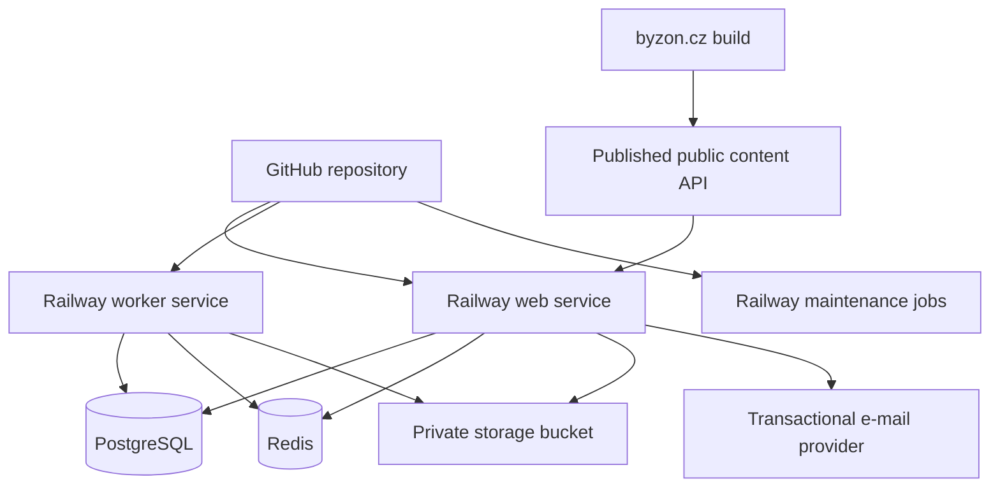
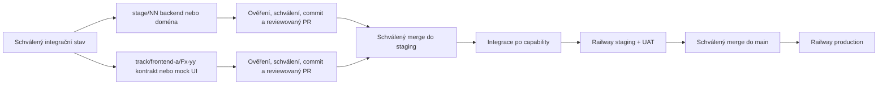

# BYZON 2026 – detailní plán agentního vývoje

> Stav: implementační plán v6.16 – publication refresh pod agenda lockem
>
> Datum sestavení: 20. července 2026
>
> Poslední revize: 20. srpna 2026
>
> Cílový repozitář: `martymax/byzon-2026`
>
> Cílová aplikace: `https://app.byzon.cz`
>
> Deployment: GitHub → Railway
>
> Produktový zdroj: [BYZON 2026 – zadávací dokumentace webové aplikace v1.0](https://docs.google.com/document/d/1xNNuZaluTWvysPVGUeLNRGAZB6JKN7Z0KNIr2RdUp5g/edit), revize načtená 15. 8. 2026: `AIroW352WKjl35773tJ0EmGYRdAZM3mMe8PPvwWVOo9k9xCMdj7qPsMi9U18amV8aoZozdI7OOJk1ECegA5Ve5FNTKRWBDpPOZUvabC3LLyB`
>
> Vypořádání připomínek: 40 vláken načteno, 39 produktových/provozních vláken vyhodnoceno; vyřešené testovací vlákno se do rozsahu nepromítá. Autoritativní závěry jsou v §3.4 a otevřené vstupy v §22.

Tento soubor je hlavní prováděcí plán pro vývoj pomocí AI agentů. Produktové zadání určuje **co** se staví; tento plán určuje **jak, v jakém pořadí a podle čeho se pozná dokončení**. Pokud se plán a produktové zadání dostanou do rozporu, má přednost produktové zadání. Změna rozsahu se nejprve zaznamená do rozhodovacího logu v tomto souboru.

---

## 1. Jak má AI agent s plánem pracovat

### 1.1 Povinný pracovní postup pro každý úkol

1. Přečti tento soubor, související část produktového zadání, `README.md`, případný `AGENTS.md` a existující kód dotčeného modulu.
2. Ověř čistotu pracovního stromu a že pracuješ na větvi přiděleného úkolu nebo workstreamu. Cizí nebo uživatelské změny nemaž, nepřepisuj ani nezahrnuj do vlastního commitu.
3. Každý agent pracuje současně právě na jednom jasně vymezeném nehotovém úkolu, jehož závislosti pro cílový stav capability jsou splněné. Projekt jako celek může paralelizovat nezávislé úkoly na oddělených větvích podle §1.7.
4. Pokud úkol narazí na položku označenou `BLOCKER`, nehádej výsledek. Blocker zastaví pouze přechod a scope výslovně uvedený v §22; contract-first návrh, syntetické fixtures a mockované UI mohou pokračovat, pokud nefixují neznámé produkční chování.
5. Nejdřív napiš nebo uprav test, pokud je to rozumné. U kritických doménových pravidel je test povinný před nebo současně s implementací.
6. Implementuj nejmenší úplný řez odpovídající cílovému stavu capability.
   Doménový/backendový úkol dokončí svou vrstvu včetně schématu, pravidel, API,
   serverové autorizace, auditu a testů, pokud jsou relevantní, ale nevytváří
   paralelní UI. Integrační úkol propojí tento serverový řez s již připraveným
   frontendem. Frontendový úkol může skončit ve stavu `UI ready (mocked)`,
   pokud používá schválený kontrakt, validované fixtures a má
   component/accessibility testy; nesmí se pak označit jako `integrated`.
7. Spusť všechny kontroly uvedené u úkolu a globální kontroly relevantní pro změnu.
8. Proveď self-review diffu se zaměřením na autorizaci, soukromí, souběh, idempotenci, časová pásma a offline chování.
9. Aktualizuj tento plán: stav úkolu, stav capability podle §1.2, odkaz na rozhodnutí a případně nově zjištěný blokátor. Neoznačuj úkol jako hotový bez splnění jeho akceptačních podmínek.
10. Předlož uživateli dokončený a ověřený krok: změněné soubory, diff/scope, migrace, env proměnné, provedené testy a zbylá rizika. Do explicitního schválení uživatelem neprováděj commit ani push.
11. Po explicitním schválení daného kroku vytvoř právě jeden tematický commit s ID úkolu a pushni jej na větev přiděleného úkolu/workstreamu. Popis musí uvést změnu schématu, proměnné prostředí, migrační/rollback dopad, cílový stav capability a provedené testy.
12. Merge etapy, rebase, force-push ani smazání větve neprováděj bez samostatného explicitního schválení uživatelem.

### 1.2 Stavové značky

- `[ ]` nezačato
- `[~]` rozpracováno
- `[x]` dokončeno a ověřeno
- `[!]` blokováno vstupem nebo rozhodnutím
- `[–]` vědomě vyřazeno z rozsahu, vždy s odkazem na rozhodnutí

Stavová značka se vztahuje ke konkrétnímu úkolu. `[x]` neznamená automaticky
dokončenou uživatelskou capability. Každá cross-layer capability postupuje
samostatně tímto řetězcem:

`not started → contract ready → UI ready (mocked) → integrated → UAT`

- **not started:** capability ještě nemá schválený úplný klientský/serverový
  kontrakt; existující dílčí schéma nebo obrazovka se uvádí pouze jako evidence;
- **contract ready:** sdílené Zod request/response/problem kontrakty, role,
  cache/offline pravidla, klasifikace PII a validované syntetické fixtures;
- **UI ready (mocked):** responzivní a přístupné UI se všemi povinnými stavy,
  component/axe testy a deterministickým mock transportem;
- **integrated:** skutečný `/api/v1` adapter, serverová relace/autorizace,
  `application/problem+json`, ETag/idempotence podle potřeby, contract/E2E test
  a ověřená nemožnost zapnout mock v produkci;
- **UAT:** staging ověřený reprezentativní rolí, fází eventu a zařízením, bez
  otevřených severity 1/2 vad.

### 1.3 Pravidla pro rozhodování agentů

- **Nedomýšlet produkt:** ceny, kapacity, texty souhlasů, storno pravidla, cílové skupiny oznámení a oprávnění k výjimkám musí být explicitní data nebo schválené rozhodnutí.
- **Privacy by default:** při nejasnosti osobní údaj nezveřejnit, neposlat třetí straně a nezapsat do logu.
- **Server je autorita:** klientské skrytí tlačítka nikdy nenahrazuje serverovou autorizaci a validaci.
- **PostgreSQL je autorita pro transakční stav:** Redis je cache/fronta/pub-sub, nikoli zdroj pravdy pro vstupenky, rezervace, check-in nebo souhlasy.
- **Idempotence:** importy, aktivace, check-in, e-mailové úlohy a webhooky musí bezpečně zvládnout opakování.
- **Čas:** databáze ukládá okamžiky v UTC; uživatelské rozhraní standardně používá `Europe/Prague`. Lokální datum akce je samostatný doménový údaj.
- **Žádné skryté breaking changes:** změny API a schématu musí být dopředně kompatibilní alespoň po dobu jednoho deploymentu.
- **Priorita A před volitelnou B:** Priority B se nesmí zahájit před akceptací
  Gate A a nesmí ohrozit stabilitu launch minima. Priority C se pro ročník
  2026 neimplementuje.

### 1.4 Definition of Ready pro implementační úkol

Úkol lze začít, když má vyřešené závislosti potřebné pro svůj cílový stav
capability a současně:

- jasný uživatelský nebo provozní výsledek;
- vyřešené závislosti a případné produktové rozhodnutí;
- známé role a oprávnění;
- definované chování při chybě, souběhu a výpadku připojení;
- akceptační kritéria a testovací scénáře;
- uvedený dopad na osobní údaje a audit, pokud nějaký má.

Frontendový nebo contract-first úkol navíc potřebuje:

- cílovou roli, fázi eventu, route/deep link a očekávané chování tlačítka Zpět;
- verzovaný kontrakt nebo výslovně označený návrh kontraktu a fixtures pro
  happy, loading, empty, permission, domain error, offline a session-expired;
- mobilní, desktopovou, klávesnicovou a accessibility akceptaci;
- vlastníka mikrocopy/obsahu nebo jasně označený syntetický placeholder.

### 1.5 Větve, schválení, commit a push

- Každá release etapa má integrační větev `stage/NN-strucny-nazev`, například `stage/04-tickets`. Frontend Priority A používá krátké task větve `track/frontend-a/Fx-yy-strucny-nazev`.
- Každá task větev vzniká z posledního uživatelem schváleného integračního commitu. Více nezávislých task větví může existovat současně; jeden agent má jednu větev, jeden worktree a jeden úkol.
- Číslování etap určuje integrační a release gate, nikoli globální zákaz zahájit nezávislou práci. Mockovaná frontendová větev se nesmí opírat o neintegrovanou backendovou implementaci; opírá se o schválený kontrakt a fixtures.
- Sdílené hotspoty (`packages/ui`, `packages/domain/src/contracts`, root layouty a globální styly) mají po dobu paralelní práce jednoho výslovného vlastníka. Překrývající se task větve se nespouštějí bez integrační dohody.
- Každý dokončený implementační krok má po schválení vlastní tematický commit; nesouvisející úkoly se neslučují do jednoho commitu.
- Dokončení a ověření kroku samo o sobě není souhlas s commitem ani pushem. Agent vždy nejprve předloží výsledek a čeká na explicitní schválení uživatele vztahující se ke konkrétnímu kroku.
- Po schválení agent commitne pouze předložený scope a pushne přidělenou task nebo etapovou větev. V handoffu uvede branch, commit SHA, cílový stav capability a výsledek pushe.
- Task větev se přes reviewovaný PR integruje do příslušné etapové větve nebo
  `staging` po splnění exit criteria svého cílového lifecycle stavu.
  `UI ready (mocked)` lze sloučit, jen pokud je route serverově skrytá nebo
  dostupná pouze v dev/test preview, kontrakt je reviewovaný, fixtures
  validované, CI zelené a produkční graf neobsahuje mock. `integration_gate`
  určuje až přechod capability do `integrated`, nikoli možnost bezpečně sloučit
  izolovaný mockovaný slice. Vytvoření/aktualizace PR a merge vyžadují
  explicitní schválení uživatele.
- Po dokončení všech úkolů a akceptačních podmínek release etapy se etapová větev sloučí přes PR do `staging`; frontendový `UI ready (mocked)` sám o sobě release gate nesplňuje.
- Po staging CI a UAT se `staging` sloučí do `main` samostatným schváleným release krokem. Přímý push do `staging` nebo `main` se nepoužívá.
- Schválení se nevztahuje automaticky na pozdější opravy nebo rozšíření. Každá dodatečná změna se znovu ověří a před commitem/pushem znovu schválí.

### 1.6 Povinný závěrečný review gate každé integrační jednotky

Po dokončení implementačních úkolů a před uzavřením nebo merge každé task větve,
frontendového milníku nebo release etapy
proveď v tomto pořadí:

1. **Security review:** zkontroluj celý rozsah etapy se zaměřením na threat
   model, autentizaci a autorizaci, event scope/IDOR, ochranu secrets a PII,
   validaci vstupů, dependency/configuration rizika, migrace a bezpečné chování
   při chybách.
2. **Code review:** zkontroluj úplný etapový diff/PR z hlediska funkční
   správnosti, architektury, souběhu, idempotence, testovacího pokrytí,
   provozních dopadů a udržovatelnosti. Rozliš actionable nálezy od
   nízkohodnotových stylistických návrhů a false positives.
3. **Okamžité zapracování nálezů:** všechny potvrzené actionable nálezy z obou
   review oprav v rámci stejné etapy, doplň regresní testy a znovu spusť
   relevantní kontroly a CI. Zamítnutý nález musí mít stručně zaznamenaný důvod.

Integrační jednotku nelze označit za dokončenou ani sloučit, dokud nejsou potvrzené nálezy
opravené a ověřené. Samotné provedení review bez následného zapracování nálezů
nesplňuje tento gate. Commit, push a merge i zde podléhají schválením z §1.5.

### 1.7 Paralelní workstreamy a dependency gate

- Release priority je `A → volitelná B`; paralelizace Priority A nesmí otevřít
  implementaci Priority B před Gate A. Priority C pro rok 2026 neexistuje.
- Každý `F*` blok a každý nově otevíraný paralelní workstream uvádí
  `depends_on`, `blocked_by`, `parallel_with` a `integration_gate`. Historické
  `P*` etapy mají závislosti u etapy; před paralelním přidělením konkrétního
  `P*` úkolu se stejné čtyři položky doplní do zadání/handoveru. Úkol se
  zahajuje podle skutečných vazeb, nikoli pouze podle čísla etapy.
- Kontrakt je hranice paralelní práce. Frontend nezná vendor sloupce, databázové
  entity ani interní serverové typy; backend nemění schválené DTO bez
  kompatibilního přechodu a contract testu.
- Mockovaný frontend je bezpečná demonstrace kontraktu, nikoli důkaz serverové
  autorizace, souběhu nebo produkční funkčnosti. V produkčním bundle nesmí
  existovat runtime přepínač na mock data.
- Neintegrované obrazovky jsou dostupné pouze v test/dev preview nebo jsou na
  stagingu bezpečně skryté serverově vyhodnoceným feature/event stavem.
- Blocker v §22 zastaví pouze uvedený lifecycle přechod. Pokud tabulka neříká
  jinak, neblokuje `contract ready` ani `UI ready (mocked)`.

---

## 2. Výchozí stav repozitáře

Původní v1 baseline byl commit `29933429a23671e7d5d88cf114b9bf8872223aab`.
Nejde o tvrzení o aktuální čistotě, větvi ani upstreamu: před každým úkolem se
musí znovu ověřit `git status`, HEAD a vzdálené větve a zachovat všechny cizí
nebo uživatelské změny.

Současný veřejný web:

- je statický HTML/CSS/JS web;
- generuje se Python skriptem `static-site/build.py`;
- používá `static-site/data/content.json` jako současný zdroj obsahu;
- nemá Node runtime ani balíčkové závislosti;
- používá SimpleShop embed pro nákup;
- musí zůstat během vývoje aplikace provozně nedotčený.

Nová aplikace se přidá do stejného repozitáře jako monorepo. Přesun nebo přepis stávajícího veřejného webu není součástí prvních etap.

---

## 3. Pevně stanovený rozsah

### 3.0 Konstanty ročníku 2026

- Event slug: `byzon-2026`.
- Termín: 18.–19. září 2026; přesný začátek/konec se převezme z publikovaného programu.
- Výchozí časová zóna: `Europe/Prague`.
- Místo: Clarion Congress Hotel, České Budějovice; přesné názvy scén a zón jsou
  řízený obsah programu. Samostatný plánek se v roce 2026 nevytváří.
- Správce osobních údajů a pořadatel: ENJOiT s.r.o.
- Jazyk UI a provozní komunikace: čeština.
- Nákup zůstává na `byzon.cz` přes SimpleShop; `app.byzon.cz` nenahrazuje checkout.
- První hromadné pozvání účastníků je plánováno na 11. září 2026; nejzazší
  akceptovaný termín odeslání je 15. září 2026.

### 3.1 Produkt

- Mobilně orientovaná PWA na `app.byzon.cz`, bez povinné instalace.
- Veřejný `byzon.cz` zůstává marketingovým/prodejním webem.
- Aktivace osobním odkazem, skenem QR/čárového kódu nebo ručním zadáním stejného kódu vstupenky.
- Jedna jedinečná vstupenka se aktivuje právě k jednomu účtu; oprávněný správce může řešit převod/reaktivaci.
- Program, osobní agenda, rezervace, čekací listiny, praktické informace a check-in.
- Online seznamy přihlášených pro vedoucí přiřazených kapacitních aktivit.
- Kritická provozní oznámení a organizační přehledy v rozsahu nutném pro akci.
- Volitelně až po Gate A: jednoduchý networkingový adresář, sběr dotazů u
  vybraných pátečních přednášek a hodnocení.
- Čeština jako jediný jazyk ročníku 2026.

### 3.2 Mimo rozsah 2026

- nativní mobilní aplikace;
- automatizované spojování účastníků, žádosti o spojení, interní zprávy,
  doporučování kontaktů a plánování networkingových schůzek;
- hlasování o dotazech, ankety, projekce dotazů/výsledků a odpovědi řečníků po
  skončení vystoupení;
- samostatný portál řečníka, upload/review prezentací, speaker reminder workflow
  a zpřístupňování materiálů po akci;
- partner účty nebo partner portál; partner je v aplikaci prezentován pouze
  logem/odkazem a případnou vstupenku aktivuje jako běžný účastník;
- social wall;
- samostatný plánek areálu a materiály ke stažení;
- automatická připomenutí bodů programu; účastník používá osobní `.ics` kalendář;
- samoobslužné stažení kompletního přehledu osobních údajů; oprava profilu je
  dostupná přímo a ostatní privacy požadavky řeší kontaktní cesta;
- pokročilé profilování/matching;
- gamifikace;
- certifikáty, fotogalerie a videozáznamy;
- plná CZ/EN lokalizace;
- Apple/Google Wallet;
- přímé řízení tiskárny jmenovek.

### 3.3 Priority

- **A – podmínka spuštění:** účet a aktivace, program, agenda, kapacitní
  rezervace a FIFO pořadník, praktické informace, check-in, přiřazené seznamy
  účastníků pro vedoucí aktivit, kritická provozní oznámení, organizační správa,
  ochrana dat a provozní fallbacky.
- **B – volitelné až po Gate A:** jednoduchý opt-in networkingový adresář bez
  propojování a zpráv, prostý sběr dotazů pro vybrané páteční sessions a
  hodnocení. Nedokončení B neblokuje spuštění aplikace.
- **Mimo plán 2026:** všechny dřívější položky Priority C a funkce výslovně
  vyřazené v §3.2.

### 3.4 Závazná produktová rozhodnutí z komentářů

Tato tabulka vypořádává otevřená vlákna načtená 15. 8. 2026. ID jsou stabilní
odkazy pro úkoly a akceptaci; nerozhodnuté body zůstávají pouze v §22.

| ID | Rozhodnutí pro ročník 2026 | Implementační důsledek | Zdrojová vlákna |
| --- | --- | --- | --- |
| `SCOPE-2026-01` | Launch staví na menším spolehlivém základu; social wall se vůbec neimplementuje. | Gate A je jediná launch gate; Priority B je volitelná a nemá blokovat go-live. | `AAACE2Bh_kg`, `AAACFfwvgWA`, `AAACD524Haw` |
| `SCOPE-2026-02` | Networking je pouze dobrovolný adresář profilů. Profil obsahuje představení, zvolené kontakty a pevný výběr „Dnes lovím“: sdílení know-how, lidi do týmu, investory, obchodní partnery, dodavatele, klienty. | Žádné recommendations, žádosti, spojení, zprávy, meetingy ani jejich reporty; kontakt má pouze viditelnost `hidden | directory`. | `AAACFfwvgQ4`, `AAACFfwvgQ0`, `AAACFfwvgPE`, `AAACFfwvgV8` |
| `SCOPE-2026-03` | Řečníci nedostanou portál. Registrují se bezplatnou vstupenkou jako běžní účastníci; medailonky zůstávají publikovaným obsahem programu. | Nevznikají speaker invitations, vlastní dashboard, uploady, workflow podkladů, reminders ani odpovědi po akci. | `AAACFfwvgUg`, `AAACFfwvgTw`, `AAACFfwvgTk`, `AAACFfwvgTg`, `AAACFfwvgTc`, `AAACFfwvgTY`, `AAACFfwvgTU` |
| `SCOPE-2026-04` | Partner nemá zvláštní přístup. V aplikaci jsou loga partnerů; partnerské vstupenky se chovají jako běžné účastnické vstupenky. | Bez partner role, partner dashboardu a přístupu k účastníkům. | `AAACFfwvgV4`, `AAACD524Hb8` |
| `SCOPE-2026-05` | Dotazy jsou prostý sběr bez hlasování a moderátorského workflow. Jsou povolené jen pro páteční program na Byzon stage a Leadership stage; vidí je pouze přiřazení moderátoři na tabletu. | Žádné ankety, votes, merge, answered state, projection ani post-event answers. Každý publikovaný bod programu má stažitelný QR deep link pro úvodní slide; možnost položit dotaz se zobrazí jen u podporované session. | `AAACFfwvgXA`, `AAACFfwvgSw`, `AAACFfwvgRI` |
| `SCOPE-2026-06` | Oznámení slouží jen pro kritické změny, například odpadnutí řečníka, zrušení části programu nebo bezpečnostní incident. | Povolené audience jsou celá akce nebo přímo dotčené sessions; běžné reminders a marketingové rozesílky se nestaví. Kalendář `.ics` zůstává. | `AAACFfwvgTE`, `AAACFfwvgP8` |
| `SCOPE-2026-07` | Samostatný plánek, materiály a samoobslužný datový export se nestaví. Profil lze opravit přímo; telefon je dobrovolné profilové pole. | Lokace je text v programu, privacy UI nabízí editaci a kontaktní cestu, nikoli exportní job. | `AAACFfwvgWI`, `AAACFfwvgTA`, `AAACFfwvgPo`, `AAACFfwvgO4` |
| `SCOPE-2026-08` | Rezervovatelné aktivity: pátek koučink, mastermind Expertního Boardu a řízený networking; sobota workshopy a mastermind Tomáše Ryzy. Počáteční administrátorské hodnoty: koučink 1 osoba/slot, EB21 12, každý sobotní workshop 20, sobotní mastermind 6; nejde o konstanty v aplikačním kódu a provozní kapacita session je auditovaně editovatelná v administraci. Registrace končí začátkem aktivity; každý použitý pořadník je striktně FIFO s automatickým potvrzením prvního čekajícího. Networking nemá hardcoded výchozí kapacitu a otevře se až po zadání kladné hodnoty v administraci. Dvě části sobotního mastermindu sdílejí jednu rezervaci, kapacitu a roster. | Nabídka s expirací, TTL a `registration_estimate` se neimplementují; podrobnosti závazně popisuje [ADR-014](docs/adr/014-reservation-waitlist-grouping.md). | `AAACFfwvgWU`, `AAACD524HbQ`, rozhodnutí produktu 30. 8. 2026 |
| `SCOPE-2026-09` | Koučové jsou Radim Roček a Stanislava Maunová; slot trvá 30 minut a dostupnost se přebírá z listu Pátek, aktuálně sloupců H:I „Radim“/„Stáňa“ v [Harmonogramu BYZON 2026](https://docs.google.com/spreadsheets/d/1SgNPggOliwIz-TZghhQuxcs1Qv3hqzRNAOWXcAhz0zw/edit?gid=0#gid=0). | Vytvořit dvě paralelní zdrojové řady slotů, respektovat hodnoty dostupnosti a před publikací znovu validovat aktuální list/range místo hardcodování dnešního pořadí sloupců. | `AAACFfwvgWs` |
| `SCOPE-2026-10` | Kouči, vedoucí mastermindů, workshopů a řízeného networkingu potřebují online jméno a firmu přihlášených pouze u svých aktivit. | Stávající technická role `room_operator` se v UI jmenuje „Vedoucí aktivity“, je scoped na session a má read-only roster; nedostává globální seznam ani práva řečníka/admina. | `AAACFfwvgUg`, `AAACFfwvgQM`, `AAACFfwvgOQ`, `AAACD524HbY` |
| `SCOPE-2026-11` | Obecný QR na badge a obrazovkách vede jen na `https://app.byzon.cz`; osobní přístup přijde ověřeným e-mailovým linkem. | Veřejný QR nesmí obsahovat ticket ani token; ideální pozvánka 11. 9. 2026, hard deadline 15. 9. 2026; zachovat recovery přes e-mail. | `AAACD524Ha0`, `AAACFfwvgOk` |
| `SCOPE-2026-12` | Vstupním baseline je aktuální web; partner list se ještě aktualizuje, FAQ se doplní a obsahová uzávěrka je 31. 8. 2026. Praktické kontakty: Jindřich Hrdý 774 835 456, Tomáš Ryza 776 089 866, Veronika Vicková 733 726 753. | Finální web → DB reconciliation/content UAT je samostatný gate; po publikaci zůstává autoritou DB dle ADR-008. Do uzávěrky lze používat viditelně označený draft. | `AAACFfwvgW4` |

Vlákna, která nepřinesla uzavřené produktové rozhodnutí, jsou vypořádána takto:

| Vlákno | Výsledek |
| --- | --- |
| `AAACFfwvgXI` | Právní revize se provede po potvrzení v6 scope; zůstává `BLOCKER-LEGAL-01`. |
| `AAACFfwvgXE` | Počet vstupů, obsluha, zařízení, vlastník jmenovek, moderátoři a oprávnění k oznámením nejsou potvrzené; zůstává `BLOCKER-OPS-01`. |
| `AAACD524HcI` | Žádost o posouzení ochrany údajů neobsahuje rozhodnutí; je evidovaná pod `BLOCKER-LEGAL-01`. |
| `AAACD524HcE` | Přístupy do SimpleShopu byly předány; ADR-015 potvrdil API sync na vyžádání, ale read-only response mapping, statusy a source-code test vectors čekají na `BLOCKER-TKT-01`, `02` a `04`. |
| `AAACD524HbA` | 48h session byla navržena a je implementovaným technickým baseline (`expiresIn=48 h`, `updateAge=24 h`), nikoli potvrzením kontinuity od pozvánky do akce; finální politika zůstává v `BLOCKER-AUTH-02`. |

Vyřešené testovací vlákno `AAACDoE25qA` ověřovalo pouze viditelnost komentářů
a nemění produkt ani plán.

Průřezový komentář `AAACE2Bh_kg` kromě zúžení rozsahu v `SCOPE-2026-01`
podporuje zachování otevřených integračních, provozních a právních vstupů
`BLOCKER-TKT-*`, `BLOCKER-OPS-01` a `BLOCKER-LEGAL-01`; sám je neuzavírá.

---

## 4. Závazná technická rozhodnutí

| ID | Rozhodnutí | Vlastník | Důvod a důsledek |
| --- | --- | --- | --- |
| [ADR-001](docs/adr/001-monorepo.md) | Jeden GitHub repozitář, monorepo | Tech lead | Sdílení značky, typů a doménových pravidel; nezávislé Railway služby přes root/watch paths. |
| [ADR-002](docs/adr/002-nextjs-react-typescript.md) | Next.js App Router + React + TypeScript strict | Tech lead | Jeden full-stack kód, serverové renderování, Route Handlers, PWA podpora, dobrý Railway deployment. |
| [ADR-003](docs/adr/003-postgresql-drizzle.md) | PostgreSQL + Drizzle ORM | Tech lead | Transakce a databázová omezení pro kapacity, vstupenky a check-in; explicitní SQL migrace. |
| [ADR-004](docs/adr/004-better-auth.md) | Better Auth pro identity, relace a magic link | Tech lead + security | Nevytvářet vlastní správu relací; ticket claim zůstává vlastní doménová vrstva. |
| [ADR-005](docs/adr/005-redis-bullmq-worker.md) | Redis + BullMQ worker | Tech lead | Asynchronní e-maily, waitlist, retence, organizační exporty a retry bez blokování web requestů. |
| [ADR-006](docs/adr/006-rest-sse.md) | REST JSON API `/api/v1`; bounded polling pro dotazy 2026 | Tech lead | Stabilní HTTP rozhraní stačí pro zúžený rozsah. SSE zůstává rezervovaná možnost, ale není launch dependency a pro moderátorské dotazy se v roce 2026 nezavádí. |
| [ADR-007](docs/adr/007-private-object-storage.md) | Railway private Storage Bucket | Tech lead + ENJOiT | Privátní importy, dočasné organizační exporty a schválené obrázky; speaker materiály nejsou součástí 2026. Přístup pouze krátkodobými podepsanými URL/proxy. |
| [ADR-008](docs/adr/008-database-published-content-source.md) | DB jako jediný zdroj publikovaného programu a profilů | Produkt + tech lead | Admin spravuje obsah bez vývojáře; `byzon.cz` obsah pouze synchronizuje/konzumuje. |
| [ADR-009](docs/adr/009-service-worker-indexeddb.md) | Service worker + IndexedDB | Tech lead | Offline čtení programu/agendy/informací; explicitní synchronizační fronta jen pro bezpečné operace. |
| [ADR-010](docs/adr/010-eu-railway-region.md) | EU Railway region pro web, worker, DB, Redis i bucket | ENJOiT + tech lead | Soulad se zadáním; externí zpracovatelé vyžadují samostatné právní schválení. |
| [ADR-011](docs/adr/011-event-feature-flags.md) | Feature flags per event | Produkt + tech lead | Bezpečné oddělení launch Priority A od volitelné B; vyřazené funkce zůstávají produkčně nedostupné. |
| [ADR-012](docs/adr/012-multi-event-data-model.md) | Multi-event datový model od začátku | Produkt + tech lead | Opakované použití pro další ročník bez sdílení dat mezi akcemi. |
| [ADR-013](docs/adr/013-incremental-frontend-architecture.md) | Fungující frontendový stack se rozvíjí inkrementálně | Tech lead | Před akcí se nedělá plošná migrace na jiný UI/data stack; nové knihovny jen pro doložený omezený use case. |

Nezafixované externí služby (e-mail, error tracking, uptime monitor, případný malware scanner) se implementují přes rozhraní/adaptéry. Produkční provider musí být vybrán a právně schválen před příslušnou launch gate.

---

## 5. Cílová architektura



### 5.1 Runtime komponenty

1. **Conference web** – Next.js proces: UI, `/api/v1`, autentizace, serverová autorizace, bounded question polling a health/readiness endpoint.
2. **Worker** – dlouho běžící Node proces: BullMQ consumers, e-maily, waitlist přechody, organizační exporty, údržba a outbox dispatch.
3. **Maintenance job** – jednorázové Railway cron příkazy: retence/anonymizace, zálohy, kontrola konzistence. Musí být idempotentní a používat distribuovaný zámek.
4. **PostgreSQL** – trvalý transakční zdroj pravdy.
5. **Redis** – fronty, rate limiting a krátká cache/koordinace. Ztráta Redis nesmí poškodit autoritativní data.
6. **Private bucket** – soubory, exporty, zálohy podle schválené politiky.

### 5.2 Railway služby a prostředí

Pro každé dlouhodobé prostředí vytvořit oddělené služby a data:

- `byzon-app-web`
- `byzon-app-worker`
- `byzon-app-postgres`
- `byzon-app-redis`
- `byzon-app-storage`
- případně `byzon-app-maintenance` pro cron

Prostředí:

- `production`: větev `main`, doména `app.byzon.cz`, produkční data;
- `staging`: větev `staging`, doména např. `staging-app.byzon.cz`, anonymizovaná/testovací data;
- PR environments: až po ověření nákladů; nikdy nekopírovat produkční osobní údaje.

Web a worker používají stejný image/lockfile, ale různé start commands. Migrace se spouštějí jako Railway pre-deploy command pouze jednou na webové službě. Worker se nesmí rozběhnout proti nekompatibilnímu schématu.

### 5.3 Vývojový tok



Na etapových a task větvích vznikají po approval gate malé tematické commity,
zpravidla jeden na každý schválený implementační krok. Mockovaná UI větev se
integruje nezávisle pouze jako skrytý/neprodukční slice; capability přechází do
`integrated` až po propojení se skutečným serverem. Přímý push do `staging` ani
`main` se nepoužívá. Produkční migrace musí být dopředně kompatibilní a nasazení
musí mít popsaný rollback bez destruktivního downgrade schématu.

---

## 6. Přijatá struktura repozitáře

Tato struktura odpovídá fungujícímu baseline po `P0-12`. Závazné jsou dependency
hranice a vlastnictví capability, nikoli mechanická přítomnost `src/modules`.
Existující `app`/`components`/`lib`/`server` se před akcí plošně nepřesouvají;
nové vertikální moduly lze zavádět postupně při dotyku podle ADR-013.

```text
/
├── apps/
│   ├── conference/
│   │   ├── public/
│   │   │   ├── icons/
│   │   │   └── sw.js                 # generovaný nebo řízený service worker
│   │   ├── src/
│   │   │   ├── app/                  # Next.js routes/layouts
│   │   │   ├── components/           # capability UI; postupně lze seskupovat vertikálně
│   │   │   ├── lib/api/              # typed fetch transport a problem mapping
│   │   │   ├── lib/offline/          # IndexedDB, sync, cache contracts
│   │   │   ├── server/               # auth, API helpers, adapters
│   │   │   ├── test/mocks/           # pouze test/dev transport handlers
│   │   │   └── instrumentation-client.ts
│   │   ├── next.config.ts
│   │   └── package.json
│   └── worker/
│       ├── src/
│       │   ├── jobs/
│       │   ├── providers/
│       │   ├── scheduler/
│       │   └── index.ts
│       └── package.json
├── packages/
│   ├── database/
│   │   ├── src/schema/
│   │   ├── drizzle/
│   │   └── package.json
│   ├── domain/
│   │   ├── src/contracts/             # sdílené Zod API DTO bez server/DB importů
│   │   ├── src/permissions.ts
│   │   ├── src/event-lifecycle.ts
│   │   └── package.json
│   ├── ui/
│   │   └── src/components/            # brandované přístupné primitives
│   ├── config/
│   └── test-support/
│       └── src/fixtures/              # syntetické contract-validované scénáře
├── AI_IMPLEMENTATION_PLAN.md
├── docs/
│   ├── adr/
│   ├── runbooks/
│   └── api/
├── .github/workflows/
├── railway.web.json
├── railway.worker.json
├── railway.maintenance.json
├── pnpm-workspace.yaml
├── package.json
├── pnpm-lock.yaml
├── static-site/
│   ├── build.py                          # generátor existujícího veřejného webu
│   ├── data/content.json                 # migrační vstup, později exportovaný snapshot
│   └── public/                           # kompletní FTP-ready výstup pro byzon.cz
└── ...
```

### 6.1 Capability hranice

- `auth`
- `events`
- `content`
- `tickets`
- `participants`
- `agenda`
- `reservations`
- `check-in`
- `networking`
- `announcements`
- `questions`
- `feedback`
- `files`
- `admin`
- `reporting`
- `privacy`
- `audit`

Capability nemusí mít samostatný adresář v `src/modules`, ale nesmí přímo
používat interní tabulky jiné capability mimo explicitně sdílené query/service
rozhraní. Sdílené doménové typy neimportují React, Next.js ani konkrétní
provider. Plošná adresářová migrace není release gate.

### 6.2 Frontendové hranice

- Veřejná klientská DTO a `application/problem+json` schémata jsou v
  `packages/domain/src/contracts`; klient nesmí importovat typy z
  `apps/conference/src/server` ani databázové entity.
- `packages/ui` obsahuje sémantické tokeny a přístupné, brandované primitives.
  Produktové moduly skládají tyto primitives, nevytvářejí druhý paralelní UI kit.
- `packages/test-support/src/fixtures` obsahuje pouze syntetická data validovaná
  stejnými Zod schématy jako HTTP odpovědi. Produkční data se do fixtures
  nekopírují.
- Produkční a mock transport implementují stejné klientské rozhraní. Mock je
  test/dev dependency a nesmí být dostupný přes produkční environment flag.
- Existující funkční UI etapy 3 se při zavádění hranic migruje postupně při
  dotyku; plošný vizuální přepis není podmínkou zahájení Frontend Priority A.

---

## 7. Technické standardy

### 7.1 Toolchain

- Node.js: při scaffoldingu ověřit aktuální Active LTS, zafixovat přes `.nvmrc`, `packageManager` a Railway/Nixpacks nastavení.
- pnpm workspaces, jeden lockfile.
- TypeScript: `strict`, `noUncheckedIndexedAccess`, `exactOptionalPropertyTypes`, bez neodůvodněného `any`.
- ESLint + Prettier; import boundaries pro moduly.
- Next.js `output: "standalone"` pro Railway.
- Environment schema validovaný Zodem při startu. Chybějící povinná proměnná musí ukončit proces před přijetím provozu.
- Datové a API kontrakty se odvozují ze sdílených Zod schémat, ale databázové entity se neposílají přímo klientovi.

### 7.2 Standard odpovědí API

- Úspěch: explicitní DTO, ISO 8601 timestamps, stabilní ID, žádná neveřejná pole.
- Chyba: `application/problem+json` s `type`, `title`, `status`, `code`, `detail`, `requestId` a volitelným `fieldErrors`.
- Stránkování: cursor-based; `limit` má serverové maximum.
- Mutace náchylné k opakování přijímají `Idempotency-Key`.
- Každý request dostane `requestId`; klient jej zobrazí v chybovém detailu pro podporu.
- API se verzionuje cestou `/api/v1`; breaking změna vyžaduje `/api/v2` nebo kompatibilní přechod.

### 7.3 Doménové identifikátory

- Primární klíče: UUIDv7, generované serverem.
- Veřejné slugs pouze pro obsah, nikoli jako autorizační identita.
- Citlivé sekvenční počty se nezveřejňují.
- Po rozhodnutí `BLOCKER-TKT-04` se kód vstupenky případně normalizuje jediným
  verzovaným serverovým pravidlem a ukládá jako
  `HMAC-SHA-256(server_pepper, normalized_code)`. Do té doby je opaque a nesmí
  se trimovat ani měnit case. HMAC je jednosměrný lookup identifikátor, ne
  prezentační credential; pro podporu lze uložit nejvýše bezpečný maskovaný
  suffix.

### 7.4 Čas a plánování

- DB `timestamptz` pro okamžiky; `date` pro lokální den konference.
- Každá akce má `timezone`, pro 2026 `Europe/Prague`.
- API vrací UTC a případně explicitní `eventTimezone`.
- DST a půlnoční přesahy musí mít testy.
- Joby se plánují podle UTC vypočteného z časové zóny akce; opakovaný scheduler nesmí vytvořit duplicitní úlohy.

### 7.5 Feature flags

Feature flags jsou per event, serverově vyhodnocené a auditované:

- `networking_enabled`
- `announcements_enabled`
- `questions_enabled`
- `ratings_enabled`
- `offline_checkin_enabled`
- `public_content_sync_enabled`

Vypnutí flagu musí uzavřít i přímé API endpointy, ne jen navigaci.
`speaker_portal_enabled`, `polls_enabled` a `social_wall_enabled` jsou historická
schématová pole. Do bezpečné expand/contract migrace zůstávají vždy `false`,
nesmějí mít route/API a nepatří mezi podporované funkce 2026.

### 7.6 Knihovny a odpovědnosti

Tabulka zachycuje přijatý baseline podle ADR-013. Přesné používané verze
zůstávají zamčené v `pnpm-lock.yaml`. Jiná knihovna vyžaduje konkrétní potřebu,
omezený migrační úkol a ověření dopadu; žádná plošná změna UI/data stacku není
před akcí plánována.

| Oblast | Výchozí knihovna/přístup | Pravidlo použití |
| --- | --- | --- |
| Web framework | Next.js App Router, React | Server Components pro read-first obrazovky; Client Components jen tam, kde je interakce/browser API. |
| CSS a komponenty | `@byzon/ui`, CSS Modules a globální tokeny | Zachovat přístupnost a jednu UI vrstvu; jiný kit jen pro doložený nový use case. |
| Formuláře | Řízené React formuláře + Zod kontrakty | Server vždy validuje znovu; sdílený helper lze zavést, až odstraní konkrétní duplicitu. |
| Server/client data | Capability-specific resource/port stav | Canonical response, request fencing, invalidace a reconnect jsou explicitní; query knihovna není povinná. |
| API klient | Native `fetch` + tenký typed wrapper nad sdílenými Zod kontrakty | Jednotně mapuje success/problem odpovědi, request ID, ETag, timeout, session expiry a idempotency; žádný generický nevalidovaný cast. |
| Mock transport | MSW pouze v dev/test + fixtures z `@byzon/test-support` | Handler i fixture používají produkční kontrakt; mock nesmí být importovatelný produkčním bundlem. |
| Lokální offline data | Účelový typed adapter nad IndexedDB | Jen DTO uvedená v cache politice, schema migrations, ownership lease a per-user cleanup. |
| Auth | Better Auth | Identity/session/magic link; event membership a ticket claim jsou vlastní doména. |
| DB | `pg` + Drizzle ORM/Kit | Transakce a constraints explicitně; migrace jsou verzované soubory v repu. |
| Queue/cache | BullMQ + ioredis | Worker jobs, rate limits, pub/sub; připojení musí fungovat přes Railway private networking. |
| Logy | Pino | JSON, request context a centrální redaction. |
| Datum/čas | `date-fns` + timezone podpora nebo aktuální ekvivalent | Žádná ruční práce s offsetem; vždy event timezone. |
| QR/barcode | Browser `BarcodeDetector` jako progressive enhancement + lazy fallback `@zxing/browser` | Ruční kód je vždy dostupný; scanner bundle nenačítat mimo scan route. |
| Rich text | Markdown subset + `react-markdown`/sanitizační allowlist | Zakázat raw HTML a nebezpečné URL protokoly. |
| E-mail | vlastní `MailProvider` interface | SDK providera smí být pouze v adapteru workeru/serveru. |
| API dokumentace | Zod kontrakty → generovaný OpenAPI dokument | CI kontroluje drift; OpenAPI nemusí být veřejně přístupné v produkci. |
| Unit/integration | Vitest | DB/Redis testy běží proti izolovaným skutečným službám, ne proti in-memory náhradě. |
| E2E | Playwright | Mobilní viewporty, Chromium; kritické Safari chování ověřit také manuálně/BrowserStack-like službou po schválení. |
| Accessibility | axe-core/Playwright integrace | Automatický audit doplnit manuálním testem; nulový axe nález není úplná akceptace. |

Redux, vlastní password auth, GraphQL, Firebase/Supabase a samostatný Express server se bez nového ADR nezavádějí. Server Actions lze použít pouze pro lokální UI formulář, pokud zároveň neobcházejí stabilní `/api/v1` kontrakt potřebný pro PWA/offline klienta.

### 7.7 Lokální vývoj

- Root příkaz spustí web, worker a sdílené watch buildy.
- PostgreSQL a Redis se spouštějí přes verzovaný `compose.yaml`; produkční data se lokálně nekopírují.
- `pnpm dev:infra` spustí infrastrukturu, `pnpm dev` aplikace, `pnpm dev:reset` znovu vytvoří pouze explicitně pojmenovanou lokální DB.
- Seed vytvoří syntetické role, ticket stavy, kapacitní souběh, FIFO waitlist,
  read-only roster vedoucího aktivity, adresářové privacy stavy a session se
  sběrem dotazů. Testovací e-maily končí v lokálním sinku.
- Lokální bucket používá S3-kompatibilní dev službu nebo filesystem adapter výhradně za stejným `ObjectStorage` rozhraním. Produkční chování presigned URL musí mít integrační test.
- Čas lze v dev/testu řídit přes injektovaný `Clock`; nepřidávat globální produkční proměnnou, která by dovolila posun času.

### 7.8 Proměnné prostředí

Názvy se mohou upravit pouze konzistentně ve schema, `.env.example`, Railway a runbooku. Hodnoty tajných proměnných se nikdy necommitují.

| Proměnná | Web | Worker | Citlivá | Účel |
| --- | --- | --- | --- | --- |
| `NODE_ENV` | ano | ano | ne | Runtime režim. |
| `APP_ENV` | ano | ano | ne | `development | test | staging | production`. |
| `APP_BASE_URL` | ano | ano | ne | Kanonická URL aplikace. |
| `PUBLIC_SITE_URL` | ano | ano | ne | Kanonická URL `byzon.cz`. |
| `DATABASE_URL` | ano | ano | ano | Railway PostgreSQL private URL. |
| `REDIS_URL` | ano | ano | ano | Railway Redis private URL. |
| `REDIS_FAMILY` | ano | ano | ne | `0` pro dual-stack DNS; explicitně `4` nebo `6` jen při provozní potřebě. |
| `REDIS_CONNECT_TIMEOUT_MS` | ano | ano | ne | Bounded timeout navázání Redis spojení. |
| `REDIS_COMMAND_TIMEOUT_MS` | ano | ne | ne | Bounded web command timeout; BullMQ worker blocking commandy jej nepoužívají. |
| `BETTER_AUTH_SECRET` | ano | ne | ano | Podpis/šifrování auth; minimální délka dle knihovny. |
| `BETTER_AUTH_URL` | ano | ne | ne | Kanonický auth origin, bez wildcardu. |
| `RATE_LIMIT_SUBJECT_SECRET` | ano | ne | ano | Samostatný environment-scoped HMAC key pro opaque rate-limit subjecty. |
| `TICKET_CODE_PEPPER_ACTIVE` | ano | ne | ano | Aktivní HMAC key. |
| `TICKET_CODE_PEPPER_PREVIOUS` | ano | ne | ano | Volitelné rotační přechodné čtení; odstranit po rehash migraci. |
| `MAIL_PROVIDER` | ano | ano | ne | `sink` v dev/test, schválený provider v prod. |
| `MAIL_API_KEY` | ano | ano | ano | Provider credential. |
| `MAIL_FROM` | ano | ano | ne | Ověřený sender. |
| `MAIL_REPLY_TO` | ano | ano | ne | Organizační podpora. |
| `STORAGE_ENDPOINT` | ano | ano | ne | S3-compatible endpoint. |
| `STORAGE_REGION` | ano | ano | ne | EU region. |
| `STORAGE_BUCKET` | ano | ano | ne | Environment-specific bucket. |
| `STORAGE_ACCESS_KEY_ID` | ano | ano | ano | Bucket credential. |
| `STORAGE_SECRET_ACCESS_KEY` | ano | ano | ano | Bucket credential. |
| `LOG_LEVEL` | ano | ano | ne | `info` produkčně, debug jen dočasně bez PII. |
| `WORKER_CONCURRENCY_EMAIL` | ne | ano | ne | Samostatný limit e-mail jobů. |
| `WORKER_CONCURRENCY_DEFAULT` | ne | ano | ne | Ostatní joby. |
| `PUBLIC_SYNC_PROVIDER` | ne | ano | ne | `noop` do potvrzení, později schválený trigger. |
| `PUBLIC_SYNC_TOKEN` | ne | ano | ano | Credential pro rebuild/deploy trigger. |
| `ERROR_TRACKING_DSN` | ano | ano | ano | Jen po schválení providera a redaction. |
| `RELEASE_SHA` | ano | ano | ne | Git commit pro logy, cache a diagnostiku. |

Do klientského bundle smí pouze výslovně bezpečné `NEXT_PUBLIC_*` hodnoty. Serverové env schema má unit test, který selže při nečekaném zpřístupnění secret názvu klientské konfiguraci.

### 7.9 Migrační strategie databáze

- Používat expand → migrate/backfill → switch reads/writes → contract v oddělených deploymentech.
- Produkční migrace nesmí čekat dlouhý table lock; velký backfill dělá resumable worker v dávkách.
- Přidání required sloupce: nejdřív nullable/default, backfill, validace, teprve později constraint.
- Odebrání/přejmenování: nejdřív duální kompatibilita aplikace, až potom odstranění starého pole.
- Každá migrace má integrační test z předchozího schématu a poznámku o očekávané délce/locku.
- Down migrace se v produkci nepovažuje za bezpečný rollback dat. Rollback aplikace musí po přechodnou dobu rozumět novému schématu.
- Destruktivní migrace vyžaduje explicitní approval, snapshot a ověřenou obnovu.

### 7.10 Frontend kontrakty, API klient a mock hranice

- Sdílený Zod kontrakt definuje request, success DTO a podporované
  `application/problem+json` kódy. Server i fixtures jej validují; klient
  bezpečně odmítne neznámý nebo nevalidní response shape.
- Jeden typed fetch transport řeší JSON/problem content type, `requestId`, ETag,
  abort/timeout, bezpečný retry, `401/session expired`, idempotency headers a
  rozlišení offline, transportní a doménové chyby.
- UI rozhoduje podle stabilního `code` a strukturovaných polí, ne podle
  lokalizovaného `title` nebo `detail`. Request ID se nabídne uživateli pro
  podporu bez vypsání citlivého payloadu.
- Deterministické fixtures pokrývají role, fáze eventu a stavy happy/loading/
  empty/permission/domain error/offline/stale/session-expired. Každá fixture
  musí projít stejným Zod parserem jako produkční odpověď.
- Mock transport nesmí být součástí produkčního dependency graphu. CI kontrola
  failne při produkčním importu mock handleru, fixture nebo runtime přepínače.
- Syntetický SimpleShop fixture prokazuje pouze vendor-neutral importní workflow.
  Nesmí kodifikovat skutečné hlavičky, statusy ani normalizaci před vyřešením
  příslušného blockeru.

`F0-02` zakládá pouze base kontrakt, error taxonomy a tento registr; není
nekonečným vlastníkem všech budoucích DTO. Konkrétní feature task spolu se svým
serverovým partnerem vlastní pojmenovaný slice a jeho fixture. Stav se po review
aktualizuje zde, takže downstream nezávisí na neurčitém „příslušném kontraktu“.
Uvedené cesty jsou cílové, dokud soubor nevznikne. Společné názvosloví,
veřejné exporty a skládání endpointových problem unionů popisují verzované
[`packages/domain/src/contracts/README.md`](packages/domain/src/contracts/README.md):

| Slice ID | Scope | Cílové schema | Vlastník kontraktu/integrace | Konzumenti | Stav |
| --- | --- | --- | --- | --- | --- |
| `CS-BASE-01` | problem, session-expired, pagination a transport metadata | `packages/domain/src/contracts/base.ts` | `F0-02` | všechny `F*` | `contract ready` |
| `CS-ACT-01` | claim outcomes, recovery a auth handoff | `packages/domain/src/contracts/activation.ts` | `F1-01`, `P4-04`, `P4-07` | `F1` | `contract ready`; striktní landing/claim/identity/link/recovery kontrakt a validované syntetické fixtures |
| `CS-BOOT-01` | `/me/bootstrap`, onboarding, profil, session actions a privacy minimum | `packages/domain/src/contracts/identity.ts` | `P4-13`, `F1-05`, `F1-06`, `F2-07` | `F1`, `F2`, `F6` | `integrated`: Better Auth session, serverově zvolený event, private/no-store bootstrap, atomický onboarding, verzovaný profil, deletion request a session actions; právní UAT dál blokuje `BLOCKER-LEGAL-01` |
| `CS-CONTENT-01` | publikovaný program a praktické informace | `packages/domain/src/contracts/content.ts` | `F2-03` s vlastníkem existujícího `P3-03` API | `F2`, `F6` | `contract ready`; P3 API, typed klient a fixtures používají sdílené schéma |
| `CS-TICKET-01` | stav a opaque presentation value vstupenky | `packages/domain/src/contracts/ticket.ts` | `P4-12`, `F2-04` | `F2`; volitelně `F5` | `not started`; hotový je pouze bezpečný status-only subset bez credentialu |
| `CS-AGENDA-01` | agenda, rezervace, waitlist, kapacita a conflict | `packages/domain/src/contracts/agenda.ts` | `P5-02` až `P5-06`, `F3` | `F3`, `F6` | `partially integrated`: private live read, add/remove, conflict, atomická rezervace, participant cancel, osobní ICS, automatické FIFO, dvě source-verified coaching řady a administrátorsky konfigurovaný networking jsou produkčně napojené; zbývá sdílená mastermind skupina dle ADR-014 |
| `CS-IMPORT-01` | batch, row validation, diff, apply a report | `packages/domain/src/contracts/ticket-import.ts` | `P4-02`, `P4-03`, `F4-02` až `F4-04` | `F4` | `contract ready`; vendor-neutral staging, diff, immutable apply a report; produkční SimpleShop zdroj bude server-only API dle ADR-015 |
| `CS-SUPPORT-01` | participant/ticket lookup a auditované support akce | `packages/domain/src/contracts/support.ts` | `P4-09`, `P9-03`, `F4-05` | `F4` | `contract ready`; maskované hledání a verzované reasoned/idempotentní akce s auditem |
| `CS-CHECKIN-01` | lookup, confirm, duplicate, undo a stats | `packages/domain/src/contracts/check-in.ts` | `P6-01` až `P6-06`, `F5` | `F5` | `contract ready`; online-only bootstrap, lookup/search, confirm, undo a stats |
| `CS-ANN-01` | participant inbox/detail/read; admin draft, audience preview a send navazují | `packages/domain/src/contracts/announcements.ts` | `P8-05`, `P8-06`, `F2-05`, `F4-06` | `F2`, `F4` | v6 `contract ready` a `UI ready (mocked)`: pouze critical a event/dotčené sessions |
| `CS-ADMIN-01` | dashboard, role, reservation cancel, session capacity, audit, organizační export a settings | `packages/domain/src/contracts/admin.ts` | `P9`, `F4-07`, `F4-08`, `F4-10` | `F4` | `partially integrated`: reasoned/idempotentní reservation cancel a samostatná session-level správa kapacity jsou live; kapacitu lze změnit i bez existující rezervace a opakovaný import ji nepřepíše. Dashboard, role, audit, export a settings zůstávají podle vlastníků v `P9` nebo `UI ready (mocked)` |
| `CS-OFFLINE-01` | version, ownership, revocation a replay policy | `packages/domain/src/contracts/offline.ts` | `P7`, `F6` | `F6` | `contract ready`; public snapshot, owner lease, revocation epoch a queue/rebase/replay policy |
| `CS-ROSTER-01` | přiřazené kapacitní sessions a read-only jméno/firma přihlášených | `packages/domain/src/contracts/activity-roster.ts` | `P5-08`, scope alignment `F4-10` | `F4` | `integrated`: Better Auth, canonical event, latest-publication allowlist, aktivní session-scoped `room_operator`, list/detail endpointy, live `/host/aktivity`, private/no-store DTO, networking s kladnou kapacitou a negativní cross-session/cross-event testy |
| `CS-NETWORKING-01` | opt-in adresář, profil, fixed „Dnes lovím“ a field visibility | `packages/domain/src/contracts/networking.ts` | `P11` | participant Priority B | `not started` |
| `CS-SESSION-QR-01` | stabilní programový deep link a QR metadata pro každý publikovaný bod | `packages/domain/src/contracts/content.ts` | `P3-12` | admin/content + participant | `not started` |
| `CS-QUESTIONS-01` | submit a session-scoped chronologický seznam bez moderation/votes/polls/projection | `packages/domain/src/contracts/questions.ts` | `P12` | participant + moderator Priority B | `not started` |

---

## 8. Role a oprávnění

### 8.1 Role

- `participant`
- `organizer_admin`
- `checkin_operator`
- `moderator`
- `room_operator` – technický název role, v UI „Vedoucí aktivity“; read-only
  seznam jmen a firem pouze pro přiřazené kapacitní sessions
- `support_operator` – volitelně oddělená omezená role pro obnovu přístupu; nevytvářet, dokud není potvrzena potřeba
- `system_worker` – technická identita, nepřihlašuje se přes UI

Role se vážou k `event_id`. Globální superadmin se ve verzi 2026 nevytváří, pokud není explicitně požadován.
Řečník používá běžnou bezplatnou vstupenku a roli `participant`. Historická
enum hodnota `speaker` může do bezpečné databázové migrace zůstat, ale nesmí
udělovat žádné zvláštní UI/API oprávnění. Partner role neexistuje.

### 8.2 Matice minimálních oprávnění

| Akce | Účastník | Check-in | Moderátor | Vedoucí aktivity | Admin |
| --- | --- | --- | --- | --- | --- |
| Číst publikovaný program | ano | ano | ano | ano | ano |
| Měnit vlastní profil/agendu/rezervaci | vlastní | jen pokud je současně participant | jen pokud je současně participant | jen pokud je současně participant | rezervace pouze jako auditovaná výjimka |
| Číst networkingový adresář | jen jako opt-in participant po Gate A | ne | jen jako opt-in participant | jen jako opt-in participant | moderace profilu bez plošného exportu kontaktů |
| Správa programu/obsahu | ne | ne | ne | ne | ano |
| Sken/check-in | vlastní kód zobrazit | ano | ne | ne | ano |
| Vrátit check-in | ne | omezeně dle potvrzené politiky | ne | ne | ano |
| Seznam rezervovaných | vlastní stav | ne | ne | jméno a firma jen u přiřazených sessions | ano |
| Odeslat dotaz | podporovaná session | ne | jen pokud je současně participant | jen pokud je současně participant | ne |
| Číst dotazy | ne | ne | jen přiřazené podporované sessions | ne | ne |
| Odeslat kritické oznámení | ne | ne | ne | ne | ano; konkrétní osoby určí `BLOCKER-OPS-01` |
| Provozní export | ne | ne | ne | ne | jen schválený minimální scope, audit |

Strojově vynucené v6 permission významy:

- `profile:own:write` a `privacy:own:write` vyžadují `ownsResource`;
- `reservation:assigned:read` vyžaduje přiřazenou session nebo room a je jediným
  roster oprávněním role `room_operator`;
- `announcement:send` je pouze pro `organizer_admin`; moderátor ani vedoucí
  aktivity jej nemají;
- `attendance:assigned:write`, participant self-export, speaker materials a
  networking connection/message permissions v matici neexistují.

### 8.3 Autorizační pravidla

- Každý chráněný query/mutation přijímá `actor`, `eventId` a kontroluje membership/role na serveru.
- Žádný endpoint nesmí důvěřovat `role` z request body nebo klientského tokenu bez serverového ověření.
- Citlivá administrativní akce vyžaduje čerstvou relaci; později lze přidat step-up ověření magic linkem.
- Audit log obsahuje aktéra, akci, cíl, event, důvod výjimky a bezpečný diff bez citlivých hodnot.
- `room_operator` a `moderator` musí mít neprázdný session scope. Server
  nepovolí globální roster ani globální question feed jen proto, že uživatel má
  tuto roli v jiné session.

---

## 9. Datový model

Názvy jsou doporučené a mají být zpřesněny v Drizzle schématu. Každá eventová tabulka musí mít index s `event_id`. Osobní údaje nesmí být zbytečně kopírovány do snapshotů nebo job payloadů.

### 9.1 Událost, konfigurace a právní verze

#### `events`

- `id`, `slug`, `name`, `starts_at`, `ends_at`, `timezone`
- `status`: `draft | activation_open | live | ended | archived`
- `activation_opens_at`, `networking_deletes_at`, `operational_data_anonymizes_at`
- `created_at`, `updated_at`
- unique: `slug`

#### `event_features`

- `event_id`, jednotlivé boolean flags, `updated_by`, `updated_at`
- unique: `event_id`

#### `legal_documents`

- `id`, `event_id`, aktivní Priority A `type`: `terms | privacy_notice`;
  historické storage hodnoty `networking_consent | other` se nemažou bez
  retenční expand/contract migrace, ale aktuální onboardingový kontrakt je
  nepřijímá ani nevydává
- `version`, `title`, `content_url` nebo sanitizovaný obsah, `published_at`, `is_current`
- unique: `(event_id, type, version)`
- právě jedna current verze typu/eventu – vynutit transakcí a částečným unique indexem

#### `consent_records`

- `id`, `event_id`, `user_id`, `legal_document_id`, `decision`: `accepted | withdrawn | acknowledged`
- `recorded_at`, `source`, `request_id`
- append-only; změna vytváří nový záznam

### 9.2 Identity a role

Better Auth tabulky (`user`, `session`, `account`, `verification` nebo jejich aktuální ekvivalent) spravovat podle zvolené verze knihovny. Doménové rozšíření:

#### `event_memberships`

- `event_id`, `user_id`, `status`: `active | suspended | revoked`
- `activated_at`, `revoked_at`, `revocation_reason`
- unique: `(event_id, user_id)`

#### `event_roles`

- `event_id`, `user_id`, `role`, `scope_json`, `granted_by`, `granted_at`, `revoked_at`
- `scope_json` jen pro omezení na session/room; schéma validovat
- unique aktivní role: `(event_id, user_id, role)`

### 9.3 Vstupenky a importy

#### `ticket_import_batches`

- `id`, `event_id`, `source`, `source_filename`, `file_sha256`
- `status`: `uploaded | validated | awaiting_confirmation | applying | applied | failed`
- `row_count`, souhrn diffu, `created_by`, timestamps
- unique: `(event_id, file_sha256)` pro idempotenci

#### `ticket_import_rows`

- staging záznamy; normalizovaná pole, původní číslo řádku, validační chyby
- původní raw řádek uchovat pouze po nezbytnou dobu a nepsat do aplikačních logů

#### `tickets`

- `id`, `event_id`, `external_id`, `order_external_id`
- `code_hmac`, `code_suffix`, `status`: `valid | activated | cancelled | refunded | transferred | blocked`
- `holder_user_id`, `claimed_at`, `cancelled_at`, `transferred_from_ticket_id`
- volitelné provozní údaje kupujícího jen pokud jsou skutečně potřebné
- unique: `(event_id, code_hmac)`
- unique: `(event_id, external_id)` pokud jej zdroj garantuje
- indexy: status, holder, order id
- `code_hmac` a `code_suffix` jsou jednosměrné identifikátory pro lookup a audit;
  nelze z nich rekonstruovat zobrazitelný ani skenovatelný kód. Kontrakt
  účastnické vstupenky proto musí před integrací vyřešit
  `BLOCKER-TKT-05`.

#### `ticket_events`

- append-only historie importu, aktivace, storna, transferu, blokace a reaktivace
- `actor_type`, `actor_id`, `ticket_id`, `from_status`, `to_status`, `reason`, `occurred_at`

#### `ticket_claim_attempts`

- agregovaná bezpečnostní stopa: HMAC/suffix, výsledek, actor/IP hash, user-agent hash, timestamp
- krátká retence; nikdy neukládat raw kód

### 9.4 Profily a soukromí

#### `participant_profiles`

- `event_id`, `user_id`, `first_name`, `last_name`, `company`, `job_title`,
  `bio`, `linkedin_url`, `phone`, `contact_email`, `photo_asset_id`
- `today_hunting`: pole enum hodnot `know_how | team | investors |
  business_partners | suppliers | clients`; žádné uživatelské custom tagy
- `networking_enabled`, `moderation_status`
- `phone_visibility`, `email_visibility`, `linkedin_visibility`:
  `hidden | directory`; výchozí `hidden`
- adresářové DTO se vydá pouze při `networking_enabled=true`; vypnutí okamžitě
  skryje celý profil bez dopadu na účet, agendu a rezervace
- timestamps, soft-delete/anonymization timestamps
- unique `(event_id, user_id)`

V roce 2026 nevznikají tabulky pro custom tagy, blokace, spojení ani zprávy.
Admin může profil jako celek skrýt přes `moderation_status`; aplikace neprovádí
žádnou komunikaci mezi uživateli.

### 9.5 Program a obsah

#### `event_days`, `venues`, `rooms`

- pořadí, názvy, lokální data, popisy, dostupnost a navigační informace

#### `sessions`

- `event_id`, `day_id`, `room_id`, `slug`, `title`, `summary`, `description`
- `type`: `talk | panel | workshop | mastermind | coaching | networking | break | meal | gala | other`
- `starts_at`, `ends_at`, `status`: `draft | published | cancelled | archived`
- `capacity_mode`: `none | reservation`; historická hodnota
  `registration_estimate` se ve v6 nepoužívá a její bezpečné odstranění řeší
  scope-alignment/migrace
- `capacity`, `reservation_opens_at`, `reservation_closes_at`
- `waitlist_mode`: produkčně `disabled | auto_confirm`; pořadí je vždy FIFO a
  uvolněné místo se automaticky potvrdí prvnímu způsobilému čekajícímu
- historické DB hodnoty `offer_with_deadline` a `waitlist_offer_ttl_minutes`
  zůstávají pouze kvůli bezpečné kompatibilitě uložených dat; kontrakt ani
  produkční UI je nevystavují
- `questions_enabled`, `version`
- omezení: end > start; capacity nezáporná; kapacitní režim vyžaduje capacity podle pravidel

#### `session_speakers`

- `session_id`, `speaker_profile_id`, `order`, `role`

#### `content_pages`, `faq_items`, `partners`

- draft/published/archived workflow, sort order, content version, asset odkazy
- `partners` publikuje pouze název, logo, pořadí a volitelný bezpečný HTTPS
  odkaz; partner účet/portal ani participant kontakty neexistují
- stránky/FAQ používají rich text pouze v omezeném sanitizovaném formátu

#### `content_publications`

- publikovaný immutable snapshot/version, checksum, published_by, published_at
- podklad pro veřejné API a kontrolu synchronizace `byzon.cz`

#### `program_change_events`

- diff významné změny publikované session, seznam dotčených uživatelů/segmentu, stav oznámení

### 9.6 Agenda, rezervace a roster

#### `participant_agendas`

- jeden kořen `(event_id, user_id)` s optimistic `version` a timestamps
- složený FK na event membership; neexistuje agenda bez eventového vztahu

#### `agenda_items`

- `event_id`, `user_id`, `session_id`, `source`: `manual | organizer`
- unique `(event_id, user_id, session_id)`
- potvrzená rezervace zůstává autoritou v `reservations` a do agendy se
  promítá při čtení; odstranění ruční položky nesmí obejít zrušení
  aktivní rezervace ani mazat její provozní historii

#### `reservations`

- `id`, `event_id`, `session_id`, `user_id`
- `status`: `confirmed | cancelled`
- `created_at`, `cancelled_at`, `source`, `version`
- maximálně jedna aktivní rezervace uživatele na session

#### `waitlist_entries`

- `id`, `session_id`, `user_id`, `status`: `waiting | promoted | cancelled`,
  stabilní `position_sequence`, `promoted_at`
- FIFO podle stabilního pořadí; automatická promotion proběhne v transakci,
  admin override je auditovaný

Read-only roster vedoucího aktivity je autorizovaný pohled nad aktivními
`reservations` a profilem (`first_name`, `last_name`, `company`), nikoli nová
kopie PII. Session attendance/no-show evidence se v launch scope 2026 nesbírá.

### 9.7 Networkingový adresář

Adresář je read-only projekce opt-in řádků `participant_profiles`. Samostatné
`connection_requests`, `connections`, `messages`, recommendations ani meeting
sloty se nevytvářejí. Hledání pracuje pouze se jménem, firmou a pevnými
hodnotami `today_hunting`; server sestaví minimální DTO podle field visibility.

### 9.8 Oznámení a doručení

#### `announcements`

- draft text/title, vždy severity `critical`, audience `event_all |
  affected_sessions`, published timestamps
- `status`: `draft | sending | sent | cancelled`
- schválený immutable recipient snapshot před odesláním

#### `announcement_recipients`

- konkrétní user ID, důvod zařazení, in-app read timestamp

#### `notification_deliveries`

- channel `in_app | email`, provider message ID, stav, pokusy, poslední chyba sanitizovaná
- kritická provozní zpráva se nikdy nemíchá s marketingovým souhlasem;
  uživatelské reminder preference ani push kanál se v roce 2026 nestaví

### 9.9 Řečníci a assety

#### `speaker_profiles`

- publikovaný obsah jména, fotografie, medailonku a programových vazeb; není
  navázaný na zvláštní přihlašovací roli ani editační portál

#### `assets`

- bucket key, owner/event, purpose (`content_image | partner_logo |
  participant_photo | import | operational_export`), původní název, MIME dle sniffingu, size, checksum
- `uploading | quarantined | ready | rejected | deleted`
- žádná veřejná bucket URL; autorizovaný download endpoint/presigned URL

### 9.10 Dotazy a hodnocení

#### `questions`

- `event_id`, `session_id`, `author_user_id`, omezený text, `created_at`
- žádný moderation/approval stav ani admin čtecí rozhraní
- žádné vote/rank/merge/answered/projection vazby; moderátorův seznam je
  chronologický a dostupný jen pro jeho session scope

#### `ratings`

- session nebo event, user, číselné hodnocení a volitelný komentář
- unique user/target/type; opakovaná výzva se po dokončení nezobrazuje

### 9.11 Check-in, audit a provoz

#### `check_ins`

- `event_id`, `ticket_id`, `user_id`, `checked_in_at`, `operator_id`, `device_id`, `source`
- aktivní check-in je unikátní na ticket/event; undo nevytváří delete, ale reverzní událost

#### `operator_devices`

- `id`, `event_id`, `label`, `public_key` nebo bezpečný credential hash, `status`, `last_seen_at`, `authorized_by`, `expires_at`
- slouží pro omezený check-in režim a případný offline manifest; ztracené zařízení lze okamžitě revokovat
- zařízení nenahrazuje osobní přihlášení operátora, pokud provozní rozhodnutí výslovně nestanoví kiosk režim

#### `audit_logs`

- append-only: actor, action, target, event, request ID, safe before/after, reason, timestamp
- citlivá data maskovat; audit log není náhradou databázové historie

#### `outbox_events`

- transakčně vytvořené doménové události, které worker doručí do fronty/provideru
- stav a počet pokusů; unique deduplication key

#### `idempotency_keys`

- actor/scope/key/request hash/result reference/expiry

#### `maintenance_runs`, `operational_export_requests`, `privacy_requests`

- dohledatelné spuštění retence, zálohy, minimálního organizačního exportu a
  žádosti o opravu/výmaz; samoobslužný export vlastních dat se nevytváří

---

## 10. Kritické stavové automaty a invarianty

### 10.1 Vstupenka

```text
valid → activated → transferred
  │         │
  ├→ cancelled/refunded
  └→ blocked

cancelled/refunded/blocked → valid nebo activated pouze auditovanou admin výjimkou
```

Invarianty:

- claim je transakce se zámkem řádku;
- claim nesmí založit membership ani relaci z neověřeného dočasného stavu;
  pořadí claimu, identity a session určuje `BLOCKER-AUTH-01`;
- účastnický QR/barcode se nikdy neodvozuje z `code_hmac` ani `code_suffix`;
  používá pouze credential schválený v `BLOCKER-TKT-05`;
- neaktivní stav nesmí založit relaci, rezervaci ani check-in;
- storno po aktivaci zachová audit a účet, ale zablokuje práva z ticketu a nové rezervace;
- převod nebo storno explicitně odpojí původního držitele od
  oprávnění, zruší jeho aktivní rezervace a uvolní jejich kapacitu;
  napojení na skutečnou ticket transition patří do `P4-09`;
- opakovaný validní claim téhož uživatele vrací idempotentní úspěch, jiného uživatele bezpečnou neenumerující chybu.

### 10.2 Rezervace

```text
available → confirmed → cancelled
full → waiting ──[uvolněné místo]──────────→ promoted/confirmed
```

Invarianty:

- počet aktivních potvrzených rezervací nikdy nepřekročí kapacitu;
- rozhodnutí se provádí v DB transakci s row/advisory lockem session;
- pořadník má deterministické FIFO pořadí; zrušení místa vybere první čekající
  pro automatické potvrzení; ruční změna vyžaduje audit a důvod;
- agenda je projekce rezervace: potvrzená rezervace vytvoří položku, zrušení ji odstraní jen pokud nemá jiný zdroj;
- časový konflikt se uživateli zobrazí jako varování; bez explicitního produktového rozhodnutí neblokuje uložení.

### 10.3 Networking

- `networking_enabled=false` znamená okamžité skrytí z adresáře.
- Existence účtu, ticketu a agendy není vypnutím dotčena.
- Adresář obsahuje pouze opt-in profily; každý kontakt se vydá jen při
  odpovídající hodnotě `directory`, nikdy na základě domnělého spojení.
- `today_hunting` přijímá pouze šest hodnot z `SCOPE-2026-02`; custom text se
  neukládá ani tiše nemapuje.
- Po skončení retenční lhůty se adresářová pole odstraní/anonymizují bez
  možnosti obnovení z aplikace.

### 10.4 Publikace obsahu

- Draft změna nemění účastnické UI ani veřejný web.
- Publish vytvoří immutable publication version.
- Významná změna času/místa/zrušení vytvoří `program_change_event` a přes outbox cílené oznámení.
- Veřejný web a aplikace zobrazují stejnou publication version; nesoulad je viditelný v admin dashboardu.
- Běžná obsahová úprava ani reminder nevytváří oznámení. Kritičnost a publikum
  musí před odesláním explicitně potvrdit oprávněný organizátor.

### 10.5 Check-in

- Online scan je jediný plně autoritativní režim.
- Duplicitní scan vrátí předchozí čas/stanoviště bez druhého check-inu.
- Undo je oprávněná, auditovaná akce s důvodem.
- Offline režim nesmí být povolen, dokud není ověřena entropie kódů, bezpečnost lokálního manifestu a provozní slučovací postup.

---

## 11. API plán

Všechny endpointy jsou pod `/api/v1`. Konkrétní názvy lze během implementace upravit ADR, ale pokrytí a bezpečnostní vlastnosti musí zůstat.

### 11.1 Veřejné a bootstrap

- `GET /health/live` – proces žije, bez externích závislostí.
- `GET /health/ready` – DB dostupná, správná verze schématu; Redis degradaci reportuje odděleně.
- `GET /public/events/:slug/bootstrap` – publikované veřejné minimum, version/ETag.
- `GET /public/events/:slug/content` – program, řečníci, partneři, praktické informace; cacheable, bez PII.
- `GET /public/events/:slug/calendar.ics` – veřejný kalendář publikovaných bodů.

### 11.2 Auth a aktivace

- Better Auth routes pod vyhrazenou cestou dle doporučené integrace.
- `POST /events/:eventId/tickets/claim` – normalizovaný kód, idempotency, rate limit.
- `POST /events/:eventId/tickets/claim-link` – jednorázový token z e-mailu/SMS.
- `GET /me/bootstrap` – uživatel, event role, onboarding, feature flags, unread counts.
- `GET /me/ticket` – stav a opaque presentation value, jehož konstrukci,
  expiraci, rotaci a verifier určuje `BLOCKER-TKT-05`; služba jej nesmí
  rekonstruovat z HMAC/suffixu ani vystavit jako běžné čitelné pole.
- `POST /me/onboarding` – povinné profilové minimum + právní acknowledgement;
  networking se případně zapíná později samostatně v Priority B.
- `POST /me/email/change-request` a potvrzení – bezpečná obnova/převazba.
- `POST /auth/logout-all` – revokace všech relací po incidentu/transferu.

Dokud není uzavřen `BLOCKER-AUTH-01`, claim kontrakt používá
transport-neutral outcome a neslibuje konkrétní vznik session/membership.
Frontend smí tento přechod simulovat fixturem, ale server nesmí přidělit práva
jen z neověřeného rozpracovaného claimu.

### 11.3 Program, agenda a rezervace

- `GET /events/:eventId/program?day=&room=&type=&version=`
- `GET /events/:eventId/sessions/:sessionId`
- `GET /admin/sessions/:sessionId/deep-link-qr.svg` a dávkový export pro každý
  publikovaný bod programu; payload je stabilní HTTPS programový deep link bez
  credentialu, nezávislý na tom, zda má session zapnuté dotazy
- `PUT /me/agenda/:sessionId`, `DELETE /me/agenda/:sessionId`
- `GET /me/agenda`, `GET /me/agenda.ics`
- `POST /sessions/:sessionId/reservations`
- `DELETE /sessions/:sessionId/reservations/me`
- `POST /sessions/:sessionId/waitlist`
- `DELETE /sessions/:sessionId/waitlist/me`

Mutace vracejí aktuální kapacitu/stav, version a případný časový konflikt.
Uvolněné místo se transakčně potvrdí prvnímu způsobilému `waiting` záznamu.
`409` rozlišuje `CAPACITY_FULL`,
`RESERVATION_CLOSED`, `STALE_VERSION`, `TICKET_INACTIVE`.

### 11.4 Profil a networkingový adresář

- `GET/PATCH /me/profile`
- `PATCH /me/privacy`
- `GET /networking/directory?q=&todayHunting=&cursor=`
- `GET /networking/profiles/:profileId`

DTO se sestavuje podle opt-in a field-level visibility; nikdy se nenačte
kompletní profil a následně pouze neschová CSS. Self-service data export,
requests, connections, messages, recommendations, blocks a reports nemají
participant endpoint.

### 11.5 Oznámení

- `GET /me/announcements`
- `POST /me/announcements/:id/read`
- admin draft/preview/audience-count/send/cancel endpoints pouze pro severity
  `critical` a audience `event_all | affected_sessions`
- audience preview musí vrátit počet a vzorek bez zbytečného odhalení PII
- send vyžaduje potvrzení immutable preview version

### 11.6 Vedoucí aktivity

- `GET /activity-roster` – pouze přiřazené kapacitní sessions
- `GET /activity-roster/:sessionId` – stav rezervace, jméno a firma; žádný
  e-mail, telefon, ticket kód, globální search ani write attendance
- server odvozuje session scope z aktivní `room_operator` role, nikoli z query
  parametru nebo klientského feature flagu

### 11.7 Dotazy

- `POST /sessions/:id/questions` – participant submit s rate limitem
- `GET /moderator/sessions/:id/questions?after=&cursor=` – chronologický
  session-scoped feed s krátkým bounded pollingem
- endpointy serverově odmítnou session mimo páteční Byzon/Leadership scope;
  admin feed, moderation state, delete/hide, votes, polls, merge, reorder,
  answered, SSE a projection neexistují

### 11.8 Check-in

- `POST /check-in/lookup` – sken/ruční kód, bez mutace.
- `POST /check-in/confirm` – autoritativní transakce, idempotency key.
- `POST /check-in/:id/undo` – oprávnění + reason.
- `GET /check-in/stats` – agregace.
- `POST /check-in/search` – hledaný e-mail/jméno pouze v no-store request body,
  nikdy v URL/referreru; minimální výsledné DTO, přísný rate limit a audit.

### 11.9 Admin, import a reporting

- CRUD draft obsahu; publish endpoint s optimistic version.
- ticket import: upload → validate → preview diff → confirm apply → report.
- auditovaný support endpoint pro ruční přiřazení/aktivaci, převod, opětovné zaslání přístupu a reaktivaci ticketu; vyžaduje důvod a ověření cílové identity.
- role grants/revocations.
- reservation/waitlist overrides.
- organizační exporty jsou asynchronní: create request → worker → expiring
  download; samoobslužný participant data export neexistuje.
- audit query jen pro oprávněné role, bez exportu tajných hodnot.

---

## 12. UI a navigace

### 12.1 Veřejná/aktivační část

- `/` – kanonický passwordless přihlašovací vstup; aktivní relace bezpečně
  pokračuje do povoleného cíle a rozpracovaný serverový claim má přednost
- `/aktivace`
- `/aktivace/skenovat`
- `/aktivace/kod`
- `/aktivace/odkaz`
- `/prihlaseni`
- `/onboarding`
- `/offline`
- `/chyba-pristupu`

QR payloady jsou tři oddělené kontrakty:

| Typ | Payload | Sám uděluje oprávnění | Použití |
| --- | --- | --- | --- |
| Obecný app QR | přesně kanonický `https://app.byzon.cz` | ne | badge a obrazovky; otevře veřejný vstup/přihlášení |
| Session QR | stabilní HTTPS deep link `/app/program/:sessionId` | ne | úvodní slide každého publikovaného bodu; podporovaná session nabídne po přihlášení položení dotazu |
| Ticket/check-in QR | opaque rotovatelný credential dle `BLOCKER-TKT-05` | ano, jen po serverovém ověření | vstupenka a check-in; nikdy se negeneruje z URL, HMAC nebo suffixu |

Design, label i automatické decode testy musí bránit záměně těchto tří typů.

### 12.2 Účastnická část

- `/app` – „Právě teď“, nejbližší agenda, oznámení, ticket shortcut
- `/app/program`, `/app/program/[sessionId]`
- `/app/agenda` – agenda i reservation/waitlist stavy v jednom canonical flow
- `/app/networking`, `/app/networking/[profileId]` – volitelný read-only
  adresář Priority B
- `/app/interakce/[sessionId]` – pouze jednoduché odeslání dotazu u podporované
  páteční session
- `/app/informace`, `/app/oznameni`
- `/app/vstupenka` – stav lze připravit nad fixturem; reálný skenovatelný
  credential čeká na `BLOCKER-TKT-05`
- `/app/vice`, `/app/profil`, `/app/soukromi`, `/app/nastaveni`

Mobilní primární navigace má nejvýše pět položek; sekundární funkce jsou v menu. Kritické akce musí být dosažitelné jednou rukou a bez hoveru.

### 12.3 Vedoucí aktivity a moderátor

- `/host/aktivity`, `/host/aktivity/[sessionId]` – pro `room_operator`
  samostatný jednoduchý read-only seznam přiřazených aktivit a
  jméno/firmu/stav rezervace přihlášených; nesmí použít globální admin shell
- `/moderator/[sessionId]` – chronologický tabletový feed dotazů pro přiřazenou
  podporovanou session

Řečník nemá samostatnou route; používá participant aplikaci.

### 12.4 Organizace

- `/admin` dashboard
- `/admin/obsah` – program, veřejné profily řečníků, loga partnerů, FAQ,
  praktické kontakty a ostatní publikovaný obsah
- `/admin/vstupenky`, `/admin/ucastnici`, `/admin/role`
- `/admin/rezervace` – rezervace, kapacita a auditované override; ne session attendance
- `/admin/oznameni`
- `/admin/reporty`, `/admin/audit`, `/admin/nastaveni`
- `/check-in` – samostatné rychlé operátorské UI

Frontendový track konsoliduje související editory do uvedených kanonických
vlastníků. Kompatibilní `/admin/import`, `/admin/support` a `/admin/provoz`
pouze přesměrují na `/admin/vstupenky`, `/admin/ucastnici` a
`/admin/role`; samostatný operátorský check-in zůstává výhradně
`/check-in`. Tím nevznikají paralelní obrazovky se stejným stavem.

### 12.5 UX stavy povinné na každé obrazovce

- loading/skeleton;
- prázdný stav s dalším krokem;
- opravitelná chyba a retry;
- nedostatečné oprávnění;
- offline/stale data včetně času poslední aktualizace;
- pending synchronizace;
- úspěch bez spoléhání pouze na barvu;
- session expired s návratem k původnímu úkolu po přihlášení.

### 12.6 Role, fáze eventu a navigační kontrakt

Každá Priority A obrazovka v §12 musí mít v `F0-01` evidováno; stejné položky
se povinně doplní pro Priority B až při otevření její gate:

- cílovou roli a minimální oprávnění;
- chování pro anonymního uživatele, nehotový onboarding, suspendovanou/revokovanou
  membership a expirovanou relaci;
- relevantní fáze eventu `draft`, `activation_open`, `live`, `ended`,
  `archived` a serverově vyhodnocené feature flags;
- primární úkol a nejvýše jednu vizuálně dominantní akci;
- vstupní deep link, kanonickou route, očekávané tlačítko Zpět a zachování
  rozpracovaného bezpečného stavu/scrollu;
- datový kontrakt, online/offline chování, klasifikaci PII a všechny stavy z
  §12.5.

Mobilní participant shell používá nejvýše pět top-level cílů s textovým labelem,
konzistentní ikonou, viditelným aktivním stavem a spodním safe-area insetem.
Sekundární funkce patří do menu. Admin na velké obrazovce používá sidebar,
na mobilu jednu adaptivní alternativu; stejné hierarchické úrovně nesmějí
současně míchat sidebar, tabs a bottom navigation.

Browser Back musí být předvídatelný a z detailu obnovit filtry/scroll seznamu.
Po změně route se focus přesune na hlavní obsah. Same-origin `returnTo` nesmí
přijímat externí URL. Nedostupná funkce se vysvětlí, pokud její samotná existence
není citlivá; bezpečnostní skrytí stále řídí server.

### 12.7 Frontend component a formulářový kontrakt

`packages/ui` musí postupně dodat:

- button/link, input/select/textarea, checkbox/radio a form field;
- inline error, focusovatelný error summary a loading/disabled submit;
- alert, status badge, skeleton, empty/error/offline/stale/session-expired stav;
- card, tabs, dialog/sheet, toast/live region, destructive confirmation;
- participant navigation, admin navigation, table/list a pagination primitives.

Formulář má viditelný label, helper text u složitého vstupu, chybu u pole,
správný `type`/`inputmode`/`autocomplete`, ochranu proti dvojímu submitu a po
neúspěchu focus na summary nebo první neplatné pole. Dialog nebo vícefázový flow
má dostupný návrat/zrušení; opuštění s neuloženou změnou se potvrzuje.

Dotykový cíl je nejméně 44 × 44 CSS px, sousední kritické cíle mají bezpečnou
mezeru a fixed/sticky prvky respektují safe areas i prostor pro obsah. Stav se
nesděluje pouze barvou. Motion používá tokeny, má funkční význam, nezpůsobuje
layout shift a respektuje `prefers-reduced-motion`.

### 12.8 Capability matrix

`F0-01` založí a každý integrační úkol aktualizuje tuto matici přímo v tomto
plánu nebo v odkazovaném verzovaném dokumentu. Sloupec `Lifecycle stav`
obsahuje právě jednu hodnotu z §1.2; dílčí historický baseline patří pouze do
Evidence. Stav je vždy stav aktuálního v6 scope: známý neprovedený
scope-alignment znamená `not started`, i když existuje znovupoužitelný v5 mock:

| Capability | Lifecycle stav | Evidence | Další závislost/blocker |
| --- | --- | --- | --- |
| Aktivace a identita v6 | `UI ready (mocked)` | `P4-13` integroval celý `CS-BOOT-01` včetně autorizovaného onboardingu a session actions; agregovaná capability zůstává na nižším stavu kvůli dosud mockovanému claim/recovery handshaku. | `BLOCKER-AUTH-01` a `BLOCKER-TKT-04` pro claim/recovery integraci; `BLOCKER-LEGAL-01` pouze pro právní UAT |
| Program a informace | `UI ready (mocked)` | `F2-01`: sdílený participant navigation primitive, pět funkčních cílů, aktivní stav detailů, mobilní safe-area/content clearance a bounded focus po route change; `F2-02`: serverovým event statusem řízený home nad publikovaným `CS-CONTENT-01` i kanonickou osobní agendou a bezpečné pre/live/post/archivní stavy; `F2-03`: sdílený `CS-CONTENT-01`, validované fixtures, typed P3 adapter a hardening povinných UI stavů; `F2-05` přidal discoverable inbox; `F2-07` sjednotil sekundární cíle pod funkční `Více`; `F2-06` kryje shell, program, ticket, inbox i účet component/axe/responsive scénáři. Etapový review doplnil přesný recovery návrat přes striktní allowlist. | `BLOCKER-CONTENT-01` až pro obsahové UAT |
| Účet, profil a soukromí Priority A v6 | `integrated` | `P4-13` napojil existující UI na Better Auth `/api/v1/me/*`, event-scoped profil s optimistic verzí, aktuální legal acknowledgement, idempotentní deletion request a auditované session controls; anonymní, cross-origin a cross-event testy failují zavřeně. | `BLOCKER-LEGAL-01` pouze pro právní obsah a UAT |
| Agenda a rezervace v6 | `partially integrated` | Live agenda podporuje add/remove, konflikty, atomickou rezervaci, participant cancel, automatické FIFO, privátní osobní `.ics`, 26 source-verified coaching sessions a administrátorem konfigurovanou rezervaci řízeného networkingu. | Dokončit jednu sdílenou rezervaci obou částí sobotního mastermindu podle ADR-014. |
| Vstupenka účastníka | `UI ready (mocked)` | `F2-04`: dokončený status-only mocked UI řez nad striktním privátním/no-store kontraktem, validovanými fixtures a typed API portem; prezentační union přijímá pouze bezpečný unavailable stav a `F2-07` jej zpřístupnil z hubu `Více` | úplný `CS-TICKET-01`, skutečný `/me/ticket`, `P4-12` a available credential blokuje `BLOCKER-TKT-05` |
| Offline čtení | `UI ready (mocked)` | `F6-01` až `F6-05`: versionovaný service worker, atomický public cache/rollback, last-updated/stale UX a owner/event-scoped osobní IndexedDB/queue s wipe, lease, epoch a fail-closed replay. Veřejný slice je použitelný; osobní cache/replay jsou v produkčním režimu vypnuté bez autoritativního owner lease. | `P7` a skutečný owner-lease/replay server pro integraci; fyzické PWA/UAT zůstává v `F6-06` až `F6-08` |
| Import a support | `UI ready (mocked)` | `F4-02` až `F4-05`: canonical vendor-neutral staging/diff/immutable apply/report a maskované support vyhledání s reasoned/idempotentními akcemi, přesnou korelací a auditem. | `TKT-01`/`TKT-02` prod API mapping/apply, `P4`/`P9` autorizované endpointy; sync kanál uzavírá ADR-015 |
| Check-in | `UI ready (mocked)` | `F5-01` až `F5-06`: samostatný online-only operator shell, camera/manual/search lookup, úplné outcome stavy, confirm, přesný retry, auditované undo a stats nad `CS-CHECKIN-01`. | `P6`, `TKT-04` source kód, `TKT-05` jen app credential a `OPS-*` pro provozní UAT |
| Admin Priority A v6 | `UI ready (mocked)` | `F4-10` odstranil attendance permission/actions/state/UI, přejmenoval roli, zúžil announcement severity/audience a zachoval rezervace, audit, settings i minimální organizační export. | `P5`/`P8`/`P9` a capability endpointy |
| Roster vedoucího aktivity | `integrated` | `P5-08` napojil připravené `/host/aktivity` na autorizovaný `CS-ROSTER-01` list a detail. Server přijímá scope jen z aktivní `room_operator` role, promítá aktivní rezervace/FIFO čekání včetně networkingu s nastavenou kapacitou a profilové jméno/firmu, omezuje dotazy i DTO a nevrací telefon, e-mail, user/ticket ID, attendance ani export. | Finální přiřazení osob v `BLOCKER-OPS-01`. |
| QR deep link každého bodu programu | `not started` | Publikované session a detail programu existují; chybí `CS-SESSION-QR-01`, stabilní QR export a dávkový balík pro všechny body. | `P3-12`; content UAT a decode test |
| Provozní oznámení minimum v6 | `UI ready (mocked)` | Participant inbox a admin immutable preview/send přijímají jen critical severity a event/dotčené sessions; info/important/reminder větve jsou odstraněné. | `P8-05`/`P8-06` a produkční kritický e-mail `P8G` |

Původní `[x]` u `P3-04`/`P3-10` prokazuje dokončení jejich tehdejšího úzkého
scope, nikoli automaticky nový lifecycle stav všech participant obrazovek.
Stejně tak `[x]` u F-tracku neopravňuje integrovat části vyřazené
`SCOPE-2026-*`; scope-alignment úkol musí odstranit route, CTA, kontraktové
větve a fixtures, nebo prokázat jejich produkční nedosažitelnost.

---

## 13. PWA, offline a synchronizace

### 13.1 Cache politika

| Data | Strategie | Offline zápis |
| --- | --- | --- |
| App shell, ikony, základní fonty | precache, versioned | ne |
| Publikovaný program, profily řečníků, partneři | network-first s cache fallback a ETag | ne |
| Osobní agenda | stale-while-revalidate + IndexedDB snapshot | bezpečný add/remove lze queueovat |
| Praktické informace/FAQ | cache-first po publikaci, invalidace verzí | ne |
| Oznámení | network-first, cache posledních | read receipt lze queueovat |
| Rezervace a waitlist | online autoritativní | nevytvářet potvrzenou rezervaci offline |
| Networkingový adresář | network-first, bez perzistentní osobní cache | ne |
| Dotazy | pouze online s jasným stavem | ne |
| Check-in | online; nouzový režim až po samostatné gate | pouze pokud je schválen bezpečný manifest |

### 13.2 IndexedDB stores

- `metadata`: event/content version, schema version, last sync
- `program`: bezpečné publikované DTO
- `agenda`: snapshot a pending safe mutations
- `practicalInfo`
- `announcements`
- `syncQueue`: mutation id, type, sanitized payload, createdAt, retries, auth owner

Při logoutu, změně uživatele nebo revokaci event membership se osobní IndexedDB data vymažou. Migrace lokálního schématu musí být testovaná; při neřešitelné chybě se vymaže cache, ne serverová data.

### 13.3 Offline mutace

- Každá queue položka má klientské UUID jako idempotency key.
- Sync probíhá po návratu online a při otevření aplikace; Background Sync je pouze optimalizace.
- Konflikt vrátí uživateli čitelný stav. Klient nesmí automaticky přepsat novější serverový stav.
- Offline UI nikdy neslibuje rezervované místo ani odeslanou živou interakci.

### 13.4 Nouzový check-in

Fáze 2026 musí minimálně dodat provozní fallback mimo běžný online flow: aktuální export, rozdělení obsluhy, značení ručních záznamů a následný import/sloučení. Pokročilý offline scanner lze zapnout jen pokud:

1. SimpleShop kódy mají dostatečnou entropii;
2. lokální manifest neobsahuje PII a používá podepsané pseudonymní otisky;
3. zařízení jsou předem autorizovaná a manifest expiruje;
4. je otestováno sloučení duplicit z více zařízení;
5. organizátor přijme známé omezení: dvě odpojená zařízení nedokážou zabránit současnému dvojímu odbavení.

---

## 14. Online aktualizace bez zbytečné realtime infrastruktury

- Outbox + worker zůstává autoritou pro kritická oznámení a e-mail. FIFO
  promotion probíhá v autoritativní rezervační transakci; případné oznámení je
  až navazující outbox side effect a neovlivňuje správnost rezervace.
- Moderátorský feed dotazů používá bounded polling canonical REST snapshotu,
  výchozí interval 5 s a exponenciální backoff při chybě/pozadí.
- Odpověď nese stabilní cursor/server time; klient po návratu online načte
  canonical snapshot a neodvozuje stav z lokálně vynechaných odpovědí.
- SSE, Redis pub/sub fan-out a projection view nejsou součástí 2026 scope.
  Zavedou se jen novým ADR po měření, že polling nesplní provozní potřebu.

---

## 15. Integrace

### 15.1 SimpleShop

Podle [ADR-015](docs/adr/015-simpleshop-api-sync.md) je SimpleShop výhradně
serverová implementace `TicketSourceAdapter` nad API. Produkční synchronizace
nepoužívá CSV/XLSX export, plánovaný polling ani webhook. Oprávněný organizátor
ji spustí na vyžádání; read-only fetch připraví staging a diff a až samostatné
explicitní potvrzení s důvodem provede idempotentní apply.

Frontend nezná Basic Authorization, vendorové endpointy ani význam zdrojových
statusů; pracuje jen s kanonickými DTO, validačními chybami a diffem. API e-mail
a klíč jsou pouze serverové secrets. Díky tomu lze preview, support i activation
UI vyvíjet nad syntetickými fixtures před produkční discovery. Takové UI smí
dosáhnout nejvýše stavu `UI ready (mocked)`; produkční apply a aktivace čekají
na příslušný integrační gate.

API sync pipeline:

1. adminem spuštěný bounded read-only fetch ze SimpleShop API;
2. striktní schema/pagination validace a staging bez změny ticketů;
3. přesné mapování stabilního externího ID, kusů, statusu a opaque kódu;
4. výpočet HMAC z přesných UTF-8 bytů bez trim/case/Unicode normalizace;
5. validační report: duplicity v odpovědi/DB, chybějící kód/stav a neznámý stav;
6. preview diffu: new/unchanged/status changed/conflict;
7. explicitní potvrzení adminem s čerstvou preview verzí a důvodem;
8. transakční dávkové apply s idempotencí;
9. outbox události pro storna/reaktivace;
10. audit batch + stažitelný sanitizovaný report bez vendor credentialů.

Nikdy automaticky nestornovat aktivovanou vstupenku z neznámé hodnoty statusu. Nejdříve zastavit batch a zobrazit konflikt.
Zdrojový kód je až do rozhodnutí `BLOCKER-TKT-04` neprůhledná hodnota: klient
ani serverový adapter jej nesmí trimovat, měnit velikost písmen nebo jinak
normalizovat. Mock data používají pouze zjevně syntetické kódy a nesmějí se
dostat do produkčního bundlu.

Absence API secrets a read-only discovery blokuje pouze produkční mapování, význam statusů,
apply/synchronizaci, bezpečnost claimu a případný offline manifest. Neblokuje
sdílené kontrakty, fixture validaci, komponenty, navigaci, formulářové stavy ani
mockované frontendové uživatelské cesty `F0`–`F6`.

Před produkčním apply doplnit z read-only discovery:

- stabilní externí ID a ID BYZON produktů/prodejních formulářů;
- význam stornované/vrácené/nezaplacené vstupenky;
- způsob více vstupenek v jedné objednávce;
- zda API vrací e-mail konkrétního účastníka nebo jen kupujícího;
- reálné source-code test vectors pro `TKT-04`.

### 15.2 Transakční e-mail

Vytvořit rozhraní `MailProvider` a šablony mimo konkrétní SDK. Povinné typy:

- magic link/obnova přístupu;
- invitation/claim link;
- potvrzení rezervace a automatické FIFO promotion;
- organizátorem potvrzená kritická změna programu nebo jiné kritické provozní
  oznámení;
- potvrzení přijetí ručně evidované privacy žádosti, pokud to právní postup vyžaduje.

Invitation batch je naplánovaný na 11. 9. 2026 a musí být odeslatelný nejpozději
15. 9. 2026. Agenda reminders, speaker workflow, odpovědi na dotazy a
self-service export completion šablony se nevytvářejí.

Každý e-mail má deduplication key, provider message ID, retry policy a plain-text variantu. Citlivá data nepatří do subjectu. Produkční sender doména musí mít SPF, DKIM a DMARC a otestovanou doručitelnost.

### 15.3 Storage

- Upload se používá jen pro ticket import, schválený obrázek a organizační
  export; participant/speaker materiály se nenahrávají.
- Upload inicializuje server a vrátí krátkodobý presigned request.
- Klient nemůže zvolit libovolný bucket key.
- Po uploadu server ověří checksum, velikost a skutečný MIME.
- Soubor je `quarantined`, dokud neprojde schválenou kontrolou.
- Download vyžaduje autorizaci nebo veřejný published asset flag.
- Smazání respektuje audit a retenci; bucket lifecycle je doplněk, ne jediný mechanismus.

### 15.4 Kalendáře

- Primární interoperabilita je `.ics` download/subscription; funguje pro Apple, Google i Outlook.
- Externí OAuth integrace kalendářů se v roce 2026 nezavádí bez nového rozhodnutí.
- U změny/zrušení používat stabilní ICS UID a rostoucí SEQUENCE.

### 15.5 Synchronizace s `byzon.cz`

1. Migrační skript převede relevantní `static-site/data/content.json` do DB draftu.
2. Admin publish vytvoří content publication version.
3. Veřejné API poskytne bezpečný, verzovaný JSON snapshot.
4. `static-site/build.py` dostane volitelný deterministický vstup z exportovaného snapshotu; při CI nesmí tiše použít zastaralá data.
5. Publish vytvoří outbox událost a přes adapter vyvolá rebuild/deploy veřejného webu nebo označí `sync_pending`.
6. Admin dashboard porovná publication version veřejného webu a aplikace.
7. Launch gate vyžaduje end-to-end test: změna programu → publish → aplikace → veřejný web → cílené oznámení dotčeným účastníkům.

Konkrétní trigger veřejného deploymentu se potvrdí podle stávajícího hostingu `byzon.cz`; do té doby bude adapter v dev/staging režimu no-op s viditelným `sync_pending`.

---

## 16. Bezpečnost

### 16.1 Hlavní hrozby

- hádání/únik ticket kódů a aktivačních tokenů;
- enumerace účastníků přes chyby, hledání nebo check-in;
- krádež relace a magic link tokenu;
- překročení kapacity souběžnými rezervacemi;
- horizontální/vertikální privilege escalation;
- XSS přes profil, obsah, dotaz nebo název souboru;
- CSRF a neověřený Origin u mutací;
- zneužití uploadu;
- únik PII do logů, analytiky, cache a exportů;
- hromadné odeslání testovacího oznámení;
- replay webhooku/importu/jobu;
- ztráta dat nebo nefunkční obnova těsně před akcí.

### 16.2 Povinná opatření

- HMAC ticket kódy, rotovatelný pepper s popsanou rotací.
- Claim rate limit per IP, device fingerprint hash a code prefix bucket; progresivní cooldown; generické chybové hlášky.
- Jednorázové magic link tokeny ukládané jako hash, krátká expirace, redirect allowlist.
- Secure/HttpOnly/SameSite cookies; serverová relace `expiresIn=48 h`,
  `updateAge=24 h`, `freshAge=24 h`, session rotation a revoke-all. UAT ověří
  kontinuitu přes oba konferenční dny i vynucené přihlášení po skutečné expiraci.
- Server-side RBAC a object-level authorization na každém endpointu.
- CSRF ochrana dle Better Auth/Next doporučení, kontrola Origin pro citlivé mutace.
- Security headers: CSP, HSTS po ověření domény, `frame-ancestors`, `nosniff`, referrer policy, permissions policy.
- Sanitizovaný omezený rich text; žádné vykreslování raw HTML z uživatelských vstupů.
- Parametrizované query přes Drizzle; raw SQL jen izolovaně a testovaně.
- Upload allowlist, size limit, MIME sniffing, quarantine, bezpečné názvy.
- Secrets pouze v Railway variables; nikdy `NEXT_PUBLIC_*`; samostatné hodnoty per environment.
- PII redaction v loggeru a error trackingu. Request body se standardně neloguje.
- Audit kritických akcí a explicitní `reason` u výjimek.
- Dependency/secret scanning v CI; lockfile a pravidelné bezpečnostní aktualizace.
- Backup a restore drill před launch gate.

### 16.3 Rate limits – počáteční bezpečné hodnoty

Hodnoty jsou konfigurovatelné per environment a musí projít load/UAT testem:

- claim/login: 5 pokusů / 15 min per IP a 5 per code hash bucket;
- magic link send: 3 / hodinu per e-mail a IP;
- directory search: 30 / min per user;
- question create: 10 / min per user;
- moderator question polling: výchozí 12 / min per přiřazenou session a
  uživatele; klient nepolluje na skryté kartě plnou frekvencí;
- check-in lookup/confirm: vyšší limit pro autorizované zařízení, např. 120 / min, s monitoringem;
- admin export/send: nízký limit + audit.

### 16.4 Security verification

- unit test authorization policies;
- integration test IDOR pro každý typ soukromého zdroje;
- abuse test claim/login a search;
- XSS payload suite;
- CSRF/origin test;
- file upload bypass test;
- concurrency test reservation/check-in;
- manuální security review před produkcí;
- externí pentest nebo nezávislá revize před akcí, pokud rozpočet dovolí.

---

## 17. Ochrana dat a retence

### 17.1 Klasifikace

- **Public:** publikovaný program, řečníci, partneři, praktické informace určené veřejnosti.
- **Internal:** drafty, provozní metriky, audit bez PII.
- **Personal:** jméno, e-mail, společnost, profil, agenda, rezervace, check-in.
- **Sensitive-by-context:** telefon, hodnoty „Dnes lovím“, text dotazu a admin poznámky.
- **Secret:** ticket kód/claim token/session/provider secrets – raw podoba se nesmí trvale ukládat ani logovat.

### 17.2 Retenční joby

- Hodnoty 30 dnů pro adresářová profilová pole a 90 dnů pro provozní data jsou
  pouze návrhové/testovací parametry, nikoli schválená produkční retence.
- Produkční konfigurace nemá bezpečný číselný default: apply job zůstává
  zablokovaný `BLOCKER-LEGAL-01`, dokud nejsou písemně potvrzené účely, lhůty,
  výjimky a legal hold. Na syntetických datech lze připravit dry-run s 30/90 dny.
- Žádné zprávy ani spojení nevznikají; právně schválená adresářová retence proto
  pracuje jen s opt-in profilovými poli.
- Oddělit zákonně uchovávané účetní/smluvní doklady; aplikace je nemá přebírat bez potřeby.
- Retention job má dry-run report, explicitní scope, idempotenci, audit, testovací fixture a možnost schválit první produkční běh.
- Backup politika nesmí fakticky obcházet schválenou retenci; dokumentovat expiraci záloh a režim obnovy.

### 17.3 Subjekt údajů

- běžnou chybu uživatel opraví v autorizovaném profilu se serverovou validací
  a optimistic version;
- aplikace nenabízí samoobslužný download dat; případnou zákonnou žádost o
  přístup, opravu nebo výmaz přijme zveřejněná kontaktní cesta a organizátor ji
  eviduje/audituje podle právně schváleného postupu;
- administrátor vidí dopad zákonných/provozních výjimek, ale systém neslibuje automaticky úplný výmaz tam, kde není právně potvrzen.

---

## 18. Přístupnost, design a výkon

### 18.1 Přístupnost

- cílit na WCAG 2.2 AA;
- plná klávesnicová obsluha adminu i účastnické části;
- logické focus pořadí, viditelný focus, skip link;
- input label, popis chyby a propojení přes ARIA;
- minimální dotykový cíl 44 × 44 CSS px;
- kontrast a význam nesdělovaný pouze barvou;
- `prefers-reduced-motion`;
- live změny oznamovat přes vhodné ARIA live regiony bez zahlcení;
- scanner musí mít ruční alternativu;
- test axe + manuální VoiceOver/TalkBack základních cest.

### 18.2 Design systém

- přenést brand tokeny z existujícího webu: růžová `#f5218e`, tmavá švestková `#140610`, světlé růžové plochy, Khand/Inter charakter;
- aplikační čitelnost a rychlost má přednost před dekorací;
- vytvořit tokeny pro barvy, spacing, radius, typography, elevation, z-index a motion;
- žádné ad-hoc hex hodnoty v produktových komponentách;
- dark theme není požadavek 2026.

### 18.3 Výkonnostní rozpočty

- mobilní LCP p75 do 2,5 s na rozumné 4G pro hlavní účastnické stránky;
- CLS pod 0,1;
- INP p75 pod 200 ms;
- počáteční JS účastnického shellu držet co nejmenší; admin moduly se nesmějí načítat participantům;
- obrázky optimalizovat a rozměry deklarovat;
- program bootstrap gzip/brotli cílit pod 250 kB pro celý event bez obrázků;
- check-in potvrzení online p95 pod 500 ms v EU regionu při očekávané špičce;
- konkrétní load profil doplnit po potvrzení počtu účastníků/stanovišť.

---

## 19. Observabilita, zálohy a provoz

### 19.1 Logování a metriky

- strukturované JSON logy přes Pino;
- request ID, event ID, actor ID jako interní pseudonym, route, latency, status;
- redaction e-mailů, telefonů, kódů, tokenů, cookies, message/profile textů;
- job metrics: queue depth, age nejstarší úlohy, success/failure/retry;
- business health: claim success/failure, aktivace, rezervace, waitlist,
  check-in throughput, moderator polling error/latency a critical notification delivery;
- alerty na readiness, error rate, DB connection pressure, queue backlog, failed email burst, public content sync drift.

Railway deployment healthcheck není nepřetržitý uptime monitoring; před produkcí připojit externí syntetické kontroly `/health/ready`, aktivační landing page a public content endpoint.

### 19.2 Zálohování

- denní šifrovaný `pg_dump` do odděleného privátního umístění s kontrolním checksumem;
- častější snapshot před hromadným importem a před akcí;
- retenční politika záloh schválená s privacy policy;
- alespoň jeden dokumentovaný restore drill na staging;
- runbook pro obnovu obsahuje RPO/RTO, pořadí DB/Redis/worker/web a ověření konzistence;
- Redis se neobnovuje jako autorita; nedoručené outbox události se replayují z DB.

### 19.3 Runbooky povinné před akcí

- `deployment-and-rollback.md`
- `database-restore.md`
- `simpleshop-import.md`
- `ticket-activation-support.md`
- `checkin-online.md`
- `checkin-connectivity-outage.md`
- `reservation-override.md`
- `urgent-announcement.md`
- `email-provider-outage.md`
- `redis-worker-outage.md`
- `privacy-incident.md`
- `event-day-roles-and-contacts.md`

---

## 20. Testovací strategie

### 20.1 Vrstvy

- **Unit:** normalizace kódů, visibility policy, role policy, state machines, capacity rules, audience builder, retention selection.
- **Integration:** skutečný PostgreSQL a Redis; transakce, constraints, migrations, outbox, BullMQ retry.
- **API contract:** Zod/OpenAPI snapshot, chybové kódy a shoda sdílených
  kontraktů s kanonickými syntetickými fixtures.
- **Component:** formuláře, role/phase varianty, loading/empty/error/offline/
  permission stavy a přístupné widgety nad stejným portem jako produkční klient.
- **E2E Playwright:** celé integrované uživatelské cesty přes prohlížeč; mockované
  UI samo o sobě nenahrazuje kontraktní E2E.
- **Accessibility:** axe v CI + klávesnicový a manuální assistive technology
  smoke test.
- **Visual smoke:** pouze stabilní klíčové obrazovky a viewporty
  `375 × 667`, `768 × 1024` a `1280 × 800`; ne plošné snapshoty každého stavu.
- **Production boundary:** build/test selže, pokud produkční graf importuje MSW,
  fixtures nebo dev-only mock transport.
- **Concurrency/load:** rezervace posledního místa, ticket claim, duplicitní
  check-in, bounded moderator polling a check-in špička.
- **Security:** IDOR, role escalation, rate limits, XSS, CSRF, upload.
- **Resilience:** Redis nedostupný, worker restart, e-mail provider timeout, stale service worker, DB read-only/failure.

### 20.2 Povinné E2E scénáře Priority A

1. Nový držitel aktivuje platný kód ručně, doplní e-mail a onboarding.
2. Tentýž kód aktivuje přes sken; používá stejný endpoint a výsledek.
3. Již aktivovaný kód nevytvoří duplicitní účet.
4. Stornovaný/refundovaný/neznámý kód neposkytne přístup.
5. Magic link obnoví přístup k účtu založenému kódem.
6. Program jde filtrovat, detail je čitelný a uložený bod se objeví v agendě.
7. Časový konflikt se zřetelně oznámí.
8. Dva uživatelé soutěží o poslední místo; právě jeden dostane rezervaci.
9. Zrušení rezervace spustí správnou waitlist politiku.
10. Program/agenda/praktické informace se po předchozím načtení zobrazí offline se stavem stáří.
11. Check-in platné vstupenky uspěje, opakování je bezpečně duplicitní.
12. Check-in stornované/neznámé vstupenky selže; operátor vidí správný stav bez přebytečné PII.
13. Admin vrátí chybný check-in s důvodem a audit stopou.
14. Admin vytvoří draft programu, preview a publish; účastník nevidí draft.
15. Kritická změna času/zrušení vytvoří po immutable potvrzení oznámení jen
    dotčeným; běžná změna se automaticky nerozešle.
16. Logout/switch account odstraní lokální osobní cache.
17. Import s konfliktem nebo neznámým statusem nelze potvrdit a nic nezmění.
18. Validní kanonický import apply je při opakování idempotentní.
19. Neoprávněný support přístup selže; oprávněná citlivá akce vyžaduje reason
    a vytvoří audit.
20. Announcement send odmítne změněný/stale preview a odešle přesně immutable
    potvrzenou audience.
21. Check-in po odmítnutí kamery nabídne ruční cestu; dvojitý scan a ztráta
    sítě mezi lookup/confirm mají bezpečný recovery bez dvojí mutace.
22. `room_operator` vidí stav, jméno a firmu pouze u přiřazené session; cizí
    session, e-mail, telefon a globální export jsou odmítnuté.
23. Pozvánka odeslaná 11.–15. 9. projde 48h expirací/recovery podle rozhodnutí
    `BLOCKER-AUTH-02` a vrátí uživatele do původního úkolu.
24. Dávkový export obsahuje právě jeden stabilní programový QR pro každý
    publikovaný bod; decode vede na správný detail a neobsahuje credential.

### 20.3 Povinné E2E scénáře Priority B

- opt-in networkingový adresář + per-field `hidden | directory` visibility;
- fixed `today_hunting` filtr odmítne custom hodnotu;
- uživatel vypne networking a jeho profil okamžitě zmizí z directory endpointu;
- participant odešle dotaz podporované session a nevidí cizí dotazy;
- přiřazený moderátor vidí chronologický tabletový feed, cizí moderátor dostane
  `403` a reconnect načte canonical snapshot;
- session QR otevře správný deep link a neobsahuje credential;
- hodnocení se po dokončení znovu nenabízí;
- adresářová retence proběhne na syntetické skončené akci.

### 20.4 CI gate

Každý PR musí projít:

```text
install --frozen-lockfile
format:check
lint
typecheck
unit tests
contract/fixture conformance
component + axe tests relevantní změně
integration tests relevantní změně
database migration validation
build web
build worker
production mock-boundary check
Playwright smoke pro kritickou cestu
targeted visual smoke
dependency/secret scan
```

No flaky retry jako trvalé řešení. Flaky test se opraví nebo dočasně izoluje s issue, vlastníkem a termínem.

---

## 21. Implementační etapy

Každá etapa končí nasaditelným a demonstrovatelným stavem a musí před uzavřením
splnit security review, code review a zapracování nálezů podle §1.6. Čísla etap
určují release gate a pořadí integrace, nikoli zákaz zahájit nezávislou práci.
Úkol lze otevřít, jakmile splní své `depends_on`; otevřený blocker zastaví jen
stav uvedený v `blocked_by`. Frontendový proud níže proto běží souběžně s
doménovými etapami a před integrací používá sdílené kontrakty a syntetické
fixtures.

### Etapa 0 – rozhodnutí, inventura a bezpečný základ

**Cíl:** odstranit nebezpečné nejasnosti a připravit měřitelný základ bez zásahu do veřejného webu.

- [x] `P0-01` Založit `docs/adr/` a převést ADR-001 až ADR-012 do samostatných krátkých záznamů.
- [~] `P0-02` Provést read-only SimpleShop API discovery a popsat odpovědi pro
  zaplaceno, čeká na platbu, storno, refund a více kusů. Směr API, Basic Auth a
  ruční sync uzavírá ADR-015; discovery čeká na secrets a BYZON product/form IDs.
- [ ] `P0-03` Potvrdit cílový hosting/deploy veřejného `byzon.cz` a způsob triggeru rebuildu.
- [x] `P0-04` Kapacity, cutoff, participant cancel, automatické FIFO,
  administrátorské nastavení kapacity networkingu a jedna sdílená rezervace
  obou částí sobotního mastermindu potvrzuje ADR-014.
- [ ] `P0-05` Potvrdit event-day RACI: počet vstupů/check-in míst, zařízení,
  operátory a očekávanou špičku, vlastníka jmenovek, konkrétní moderátory,
  vedoucí aktivit a osoby oprávněné odeslat kritické oznámení.
- [x] `P0-06` Udělat asset/content inventuru `static-site/data/content.json` → cílové entity. Výsledek: [`docs/content-inventory.md`](docs/content-inventory.md).
- [x] `P0-07` Změřit současný veřejný web a vytvořit regresní smoke test, že monorepo změny jej nerozbijí. Baseline: [`docs/static-site-baseline.md`](docs/static-site-baseline.md), test: `python3 tests/static_site_smoke.py`.
- [ ] `P0-08` Vybrat produkční e-mail provider a potvrdit DPA/region až před etapou 8; zatím fake provider.
- [x] `P0-09` Založit decision/blocker registry v tomto dokumentu a jmenovat vlastníky. Registr rozhodnutí je v §4, blockery s vlastníky a gates v §22.
- [x] `P0-10` Projít existující schéma, kontrakty, fixtures a mockované UI proti
  `SCOPE-2026-*`; vyřazené route/CTA/stavy odstranit nebo serverově znepřístupnit
  před první v6 integrací. Historické `[x]` se tím neruší, ale neopravňuje
  nasadit starý scope. Výsledek: [`docs/v6-scope-inventory.md`](docs/v6-scope-inventory.md).
- [x] `P0-11` Aktualizovat ADR-006, ADR-007 a ADR-011 podle v6 scope: polling
  místo live SSE, žádné speaker materiály a žádná Priority C.
- [x] `P0-12` Srovnat deklarovanou cílovou strukturu/toolchain s aktuálním
  repozitářem: `src/modules` a některé závazné UI/data knihovny zatím nejsou
  používány. Buď schválit explicitní migrační úkoly, nebo aktualizovat §6/§7.6
  a ADR; neoznačovat neexistující stack za dokončený. Přijatý baseline je v
  §6/§7.6 a ADR-013; plošná migrace UI/data stacku se před akcí neprovádí.

**Akceptace:** `pnpm build:static` generuje stejný web; všechny nejasnosti mají ID, vlastníka a gate; nic nebylo nasazeno do produkce.

### Etapa 1 – monorepo, aplikace, CI a Railway skeleton

**Cíl:** prázdná, brandovaná a monitorovatelná aplikace se stejným buildem lokálně, v CI a Railway staging.

- [x] `P1-01` Přidat pnpm workspace bez změny Python static build workflow.
- [x] `P1-02` Scaffold `apps/conference` s aktuální stabilní Next.js/React/TypeScript verzí a standalone output.
- [x] `P1-03` Scaffold `apps/worker` a sdílené packages.
- [x] `P1-04` Zafixovat Node Active LTS, pnpm a lockfile; přidat Renovate/Dependabot pravidla.
- [x] `P1-05` Přidat strict TS, lint, format, module boundaries a root scripts.
- [x] `P1-06` Přenést základní BYZON tokeny, fonty a aplikační shell; nepřenášet zbytečné marketingové komponenty.
- [x] `P1-07` Přidat manifest, ikony, offline fallback page a instalovatelnost bez datové cache.
- [x] `P1-08` Implementovat `/health/live`, `/health/ready`, request ID a redacted logger.
- [x] `P1-09` Přidat env schema a `.env.example` bez tajných hodnot.
- [x] `P1-10` GitHub Actions CI pro statický web i nové aplikace.
- [x] `P1-11` Railway config-as-code, root/watch paths, web/worker start commands a staging služby. Deployment a smoke staging skeletonu potvrdil provozovatel 20. 7. 2026.
- [x] `P1-12` Smoke test veřejného webu a conference shellu.

**Akceptace:** čistý checkout se reprodukovatelně nainstaluje a sestaví; `static-site/build.py` zůstává funkční; staging web/worker startují; healthchecky a CI jsou zelené.

### Etapa 2 – databáze, auth, audit a doménový kernel

**Cíl:** bezpečná identita a víceeventový základ bez ještě otevřené aktivace.

- [x] `P2-01` Drizzle schema pro events, features, Better Auth tabulky, memberships, roles, legal documents, consents, audit, outbox/idempotency. Implementováno v `packages/database`; schema metadata kryje 12 testů.
- [x] `P2-02` Migrace, seed BYZON 2026 a testovací event; migration journal v repu. První Drizzle migrace a idempotentní seed jsou v `packages/database/drizzle` a byly ověřeny proti PostgreSQL.
- [x] `P2-03` DB connection pooling a transakční helpery. Sdílený bounded `pg` pool, Drizzle klient, transakce a advisory lock jsou zapojené do web readiness a worker lifecycle a ověřené proti PostgreSQL.
- [x] `P2-04` Better Auth session + magic link s fake mail providerem. Serverová konfigurace, Next.js route, hashované pětiminutové tokeny, přesný trusted origin a fake provider jsou implementované; jednorázovost a session byly ověřeny proti PostgreSQL.
- [x] `P2-05` Serverové policy helpers a permission matrix testy. Doménová matice a DB-backed event policy jsou implementované; unit kontroly, produkční web build a PostgreSQL IDOR test proti Railway staging DB prošly.
- [x] `P2-06` Onboarding state machine a versionované právní acknowledgement.
  Eventový onboarding profil, čistý stavový automat, aktuální právní verze,
  append-only rozhodnutí a transakční audit jsou implementované; PostgreSQL
  integrační scénáře i globální kontroly prošly.
- [x] `P2-07` Admin bootstrap role pouze explicitním seedem/CLI, ne veřejným
  endpointem. Interní transakční operace a `db:bootstrap-admin` udělují pouze
  event-scoped `organizer_admin`, bezpečně zvládají souběžné opakování,
  odmítají neaktivní membership a zapisují audit bez e-mailu.
- [x] `P2-08` Audit helper s redaction a testem, že se raw secrets/PII
  nezapisují. Sdílený `writeAuditLog` validuje technická metadata, rekurzivně
  rediguje citlivé klíče a textové hodnoty a je jedinou cestou současných
  onboarding/bootstrap zápisů; unit i PostgreSQL integrační testy prošly.
- [x] `P2-09` API problem response, idempotency middleware a rate-limit
  abstraction. Přidán bezpečný `application/problem+json` kontrakt, transakční
  PostgreSQL replay wrapper s hashovaným klíčem/requestem a provider-neutral
  atomický rate-limit kontrakt s fail-closed chováním a `429` hlavičkami.
- [x] `P2-10` Auth/session E2E včetně expirace a logout-all. Session politika je
  explicitně připnutá na `expiresIn=48 h`, `updateAge=24 h`, `freshAge=24 h`;
  HTTP integrační test odmítá expirovanou relaci a
  `POST /api/v1/auth/logout-all` revokuje všechny Better Auth relace, maže
  lokální cookie a odmítá anonymní i cross-origin požadavky. Kontinuita mezi
  invitation termínem a akcí je samostatný produktový `BLOCKER-AUTH-02`.

**Akceptace:** neautorizovaný uživatel nečte event data; role jsou event-scoped; magic link je jednorázový; souhlasy jsou versionované a auditovatelné.

### Etapa 3 – obsah, program, praktické informace a admin publikace

**Cíl:** DB se stane zdrojem pravdy pro aplikaci a administrátor spravuje/publikuje program bez vývojáře.

- [x] `P3-01` Schéma program/content/speakers/partners/assets/publications.
- [x] `P3-02` Jednorázový idempotentní import `static-site/data/content.json` do draftu; report nepřevedených polí.
- [x] `P3-03` Participant read API s ETag/version a filtry.
- [x] `P3-04` Mobile program, detail, speaker/partner/practical pages.
- [x] `P3-05` Admin CRUD pro dny, místnosti, sessions, speaker/partner/FAQ/page.
- [x] `P3-06` Validace času, kolizí, slugu, draft/published/archived.
- [x] `P3-07` Preview a atomická publication snapshot.
- [x] `P3-08` Program change detection a outbox bez odesílání e-mailu.
- [x] `P3-09` Veřejné content API a `.ics`.
- [x] `P3-10` Přístupnost a responzivní testy programu.
- [ ] `P3-11` Do 31. 8. 2026 načíst a UAT ověřit aktuální program z webu,
  finální loga partnerů, FAQ a praktické kontakty z `SCOPE-2026-12`; odstranit
  samostatný plánek a materiály z participant DTO/UI. Lokace scén a koučovací
  zóny musí být textem u programu. Průběžný baseline z 15. 8. 2026 importuje
  67 validních sessions, jednu neplatnou položku `24:00 - ?` bezpečně přeskočí
  a reportuje nepřevedené prezentační atributy včetně `span` a `compact`;
  finální obsahové UAT a uzávěrka tím nejsou splněné.
- [ ] `P3-12` Implementovat `CS-SESSION-QR-01`: stabilní programový deep link,
  jednotlivé SVG a dávkový balík pro každý publikovaný bod programu. QR vede na
  `/app/program/[sessionId]`, neobsahuje credential a funguje i bez Priority B;
  u podporované session detail případně nabídne položení dotazu.

**Akceptace:** participant nikdy nevidí draft; publish je atomický; stejná
version vrací deterministický JSON; významná změna vytváří cílitelnou událost;
každý publikovaný bod programu má stabilní otestovaný QR deep link.

### Průběžný frontendový track Priority A – F0 až F6

Frontendový track je backlog souběžný s etapami `P`. Úkoly `F` vlastní
informační architekturu, prezentační komponenty, klientský stav, formuláře,
přístupnost a testy uživatelského rozhraní. Odpovídající úkol `P` vlastní
doménu, perzistenci, serverovou autorizaci a produkční integraci. Pokud `P` níže
zmiňuje UI, znamená to integraci nebo hardening výstupu `F`, nikoli vytvoření
druhé konkurenční implementace.

Každý `F` úkol může samostatně postupovat
`contract ready → UI ready (mocked)`. Stav `integrated` smí získat až po
napojení na skutečný endpoint a negativních autorizačních testech; `UAT` až po
ověření celé capability. Kontrakty a fixtures se dodávají po malých
capability slices, takže jeden nedokončený kontrakt nezastaví ostatní balíky.

| Frontendový balík | Release/doménová návaznost | Jediný vlastník UI scope |
| --- | --- | --- |
| `F0` Frontend foundation | `P1`, `P2`, průřezově `P4`–`P7` | kontrakty, fixtures, klient a test harness |
| `F1` Aktivace a identita | `P2`, `P4` | veřejná aktivace, onboarding a recovery UI |
| `F2` Participant shell a read-first | `P3`, `P4`, `P8` | navigace, program hardening, vstupenka a inbox |
| `F3` Agenda a rezervace | `P5` | agenda, kapacita, waitlist a konflikty |
| `F4` Admin, import a support | `P4`, `P8`, `P9` | admin shell, import preview a support UI |
| `F5` Check-in operátor | `P6` | scanner, lookup, výsledky a undo UI |
| `F6` Offline, integrace a UAT | `P7`, `Gate A` | cache UX, odpojení mocků a frontendové UAT |

#### F0 – frontend foundation, kontrakty a fixtures

- `depends_on`: `P1-05`, `P1-06`, `P2-09`; existující participant API z
  `P3-03` je referenční integrovaný řez.
- `blocked_by`: nic pro frontend foundation.
- `parallel_with`: serverové práce `P4-01` až `P6-01`.
- `integration_gate`: každý capability kontrakt má vlastní schema review;
  produkční build prokazatelně neobsahuje mock transport ani fixtures.

- [x] `F0-01` Zapsat route mapu Priority A a pro každou route určit roli,
  fázi eventu, hlavní CTA, deep link, návratovou cestu a povinné UX stavy dle
  §12.6. Implementováno v
  [`docs/frontend-route-map.md`](docs/frontend-route-map.md).
- [x] `F0-02` Založit `CS-BASE-01`, error taxonomy, export conventions a
  registr slice v §7.10; feature DTO zůstávají vlastnictvím konkrétních
  `F`/`P` úkolů. Žádný kontrakt nesmí importovat DB nebo server-only modul.
  Implementováno v `@byzon/domain/contracts`; `CS-BASE-01` je
  `contract ready`.
- [x] `F0-03` Založit fixture factory a validační harness v
  `packages/test-support`, včetně base problem, rolí a fází eventu; konkrétní
  feature fixtures dodává vlastník příslušného `CS-*` slice. Implementováno a
  popsáno v
  [`packages/test-support/README.md`](packages/test-support/README.md).
- [x] `F0-04` Zavést tenký typovaný API port a klienta nad nativním `fetch`,
  včetně abortu, problem responses, idempotency a bezpečného opakování čtení.
  Implementováno a popsáno v
  [`apps/conference/src/lib/api/README.md`](apps/conference/src/lib/api/README.md).
- [x] `F0-05` Zapojit MSW pouze pro dev/test přes stejný API port, přidat
  jednoznačný indikátor mock režimu a build check proti importu mocků do
  produkčního grafu. Implementováno a popsáno v
  [`apps/conference/src/test/mocks/README.md`](apps/conference/src/test/mocks/README.md).
  Baseline hardening z 15. 8. 2026 přesunul recovery token helper výhradně pod
  `src/test/mocks`, izoloval syntetický recovery link za build-time dev/test
  guard a source/build boundary nyní obě regrese v produkci explicitně odmítá.
- [x] `F0-06` Přidat component/axe harness, helpers pro role/fáze a cílové
  viewporty `375 × 667`, `768 × 1024` a `1280 × 800`. Implementováno v
  [`apps/conference/src/test/component/README.md`](apps/conference/src/test/component/README.md)
  a `@byzon/test-support/viewports`.
- [x] `F0-07` Zpevnit BYZON design tokeny a dodat přístupné primitives z
  §12.7 v `packages/ui`, včetně focus, formulářových chyb, safe-area a
  reduced-motion variant; nevytvářet druhý paralelní UI kit.

**Akceptace F0:** každá fixture prochází runtime kontraktem; produkční i mock
transport používají stejné rozhraní; chyba kontraktu má viditelný bezpečný stav;
produkční bundle neobsahuje MSW ani syntetická data. Zachovají se existující
BYZON tokeny, fonty `Khand`/`Inter` a průběžně migrovaný shell; Storybook,
dark mode ani plošný redesign nejsou podmínkou.

#### F1 – aktivace, identita a onboarding

- `depends_on`: `F0-02` až `F0-07` a auth/session doména z `P2`; `F1-01`
  vytváří `CS-ACT-01`, `F1-05` spolu s `P4-13` vytváří `CS-BOOT-01`.
- `blocked_by`: `BLOCKER-AUTH-01` a `BLOCKER-TKT-04` pro `integrated`;
  `BLOCKER-LEGAL-01` pouze pro onboarding `UAT`. Mockované UI blokované není.
- `parallel_with`: `P4-02` až `P4-10`.
- `integration_gate`: claim/identity handshake je rozhodnutý, endpointy
  implementované a server odmítá neaktivní ticket i neověřenou identitu.

- [x] `F1-01` Nejprve s `P4-04`/`P4-07` uzavřít `CS-ACT-01`, potom
  implementovat veřejnou aktivační route s podporou deep linku, návratu po
  přihlášení a stavů anonymní/rozpracovaná/aktivovaná/pozastavená/session
  expired. `CS-ACT-01` nyní striktně pokrývá landing, claim, identity,
  one-time link a recovery včetně no-store/secrets/returnTo hranic.
  Development-only `/aktivace` má anonymní, phase-closed, rozpracovaný,
  aktivovaný, suspended, loading/offline/error/session-expired stav,
  deterministický handler a component/axe/responsive regresi; skutečný
  membership/session handoff zůstává za `BLOCKER-AUTH-01`/`P4`.
- [x] `F1-02` Implementovat ruční zadání opaque ticket kódu s viditelným
  labelem, správnými input atributy, bez neodsouhlasené normalizace a s
  neenumerujícími chybami. Development-only `/aktivace/kod` odesílá přes
  `CS-ACT-01` přesnou opaque hodnotu bez trim/case transformace, používá
  idempotency key a no-store typed API port, mapuje neplatný kód na jedinou
  obecnou chybu a po syntetickém úspěchu výslovně potvrzuje, že nevznikl účet,
  membership ani session. Mock handler přijme pouze kanonický syntetický kód;
  component/axe/responsive testy kryjí úspěch, lokální validaci i bezpečné
  odmítnutí.
- [x] `F1-03` Přidat progresivní scanner s vysvětlením oprávnění kamery,
  bezpečným zrušením, stavem nepodporovaného zařízení a vždy dostupným ručním
  fallbackem; v dev/test jen syntetické QR. Development-only
  `/aktivace/skenovat` před kamerou znovu ověří serverový event/flow/method
  gate, žádá o oprávnění pouze po kliknutí, zastaví a odpojí stream při
  cancel/unmount/pagehide/skrytí i pozdním doběhnutí a přes `CS-ACT-01`
  odešle nejvýše jeden runtime syntetický `camera_scan`. Denied, unsupported,
  unavailable, offline, rate-limit, rejected, session-expired a bezpečný
  success mají explicitní stav; ruční fallback zůstává dostupný bez přenosu
  raw hodnoty. Kontrakt nově vyžaduje `manual_code`, kdykoli nabízí kameru.
- [x] `F1-04` Implementovat přechod claim → identita → session podle
  kontraktu, včetně obnovení rozpracované cesty, same-origin `returnTo`,
  dvojitého odeslání a vypršení. Development-only `/prihlaseni` obnovuje
  pending flow výhradně ze serverového landing kontraktu, nikoli z URL nebo
  browser storage, koreluje response `flowId`, allowlistuje `/app` či
  `/onboarding` a proti same-tick double submitu používá synchronní lock.
  Neurčitý retry drží stejnou idempotency key. `/aktivace/odkaz` zachytí právě
  jeden token pouze do ref, okamžitě replace odstraní query i hash se
  zachováním history state, teprve po potvrzení provede zamčený no-store
  consume a přejde na serverem allowlistovaný `/onboarding`. Route má
  `no-referrer`, `private, no-store`; mock nepoužívá Better Auth a nevytváří
  session ani membership.
- [x] `F1-05` S `P4-13` uzavřít `CS-BOOT-01` a implementovat onboarding s
  versionovaným právním acknowledgement, odděleným dobrovolným networking
  opt-in a stavem nepublikované právní verze. Striktní private/no-store
  bootstrap nese přesné current dokumenty, profil, event vztah bez klientské
  role, feature flags a bezpečné onboarding stavy. Development-only
  `/onboarding` vede třemi kroky profil → povinné legal acknowledgement →
  nepředvolený networking opt-in/opt-out, nic nepersistuje, failne zavřeně při
  chybějící/stale verzi a drží idempotency key pouze pro neurčitý retry.
  Syntetické drafty jsou viditelně neplatné pro produkci; mock nevytváří
  session, membership ani consent record. Produkční autorizovaný zápis
  implementuje `P4-13`; právní obsah a UAT zůstávají za
  `BLOCKER-LEGAL-01`.
- [x] `F1-06` Implementovat již aktivovaný kód, recovery/magic-link,
  pozastavený přístup, logout a switch-account UI bez náznaku existence cizího
  účtu. Přesný syntetický already-active kód vede na neenumerující
  `/prihlaseni?mode=recovery`, e-mail zůstává jen v paměti a recovery link
  skončí kontraktním `active → /app`. Link replay je svázaný s tokenem i
  idempotency key. `/chyba-pristupu` kryje bezpečný suspended stav a
  `/app/nastaveni` zpřístupňuje potvrzené logout-current/logout-all/switch
  akce bez výpisu účtů. Canonical response se koreluje před lokálním wipe
  seamem a mock výslovně nemění skutečnou Better Auth session; suspended a
  revoked bootstrap nesmí nést role.
- [x] `F1-07` Scope alignment v6: odstranit networking opt-in z povinného
  onboardingu a z `CS-BOOT-01`; onboarding ponechá pouze profilové minimum a
  právní acknowledgement. Networking se případně aktivuje až z vlastního
  Priority B profilu.

**Akceptace F1:** kompletní mockovaná cesta je ovladatelná klávesnicí na všech
třech viewports, focus a error summary míří na první chybu, targety mají
nejméně `44 × 44 px`, claim chyba neprozradí držitele a mock nikdy nevytvoří
skutečnou membership/session. Integrovaný stav vyžaduje E2E scénáře 1–5 z
§20.2.

Etapový security a code review F1 byl dokončen 25. 7. 2026. Zapracované nálezy
kryjí token pouze ve fragmentu a jeho okamžité odstranění, stabilní
idempotency při neurčitém výsledku, race-safe scanner/cancel, neenumerující
recovery, autoritativní ochranu rozpracovaného claimu, ochranu rozepsaného
onboardingu, redigované mock diagnostiky a focus po stavové změně. Capability
je `UI ready (mocked)`; produkční integrace zůstává za pojmenovanými blockery.

#### F2 – participant shell, program a vstupenka

- `depends_on`: `F0` a funkční legacy API `P3-03`; první deliverable
  `F2-03` extrahuje a zreviduje `CS-CONTENT-01`. Personalizované řezy používají
  `CS-BOOT-01`, agenda card `CS-AGENDA-01`, vstupenka `CS-TICKET-01` a inbox
  `CS-ANN-01`. `P3-04` je existující základ k hardeningu, ne k přepisu.
- `blocked_by`: `BLOCKER-TKT-05` pouze pro integrovanou vstupenku; backend
  inboxu pouze pro integraci oznámení.
- `parallel_with`: `P4`, veřejná část `P7` a `P8-05`/`P8-06`.
- `integration_gate`: role/fáze z `/me/bootstrap`, reálné program API a pro
  každou integrovanou dílčí funkci její serverový kontrakt.

- [x] `F2-01` Dokončit participant shell s nejvýše pěti položkami spodní
  navigace, ikonou i labelem, aktivním stavem, safe-area insetem, skip linkem a
  konzistentním návratem z detailu/deep linku. Implementováno nad sdíleným
  `ParticipantNavigation` pro pět funkčních cílů: mobilní fixed
  navigace a větší sticky varianta mají ikonu i label, segmentově bezpečný
  `aria-current`, `viewport-fit=cover`, prostor pod obsahem a existující skip
  link. Detailové routy aktivují rodičovský cíl, používají kanonický fallback a
  bounded focus čeká i na asynchronní nadpis bez odebrání focusu aktivnímu
  uživateli. První rozšíření cílové informační architektury o funkční
  `Přehled` proběhlo dílčím `F2-02`; `F2-05` přidal funkční `Oznámení` a
  `F2-07` sloučil profil, soukromí, nastavení, vstupenku, řečníky, partnery a
  praktické informace pod funkční `Více`; `F3` doplnil osobní `Agendu`.
- [x] `F2-02` Přidat domovský přehled podle fáze eventu: dnešní minimum,
  praktické informace, další uložený bod a jasný stav před/po akci bez
  vymyšlených live dat. Dílčí řez je implementovaný v
  [`apps/conference/src/components/participant-home.tsx`](apps/conference/src/components/participant-home.tsx):
  `/app` používá serverový event status a publikovaný program/obsah, vybírá
  nejvýše dva relevantní body podle event timezone, rozlišuje pre/live/post/
  archivní copy a nepouští content request v draftu ani archivu. Připravený
  vstup pro další uložený bod přijme jen neukončenou, nezrušenou session z
  publikovaného programu. Dokončený `CS-AGENDA-01` nyní napájí další uložený
  bod; při nedostupné nebo neautorizované osobní agendě zůstává poctivý
  unavailable stav bez odvozování privátních dat z veřejného programu.
- [x] `F2-03` Extrahovat server-local `P3` schémata a fixtures do
  `CS-CONTENT-01`, přepojit existující API/UI na sdílený kontrakt a zpevnit
  program/detail/speaker/partner/practical UI: loading/empty/error/offline/
  permission, zachování filtru a scrollu, dlouhý český obsah, reduced motion a
  focus po změně route. Implementováno v
  [`packages/domain/src/contracts/content.ts`](packages/domain/src/contracts/content.ts),
  `@byzon/test-support/fixtures` a typed participant UI; capability je
  `contract ready`, zatímco širší axe/visual gate zůstává vlastnictvím
  `F2-06`.
- [x] `F2-04` Přidat obrazovku vstupenky se stavem, držitelem v minimálním
  rozsahu a prezentační plochou. Skenovatelný credential smí být jen syntetický,
  dokud není rozhodnut `BLOCKER-TKT-05`. Implementováno jako bezpečný
  status-only mock řez v
  [`apps/conference/src/components/participant-ticket.tsx`](apps/conference/src/components/participant-ticket.tsx):
  valid/cancelled/refunded/blocked, minimální držitel, čtyřznakový maskovaný
  suffix, loading/offline/auth/session/permission/error stavy a prezentační
  plocha, která záměrně přijímá jen `unavailable`. Striktní
  [`packages/domain/src/contracts/ticket.ts`](packages/domain/src/contracts/ticket.ts)
  odmítne unknown pole i jakoukoli presentation value; typed read používá
  `cache: no-store` a deterministický dev mock. Úplný `CS-TICKET-01`,
  produkční `/me/ticket` a dostupný credential zůstávají integrační prací za
  `BLOCKER-TKT-05`; status-only vstupenka je dostupná z hubu `Více`.
- [x] `F2-05` Přidat minimální Priority A in-app inbox: seznam, detail,
  unread/read a bezpečné prázdné/offline stavy; pokročilé cílení a e-mail
  zůstávají v Priority B. Implementovaný participant subset `CS-ANN-01`
  používá striktní DTO, recipient-scoped syntetické fixtures, privátní
  `no-store` typed adapter a online-only idempotentní read. `/app/oznameni`
  nabízí all/unread filtr řízený URL, cursorové načítání, přesné pořadí,
  nebarevné read cues a zachování validované hloubky/číselného scrollu při
  návratu z detailu bez persistence obsahu, ID či cursoru. Detail koreluje
  event i route ID před renderem/read a autoritativní revokace okamžitě maže
  obsah i návratový kontext. Recipient a missing ID vracejí shodnou 404.
  Závěrečný security i code review je `PASS`; produkční endpoint/admin send
  zůstávají v `P8-06`/`P8-05` a `F4-06`.
- [x] `F2-06` Doplnit component/axe a omezené visual smoke testy klíčového
  shellu, programu, vstupenky, inboxu a správy účtu/soukromí. Dílčí
  shell/program gate je implementovaný v
  [`apps/conference/src/test/component/participant-quality.component.tsx`](apps/conference/src/test/component/participant-quality.component.tsx):
  redigovaný axe helper, focus/touch/overflow/responsive geometrie,
  reduced-motion a jeden deterministický visual baseline na každý schválený
  viewport. Ticketová část je doplněná v
  [`apps/conference/src/test/component/participant-ticket.component.tsx`](apps/conference/src/test/component/participant-ticket.component.tsx)
  pro všechny čtyři stavy, privátní failure taxonomy, `axe`, overflow, touch
  target a tři visual baseline. Inboxová část je doplněná v
  [`apps/conference/src/test/component/participant-announcements.component.tsx`](apps/conference/src/test/component/participant-announcements.component.tsx)
  včetně tří viewportů, axe, `44 px`, focus, overflow, filtru, pagination,
  návratu a bezpečnostních regresí. Účet doplňuje
  [`apps/conference/src/test/component/participant-account.component.tsx`](apps/conference/src/test/component/participant-account.component.tsx):
  108 Chromium běhů (36 scénářů ve třech viewports) kryje lazy bootstrap,
  profil, stale-version, dirty guard, právní dokumenty, privacy confirmation,
  session wipe, event/principal scope, axe, touch targety a overflow.
- [x] `F2-07` Implementovat Priority A účet/profil/soukromí/nastavení:
  profilové minimum, právní dokumenty a acknowledgement, privacy žádost,
  kontaktní podporu, správu relace, logout/logout-all a switch-account.
  Implementovaný striktní `CS-BOOT-01` nese event/user scope, verzovanou
  správu profilu, full-inline nebo HTTPS právní obsah, aktuální evidence
  acknowledgement, privacy stavy a support e-mail. `PATCH /me/profile` vrací
  canonical profil/version a řeší stale/read-only; idempotentní
  `POST /me/privacy-requests` rozlišuje replay, collision a pending stav.
  Lazy in-memory account resource failne zavřeně pro pending/suspended/
  revoked/nesprávnou roli, koreluje event/user/version před převzetím odpovědi
  a po autoritativním zamítnutí zahodí PII. `/app/vice`, `/app/profil`,
  `/app/soukromi` a `/app/nastaveni` poskytují dirty guard, explicitní
  potvrzení smazání, právní read-only přehled, podporu a stávající session
  controls. Stateful development mock přejde do aktivního syntetického
  participant kontextu až po onboarding completion a po reloadu nic
  nepersistuje. Networkingová profilová pole a viditelnost zůstávají v
  Priority B.
- [x] `F2-08` Scope alignment v6: doplnit editovatelný dobrovolný telefon,
  odstranit participant self-service data-export CTA/fixture/contract branch a
  zachovat zveřejněnou kontaktní cestu pro privacy požadavky. Ověřit, že partner
  je jen veřejná loga/odkazy a řečník nemá zvláštní přihlašovací UI.

**Akceptace F2:** žádný draft ani PII navíc se nedostane do participant UI;
hlavní navigace je použitelná jednou rukou a nezakrývá obsah; existující
funkční `P3` slice zůstane zachovaný; neexistující credential se nevyrábí z
HMAC/suffixu; uživatel má před Gate A dostupné právní dokumenty, session
controls a privacy/support cestu. Jednotlivé řezy mohou být integrovány
nezávisle.

Etapový security a code review F2 byl dokončen 25. 7. 2026 s výsledkem `PASS`.
Zapracované nálezy kryjí event/user/session scope všech privátních zdrojů,
synchronní wipe při 401/403, revokaci a změně účtu, race-safe bootstrap,
profil i privacy mutace, archivní scope bez serializace event ID, bezpečný
dirty-form navigation guard a přesný post-auth návrat přes uzavřený seznam
statických tras, UUID detailů a bounded slugů. Canonical base64url je pouze
development mock transport; produkční token zůstává serverově svázaný za
`BLOCKER-AUTH-01`. Finální gate prošel jako 113 domain testů, 27 fixture testů,
229 conference unit testů, 36 očekávaně přeskočených DB scénářů a 510
Chromium component/axe/responsive scénářů ve třech viewports. Prošly také
Prettier, ESLint, všechny typechecky, produkční Next build a source/post-build
mock boundary.

#### F3 – agenda, rezervace a waitlist

- `depends_on`: `F0`, `F2-01` a `CS-CONTENT-01`; první deliverable
  `F3-01` společně s `P5-02` posune `CS-AGENDA-01` do `contract ready`.
- `blocked_by`: žádný produktový blocker pro běžné rezervace, networking ani
  automatické FIFO. Implementačně zbývá seskupit obě části sobotního
  mastermindu podle ADR-014.
- `parallel_with`: `P5-01` až `P5-05` a `P5-09`.
- `integration_gate`: serverové mutace vracejí kanonický stav, version,
  kapacitu, konflikt a stabilní error code; race test je zelený.

- [x] `F3-01` S `P5-02` uzavřít `CS-AGENDA-01` a implementovat osobní agendu
  po dnech s prázdným stavem, deep linkem na session, zachováním scrollu a
  zřetelným odlišením uložené položky, rezervace a waitlistu.
- [x] `F3-02` Historický v5 mock implementoval add/remove, reserve/cancel a
  generický registration-estimate CTA jako explicitní stavový automat s pending
  ochranou. Estimate větev není schválená náhrada networkingové rezervace a do
  v6 se bez jiného potvrzeného konzumenta neintegruje.
- [x] `F3-03` Historický mock pokrýval capacity full, waiting, offered,
  expired, cancelled, closed a stale-version; produkční kontrakt nyní zachovává
  pouze potvrzenou automatickou FIFO větev a legacy stavy odmítá.
- [x] `F3-04` Dialog konfliktu a čekací listina používají automatické FIFO;
  historický countdown/offer UI byl odstraněn.
- [x] `F3-05` Přidat osobní `.ics` export UI a component/axe/contract testy
  všech stavů; specializovaný coaching ani plné networking UI nejsou součástí
  tohoto generického slice.
- [x] `F3-06` Implementační slice je dokončený: společný canonical session
  action pattern podporuje potvrzené
  30minutové sloty Radima Ročka a Stanislavy Maunové, kapacitu 1 a přesnou
  dostupnost ze snapshotu `Pátek!G1:I18`. Účastnické UI používá serverový
  capacity stav a nezveřejňuje identitu rezervujícího.
- [x] `F3-07` Z `CS-AGENDA-01`, fixtures a UI je odstraněn networkingový
  estimate i nepoužitá offer/TTL větev. Networking se po nastavení kladné
  kapacity v administraci chová jako běžná rezervovatelná session s
  automatickým FIFO. Uzávěrka registrace i participant cancel cutoff jsou
  potvrzený začátek session; později je dostupný jen auditovaný admin override.

**Akceptace F3:** UI nikdy lokálně neslibuje poslední místo; po každé mutaci
zobrazí serverový canonical stav; konflikt je srozumitelný i bez barvy; offline
mutace jasně zůstane pending nebo je odmítnuta podle `F6`; integrovaný stav
projde scénáři 6–9 z §20.2.

Etapový security a code review F3 byl dokončen 25. 7. 2026 s výsledkem `PASS`.
`CS-AGENDA-01`, typed klient, validované fixtures a stateful mock napájejí
event/user-scoped agendu, programové CTA, rezervace, čekací listinu, konflikty,
kapacitní stavy a autorizovaný `.ics` export. Scope alignment 16. 8. odstranil
historický odhad registrace z runtime kontraktu, fixtures a UI. Canonical mutace korelují action,
session, offer, version a postcondition; bezpečně rozlišují retained saved
zdroj od odstraněné projekce. Neurčité výsledky zachovají idempotency key a
uzamknou další změny do načtení kanonického stavu. Owner switch, revokace a
401/403 synchronně mažou soukromý stav. Finální gate prošel jako 124 domain
testů, 28 fixture testů, 273 conference unit testů, 36 očekávaně přeskočených
DB scénářů a 618 Chromium component/axe/responsive scénářů ve třech
viewports. Prošly také Prettier, ESLint, všechny relevantní typechecky,
produkční Next build a source/post-build mock boundary. Produktové vstupy pro
`F3-06` jsou uzavřené v `SCOPE-2026-09` a implementační slice je dokončený.
Agregovaná agenda capability zůstává `partially integrated` do seskupení obou
částí sobotního mastermindu. `P5-04` doplnilo automatické FIFO, `P5-07`
networkingovou rezervaci a `P5-09` osobní `.ics`. Před obsahovým UAT navíc
proběhne finální publication reconciliation se živým coaching snapshotem.

Produkční integrační řez z 20.–21. 8. 2026 posunul `CS-AGENDA-01` do stavu
`partially integrated`: Better Auth a canonical event nyní napájejí live
`/app/agenda`, add/remove, neblokující conflict a atomickou rezervaci s kontrolou
aktivované vstupenky, version/idempotency, event/session lockem, auditem a
canonical race chybou. `P5-05` doplnilo participant cancel do publikovaného
začátku session a reasoned admin override; `P5-09` zpřístupnilo autorizovaný
osobní ICS export. Produkční server přijímá jedinou automatickou FIFO větev a
záměrně odmítá historické offer/TTL stavy.

#### F4 – admin, import a support

- `depends_on`: `F0`, existující admin patterns `P3-05` až `P3-07`; každý
  `F4` slice začne review svého pojmenovaného `CS-IMPORT-01`/
  `CS-SUPPORT-01`/`CS-ANN-01`/`CS-ADMIN-01` kontraktu s příslušným `P`
  vlastníkem.
- `blocked_by`: SimpleShop blockery jen pro produkční mapping/apply;
  `BLOCKER-AUTH-01` pro identity-sensitive support, nikoli pro mockované UI
  ani Priority A in-app oznámení.
- `parallel_with`: `P4-02` až `P4-10`, `P8-05`, `P9`.
- `integration_gate`: příslušný `CS-*` slice a serverové endpointy jsou
  integrované; každá destruktivní/support akce má serverovou autorizaci,
  reason, audit, idempotenci a kanonický preview/version.

- [x] `F4-01` Sjednotit adaptivní admin shell: desktop sidebar, úzká
  navigace, role/scope guard, breadcrumbs a návrat z detailu bez druhé
  paralelní navigační soustavy.
- [~] `F4-02` Historický vendor-neutral staging UI přijímá CSV/XLSX fixture.
  Při integraci `P4-02` nahradit vstup SimpleShopu akcí „Načíst ze
  SimpleShopu“, průběhem serverového API fetch a bezpečným retry; SimpleShop
  file upload nebude produkční cesta. Diff a apply UI se znovu použijí.
- [x] `F4-03` Implementovat staging validation a diff preview
  new/unchanged/status changed/conflict s filtrem, souhrnem a dostupnou
  tabulkou i úzkým card zobrazením.
- [x] `F4-04` Implementovat confirm/apply/report flow s immutable preview
  version, explicitním potvrzením dopadu a zákazem apply při neznámém statusu;
  v mock režimu musí být apply viditelně neprodukční.
- [x] `F4-05` Implementovat participant/ticket search a support akce
  resend/reassign/block/reactivate/transfer s minimem PII, reason polem,
  potvrzením a zobrazením výsledného auditu.
- [x] `F4-06` Implementovat Priority A minimum oznámení: in-app draft,
  audience preview, immutable confirmation a stav odeslání; pokročilé cílení,
  e-mail a reporting zůstávají v Priority B.
- [x] `F4-07` Implementovat Priority A organizační přehled a role UI:
  activation/import/content-sync/check-in/reservation/notification stavy,
  bezpečný queue/DLQ souhrn, scoped operator assignments a spuštění
  asynchronního exportu. Pokročilé grafy zůstávají mimo minimum.
- [x] `F4-08` Historický v5 mock implementoval rezervační override,
  room-operator attendance, audit browser a event settings UI nad
  `CS-ADMIN-01`; attendance write se ve v6 neintegruje a odstraňuje jej
  `F4-10`.
- [x] `F4-09` Přidat component/axe/keyboard a kontraktní E2E testy
  formulářů, tabulek, dialogů, error summary, forbidden rolí a kritických
  confirmation/audit cest celého F4 scope.
- [x] `F4-10` Scope alignment v6: omezit oznámení na critical +
  event/affected-session audience, přejmenovat UI role `room_operator` na
  „Vedoucí aktivity“, vytvořit samostatné `/host/aktivity` UI nad read-only
  `CS-ROSTER-01` (stav rezervace, jméno, firma) pro přiřazené sessions a
  odstranit attendance UI, permission `attendance:assigned:write`, mark/undo
  attendance větve z `CS-ADMIN-01`, širší notification audience i vyřazené
  exportní metriky z produkčního integračního scope.

**Akceptace F4:** kompletní import preview a support UI lze demonstrovat nad
validovanými fixtures bez produkční SimpleShop API odpovědi; mock apply je nezaměnitelný s
produkční akcí; neznámý status nic nemění; tabulky jsou použitelné na mobilu i
desktopu; dashboard, role, overrides, audit a settings mají jednoho UI
vlastníka; citlivá akce bez oprávnění/reason selže na serveru.

F4 je dokončené jako `UI ready (mocked)` nad canonical porty. Import, support
a provozní řezy používají stateful development-only MSW; editor obsahu
injektuje přímo development-only stateful port, protože sdílí přesně stejné
rozhraní s produkčním fetch adapterem a nepotřebuje druhý HTTP mock. Import
používá fail-closed typ/MIME kontrolu, immutable SHA-256 preview a přesnou apply
korelaci; support i ostatní admin mutace oddělují read/write oprávnění, reason,
idempotenci, autoritativní výsledek a audit. Scope/permission změna synchronně
skryje data a request fence s `AbortController`/security epoch odmítne stale
odpověď. Legacy `/admin/import`, `/admin/support` a `/admin/provoz` vedou přes
preview gate na kanonické routy. Etapový review zahrnuje commity `0b29f78`,
`4c04a2d`, `a05b6a5`, `20ebc72` a `b739507`. Finální osmizdrojový editor
obsahu, archivní režim, immutable publish a opravy z opakovaného review jsou v
`e429119`; `13e7749` sjednotil maximální délku Markdownu s autoritativním
serverovým kontraktem a `cf63bb4` uzavřel oboustranný limitní test pro stránky
i FAQ. Cílený gate prošel v unit/contract/server sadě i ve všech třech browser
viewports.

#### F5 – check-in operátor

- `depends_on`: `F0` a role policy `P2-05`; první deliverable `F5-01` s
  `P6-01` posune `CS-CHECKIN-01` do `contract ready`. Source-ticket a
  participant app credential jsou dva volitelné adaptery stejného opaque
  lookup kontraktu; F5 nezávisí na UI úkolu `F2-04`.
- `blocked_by`: `BLOCKER-TKT-04` pro reálný source-ticket scan,
  `BLOCKER-TKT-05` jen pro app-credential adapter a `BLOCKER-OPS-*` pro load
  profil/UAT; mockovaná obsluha blokovaná není.
- `parallel_with`: `P6-01` až `P6-07`.
- `integration_gate`: lookup/confirm jsou oddělené autorizované operace,
  duplicate je idempotentní výsledek, zařízení/role jsou serverově ověřené a
  alespoň jeden schválený credential adapter má test vectors. App credential
  se přidá samostatně po `P4-12`.

- [x] `F5-01` S `P6-01` uzavřít `CS-CHECKIN-01` a implementovat operator shell
  s jasným eventem, stanovištěm, stavem sítě/zařízení, rolí a rychlým návratem
  do scanneru.
- [x] `F5-02` Implementovat camera scan s viditelným zaměřením, permission a
  unsupported stavy, přerušením při opuštění route a vždy dostupným ručním
  kódem.
- [x] `F5-03` Implementovat minimální jméno/e-mail lookup s debouncingem,
  limitem výsledků, privacy-safe řádky a potvrzením správné osoby před mutací.
- [x] `F5-04` Implementovat plnoobrazovkové výsledky valid/duplicate/
  cancelled/refunded/blocked/unknown/error s textem a ikonou; zvuk a haptika
  jsou jen doplněk.
- [x] `F5-05` Implementovat confirm, bezpečný retry a časově/rolí omezené
  undo s povinným důvodem a návratem do scanneru.
- [x] `F5-06` Přidat component/axe testy, keyboard fallback, landscape smoke
  a měření scan-to-result bez reálných PII.

**Akceptace F5:** primární úkon je rychlý, ale scan sám neprovádí skrytou
mutaci; duplicate nic nepoškodí; stav je srozumitelný bez barvy, zvuku i
haptiky; operátor nevidí zbytečná data. Offline check-in není součástí tohoto
balíku.

Etapový security/code review F5 skončil `PASS`. Commity `3f67715` a `2a41931`
oddělily operátorský fullscreen shell od adminu a produkčního dependency
graphu, uzavřely scanner lifecycle/race, bidi-safe minimální lookup, přesný
retry/idempotency a expiraci od autoritativního `serverNow`. Online-only
check-in nic nemutuje při samotném scan/lookup kroku a undo vždy vyžaduje
důvod i platné oprávnění. Browser gate po review prošel ve všech třech
schválených viewports.

#### F6 – PWA, odpojení mocků, integrace a UAT

- `depends_on`: `F0` a alespoň `contract ready` `CS-CONTENT-01` pro veřejnou část; osobní řezy
  postupně na `CS-BOOT-01`, `CS-AGENDA-01` a dokončených `F1`–`F5`. První
  společný deliverable s `P7` je `CS-OFFLINE-01`.
- `blocked_by`: žádný SimpleShop blocker pro veřejný cache slice; osobní cache,
  ticket a check-in blokují jen jejich capability gates.
- `parallel_with`: `P7`, fake/in-app část `P8` a backend integration review.
- `integration_gate`: každý mock handler má skutečný protějšek nebo je z
  produkční cesty odstraněn; role, event phase, offline a revocation scénáře
  prošly E2E.

- [x] `F6-01` Implementovat versionovaný service worker, install/update UX a
  bezpečný stale-shell rollback bez automatického cachování privátních API.
- [x] `F6-02` Cacheovat publikovaný program a praktické informace s version,
  last-updated a explicitním offline/stale stavem; tento slice může začít
  ihned po contract gate `CS-CONTENT-01`.
- [x] `F6-03` Přidat event/user-scoped IndexedDB schema a migrace pro osobní
  agendu až po dostupnosti identity kontraktu.
- [x] `F6-04` Implementovat omezenou offline queue jen pro schválené
  idempotentní mutace, viditelný pending/conflict/retry a žádný falešný
  success pro rezervaci nebo check-in.
- [x] `F6-05` Implementovat wipe osobních dat při logoutu, switch-account,
  revokaci membership a neřešitelné migraci lokálního schématu.
- [!] `F6-06` Po capability slices nahradit mock transport produkčním
  klientem, uzavřít kontraktní odchylky a aktualizovat capability matrix v
  §12.8. Frontendové porty a produkční mock boundary jsou hotové, ale skutečné
  serverové protějšky a negativní autorizační integrace dosud neexistují pro
  celý F1–F6 rozsah.
- [!] `F6-07` Provést role/phase/deep-link/offline E2E, targeted visual smoke,
  axe, klávesnicové a mobile/desktop/landscape UAT. Mockované Chromium
  component scénáře jsou pokryté; staging E2E a produktové UAT zůstávají
  blokované produkčními endpointy.
- [!] `F6-08` Ověřit frontendové performance budgets, safe areas, reduced
  motion, dlouhou češtinu a skutečná omezení Chrome Android a Safari iOS/PWA.
  Automatizované responsive/a11y pokrytí existuje, ale fyzický Android,
  iOS/installed-PWA průchod a finální performance měření neproběhly.

**Akceptace F6:** veřejné čtení funguje po předchozím načtení bez SimpleShopu;
osobní data se nemíchají mezi účty/eventy; offline stav nic neslibuje bez
serverového potvrzení; produkce neobsahuje mocky; všechny Priority A capability
dosáhly před Gate A stavu `UAT`. Specializované offline check-in řešení vyžaduje
samostatné bezpečnostní rozhodnutí a není skrytě součástí F6.

Frontendová část `F6-01` až `F6-05` je dokončená jako `UI ready (mocked)`.
`CS-OFFLINE-01` vynucuje owner lease, revocation epoch, synchronní scope wipe,
nové ID při conflict rebase, maximální počet pokusů a explicitní recovery
terminal queue stavů. Service worker serializuje zápisy per cache key,
validuje celý public content snapshot, brání downgrade a rollback provede jen
na úplný přesný shell manifest. Produkční režim osobní cache/replay failne
zavřeně bez serverového owner lease a UI tento limit výslovně říká. Etapové
review opravy jsou v `e1e23b9`, `8af539e`, `2b7a9d3`, `afb1239`, `4772a95` a
`b6abbb3`. Opakovaný nezávislý post-review skončil `PASS`: celý shell má
obsahové SHA-256 digests, aktivace i navigační fallback failnou zavřeně při
poškození aktuální cache a non-production efekt odregistruje pouze vlastní
`/sw.js`. `F6-06` až `F6-08` jsou integrační/UAT blokátory, nikoli chybějící
mockovaná frontendová cesta.

### Etapa 4 – vstupenky, import, claim a obnova přístupu

**Závislost:** `BLOCKER-TKT-01`/`TKT-02` blokují produkční API mapping a apply,
`TKT-04` bezpečnost reálného claimu,
`BLOCKER-AUTH-01` vznik identity/session a `BLOCKER-TKT-05` pouze účastnický
prezentační credential. `BLOCKER-AUTH-02` blokuje až produkční invitation/UAT
kontinuity mezi odesláním odkazu a konferencí. Vendor-neutral kontrakty,
fixtures a `F1`/`F4` mockované UI mohou pokračovat.

- [~] `P4-01` Tickets/import schema, HMAC infrastruktura, test vectors a pepper rotation runbook. Schéma a rotační mechanismus jsou implementované bez raw kódu; produkční normalizér a bezpečnostní akceptace claimu čekají na `BLOCKER-TKT-04`.
- [ ] `P4-02` Serverový SimpleShop API adapter a vendor-neutral
  staging/validation/preview bez změny ticketů; `F4-02` a `F4-03` vlastní UI.
  Síťové čtení spouští admin na vyžádání a nikdy samo neaplikuje změny.
  Produkční endpoint/field mapping čeká na `TKT-01`/`TKT-02` discovery.
- [ ] `P4-03` Transakční idempotentní apply a stavová historie.
- [ ] `P4-04` Manual code claim doména a endpoint s lockem, rate limitem a
  generickými chybami; finální výstup identity/session čeká na
  `BLOCKER-AUTH-01`.
- [ ] `P4-05` Integrovat scanner a ruční fallback z `F1-02`/`F1-03` se stejným
  claim endpointem; nevytvářet druhou UI implementaci.
- [ ] `P4-06` Claim link token a invitation batch přes worker; připravit
  idempotentní odeslání 11. 9. 2026 a hard-deadline runbook pro 15. 9. 2026.
- [ ] `P4-07` Propojení claimu s Better Auth identitou a onboardingem podle
  rozhodnutí `BLOCKER-AUTH-01`.
- [ ] `P4-08` Již aktivovaný kód: bezpečné přihlášení/support flow, žádný duplicitní profil.
- [ ] `P4-09` Implementovat serverové ruční přiřazení/aktivaci,
  storno/refund/block/transfer/reactivation s ověřením identity, důvodem a
  auditem; integrovat support UI `F4-05`.
- [ ] `P4-10` Recovery ověřeným e-mailem a revokace relací při transferu.
- [ ] `P4-11` Abuse, race a E2E testy všech stavů.
  Zahrnout bezplatnou vstupenku řečníka; cena 0 Kč nesmí měnit ticket claim
  pravidla ani udělit zvláštní roli.
- [ ] `P4-12` Serverový kontrakt a rotovatelný prezentační credential pro
  `/me/ticket` podle `BLOCKER-TKT-05`; z HMAC/suffixu negenerovat zdrojový QR.
- [x] `P4-13` Implementovat `CS-BOOT-01`: autorizované `GET /me/bootstrap`,
  `POST /me/onboarding` a Priority A account/profile/privacy minimum nad
  doménou `P2-06`, včetně negativních event-scope testů; integrovat `F1-05`,
  `F1-06`, `F1-07`, `F2-07` a `F2-08`. Tento úkol nečeká na SimpleShop.
  Implementace přidává také `PATCH /me/profile`, idempotentní
  `POST /me/privacy-requests` a `POST /me/session-action`, migraci profilové
  verze/deletion requestu, přesný Origin gate, audit bez PII a PostgreSQL
  regrese pro anonymous/cross-event/CSRF, replay, collision a stale version.
- [ ] `P4-14` Vygenerovat a otestovat obecný QR pouze pro
  `https://app.byzon.cz` na badge/obrazovky. Vizuálně i datově jej odlišit od
  session deep link QR a ticket/check-in credentialu.
- [ ] `P4-15` Uzavřít `BLOCKER-AUTH-02` a otestovat realistickou cestu: pozvánka
  odeslaná 11.–15. 9., první otevření, 48h expirace, recovery e-mailem a návrat
  do původního úkolu během 18.–19. 9.

**Akceptace:** žádný raw kód v DB/logu; dva souběžné claimy nevytvoří dva
držitele; stornovaná vstupenka nezíská práva; uživatel se po claimu může
bezpečně vrátit magic linkem; `F1`, `F2-04` a relevantní `F4` slices jsou
integrované, ne pouze mockované; `CS-BOOT-01` a Priority A účet/soukromí
odmítají anonymní i cross-event přístup.

### Etapa 5 – agenda, rezervace, waitlist a kalendář

**Závislost:** sessions, cutoff, koučové, většina kapacit a FIFO pořadí jsou
potvrzené v `SCOPE-2026-08`/`09`; transfer/storno pravidlo uzavřelo `P5-05`.
`BLOCKER-RES-01`, `BLOCKER-RES-04` a `BLOCKER-RES-05` uzavřelo 30. 8. 2026
produktové rozhodnutí zaznamenané v
[ADR-014](docs/adr/014-reservation-waitlist-grouping.md): automatická FIFO
promotion, administrátorem povinně nastavená networkingová kapacita a jedna
sdílená rezervace obou částí sobotního mastermindu.

- [x] `P5-01` Agenda/reservation/waitlist schema a constraints bez session
  attendance/no-show evidence. `P5-08` dodal `reservations`/`waitlist_entries`;
  migrace `0008_pretty_firebrand.sql` doplnila versioned
  `participant_agendas`, event-scoped `agenda_items`, složené membership/session
  FK a oddělení mazatelné uložené projekce od provozní historie rezervací.
  Capacity backfill zamyká rezervační zápisy a failne před změnou, pokud by
  provenance-verified kapacita klesla pod počet již potvrzených rezervací.
- [x] `P5-02` Implementovat agenda add/remove API a conflict detector;
  společně s `F3-01` uzavřít `CS-AGENDA-01` a integrovat agenda UI. Hotový
  produkční subset používá Better Auth, canonical event/publication,
  private/no-store snapshot, optimistic version, idempotentní add/remove,
  audit, canonical konflikt a live agenda/program/home UI. Add nad existující
  reservation/waitlist projekcí je no-op a post-commit první odpověď i replay
  vracejí `superseded`, pokud mezitím novější mutace nebo publikace nahradila
  cílový stav.
  GET serializuje version a sjednocenou save/reservation/waitlist projekci
  stejným participant lockem jako mutace, serverový čas získá až po locku a
  latest immutable publication pod lockem znovu načte. Mutation callback dělá
  stejný refresh před target validací a zápisem, takže položky, agenda version
  a publication version nevznikají z různých canonical bodů;
  read i mutation po získání všech svých locků znovu načtou eventový
  `operational_data_anonymizes_at`, takže po retention cutoffu nevydají ani
  nezapíšou P2 stav a rozpracovaný idempotency záznam se rollbackne.
  Společný limit 512 se ověřuje před add pouze nad sessions viditelnými v
  poslední publikaci. Skryté historické řádky limit neblokují a uloženou
  položku lze idempotentně odstranit i po jejím stornu nebo úplném odebrání z
  nové publikace. Existující waiting projekce zůstává viditelná i po uvolnění
  kapacity, používá živé pořadí pouze mezi aktivními waiting řádky a má vypnuté
  akce, takže participant neobejde FIFO před dokončením autoritativní promotion. Při
  operational driftu kapacity nebo typu se waiting stav zachová jako bezpečně
  uzavřená reservation projekce a vyšle operator warning místo zmizení/500.
  Sdílené Redis
  buckety používají event/user HMAC subject: read 120/min s explicitním
  logovaným fail-open a mutation 30/min s fail-closed před DB/idempotency prací.
- [!] `P5-03` Rezervační transakce s lockem a concurrency testem posledního
  místa je hotová včetně aktivované vstupenky, cutoffu v začátku session,
  canonical capacity/stale chyb a auditovaného zápisu. Lock pořadí owner →
  shared content → event/session serializuje vznik rezervace s provozním
  stornem a cutoff se znovu vyhodnotí z autoritativního času až po získání
  locků. Exact-key replay překonaný pozdější opačnou mutací vrací aktuální
  canonical snapshot s výsledkem `superseded`, zatímco v databázi zůstává jen
  minimální receipt. Source-provenance policy
  inicializuje EB21 na 12 a oba sobotní workshopy na 20. Jde o počáteční
  session data; administrátor je může auditovaně změnit a opakovaný import
  programu provozní hodnotu nepřepíše. Coaching
  1/slot zůstává v `P5-06`, protože živý list potvrzuje dvě paralelní řady;
  sobotní mastermind má podle ADR-014 jednu skupinovou rezervaci a sdílenou
  počáteční administrátorskou kapacitu 6. Páteční networking se otevře až po
  zadání kladné kapacity v administraci.
- [x] `P5-04` Dokončen serverový waitlist se stabilním FIFO a jediným
  automatickým promotion režimem podle ADR-014. Participant může zařazení i
  opuštění provést jen online nad canonical verzí; cancel a auditované zvýšení
  kapacity v témže session locku automaticky potvrzují první způsobilé čekající.
  Nabídka, expirace, TTL, accept/decline a offer worker byly odstraněny z
  kontraktu, UI, fixtures a mock serveru. Nezpůsobilý čekající se fail-closed
  zruší s auditem; oznámení není podmínkou správnosti transakce.
- [x] `P5-05` Implementováno serverové participant zrušení do immutable
  publikovaného začátku session a pozdější admin cancel spolu se
  samostatnou session-level správou kapacity s
  povinným reason, optimistic version, idempotency a auditem. Owner → content
  → session locky serializují cancel s rezervací i provozní změnou; snížení
  kapacity pod confirmed count je odmítnuté a session capacity update
  invaliduje reservation snapshoty. Kapacitu lze změnit i před první
  rezervací. Nový klient původní reservation-bound override nepoužívá;
  `reservations/actions` jej dočasně přijímá a list jej inzeruje pouze kvůli
  rolling-deploy kompatibilitě s již cachovaným klientem. Odstranění je
  samostatný následný krok až po ověřené expiraci předchozího
  frontend/service-worker buildu.
  Shared Redis HMAC buckety omezují read
  120/min a mutation 30/min; obě chráněné cesty failují zavřeně. Live
  participant `F3` a produkční reservation-only `F4-08` jsou napojené;
  waitlist se díky `P5-04` automaticky posouvá. Transfer/storno ruší aktivní
  rezervace a uvolní kapacitu, ale samotný ticket-transition consumer zůstává
  vlastnictvím `P4-09`.
- [x] `P5-06` Koučovací doména/API a integrace `F3-06`: source-verified
  snapshot `Pátek!G1:I18` vytváří 12 slotů Radima Ročka a 14 slotů Stanislavy
  Maunové, vždy 30 minut, kapacita 1, cutoff v začátku a vypnutý waitlist.
  Import i migrace nahrazují 11 obecných placeholderů pouze při přesné
  provenance/policy shodě a bez participant state; jinak failují zavřeně.
  Poslední místo chrání existující transakční reservation lock a participant
  DTO/UI nezveřejňuje rezervujícího. Snapshot se před finální publikací znovu
  porovná s živým listem.
- [x] `P5-07` Páteční řízený networking je skutečná rezervace a je zahrnutý do
  scoped rosteru vedoucího aktivity. Nezkonfigurovaná networkingová session se
  v administraci zobrazí s `capacity=null`; první auditované zadání kladné
  kapacity ji atomicky přepne na `reservation` + `auto_confirm`. Do té chvíle
  participant flow zůstává fail-closed a nevzniká `registration_estimate`.
  Networkingový profil/adresář zůstává oddělená Priority B capability.
  Autoritativní produktový dokument a všechna jeho vlákna byly znovu ověřeny
  21. 8. 2026 na nezměněné revizi: potvrzují rezervaci a roster, ale stále
  neobsahují číselnou kapacitu ani waitlist/storno režim.
- [x] `P5-08` Implementovat `CS-ROSTER-01` a serverový read-only
  room-operator seznam se stavem rezervace, jménem a firmou pouze pro přiřazené
  sessions; integrovat `/host/aktivity` z `F4-10`. Bez attendance write,
  telefonu, e-mailu a globálního exportu. Hotovo přes Better Auth a canonical
  event, aktivní event/session assignment, list/detail API, live server page,
  latest-publication allowlist nad běžnými importovanými `draft` provozními
  řádky, bounded DB projekci a PostgreSQL testy anonymního, role, revokovaného,
  cross-session i cross-event přístupu a retenčního deadline. Networking se
  vydává i nakonfigurovaný networking; bez kladné kapacity zůstává skrytý.
- [x] `P5-09` Dokončen autorizovaný `GET /api/v1/me/agenda.ics` nad stejným
  owner/event/retention gate a zamčeným canonical snapshotem jako JSON agenda.
  Privátní no-store RFC 5545 reprezentace používá stabilní ne-PII UID,
  publication `SEQUENCE`, UTC, CRLF, escaping, Unicode-safe 75octetové folding
  a stav zrušené session; live UI nabízí export jen pro neprázdnou agendu.
- [–] `P5-10` Agenda/session reminders – vyřazeno rozhodnutím
  `SCOPE-2026-06`; `.ics` je minimum.
- [!] `P5-11` Neblokovaná testovací matice je dokončená: PostgreSQL regrese
  ověřují jediného vítěze posledního místa i coaching slotu 1/slot, souběh
  rezervace s participant/admin stornem a změnou kapacity, canonical cutoff,
  owner/event IDOR a nečitelnost nepřiřazeného/cizího rosteru. Importační test
  explicitně drží počáteční kapacity EB21 12, oba workshopy 20 a všech 26
  coaching slotů 1, zatímco networking zůstává bez domyšlené kapacity a obě
  části sobotního mastermindu čekají na skupinovou projekci. Playwright cesta přes všechny tři
  viewporty rezervuje dostupné místo, ověřuje pražský lokální čas a stahuje
  privátní UTC/CRLF `.ics`. FIFO join/leave/promotion i nakonfigurovaná
  networkingová rezervace mají PostgreSQL regresi; service-backed CI je
  finální gate.

**Akceptace:** kapacitu nelze překročit; waitlist je deterministický a používá
právě jeden schválený promotion režim; konflikt se zobrazí; změny mají audit;
ICS funguje v reprezentativních kalendářích; vedoucí aktivity čte jen
přiřazený roster a žádné nadbytečné PII.

### Etapa 6 – check-in a provozní výjimky

**Závislost:** `BLOCKER-OPS-*`, zejména zařízení, stanoviště a offline postup,
blokují load profil, rehearsal a případný offline režim. `F5` mockovaná obsluha
a serverové kontrakty mohou vznikat souběžně. `TKT-04` blokuje reálný
source-ticket adapter; `TKT-05` pouze přídavný app-credential adapter.

- [ ] `P6-01` Check-in schema, `CS-CHECKIN-01`, device identity a permission
  policies.
- [ ] `P6-02` Integrovat `F5` rychlý scan/lookup/confirm flow s autoritativním
  serverem přes alespoň jeden schválený credential adapter; app credential se
  přidá po `P4-12`. Haptická/zvuková odezva je pouze doplněk.
- [ ] `P6-03` Implementovat serverový manual-code a jméno/e-mail lookup s
  minimálními výsledky přes `POST` body bez PII v URL; integrovat
  `F5-02`/`F5-03` a opravit případný historický GET klient.
- [ ] `P6-04` Implementovat canonical duplicate/storno/neznámý outcome,
  idempotenci a bezpečný retry; integrovat `F5-04`.
- [ ] `P6-05` Implementovat serverové undo s důvodem, omezením role a audit
  trail; integrovat `F5-05`.
- [ ] `P6-06` Implementovat agregované stats/seznam výjimek DTO bez zbytečné
  PII; UI skládá `F4`/`F5`, nevzniká druhý operátorský frontend.
- [ ] `P6-07` Implementovat export pro jmenovky/seznam, bez přímého tisku;
  spouští se přes společné export request UI `F4-07`.
- [ ] `P6-08` Nouzový offline runbook + ruční import/sloučení.
- [ ] `P6-09` Rozhodnutí a případná implementace device offline manifestu za feature flagem.
- [ ] `P6-10` Load test očekávané špičky a onsite rehearsal checklist.

**Akceptace:** běžný check-in je rychlý a idempotentní; duplicitní scan nic nepoškodí; obsluha nevidí zbytečná data; fallback je prakticky odzkoušen.

### Etapa 7 – PWA offline čtení a odolnost Priority A

Extrakce `CS-CONTENT-01` v `F2-03` může začít ihned nad publikovaným API z
`P3`; po jejím contract gate mohou bez dalších etapových závislostí pokračovat
`F6-01`/`F6-02`. Osobní cache a queue se zapojují až po dostupnosti identity,
agendy a jejich revokačních kontraktů.

- [ ] `P7-01` Definovat a bezpečnostně zrevidovat server cache headers,
  service-worker scope a update/rollback policy; integrovat browserovou
  implementaci `F6-01`.
- [ ] `P7-02` Dodat serverový publication version/invalidation kontrakt pro
  public snapshots a integrovat cache/last-updated UI `F6-02`.
- [ ] `P7-03` Dodat do `CS-BOOT-01` event/user ownership a revocation signály
  pro osobní cache a integrovat IndexedDB `F6-03`.
- [ ] `P7-04` Implementovat serverovou idempotenci/replay pravidla pouze pro
  schválené queue mutace a integrovat `F6-04`; rezervace a check-in zůstávají
  online-only.
- [ ] `P7-05` Dodat privacy-safe sync telemetry a canonical
  conflict/retry/problem outcomes pro `F6-04`, bez payload PII.
- [ ] `P7-06` Integrovat logout/logout-all/revokaci membership s wipe
  mechanismem `F6-05` a negativně otestovat přepnutí účtu/eventu.
- [ ] `P7-07` Spustit integrační offline/install/ownership matici
  `F6-07`/`F6-08` nad staging API v Chrome Android a Safari iOS/PWA.
- [ ] `P7-08` Provest staged service-worker release a rollback drill nad
  `F6-01`, včetně obnovy po vadné cache verzi.

**Akceptace:** `F6` je jediný vlastník browserové SW/IndexedDB/cache/queue UI
implementace; `P7` prokazuje její serverovou integraci a release bezpečnost.
Dříve načtený program/agenda/informace fungují bez sítě; rezervace a dotazy
jasně odmítnou offline příslib; osobní cache nepřeteče mezi účty.

### Etapa 8 – worker, e-maily a kritická oznámení

Etapa je rozdělena na in-app část `P8A` a produkční e-mail `P8G`. Obě jsou
Priority A a musí projít Gate A; provider-neutral kontrakt a sink lze připravit
souběžně, ale kritický e-mail je součást schváleného launch minima. Agenda reminders, marketingové rozesílky a
rozšířené segmentování jsou v `P8B` výslovně vyřazené.

#### P8A – Priority A provozní in-app minimum

- [x] `P8-01` Redis/BullMQ connection s Railway IPv6/family konfigurací a
  health metrikami. Sdílený `@byzon/redis` používá lazy ioredis spojení s
  `family=0`, bounded web profilem a BullMQ worker profilem s
  `maxRetriesPerRequest=null`; atomický Lua fixed-window store je společný pro
  více instancí. Web readiness reportuje Redis degradaci a ping latency
  odděleně od autoritativní DB, worker ověřuje Redis při startu a obě spojení
  korektně zavírá. Versionovaný Compose a CI používají skutečný Redis s
  `noeviction`; integrační test kryje souběh i BullMQ kompatibilitu. Produkční
  provisioning, EU region a credentials dál vyžadují provozní schválení.
- [ ] `P8-02` Transactional outbox dispatcher a deduplication.
- [ ] `P8-05` Implementovat serverový in-app announcement
  draft/audience-preview/immutable-confirm/send kontrakt pro bezpečné
  critical event-wide a přímo dotčené session publikum; integrovat scope-aligned
  `F4-06`/`F4-10`. Jiná severity/audience server odmítne.
- [ ] `P8-06` Implementovat serverový in-app inbox/read state pro event a
  přímo dotčené session publikum; integrovat `F2-05`.
- [ ] `P8-08` Převést jen organizátorem označenou kritickou
  `program.changed` událost na deduplikovaný draft s dotčeným publikem;
  běžná změna se automaticky nerozesílá a send vyžaduje immutable confirm.
- [ ] `P8-10` Implementovat retry/backoff/dead-letter a bezpečné admin status
  DTO; integrovat provozní souhrn `F4-07`.

**Akceptace P8A:** opakovaný job nevytvoří duplicitní oznámení; server odmítne
nekritickou severity a nepovolené publikum; audience count odpovídá immutable
send snapshotu; `F2-05`/`F4-06` jsou integrovány po v6 scope alignmentu;
  výpadek workeru neztratí outbox událost. Produkční kritický e-mail dokončuje
  `P8G` a je podmínkou Gate A.

#### P8G – produkční transakční e-mail, před go-live

- [ ] `P8-03` MailProvider prod adapter + fake dev adapter.
- [ ] `P8-04` Šablony a delivery log pro povinné auth, claim, recovery a
  rezervační/FIFO změny a kritické event/session oznámení. Invitation batch musí
  podporovat termíny 11. a 15. 9. 2026.
- [ ] `P8-11` SPF/DKIM/DMARC a deliverability smoke.

**Akceptace P8G:** staging používá bezpečný sink; produkce schválený provider,
sender doménu a oddělené secrets. Auth/recovery zpráva je deduplikovaná,
doručitelná; invitation batch, reservation/FIFO a critical notification mají
dedupe i delivery audit. Provider outage neztratí outbox událost ani
nezablokuje web.

#### P8B – vyřazená distribuce 2026

- [–] `P8-07` Critical e-mail channel – přesunut do povinného `P8-04`, nikoli
  samostatná Priority B funkce.
- [–] `P8-09` Agenda/reminder scheduler – vyřazen `SCOPE-2026-06`; `.ics`
  zůstává.
- [–] `P8-12` Rozšířené cílení day/room/role/user, marketingové e-maily a
  obecná historie/reporting – mimo rozsah 2026.

### Etapa 9 – organizační dashboard a reporty Priority A

Admin UI používá shell a support patterns `F4`; tato etapa doplňuje serverové
agregace, oprávnění, exporty a jejich integraci, nikoli další paralelní admin
frontend.

- [ ] `P9-01` Implementovat serverové agregace activation/check-in/reservation/
  content-sync stavu a integrovat dashboard `F4-07`.
- [ ] `P9-02` Implementovat serverovou správu rolí a scoped operator
  assignments s auditem; `room_operator` vyžaduje session IDs a v UI se jmenuje
  Vedoucí aktivity, `moderator` smí dostat jen podporované sessions. Integrovat
  role UI `F4-07`/`F4-10`.
- [ ] `P9-03` Implementovat participant/ticket search a auditované support
  endpointy; integrovat `F4-05`, nevytvářet druhý support frontend.
- [ ] `P9-04` Implementovat audit query s bezpečnými filtry a minimálními DTO;
  integrovat audit browser `F4-08`.
- [ ] `P9-05` Implementovat async export framework, expirující linky a
  download audit jen pro schválené organizační exporty; participant self-data
  export není konzument. Integrovat scope-aligned `F4-07`.
- [ ] `P9-06` Vynutit CSV injection ochranu v exportech
  (`=`, `+`, `-`, `@`) a přidat regresní testy.
- [ ] `P9-07` Implementovat pouze agregované activation, reservation a
  check-in report DTO. Žádosti, spojení, zprávy ani attendance se neměří;
  pokročilé grafy nejsou součástí launch minima.
- [ ] `P9-08` Integrovat a ověřit `F4-09` admin accessibility, keyboard a
  desktop/mobile responsive smoke nad skutečnými endpointy.
- [ ] `P9-09` Implementovat minimální event settings read/update API s
  optimistic version, oprávněním a auditem; integrovat settings `F4-08`.

**Akceptace:** běžné organizační změny nevyžadují vývojáře; všechny výjimky jsou dohledatelné; exporty jsou minimální, bezpečné a časově omezené.

### Gate A – formální připravenost ke spuštění

Před zahájením volitelné Priority B musí být na staging akceptováno:

- [ ] všechny Priority A capability v §12.8 dosáhly stavu `UAT`, nikoli jen
  `UI ready (mocked)`;
- [ ] kompletní activation → onboarding → program → reservation → ticket → check-in cesta;
- [ ] offline program/agenda/info;
- [ ] admin program/import/support/check-in/announcement základ;
- [ ] Scope audit etapy 0 a všechny `F1-07`/`F2-08`/`F3-07`/`F4-10`
  scope-alignment kontroly uzavřené; vyřazené v5 route/CTA/API nejsou v
  produkčním grafu;
- [ ] vedoucí aktivity prošel UAT nad dvěma přiřazenými a jednou cizí session;
- [ ] finální program, partner loga, FAQ a kontakty prošly reconciliation k
  obsahové uzávěrce 31. 8. 2026;
- [ ] QR deep link a dávkový balík existují pro každý publikovaný bod programu;
- [ ] kritické oznámení prošlo UAT v aplikaci i přes produkčně ekvivalentní
  e-mailový kanál;
- [ ] souhlasy, privacy defaults, audit a retention skeleton;
- [ ] záloha + restore drill;
- [ ] fallback runbooky;
- [ ] load/security/accessibility minimum;
- [ ] žádné otevřené severity 1/2 vady.

### Etapa 10 – portál řečníka zrušen

- [–] `P10-01` až `P10-07` – speaker invitation, dashboard, instrukce,
  upload/review podkladů, publish permission, reminders a odpovědi po akci jsou
  vyřazené rozhodnutím `SCOPE-2026-03`.

Veřejné medailonky a vazby řečníků na program zůstávají v P3. Řečník aktivuje
bezplatnou vstupenku jako participant; případný přístup k rosteru dostane jen
jako explicitně session-scoped `room_operator` podle P5/P9.

### Etapa 11 – jednoduchý networkingový adresář, volitelná Priority B

- [ ] `P11-01` Rozšířit participant profil o opt-in, představení, dobrovolný
  telefon/kontaktní e-mail/LinkedIn a `hidden | directory` visibility.
- [ ] `P11-02` Implementovat pevný multiselect `today_hunting` se šesti
  hodnotami z `SCOPE-2026-02`; žádné custom návrhy ani aliasy.
- [ ] `P11-03` Directory search/filter podle jména, firmy a `today_hunting` s
  minimálním privacy DTO a cursor pagination.
- [ ] `P11-04` Detail profilu bez contact unlock logiky; každé kontaktní pole
  respektuje vlastní visibility.
- [ ] `P11-05` Instant hide po opt-out, admin hide a cache invalidace.
- [ ] `P11-06` Privacy/IDOR/retention test suite včetně zákazu plošného exportu.
- [–] `P11-07` Connections, requests, recommendations, messages, meeting
  proposals, blocks/reports a custom tags – mimo rozsah 2026.

**Akceptace:** opt-out profil není zjistitelný; skrytý kontakt se nikdy nedostane
do DTO/cache; adresář neposkytuje interní komunikaci ani export kontaktů.

### Etapa 12 – jednoduché dotazy a hodnocení, volitelná Priority B

**Závislost:** finální seznam pátečních sessions na Byzon/Leadership stage a
konkrétní session-scoped moderátoři v `BLOCKER-LIVE-01`.

- [ ] `P12-01` Implementovat `questions` schema a `CS-QUESTIONS-01` bez
  moderation stavu, admin feedu, delete/hide, votes, rank, merge, answered a
  poll entit.
- [ ] `P12-02` Participant submit UI přes detail programu/session QR deep link;
  účastník nevidí ostatní dotazy.
- [ ] `P12-03` Moderátorský read-only chronologický tabletový seznam; žádný
  admin read, hide/delete, approve/merge/reorder/answered workflow.
- [ ] `P12-04` Bounded REST polling s cursor/server time, backoffem a canonical
  reloadem po reconnectu; bez SSE/Redis pub-sub.
- [ ] `P12-05` Napojit question CTA podporovaných sessions na kanonické
  programové deep linky/QR z `P3-12`; nevytvářet druhý question-only QR formát.
- [ ] `P12-06` Rate-limit/XSS/IDOR testy a rehearsal na reálných tabletech
  moderátorů v obou pátečních scénách.
- [ ] `P12-07` Session/event ratings a completed suppression jako oddělený
  volitelný slice; komentáře hodnocení nijak nezrušily.
- [–] `P12-08` Hlasování o dotazech, ankety, projection view a live výsledky –
  mimo rozsah 2026.
- [–] `P12-09` Přiřazení nezodpovězených dotazů řečníkům a odpovědi po akci –
  mimo rozsah 2026.

**Akceptace:** participant odešle dotaz jen podporované session; ostatní dotazy
nevidí; moderátor čte pouze svůj chronologický feed na tabletu; QR neobsahuje
credential; po výpadku se načte canonical snapshot; polls/projection endpointy
neexistují.

### Etapa 13 – privacy operations, retence a finální reporty

- [–] `P13-01` Participant self-service data export – vyřazen
  `SCOPE-2026-07`; zákonné právo na přístup řeší právně schválená kontaktní cesta.
- [ ] `P13-02` Minimální interní evidence privacy žádosti přijaté přes kontakt,
  včetně identity verification, stavu, auditu a zákonných výjimek; konkrétní
  workflow čeká na `BLOCKER-LEGAL-01`.
- [ ] `P13-03` Připravit adresářový profile-field dry-run na syntetických datech
  s návrhovou hodnotou 30 dnů; žádné connection/message tabulky neexistují.
- [ ] `P13-04` Připravit operational anonymization dry-run na syntetických
  datech s návrhovou hodnotou 90 dnů.
- [ ] `P13-05` Legal hold mechanism s přísným oprávněním a expirací.
- [ ] `P13-06` Backup retention alignment.
- [ ] `P13-07` Agregované activation/reservation/check-in a critical-delivery
  reporty; žádné connection, message nebo attendance metriky.
- [ ] `P13-08` Test na syntetické skončené akci.
- [!] `P13-09` Nastavit produkční retenční lhůty a povolit první delete/apply
  běh teprve po uzavření `BLOCKER-LEGAL-01`; návrhových 30/90 dnů není default.

**Akceptace:** dry-run přesně ukazuje dopad; apply je idempotentní a auditovaný;
po retenci nejsou adresářová pole dostupná přes UI/API/cache/export a ruční
privacy cesta splňuje právně schválený postup.

### Etapa 14 – plná synchronizace `byzon.cz`

- [ ] `P14-01` Public snapshot schema a compatibility test se `static-site/build.py`.
- [ ] `P14-02` Deterministický static import/build bez ručního dvojího editování.
- [ ] `P14-03` Deployment trigger adapter podle potvrzeného hostingu.
- [ ] `P14-04` Publication version marker na obou webech a drift monitoring.
- [ ] `P14-05` Viditelný vstup z `byzon.cz` do aplikace po otevření aktivací a
  verzovaný tiskový asset obecného `https://app.byzon.cz` QR pro badge/obrazovky.
- [ ] `P14-06` Odkazy z aplikace na nákup/právní veřejné stránky.
- [ ] `P14-07` End-to-end publish/sync/notification test.
- [ ] `P14-08` Automaticky otestovat tři oddělené QR kontrakty: veřejný app URL,
  session deep link a opaque ticket/check-in credential; žádný payload nesmí
  být zaměnitelný ani nechtěně udělovat oprávnění.

**Akceptace:** program, speaker a partner data se ručně neupravují dvakrát; sync failure je viditelný a opravitelný; starý snapshot je označen, ne tiše považován za aktuální.

### Etapa 15 – hardening, UAT a go-live

- [ ] `P15-01` Kompletní test matrix na produkčně podobném stagingu.
- [ ] `P15-02` Concurrency/load test podle potvrzených počtů.
- [ ] `P15-03` Security review a oprava high/critical.
- [ ] `P15-04` Accessibility audit kritických cest.
- [ ] `P15-05` Restore drill a deploy rollback drill.
- [ ] `P15-06` Rehearsal se skutečnými/testovacími ticket kódy a zařízeními na místě.
- [ ] `P15-07` E-mail deliverability a announcement dry run s bezpečnou test skupinou.
- [ ] `P15-08` Feature flag a role review.
- [ ] `P15-09` Retention dates a právní texty potvrzeny.
- [ ] `P15-10` Freeze period, incident kontakty, on-call rozpis a change approval.
- [ ] `P15-11` Production domain/TLS/DNS, monitoring a alert routing.
- [ ] `P15-12` Go/no-go checklist podepsaný vlastníky produktu, provozu a techniky.
- [ ] `P15-13` Invitation dry run a monitoring dávky pro plán 11. 9. a
  nejzazší odeslání 15. 9. 2026, včetně 48h baseline, schválené finální session
  policy a recovery cesty.
- [ ] `P15-14` Scope-negative UAT: `/speaker`, spojení/zprávy, polls,
  projection, social wall, plánek, materiály a self-data export nejsou dostupné
  přes navigaci ani přímé produkční API.
- [ ] `P15-15` Povinný onsite UAT vedoucích aktivit: scoped roster na
  mobilu/tabletu a zamítnutí cizí session.
- [ ] `P15-16` Pouze pokud se zapne Priority B dotazů: onsite UAT konkrétních
  moderátorů, dvou pátečních feedů, programových QR a zamítnutí cizí session.

### Etapa 16 – Social wall zrušen

- [–] `P16-01` až `P16-05` – social wall je mimo rozsah ročníku 2026 podle
  `SCOPE-2026-01`; neexistuje route/API a historický feature flag zůstává
  `false` do bezpečné migrace.

---

## 22. Decision/blocker registry

Tyto body nejsou důvodem zastavit celý projekt. Zastavují pouze uvedenou část.
Přijatá architektonická rozhodnutí, jejich vlastníci a odkazy na samostatné
záznamy jsou vedeny v §4. Následující tabulka je autoritativní registr otevřených
vstupů. `Gate` určuje nejzazší krok, před kterým musí vlastník dodat a nechat
zaznamenat rozhodnutí; bezpečný výchozí postup není automatické produktové
rozhodnutí ani souhlas s produkčním nasazením.

| ID | Potřebný vstup | Blokuje | Vlastník | Gate | Bezpečný výchozí postup |
| --- | --- | --- | --- | --- | --- |
| BLOCKER-AUTH-01 | Pořadí a handshake ticket claimu, ověření identity, vytvoření session a event membership včetně přerušení/obnovení toku | `P4-04` výstup, `P4-07`, `F1` integrace | Produkt + tech lead + security | Před claim/session integrací | Dokončit kontrakty, fixtures a mockované UI; neověřený pending claim nesmí vytvořit membership, relaci ani práva. |
| BLOCKER-AUTH-02 | Jak 48h session funguje s invitation odeslanou 11.–15. 9. a konferencí 18.–19. 9.: očekávaná opakovaná recovery, nebo event-bound prodloužení | `P4-15`, invitation UAT a go-live recovery kapacita | Produkt + tech lead + security | Před produkční invitation dávkou | Zachovat implementovaných 48 h/24 h a spolehlivý recovery flow; neslibovat, že jedno otevření odkazu před akcí udrží relaci až do konference. |
| BLOCKER-TKT-01 | Read-only SimpleShop API discovery: přesné endpointy, pagination, response fields, stabilní externí ID a BYZON product/form IDs | Produkční API mapping/apply | Organizátor | `P4-02` produkční preview | Vložit vyhrazený API e-mail/klíč do secrets; do té doby kanonický staging kontrakt a mock preview bez prod apply. |
| BLOCKER-TKT-02 | Význam statusů storno/refund/nezaplaceno | Produkční ticket stavy/apply | Organizátor | `P4-03` prod apply | Neznámý stav = validation error, nikdy automaticky neaktivovat/stornovat; UI stav otestovat fixturem. |
| BLOCKER-TKT-04 | Entropie, formát a povolená normalizace zdrojových kódů | Reálný claim/offline check-in security | Organizátor + tech lead | Před `P4-04` integrací | Kód je opaque bez trim/case změn, HMAC storage; syntetické UI fixtures povolené, offline manifest disabled. |
| BLOCKER-TKT-05 | Formát, expirace, rotace a verifier skenovatelné účastnické vstupenky: podepsaný app credential vs bezpečně chráněný zdrojový kód | `F2-04` integrace, `P4-12` a pouze app-credential adapter/rehearsal v `P6-02` | Produkt + tech lead + security | Před integrací `/me/ticket` a UAT app credentialu | Zobrazit jen stav a suffix; HMAC není QR payload. Syntetický QR pouze dev/test. Source-ticket scan se řídí `TKT-04` nezávisle. |
| BLOCKER-OPS-01 | Event-day RACI a kapacita: počet vstupů/zařízení/operátorů, špička, vlastník jmenovek, konkrétní moderátoři a osoby oprávněné odeslat kritické oznámení | P6 load/rehearsal, role assignments, P8 send UAT, P12 moderator UAT | Organizace | Před P6-10/P8 send/P12 UAT | Parametrizovaný load profil; send pouze admin seedem, questions feature off a žádné domnělé přiřazení osob. |
| BLOCKER-OPS-02 | Nouzový check-in a autorita ručních záznamů | P6 gate | Organizace + tech lead | P6-08 runbook | Online autorita + exportní fallback. |
| BLOCKER-LIVE-01 | Finální ID pátečních sessions na Byzon/Leadership stage a přiřazení moderátorů; ankety/projekce nejsou vstup | Volitelná P12 Priority B | Organizace | Před P12-01/P12-06 | `questions_enabled=false`; lze připravit kontrakt a syntetické fixtures bez publikace feature. Programový QR generátor `P3-12` pokračuje pro všechny body nezávisle. |
| BLOCKER-CONTENT-01 | Finální program reconciliation, loga partnerů a FAQ k uzávěrce 31. 8. 2026 | Obsah UAT | Organizace | Gate A content UAT | Aktuální web je označený baseline/draft; plánek ani materiály se neočekávají. |
| BLOCKER-LEGAL-01 | Schválené účely, texty, retence, kontaktní privacy postup a případný directory consent po finálním v6 scope | Produkční onboarding, privacy operations a networkingový adresář | ENJOiT | Gate A onboarding UAT / před P11 | Verze draft, žádný produkční directory opt-in; právo na přístup se neinterpretuje jako zrušené odstraněním self-service exportu. |
| BLOCKER-VENDOR-01 | E-mail provider + DPA/region | Prod e-mail | ENJOiT + tech lead | P8-03 | Fake/sink adapter. |
| BLOCKER-VENDOR-02 | Error/uptime provider + privacy nastavení | Go-live monitor | Tech lead + ENJOiT | P15-11 | Redacted logs + Railway, ale launch gate zůstává otevřená. |
| BLOCKER-INFRA-01 | Railway DPA, subprocesory, datová rezidence a bezpečnost/retence bucketu | Produkční PII, ticket importy, organizační exporty a schválené obrázky | ENJOiT + tech lead | První produkční PII/upload | Pouze syntetický/anonymizovaný staging; žádné speaker materiály se neočekávají. |
| BLOCKER-WEB-01 | Hosting/deploy trigger `byzon.cz` | P14 | Tech lead | P14-03 | Public API + no-op adapter + sync_pending. |

Potvrzené kapacity/cutoff jsou v `SCOPE-2026-08` a coaching inputy dříve vedené
jako `BLOCKER-RES-02` jsou uzavřené v `SCOPE-2026-09`. `BLOCKER-RES-03`
uzavřelo `P5-05` rozhodnutím zrušit při transferu/stornu aktivní rezervace
a uvolnit kapacitu; napojení na ticket transition zůstává v `P4-09`.
`BLOCKER-RES-01`, `BLOCKER-RES-04` a `BLOCKER-RES-05` jsou uzavřené
[ADR-014](docs/adr/014-reservation-waitlist-grouping.md). Uzavření
`BLOCKER-TKT-03` zaznamenal [ADR-015](docs/adr/015-simpleshop-api-sync.md):
sync je ručně spuštěný API fetch s odděleným preview a apply. Uzavření
`BLOCKER-AUTH-01`, `BLOCKER-AUTH-02`, `BLOCKER-TKT-04` nebo `BLOCKER-TKT-05` vyžaduje
samostatný ADR, aktualizovaný threat model a konkrétní test vectors; samotná
ústní dohoda nebo mockované UI blocker neuzavírá.

---

## 23. Globální Definition of Done

Tato Definition of Done platí pro capability ve stavu `integrated`/`UAT`.
Jednotlivý frontendový úkol může být korektně uzavřen ve stavu
`contract ready` nebo `UI ready (mocked)`, pokud je tento stav výslovně uveden
v §12.8 a handoveru; nesmí být vydáván za hotovou produkční funkci. Capability
je dokončená pouze pokud:

- odpovídá produktovému zadání a není mimo prioritu;
- její role, fáze eventu, route, deep-link a návratové chování odpovídají
  kontraktu §12.6;
- autorizace je v serverové vrstvě a má negativní test;
- runtime kontrakt, produkční odpověď a syntetické fixtures procházejí stejnou
  validací a error taxonomy;
- doménová pravidla mají unit/integration testy;
- souběh a idempotence jsou ošetřeny tam, kde hrozí;
- UI má loading/empty/error/offline/permission/session-expired stavy a neřeší
  význam jen barvou;
- je použitelné klávesnicí na `375 × 667`, `768 × 1024` a `1280 × 800`,
  relevantně i na šířku; respektuje `44 × 44 px` targety, safe areas,
  viditelný focus a reduced motion;
- formulář má viditelný label, error summary/focus, ochranu dvojitého submitu
  a bezpečný návrat/zrušení;
- produkční graf neobsahuje MSW, syntetické fixtures ani dev-only mock přepínač;
- osobní údaje mají klasifikaci, minimální DTO a nejsou v logu;
- kritická mutace má audit a případně outbox;
- DB změna má dopřednou migraci a deployment/rollback poznámku;
- proměnná prostředí je ve schématu a `.env.example` bez secretu;
- telemetry dovolí zjistit problém bez čtení PII;
- relevantní testy, lint, typecheck a build prošly;
- staging smoke/UAT přes skutečný endpoint je proveden, pokud funkce mění
  uživatelskou cestu; mockovaný E2E jej nenahrazuje;
- dokumentace/runbook/API kontrakt jsou aktualizované;
- plán a changelog rozhodnutí odrážejí skutečný stav.

Po splnění Definition of Done agent předloží krok uživateli ke schválení. Commit a push jsou následné publikační operace podle §1.5, nikoli automatická součást samotného dokončení.

---

## 24. Go-live checklist

### Produkt a obsah

- [ ] Finální publikovaný program a praktické informace.
- [ ] Kapacity/uzávěrky/waitlist pravidla potvrzené.
- [ ] Finální program, partner loga, FAQ a praktické kontakty reconciled k 31. 8. 2026.
- [ ] Tři typy QR (app URL, session deep link, ticket/check-in credential)
  vizuálně i datově odlišené a otestované z tiskových materiálů/obrazovek;
  session dávka pokrývá každý publikovaný bod programu.
- [ ] Čeština a mikrocopy zkontrolované.
- [ ] Speaker portal, spojení/zprávy, polls/projection, social wall, plánek,
  materiály a self-data export nejsou dostupné přes route ani API.

### Data a právní

- [ ] Finální SimpleShop API sync a diff review.
- [ ] Právní dokumenty a consent versions publikované.
- [ ] DPA/vendor/region schválené.
- [ ] Retenční data nastavena a maintenance job naplánován.
- [ ] Produkční exporty omezeny rolemi a auditovány.

### Technologie

- [ ] Production migration + snapshot/backup.
- [ ] Health/uptime/error/queue alerty fungují.
- [ ] Domain/TLS/cookies/CSP/HSTS zkontrolovány.
- [ ] E-mail authentication/delivery zkontrolovány.
- [ ] Invitation batch připravený na 11. 9. a nejzazší běh 15. 9.; 48h session
  a recovery cesta jsou produktově schválené a odzkoušené.
- [ ] Restore a rollback drill úspěšný.
- [ ] Load test splňuje check-in a app budget.
- [ ] Žádné high/critical bezpečnostní vady.

### Provoz na místě

- [ ] Operátoři mají správné role, zařízení a nabíjení.
- [ ] Test scan z aplikace, PDF, SMS i ručního kódu.
- [ ] Test stornované/duplicitní/neznámé vstupenky.
- [ ] Fallback seznam/export aktuální a bezpečně distribuovaný.
- [ ] Incident/eskalační kontakty jsou dostupné offline.
- [ ] Vedoucí aktivit mají přiřazené pouze své sessions a prošli roster UAT.
- [ ] Pokud se zapne volitelná Priority B dotazů, konkrétní moderátoři a jejich
  tablety prošli rehearsal na Byzon i Leadership stage; projektor se nepoužívá.
- [ ] Bezpečná test audience pro oznámení je oddělená od produkčního publika.

---

## 25. Rizika a mitigace

| Riziko | Dopad | Mitigace |
| --- | --- | --- |
| Neznámý SimpleShop formát/změny | aktivace a storna | Adapter, staging import, preview diff, žádné auto-apply neznámého stavu. |
| Současné rezervace posledního místa | overbooking | DB transaction/lock/constraint, race test. |
| Slabý internet na místě | check-in a orientace | Offline čtení, online autoritativní check-in, vyzkoušený fallback a export. |
| Příliš široký rozsah | nedokončené launch minimum | V6 scope-negative test, Gate A před volitelnou B, vyřazené funkce bez route/API. |
| Únik networkingových údajů | právní/reputační | Opt-in, field policy na DTO, IDOR test, retence, žádný partner export. |
| 48h relace expiruje mezi pozvánkou a konferencí | uživatel se na místě znovu nepřihlásí | `BLOCKER-AUTH-02`, rehearsal časové osy a ověřená recovery kapacita. |
| Záměna app/session/ticket QR | nefunkční přístup nebo únik oprávnění | Tři oddělené payload kontrakty, vizuální label a automatický decode test. |
| Hromadné chybné oznámení | provozní škoda | Draft → audience preview → immutable confirm → send, test audience. |
| Service worker drží starou verzi | nesprávné instrukce na akci | Versioning, update prompt/forced critical refresh, rollback test. |
| Worker/provider výpadek | zpožděné e-maily/waitlist | Outbox, retry/backoff/DLQ, queue alerts, ruční replay. |
| Nekonzistence `byzon.cz` a app | chybný program | Publication version, automated trigger, drift monitor, admin sync status. |
| Destruktivní migrace před akcí | výpadek/ztráta | Expand-contract, pre-deploy migration, backup, restore/rollback drill. |
| AI agent rozšíří scope nebo obchází policy | technický dluh/bezpečnost | Jeden úkol, DoR/DoD, ADR, review kritických invariantů, gates. |

---

## 26. Šablona zadání pro následujícího AI agenta

```markdown
Implementuj právě úkol `<ID>` z `AI_IMPLEMENTATION_PLAN.md` do cílového
lifecycle stavu `<contract ready | UI ready (mocked) | integrated | UAT>`.

Povinně:
1. Nejprve ověř `depends_on`, `blocked_by`, `parallel_with`,
   `integration_gate` a relevantní ADR.
2. Pracuj na větvi přiděleného úkolu/workstreamu; zachovej veřejný statický web
   a všechny cizí změny.
3. Neměň scope jiného `P`/`F` úkolu. Pokud cílem není `integrated`, nevymýšlej
   backend ani neoznačuj mockovanou cestu jako produkční.
4. Použij sdílený runtime kontrakt, validované syntetické fixtures a stejný API
   port pro mock i produkci; žádný mock nesmí vstoupit do produkčního grafu.
5. Přidej testy akceptačních kritérií. Pro `integrated` navíc negativní
   autorizaci, kritické invarianty a kontraktní E2E přes skutečný endpoint.
6. Ověř relevantní role, fáze eventu, deep link/návrat, formulářové a
   loading/empty/error/offline/permission/session-expired stavy, klávesnici,
   axe a cílové viewporty.
7. Spusť lint, typecheck, relevantní testy, contract/fixture conformance,
   produkční mock-boundary check a build.
8. Proveď self-review bezpečnosti, soukromí, souběhu, idempotence, timezone,
   offline dopadu, safe areas a reduced motion.
9. Aktualizuj checkbox, capability state v §12.8 a handover pouze podle
   skutečného výsledku. Vypiš změněné soubory, migrace, env proměnné, testy,
   otevřené blockery a cílový lifecycle stav.
10. Předlož krok uživateli; bez explicitního schválení neprováděj commit/push.
11. Po schválení commitni pouze schválený scope s ID úkolu a pushni přidělenou
    větev; uveď branch, commit SHA a výsledek pushe.
12. PR nebo merge proveď pouze po samostatném explicitním schválení uživatelem.

Pokud chybí vstup označený BLOCKER, nevymýšlej jej. Dokonči neblokovaný
lifecycle stav, nepřekroč jeho `integration_gate` a přesně popiš potřebné
rozhodnutí.
```

---

## 27. Doporučené následující implementační zadání

Původní F0–F6 foundation je hotová jako širší v5 mock. Po revizi v6 je bezpečné
pokračovat v tomto pořadí:

Zelený baseline byl 15. 8. 2026 obnoven: frozen install, formát, lint, sedm
typechecků, 801 unit/integration testů nad izolovaným PostgreSQL, produkční
Next/worker build, source/build mock boundary, 852 browser component testů,
15 E2E, statický smoke test a úplný production/development dependency audit
prošly bez nálezu. Následující pořadí se tím nemění.

V6 scope alignment byl 16. 8. 2026 ověřen nad všemi pěti migracemi a
izolovaným PostgreSQL: database 81/81, conference server/unit 482/482,
browser components 843/843 a Playwright E2E 15/15 bez přeskočených integrací.
Formát, lint, typecheck, produkční Next/worker build, mock boundary a statický
web smoke zůstávají zelené. Nižší počet scénářů proti historickému baseline je
očekávaný důsledek odstranění vyřazených v5 větví, nikoli ztráta pokrytí
Priority A.

Integrační řezy `P4-13` a `P5-08` byly 20. 8. 2026 ověřeny nad všemi sedmi
migracemi a izolovaným PostgreSQL: database 89/89, conference 514/514, browser
components 846/846 a Playwright E2E 15/15. Globální gate obsahuje 829 workspace
testů, produkční Next/worker build, mock boundary a statický smoke; production
i úplný dependency audit nehlásí známou zranitelnost.

Následný agenda řez `P5-01`/`P5-02` a jádro `P5-03` prošel 20. 8. 2026 nad
všemi devíti migracemi: database 94/94, conference 524/524, celkem 845
workspace testů, browser components 846/846 a Playwright E2E 15/15. Formát,
lint bez warningů, sedm typechecků, produkční Next/worker build, source/build
mock boundary, statický smoke 25 HTML/58 assetů a oba dependency audity jsou
zelené. Samostatný čistý import ověřil právě tři jednoznačné rezervovatelné
aktivity a cutoff v začátku session.

Aktuální review hardening PR `#22` zachovává waiting projekci při uvolněné
kapacitě bez možnosti obejít FIFO, počítá pořadí nad aktivními waiting řádky a
odděluje viditelný publication snapshot od ukliditelné historické agenda
vrstvy. Service-backed gate prošel 880/880 workspace testy včetně database
94/94, domain 176/176, Redis 9/9 a conference 546/546; produkční web/worker
build, source/build mock boundary, static smoke a browser komponenty 849/849
jsou zelené.

1. Dokončit implementaci jedné sdílené rezervace, kapacity a rosteru obou částí
   sobotního mastermindu podle ADR-014; produktové rozhodnutí už není blocker.
2. Otevřít `P4-02` read-only API discovery po instalaci SimpleShop secrets a
   dodání BYZON product/form IDs; produkční mapping/apply až po uzavření
   `TKT-01`, `TKT-02` a `TKT-04`.
3. `P5-04`, `P5-07` a `P5-09` jsou dokončené; před UAT nastavit skutečnou
   networkingovou kapacitu v administraci a ověřit roster.
4. `P8-05`/`P8-06` integrují critical-only announcement kontrakt a produkčně
   ekvivalentní e-mailový kanál.
5. `P3-11` připraví content reconciliation a 31. 8. provede finální import/UAT;
   aktuální web je vstup, publikovaná DB zůstává autoritou.

Před spuštěním souběžných worktree určit jediného vlastníka kontraktů,
databázových migrací a admin shellu. Žádný v6 scope-alignment krok nesmí být
označen `integrated`, dokud produkční API negativně neprokáže, že vyřazené
funkce a cizí session scope nejsou dosažitelné.

---

## 28. Referenční dokumentace

- [Next.js dokumentace](https://nextjs.org/docs)
- [Next.js self-hosting](https://nextjs.org/docs/app/guides/self-hosting)
- [Next.js PWA](https://nextjs.org/docs/app/guides/progressive-web-apps)
- [Railway – Next.js](https://docs.railway.com/guides/nextjs)
- [Railway – full-stack Next.js](https://docs.railway.com/guides/fullstack-nextjs)
- [Railway – monorepo](https://docs.railway.com/deployments/monorepo)
- [Railway – config as code](https://docs.railway.com/config-as-code/reference)
- [Railway – regions](https://docs.railway.com/deployments/regions)
- [Railway – storage buckets](https://docs.railway.com/storage-buckets)
- [Railway – healthchecks](https://docs.railway.com/deployments/healthchecks)
- [Better Auth – magic link](https://better-auth.com/docs/plugins/magic-link)

Při implementaci se řiď aktuální dokumentací a přesné použité verze vždy zafixuj v lockfilu. Změna major verze vyžaduje kompatibilitní review auth, migrations, service workeru a Railway deploymentu.

---

## 29. Záznam změn plánu

| Verze | Datum | Změna |
| --- | --- | --- |
| 1.0 | 20. 7. 2026 | První úplný implementační plán vytvořený z produktového zadání v1.0 a stavu repozitáře. |
| 1.1 | 20. 7. 2026 | Dokončen `P0-01`: ADR-001 až ADR-012 byly převedeny do samostatných závazných záznamů; doplněn `BLOCKER-INFRA-01`. |
| 1.2 | 20. 7. 2026 | Zavedeny etapové větve a povinné explicitní schválení každého kroku před commitem/pushem i samostatné schválení PR/merge. |
| 1.3 | 20. 7. 2026 | Dokončen `P0-06`: zdrojový obsah a assety byly zmapovány na cílové entity včetně migračních hranic, validačních nálezů a kontraktu budoucího draftového importu. |
| 1.4 | 20. 7. 2026 | Dokončen `P0-07`: změřen root statický web a přidán izolovaný deterministický smoke test generovaných souborů, lokálních odkazů a kritických embedů. |
| 1.5 | 20. 7. 2026 | Dokončen `P0-09`: registr přijatých rozhodnutí dostal vlastníky a každý otevřený blocker explicitního vlastníka, gate a bezpečný postup. |
| 1.6 | 20. 7. 2026 | Dokončen `P2-07`: přidán explicitní event-scoped organizer admin bootstrap přes auditované idempotentní CLI bez veřejného endpointu. |
| 1.7 | 20. 7. 2026 | Dokončen `P2-08`: všechny audit zápisy používají sdílený helper s rekurzivní redakcí secrets/PII a databázovým negativním testem. |
| 1.8 | 20. 7. 2026 | Dokončen `P2-09`: standardizovány problem responses, databázová idempotence mutací a víceinstanční rate-limit rozhraní. |
| 1.9 | 21. 7. 2026 | Přidán povinný závěrečný gate každé etapy: security review, code review a okamžité zapracování potvrzených nálezů včetně regresních testů a opakovaného ověření. |
| 2.0 | 21. 7. 2026 | Dokončen `P3-01`: přidáno event-scoped schéma programu, míst, řečníků, partnerů, praktického obsahu, privátních asset metadat a immutable publication snapshotů se složenými FK a PostgreSQL regresními testy. |
| 2.1 | 21. 7. 2026 | Dokončen `P3-02`: přidán transakční idempotentní import stávajícího obsahu do draftu s validací assetů, provenance a reportem bezpečně nepřevedených hodnot. |
| 2.2 | 21. 7. 2026 | Dokončen `P3-03`: participant program API čte pouze immutable publication snapshot, vynucuje event-scoped oprávnění a podporuje bezpečné filtry, version a privátní ETag revalidaci. |
| 2.3 | 21. 7. 2026 | Dokončen `P3-04`: přidáno mobilní participant UI programu a detailů, adresář řečníků, partneři a praktické informace nad whitelisted published snapshot API. |
| 2.4 | 21. 7. 2026 | Dokončen `P3-05`: přidáno event-scoped admin CRUD API a mobilní konzole pro program a obsah s autorizací, same-origin ochranou, optimistic version a auditem. |
| 2.5 | 21. 7. 2026 | Dokončen `P3-06`: admin mutace validují event scope vazeb, lokální den a čas, kolize místností, unikátní slugy a bezpečné stavové/archivační vstupy. |
| 2.6 | 21. 7. 2026 | Dokončen `P3-07`: kanonický preview a atomický publish vytváří immutable snapshot s optimistic publication version, auditem a synchronizační outbox událostí. |
| 2.7 | 21. 7. 2026 | Dokončen `P3-08`: porovnání publication snapshotů detekuje významné změny času, stavu a místa a ukládá cílitelnou deduplikovanou outbox událost bez přímého odesílání. |
| 2.8 | 21. 7. 2026 | Dokončen `P3-09`: veřejné bootstrap/content API a RFC 5545 kalendář čtou pouze whitelisted publication snapshot, podporují veřejnou ETag cache a stabilní UID/SEQUENCE. |
| 2.9 | 21. 7. 2026 | Dokončen `P3-10`: mobilní Playwright ověřuje landmarky, skip link a focus, navigaci, touch targety, vodorovný overflow a reduced-motion chování participant shellu. |
| 3.0 | 21. 7. 2026 | Dokončen závěrečný security/code review etapy 3: omezeny externí URL protokoly, zpřesněna timezone/FK validace, dokončen použitelný venue/reference/update admin flow a opraveno Unicode-safe ICS folding; nálezy mají regresní testy. |
| 3.1 | 23. 7. 2026 | Plán přepracován na dependency-driven paralelní realizaci: přidán frontendový track `F0`–`F6`, capability lifecycle a matrix, sdílené kontrakty/fixtures/mock hranice, UI/UX a testovací gates; SimpleShop blokuje jen produkční ticket integraci. Doplněny `BLOCKER-AUTH-01` a `BLOCKER-TKT-05` a odstraněny redundantní pracovní kopie souborů bez unikátních změn. |
| 3.2 | 25. 7. 2026 | Dokončen `F2-01`: participant shell používá sdílenou navigaci s ikonami, aktivním stavem pro detailové routy, mobilním safe-area/content clearance, zachovaným skip linkem a bounded focus managementem pro asynchronní obsah. Závislostmi připravené `F2-03` a dílčí `F2-06` vznikly dříve; další frontendové kroky pokračují číselně, pokud je nezastaví explicitní dependency gate. |
| 3.3 | 25. 7. 2026 | Přidán první dílčí řez `F2-02`: funkční `/app` přehled řízený serverovým event statusem, pátý navigační cíl, phase-aware publikovaný program a praktické informace, poctivý unavailable stav osobní agendy a responsive/axe/visual regresní pokrytí. `F2-02` zůstává otevřený do dokončení `CS-BOOT-01`, `CS-AGENDA-01` a archivního navigačního gate. |
| 3.4 | 25. 7. 2026 | Dokončen status-only mocked řez `F2-04`: `/app/vstupenka` má striktní privátní/no-store DTO, validované syntetické fixtures, typed klienta, bezpečné stavové a failure UI a component/axe/visual gate. Kontrakt záměrně neobsahuje credential; úplný `CS-TICKET-01`, produkční `/me/ticket` a available presentation zůstávají za `BLOCKER-TKT-05`/`P4-12`. |
| 3.5 | 25. 7. 2026 | Frontend foundation review před kompletačním trackem zpevnil event-scope invariant `CS-CONTENT-01`, kanonický syntetický event, privátní cache hlavičky a mock fail-closed hranici pro celé `/api/**` bez blokování Next navigace. Neintegrovaná ticket route je nově dostupná pouze v explicitním development mock preview. |
| 3.6 | 25. 7. 2026 | Dokončen `F1-01`: `CS-ACT-01` pokrývá striktní landing/claim/identity/link/recovery kontrakty, validované syntetické fixtures a typed API port. Development-only `/aktivace` nabízí phase-aware anonymní i recovery stavy, bezpečný návrat a přístupnou/responzivní mockovanou vstupní obrazovku bez vytvoření session nebo membership. |
| 3.7 | 25. 7. 2026 | Dokončen `F1-02`: development-only `/aktivace/kod` bezpečně odesílá přesný opaque ticket kód bez tiché normalizace, zakazuje dvojitý submit, používá no-store/idempotentní typed request a pro všechny neplatné kódy vrací jedinou neenumerující chybu. Syntetický úspěch nepředstírá účet, membership ani session; Strict Mode regresní test chrání dokončení asynchronního submitu. |
| 3.8 | 25. 7. 2026 | Dokončen `F1-03`: development-only `/aktivace/skenovat` používá server-gated progresivní camera flow, žádá o oprávnění až po vysvětlení, bezpečně ukončuje stream ve všech lifecycle/race stavech a mock claimuje pouze jednorázovou in-memory syntetickou hodnotu. Kontrakt vynucuje ruční fallback pro každou camera nabídku, hlavička omezuje kameru na same-origin a UI kryje denied/unsupported/cancel/failure/success bez úniku raw hodnoty. |
| 3.9 | 25. 7. 2026 | Dokončen `F1-04`: mock claim pokračuje klientskou navigací do server-resumed identity flow, bezpečně allowlistuje návrat, koreluje flow ID, blokuje dvojitý submit a drží idempotency při neurčitém retry. Jednorázový token `/aktivace/odkaz` se před akcí odstraní z URL/hash, nikdy se nepersistuje, route má no-referrer/no-store a úspěch pouze simuluje handoff na onboarding bez Better Auth session nebo membership. |
| 4.0 | 25. 7. 2026 | Dokončen `F1-05`: `CS-BOOT-01` definuje private/no-store identity bootstrap a idempotentní onboarding nad přesnými právními verzemi. Development-only tříkrokový flow drží P2 data jen v paměti, odděluje nepředvolený networking opt-in, failne zavřeně při chybějící/stale právní konfiguraci a zřetelně označuje syntetické drafty i absenci skutečné session, membership a consent zápisu. |
| 4.1 | 25. 7. 2026 | Dokončen `F1-06`: already-active kód, neenumerující recovery a jednorázový active link tvoří úplný syntetický návrat do aplikace. Přidány bezpečné suspended/revoked/session-expired stavy, potvrzené logout/switch session actions, token-bound replay, lokální wipe seam a dostupná nastavení účtu; mock nikdy nepotvrzuje existenci cizího účtu ani změnu skutečné Better Auth session. |
| 4.2 | 25. 7. 2026 | Uzavřen etapový security/code review F1 a capability posunuta na `UI ready (mocked)`. Tokeny se přijímají pouze z URL fragmentu a ihned se odstraňují; mutace drží nebo rotují idempotency key podle autoritativního výsledku, scanner je race-safe, recovery zachová bezpečný návrat, login query neobejde rozpracovaný claim, onboarding chrání draft a úspěšné stavové přechody řídí focus. Mock replay ukládá jen opaque fingerprinty a diagnostiky neodhalují secrets ani PII. |
| 4.3 | 25. 7. 2026 | Dokončen `F2-05` ve stavu `UI ready (mocked)`: participant `CS-ANN-01`, recipient-scoped fixtures a typed no-store mock podporují discoverable inbox, URL all/unread filtr, cursorové stránky, detail a online-only read. Security/code review doplnil event/route korelaci, okamžitý wipe při revokaci, nerozlišitelný missing/audience 404, globální pořadí, race-safe filtr, focus a bounded návratový kontext bez persistence soukromého obsahu. |
| 4.4 | 25. 7. 2026 | Dokončen `F2-07` a účetní část `F2-06`: rozšířený `CS-BOOT-01`, validované fixtures a stateful typed mock napájí lazy account resource, hub `Více`, verzovaný profil, read-only právní dokumenty/evidence, potvrzené privacy žádosti, support a session controls. Account data zůstávají jen v paměti, canonical odpovědi se korelují podle event/user/version, revokace provádí wipe a 18 Chromium scénářů kryje tři schválené viewporty. |
| 4.5 | 25. 7. 2026 | Uzavřen etapový security/code review F2 s výsledkem `PASS`. Privátní resource se nyní globálně invalidují při auth/event revokaci, account scope je serverově vázaný i pro archiv bez zveřejnění event ID, profil/privacy/session mutace odmítají stale canonical stav a exact recovery návrat prochází striktním allowlistem a token-bound mock replayem. Finální gate: 113 domain, 27 fixture, 229 conference unit a 510 browser scénářů; build a production mock boundary jsou zelené. |
| 4.6 | 25. 7. 2026 | Dokončeny `F3-01` až `F3-05` a etapový security/code review skončil `PASS`. Event/user-scoped osobní agenda používá kanonické mutace pro save, rezervace, waitlist, nabídky a odhad účasti, neblokující konflikty, bezpečný retry, přesný návrat a autorizovaný `.ics` export. Finální gate: 124 domain, 28 fixture, 273 conference unit a 618 browser scénářů; `F3-06` zůstává za `BLOCKER-RES-02`. |
| 4.7 | 25. 7. 2026 | Dokončen `F2-02` nad kanonickou osobní agendou a `F4-01` až `F4-09`: adaptivní admin shell, import, support, oznámení, role, exporty, rezervace, attendance, audit a settings používají sdílené striktní kontrakty, canonical porty a development-only mock transport. |
| 4.8 | 25. 7. 2026 | Dokončen a etapově zrevidován `F5-01` až `F5-06`: online-only operátorský check-in má oddělený shell, scanner/manual/search lookup, všechny výstupní stavy, explicitní confirm, přesný retry a auditované undo odvozené od serverového času. |
| 4.9 | 25. 7. 2026 | Dokončen `F6-01` až `F6-05` a offline hardening: public snapshot cache, bezpečný SW rollback, owner/event-scoped osobní storage, lease/epoch wipe a omezená agenda queue. `F6-06` až `F6-08` jsou explicitně blokované skutečnou serverovou integrací, staging UAT a fyzickými zařízeními. |
| 5.0 | 25. 7. 2026 | Frontendový track F0–F6 tvoří úplné syntetické preview uživatelských průchodů. Aktualizovány contract registry, capability matrix, route/permission evidence a závěrečný implementační report; stav zůstává poctivě `UI ready (mocked)`, nikoli produkční integrace nebo UAT. |
| 5.1 | 26. 7. 2026 | Uzavřeny opakované finální review smyčky: `b6abbb3` failne zavřeně při poškození aktuálního offline shellu a `e429119`/`13e7749`/`cf63bb4` dokončují osmizdrojový admin editor, immutable publikaci, browser stavové regrese, přesnou Markdown DTO paritu a oboustranné limitní testy. Cílené unit/contract/server, Chromium viewport, lint a source-boundary gates jsou zelené. |
| 6.0 | 15. 8. 2026 | Vypořádáno všech 40 vláken zadávacího dokumentu (39 věcných/otevřených + 1 testovací) a ověřen coaching sheet. Scope je zúžen na launch Priority A a volitelnou B: odstraněny connections/messages, speaker portal, polls/projection, social wall, plánek, materiály, reminders a self-data export; přidán session-scoped roster vedoucích aktivit, fixed „Dnes lovím“, potvrzené kapacity/coaching, QR pro každý bod programu, kritická oznámení a scope-negative UAT. Chybějící kapacita networkingu, session kontinuita a právní retence zůstávají explicitní blockery. Historické changelog řádky popisují tehdejší v5 mock a neopravňují vyřazené části integrovat. |
| 6.1 | 15. 8. 2026 | Obnoven důvěryhodný zelený baseline: programový import a oba jeho regresní testy odpovídají 67 validním sessions a reportují `compact`; recovery token helper i syntetické odkazy byly izolovány do guarded dev/test grafu a production boundary je nyní explicitně blokuje; tranzitivní security overrides odstranily všechny známé auditní nálezy; flaky check-in browser test dostal deterministický focus a oddělené odpovědnosti. Celý CI ekvivalent prošel nad izolovaným PostgreSQL bez přeskočených integračních testů. |
| 6.2 | 16. 8. 2026 | Dokončeny `P0-10`, `P0-11`, `P0-12`, `F1-07`, `F2-08` a `F4-10`: přidán v6 scope inventář, synchronizované ADR/route/permission/handover dokumenty a ADR-013 bez plošné migrace stacku; onboarding je bez networkingu, profil má dobrovolný telefon, privacy nemá self-export, oznámení jsou critical-only, attendance write je odstraněn a vzniklo read-only `/host/aktivity` preview nad `CS-ROSTER-01`. Nezablokovaná část `F3-07` odstranila registration estimate; networking a jediný promotion režim zůstávají explicitně blokované `RES-01`/`RES-04`. Žádná capability tím nepřešla na `integrated` ani `UAT`. |
| 6.3 | 20. 8. 2026 | Dokončen `P5-08`: `CS-ROSTER-01` a `/host/aktivity` jsou napojené na Better Auth, canonical event a aktivní session-scoped `room_operator` assignment. List/detail vydávají bounded private/no-store jméno, firmu a reservation/waitlist stav bez kontaktů, ticketů, attendance nebo exportu; unknown/unassigned session mají stejný 404. Migrace přidává pouze potřebný read-model základ a nevolí blokovaný promotion režim ani networkingovou kapacitu. |
| 6.4 | 20. 8. 2026 | Dokončen `P8-01`: přidán sdílený ioredis 6 základ pro web a BullMQ worker s Railway dual-stack family konfigurací, bounded web selháním, worker retry profilem, bezpečným lifecycle, Redis health latencí a atomickým víceinstančním fixed-window rate-limit storem. Compose a CI spouštějí skutečný Redis 8.2 s `noeviction`; samostatný HMAC secret udržuje PII mimo bucket keys. |
| 6.5 | 20. 8. 2026 | Dokončeny `P5-01` a `P5-02` a transakční jádro `P5-03`: versioned agenda schema, Better Auth/canonical event private API, live UI, idempotentní add/remove, konflikt a auditovaná rezervace s aktivovanou vstupenkou a event/session lockem. Concurrency regrese potvrzuje jediného vítěze posledního místa. Provenance-verified kapacity nastavují EB21 12 a oba sobotní workshopy 20; coaching zůstává v `P5-06` a dvoudílný sobotní mastermind nově za `BLOCKER-RES-05`. Waitlist, cancel, networking a ICS nejsou předstíraně aktivované. |
| 6.6 | 20. 8. 2026 | Review PR `#22` opravilo publication/operational status invariant, minimalizovalo idempotency receipt, omezilo add na 512 položek, zachovalo čitelnost potvrzené rezervace při capacity driftu s operator warningem, skrylo zakázané offer akce a atomicky validuje všechny tři migrační backfill targety. Redis provider z `P8-01` už je integrovaný; explicitní agenda route wiring zůstává posledním produkčním rollout gate. |
| 6.7 | 20. 8. 2026 | PR `#22` byl rebasován na integrované `P8-01` a agenda route dostaly atomické shared Redis limity s event/user HMAC subjectem: read 120/min fail-open s throttled PII-free warningem, mutation 30/min fail-closed před DB/idempotency prací a kanonické `429 RATE_LIMITED` hlavičky/kontrakty. Tím je odstraněn rate-limit rollout gate; otevřené zůstávají pouze výslovně uvedené waitlist/cancel/ICS/networking/coaching blockery. |
| 6.8 | 20. 8. 2026 | Aktuální Codex review PR `#22` odstranilo tři další race/replay vady: rezervace sdílí content lock s provozním stornem a teprve potom session lock, cutoff používá čerstvý autoritativní čas po locku a exact-key replay po pozdější opačné mutaci vrací canonical `superseded` místo HTTP 500 bez rozšíření uloženého receiptu. PostgreSQL regrese kryjí storno race, čekání přes cutoff i oba směry inverse replaye; plný service-backed gate má 876/876 workspace testů, conference 542/542 a browser komponenty 849/849. |
| 6.9 | 20. 8. 2026 | Další review PR `#22` uzavřelo poslední dvě postcondition mezery: add nad předexistující potvrzenou rezervací nebo viditelným waitlistem je no-op bez verze, auditu a duplicitní agenda vrstvy; `superseded` se vyhodnotí také pro první odpověď, pokud jiná mutace změní cílový stav mezi commitem a načtením canonical snapshotu. Agenda HTTP regrese mají 15/15 a service-backed workspace gate 877/877 testů. |
| 6.10 | 20. 8. 2026 | Finální Codex review PR `#22` sjednotilo GET version a položky pod participant advisory lockem, přesunulo limit 512 nad množinu unikátních save/reservation/waitlist session před zápis a povolilo odstranit uloženou položku zrušenou v poslední publikaci. PostgreSQL regrese pro všechny tři invarianty rozšířily agenda HTTP sadu na 17/17; celý service-backed gate prošel 879/879 workspace a 545/545 conference testy, browser komponenty zůstávají zelené 849/849. |
| 6.11 | 20. 8. 2026 | Následné Codex review PR `#22` přesunulo snapshot `serverNow` za participant lock, aby nemohl předcházet právě zviditelněnému zápisu, a odložilo mutable publication target validaci až do non-replay idempotency callbacku. Exact-key retry po novější publikaci, která session odstranila, tak vrací canonical `superseded` místo 404. Agenda HTTP sada má 18/18, conference 546/546 a celý service-backed workspace gate 880/880 testů. |
| 6.12 | 20. 8. 2026 | Další Codex review PR `#22` sjednotilo downstream `CS-ROSTER-01` s agenda publication invariantem: roster bere viditelnost a metadata z posledního immutable snapshotu a provozní řádek používá jen pro podporovanou rezervační kapacitu. Běžně importovaná session ve stavu `draft` se po publikaci zobrazí v přiřazeném listu/detailu i s participant rezervací, zatímco nepublikovaná `draft`, networking a nekapacitní session zůstávají skryté. Cílené agenda+roster PostgreSQL testy prošly 28/28 a service-backed workspace gate zůstává 880/880. |
| 6.13 | 20. 8. 2026 | Poslední review PR `#22` zpevnilo tři hrany canonical agendy: waiting záznam zůstává viditelný i po uvolnění kapacity, ale s vypnutými akcemi až do FIFO promotion; pozice se počítá živě pouze mezi aktivně čekajícími řádky; sessions odebrané z poslední publikace nejsou viditelné ani nezabírají limit 512, přesto lze jejich uloženou vrstvu idempotentně odstranit. Cílené conference testy prošly 38/38, domain kontrakty 15/15, celý service-backed workspace 880/880 a browser komponenty 849/849. |
| 6.14 | 20. 8. 2026 | Následné Codex review PR `#22` uzavřelo capacity-drift hrany: migrace `0008` drží rezervační tabulkový lock a odmítne backfill, který by nastavil kapacitu pod již potvrzené rezervace; aktivní waiting zůstává v canonical agendě jako bezpečně uzavřená reservation projekce i při odstraněné kapacitě nebo networking driftu a hlásí operator warning. Čerstvá PostgreSQL databáze potvrdila odmítnutí 13 rezervací pro kapacitu 12; cílené migration/agenda/roster/model testy i typecheck jsou zelené. |
| 6.15 | 20. 8. 2026 | Další Codex review PR `#22` uzavřelo retention race: GET po participant locku znovu čte aktuální eventový anonymizační deadline ještě před privátními řádky; mutation provádí stejný recheck po participant a případných content/session locích ještě před agenda rootem a zápisy. PostgreSQL race regrese potvrzují `403 EVENT_ACCESS_DENIED` bez privátní odpovědi, agenda zápisu i idempotency zbytku, když request vstoupí před cutoffem a lock získá až po něm. Agenda HTTP sada má 20/20. |
| 6.16 | 20. 8. 2026 | Následné Codex review PR `#22` odstranilo stale publication race: shared loader načte latest immutable publication znovu až po participant locku pro GET i non-replay mutation callback. PostgreSQL regrese načte N před čekáním, pod lockem commitne N+1 s novou agenda položkou a po uvolnění ověřuje jednotný snapshot `agenda version 3 / publication version 4` včetně nové session. Agenda HTTP sada má 21/21 a relevantní typecheck je zelený. |
| 6.17 | 20. 8. 2026 | Finální Codex review PR `#22` rozšířilo post-lock event revalidaci z retenčního termínu na celou fázi události. GET po přechodu do `archived` už nevydá privátní snapshot a non-replay mutation po přechodu do `ended` rollbackne agenda i idempotency stav s `409 AGENDA_DISABLED`; publication loader současně dostává čerstvý eventový kontext. Dvě PostgreSQL lock-race regrese rozšířily agenda HTTP sadu na 23/23. |
| 6.18 | 20. 8. 2026 | Další Codex review PR `#22` doplnilo pod participant lockem také nové ověření aktivního membershipu a participant role před privátním čtením nebo zápisem. Exact-key retry po přechodu eventu do `ended` nově projde replay-safe počátečním kontextem, zatímco phase gate uvnitř non-replay callbacku dál odmítá nové mutace. Tři PostgreSQL regrese rozšířily agenda HTTP sadu na 26/26. |
| 6.19 | 20. 8. 2026 | Následné Codex review PR `#22` verzovalo server-only rezervační okno spolu s immutable content publication, zatímco public/participant program extrakce je nadále odstraňuje. Migrace `0009` zachová dosavadní cutoff i starším publikacím v novém immutable `reservation_windows`; agenda tak používá publikovaný cutoff a nepublikovaný import časů nemůže živou session znovu otevřít ani předčasně zavřít. Canonical conflict se po rollbacku znovu klasifikuje podle právě načteného snapshotu, takže souběžné storno nebo změna kapacity už nemůže způsobit schema `500`. Dvě PostgreSQL regrese rozšířily agenda HTTP sadu na 28/28. |
| 6.20 | 21. 8. 2026 | Dokončeno `P5-05`: participant může idempotentně zrušit potvrzenou rezervaci do publikovaného začátku session; po cutoffu zasáhne jen organizer admin přes reasoned, auditovaný cancel nebo kapacitní override. Sdílené owner/content/session locky, stale verze, exact replay, capacity guard, cross-event/retention/permission negativní testy, fail-closed shared Redis HMAC rate limits a produkční reservation-only admin UI jsou pokryté. Uvolněné místo bez `P5-04` neprovádí waitlist promotion. Service-backed workspace gate prošel 905/905, browser komponenty 852/852 a Playwright 15/15; build i audity jsou zelené. `RES-03` je rozhodnuté a ticket-transition napojení zůstává v `P4-09`. |
| 6.21 | 21. 8. 2026 | Dokončeno `P5-06`/`F3-06`: snapshot živého `Pátek!G1:I18` vytváří dvě source-verified coaching řady (Radim 12, Stanislava 14), 30 minut, kapacitu 1, cutoff v začátku a vypnutý waitlist. Migrace/import failují při neúplné provenance, policy driftu nebo participant state; souběh posledního místa a UI bez identity držitele mají PostgreSQL/browser regresi. Před finální publikací se snapshot znovu porovná s autoritativním listem. |
| 6.22 | 21. 8. 2026 | Dokončeno `P5-09`: produkční osobní agenda nabízí privátní autorizovaný RFC 5545 export nad stejným zamčeným canonical snapshotem jako JSON. Stabilní ne-PII UID, publication SEQUENCE, UTC, CRLF, escaping, Unicode-safe folding, cancellation a IDOR/retention hlavičky mají unit/PostgreSQL regresi. `P5-07` bylo znovu ověřeno proti nezměněné autoritativní revizi a zůstává fail-closed za chybějící kapacitou a waitlist/storno rozhodnutím `BLOCKER-RES-01`. |
| 6.23 | 21. 8. 2026 | Kapacita rezervovatelné aktivity je samostatné session-level provozní nastavení v `/admin/rezervace`, nikoli konstanta nebo vlastnost konkrétní rezervace. Organizer ji může auditovaně a idempotentně změnit i před první rezervací; server odmítá hodnotu pod confirmed count, serializuje ji s participant rezervacemi a invaliduje dotčené snapshoty. Opakovaný import programu zachová administrátorskou hodnotu. Nový klient používá jen session-level endpoint; starý reservation-bound override zůstává přechodově podporovaný na původní cestě po jednu kompatibilní rollout fázi a smí se odstranit až po ověřené expiraci předchozího klientského/service-worker buildu. |
| 6.24 | 26. 8. 2026 | Dokončena neblokovaná část `P5-11`: source/import regrese explicitně drží EB21 12, oba workshopy 20, 26 coaching slotů 1 a fail-closed networking/mastermind; existující PostgreSQL race a IDOR sada kryje poslední místo, coaching souběh, admin/participant mutace a cizí roster. Nový Playwright průchod na telefonu, tabletu a desktopu rezervuje dostupné místo, ověřuje zobrazení v `Europe/Prague` a privátní UTC/CRLF `.ics` download. FIFO/promotion a úspěšný networking zůstávají poctivě blokované `RES-04`/`RES-01`. |
| 6.25 | 30. 8. 2026 | ADR-014 uzavřelo rezervační rozhodnutí a implementace dokončila `P5-04`/`P5-07`: jediná automatická FIFO promotion běží transakčně po participant/admin stornu i zvýšení kapacity, offer/TTL větev je odstraněná z kontraktu a UI a řízený networking dostává kladnou kapacitu auditovaně v administraci bez hardcoded hodnoty. ADR-015 mění produkční SimpleShop zdroj na server-only API fetch spuštěný administrátorem s odděleným preview/apply; CSV/XLSX export není produkční sync kanál. Zbývá implementovat sdílenou skupinu obou částí sobotního mastermindu a provést SimpleShop discovery po instalaci secrets a dodání product/form IDs. |
