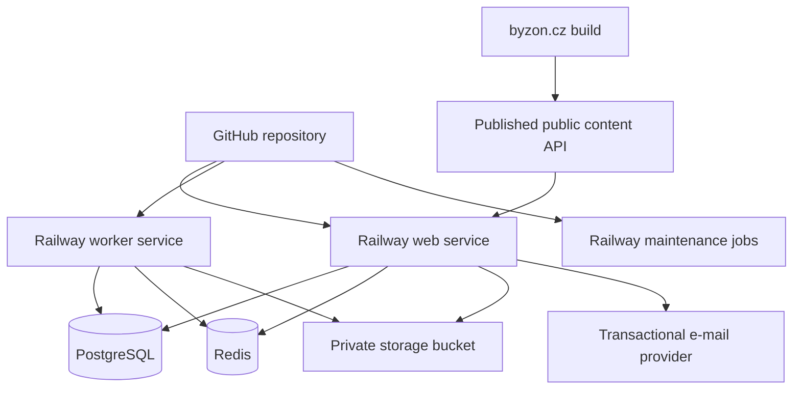
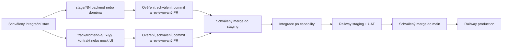

# BYZON 2026 – detailní plán agentního vývoje

> Stav: implementační plán v3.1
>
> Datum sestavení: 20. července 2026
>
> Poslední revize: 23. července 2026
>
> Cílový repozitář: `martymax/byzon-2026`
>
> Cílová aplikace: `https://app.byzon.cz`
>
> Deployment: GitHub → Railway
>
> Produktový zdroj: [BYZON 2026 – zadávací dokumentace webové aplikace v1.0](https://docs.google.com/document/d/1xNNuZaluTWvysPVGUeLNRGAZB6JKN7Z0KNIr2RdUp5g/edit), revize načtená 20. 7. 2026: `ALtnJHwlTM7HUd2qC1co_s6cz_hQwtjfSgjWmCZUo6W79pbMu4Ko6PiTLZKqIWYoVF50nMCRTqiH-n9leQBGgaXE-AD6uDRScGZ3o91P2P2i`

Tento soubor je hlavní prováděcí plán pro vývoj pomocí AI agentů. Produktové zadání určuje **co** se staví; tento plán určuje **jak, v jakém pořadí a podle čeho se pozná dokončení**. Pokud se plán a produktové zadání dostanou do rozporu, má přednost produktové zadání. Změna rozsahu se nejprve zaznamená do rozhodovacího logu v tomto souboru.

---

## 1. Jak má AI agent s plánem pracovat

### 1.1 Povinný pracovní postup pro každý úkol

1. Přečti tento soubor, související část produktového zadání, `README.md`, případný `AGENTS.md` a existující kód dotčeného modulu.
2. Ověř čistotu pracovního stromu a že pracuješ na větvi přiděleného úkolu nebo workstreamu. Cizí nebo uživatelské změny nemaž, nepřepisuj ani nezahrnuj do vlastního commitu.
3. Každý agent pracuje současně právě na jednom jasně vymezeném nehotovém úkolu, jehož závislosti pro cílový stav capability jsou splněné. Projekt jako celek může paralelizovat nezávislé úkoly na oddělených větvích podle §1.7.
4. Pokud úkol narazí na položku označenou `BLOCKER`, nehádej výsledek. Blocker zastaví pouze přechod a scope výslovně uvedený v §22; contract-first návrh, syntetické fixtures a mockované UI mohou pokračovat, pokud nefixují neznámé produkční chování.
5. Nejdřív napiš nebo uprav test, pokud je to rozumné. U kritických doménových pravidel je test povinný před nebo současně s implementací.
6. Implementuj nejmenší úplný řez odpovídající cílovému stavu capability.
   Doménový/backendový úkol dokončí svou vrstvu včetně schématu, pravidel, API,
   serverové autorizace, auditu a testů, pokud jsou relevantní, ale nevytváří
   paralelní UI. Integrační úkol propojí tento serverový řez s již připraveným
   frontendem. Frontendový úkol může skončit ve stavu `UI ready (mocked)`,
   pokud používá schválený kontrakt, validované fixtures a má
   component/accessibility testy; nesmí se pak označit jako `integrated`.
7. Spusť všechny kontroly uvedené u úkolu a globální kontroly relevantní pro změnu.
8. Proveď self-review diffu se zaměřením na autorizaci, soukromí, souběh, idempotenci, časová pásma a offline chování.
9. Aktualizuj tento plán: stav úkolu, stav capability podle §1.2, odkaz na rozhodnutí a případně nově zjištěný blokátor. Neoznačuj úkol jako hotový bez splnění jeho akceptačních podmínek.
10. Předlož uživateli dokončený a ověřený krok: změněné soubory, diff/scope, migrace, env proměnné, provedené testy a zbylá rizika. Do explicitního schválení uživatelem neprováděj commit ani push.
11. Po explicitním schválení daného kroku vytvoř právě jeden tematický commit s ID úkolu a pushni jej na větev přiděleného úkolu/workstreamu. Popis musí uvést změnu schématu, proměnné prostředí, migrační/rollback dopad, cílový stav capability a provedené testy.
12. Merge etapy, rebase, force-push ani smazání větve neprováděj bez samostatného explicitního schválení uživatelem.

### 1.2 Stavové značky

- `[ ]` nezačato
- `[~]` rozpracováno
- `[x]` dokončeno a ověřeno
- `[!]` blokováno vstupem nebo rozhodnutím
- `[–]` vědomě vyřazeno z rozsahu, vždy s odkazem na rozhodnutí

Stavová značka se vztahuje ke konkrétnímu úkolu. `[x]` neznamená automaticky
dokončenou uživatelskou capability. Každá cross-layer capability postupuje
samostatně tímto řetězcem:

`not started → contract ready → UI ready (mocked) → integrated → UAT`

- **not started:** capability ještě nemá schválený úplný klientský/serverový
  kontrakt; existující dílčí schéma nebo obrazovka se uvádí pouze jako evidence;
- **contract ready:** sdílené Zod request/response/problem kontrakty, role,
  cache/offline pravidla, klasifikace PII a validované syntetické fixtures;
- **UI ready (mocked):** responzivní a přístupné UI se všemi povinnými stavy,
  component/axe testy a deterministickým mock transportem;
- **integrated:** skutečný `/api/v1` adapter, serverová relace/autorizace,
  `application/problem+json`, ETag/idempotence podle potřeby, contract/E2E test
  a ověřená nemožnost zapnout mock v produkci;
- **UAT:** staging ověřený reprezentativní rolí, fází eventu a zařízením, bez
  otevřených severity 1/2 vad.

### 1.3 Pravidla pro rozhodování agentů

- **Nedomýšlet produkt:** ceny, kapacity, texty souhlasů, storno pravidla, cílové skupiny oznámení a oprávnění k výjimkám musí být explicitní data nebo schválené rozhodnutí.
- **Privacy by default:** při nejasnosti osobní údaj nezveřejnit, neposlat třetí straně a nezapsat do logu.
- **Server je autorita:** klientské skrytí tlačítka nikdy nenahrazuje serverovou autorizaci a validaci.
- **PostgreSQL je autorita pro transakční stav:** Redis je cache/fronta/pub-sub, nikoli zdroj pravdy pro vstupenky, rezervace, check-in nebo souhlasy.
- **Idempotence:** importy, aktivace, check-in, e-mailové úlohy a webhooky musí bezpečně zvládnout opakování.
- **Čas:** databáze ukládá okamžiky v UTC; uživatelské rozhraní standardně používá `Europe/Prague`. Lokální datum akce je samostatný doménový údaj.
- **Žádné skryté breaking changes:** změny API a schématu musí být dopředně kompatibilní alespoň po dobu jednoho deploymentu.
- **Priorita A před B před C:** práce na C se nesmí zahájit před akceptací A a B.

### 1.4 Definition of Ready pro implementační úkol

Úkol lze začít, když má vyřešené závislosti potřebné pro svůj cílový stav
capability a současně:

- jasný uživatelský nebo provozní výsledek;
- vyřešené závislosti a případné produktové rozhodnutí;
- známé role a oprávnění;
- definované chování při chybě, souběhu a výpadku připojení;
- akceptační kritéria a testovací scénáře;
- uvedený dopad na osobní údaje a audit, pokud nějaký má.

Frontendový nebo contract-first úkol navíc potřebuje:

- cílovou roli, fázi eventu, route/deep link a očekávané chování tlačítka Zpět;
- verzovaný kontrakt nebo výslovně označený návrh kontraktu a fixtures pro
  happy, loading, empty, permission, domain error, offline a session-expired;
- mobilní, desktopovou, klávesnicovou a accessibility akceptaci;
- vlastníka mikrocopy/obsahu nebo jasně označený syntetický placeholder.

### 1.5 Větve, schválení, commit a push

- Každá release etapa má integrační větev `stage/NN-strucny-nazev`, například `stage/04-tickets`. Frontend Priority A používá krátké task větve `track/frontend-a/Fx-yy-strucny-nazev`.
- Každá task větev vzniká z posledního uživatelem schváleného integračního commitu. Více nezávislých task větví může existovat současně; jeden agent má jednu větev, jeden worktree a jeden úkol.
- Číslování etap určuje integrační a release gate, nikoli globální zákaz zahájit nezávislou práci. Mockovaná frontendová větev se nesmí opírat o neintegrovanou backendovou implementaci; opírá se o schválený kontrakt a fixtures.
- Sdílené hotspoty (`packages/ui`, `packages/domain/src/contracts`, root layouty a globální styly) mají po dobu paralelní práce jednoho výslovného vlastníka. Překrývající se task větve se nespouštějí bez integrační dohody.
- Každý dokončený implementační krok má po schválení vlastní tematický commit; nesouvisející úkoly se neslučují do jednoho commitu.
- Dokončení a ověření kroku samo o sobě není souhlas s commitem ani pushem. Agent vždy nejprve předloží výsledek a čeká na explicitní schválení uživatele vztahující se ke konkrétnímu kroku.
- Po schválení agent commitne pouze předložený scope a pushne přidělenou task nebo etapovou větev. V handoffu uvede branch, commit SHA, cílový stav capability a výsledek pushe.
- Task větev se přes reviewovaný PR integruje do příslušné etapové větve nebo
  `staging` po splnění exit criteria svého cílového lifecycle stavu.
  `UI ready (mocked)` lze sloučit, jen pokud je route serverově skrytá nebo
  dostupná pouze v dev/test preview, kontrakt je reviewovaný, fixtures
  validované, CI zelené a produkční graf neobsahuje mock. `integration_gate`
  určuje až přechod capability do `integrated`, nikoli možnost bezpečně sloučit
  izolovaný mockovaný slice. Vytvoření/aktualizace PR a merge vyžadují
  explicitní schválení uživatele.
- Po dokončení všech úkolů a akceptačních podmínek release etapy se etapová větev sloučí přes PR do `staging`; frontendový `UI ready (mocked)` sám o sobě release gate nesplňuje.
- Po staging CI a UAT se `staging` sloučí do `main` samostatným schváleným release krokem. Přímý push do `staging` nebo `main` se nepoužívá.
- Schválení se nevztahuje automaticky na pozdější opravy nebo rozšíření. Každá dodatečná změna se znovu ověří a před commitem/pushem znovu schválí.

### 1.6 Povinný závěrečný review gate každé integrační jednotky

Po dokončení implementačních úkolů a před uzavřením nebo merge každé task větve,
frontendového milníku nebo release etapy
proveď v tomto pořadí:

1. **Security review:** zkontroluj celý rozsah etapy se zaměřením na threat
   model, autentizaci a autorizaci, event scope/IDOR, ochranu secrets a PII,
   validaci vstupů, dependency/configuration rizika, migrace a bezpečné chování
   při chybách.
2. **Code review:** zkontroluj úplný etapový diff/PR z hlediska funkční
   správnosti, architektury, souběhu, idempotence, testovacího pokrytí,
   provozních dopadů a udržovatelnosti. Rozliš actionable nálezy od
   nízkohodnotových stylistických návrhů a false positives.
3. **Okamžité zapracování nálezů:** všechny potvrzené actionable nálezy z obou
   review oprav v rámci stejné etapy, doplň regresní testy a znovu spusť
   relevantní kontroly a CI. Zamítnutý nález musí mít stručně zaznamenaný důvod.

Integrační jednotku nelze označit za dokončenou ani sloučit, dokud nejsou potvrzené nálezy
opravené a ověřené. Samotné provedení review bez následného zapracování nálezů
nesplňuje tento gate. Commit, push a merge i zde podléhají schválením z §1.5.

### 1.7 Paralelní workstreamy a dependency gate

- Release priority zůstává `A → B → C`; paralelizace Priority A nesmí otevřít
  implementaci Priority B/C před jejich gate.
- Každý `F*` blok a každý nově otevíraný paralelní workstream uvádí
  `depends_on`, `blocked_by`, `parallel_with` a `integration_gate`. Historické
  `P*` etapy mají závislosti u etapy; před paralelním přidělením konkrétního
  `P*` úkolu se stejné čtyři položky doplní do zadání/handoveru. Úkol se
  zahajuje podle skutečných vazeb, nikoli pouze podle čísla etapy.
- Kontrakt je hranice paralelní práce. Frontend nezná vendor sloupce, databázové
  entity ani interní serverové typy; backend nemění schválené DTO bez
  kompatibilního přechodu a contract testu.
- Mockovaný frontend je bezpečná demonstrace kontraktu, nikoli důkaz serverové
  autorizace, souběhu nebo produkční funkčnosti. V produkčním bundle nesmí
  existovat runtime přepínač na mock data.
- Neintegrované obrazovky jsou dostupné pouze v test/dev preview nebo jsou na
  stagingu bezpečně skryté serverově vyhodnoceným feature/event stavem.
- Blocker v §22 zastaví pouze uvedený lifecycle přechod. Pokud tabulka neříká
  jinak, neblokuje `contract ready` ani `UI ready (mocked)`.

---

## 2. Výchozí stav repozitáře

Při sestavení plánu je větev `main` čistá a sleduje `origin/main`. Výchozí commit je `29933429a23671e7d5d88cf114b9bf8872223aab`.

Současný veřejný web:

- je statický HTML/CSS/JS web;
- generuje se Python skriptem `static-site/build.py`;
- používá `static-site/data/content.json` jako současný zdroj obsahu;
- nemá Node runtime ani balíčkové závislosti;
- používá SimpleShop embed pro nákup;
- musí zůstat během vývoje aplikace provozně nedotčený.

Nová aplikace se přidá do stejného repozitáře jako monorepo. Přesun nebo přepis stávajícího veřejného webu není součástí prvních etap.

---

## 3. Pevně stanovený rozsah

### 3.0 Konstanty ročníku 2026

- Event slug: `byzon-2026`.
- Termín: 18.–19. září 2026; přesný začátek/konec se převezme z publikovaného programu.
- Výchozí časová zóna: `Europe/Prague`.
- Místo: Clarion Congress Hotel, České Budějovice; přesné navigační texty a plánek jsou řízený obsah.
- Správce osobních údajů a pořadatel: ENJOiT s.r.o.
- Jazyk UI a provozní komunikace: čeština.
- Nákup zůstává na `byzon.cz` přes SimpleShop; `app.byzon.cz` nenahrazuje checkout.

### 3.1 Produkt

- Mobilně orientovaná PWA na `app.byzon.cz`, bez povinné instalace.
- Veřejný `byzon.cz` zůstává marketingovým/prodejním webem.
- Aktivace osobním odkazem, skenem QR/čárového kódu nebo ručním zadáním stejného kódu vstupenky.
- Jedna jedinečná vstupenka se aktivuje právě k jednomu účtu; oprávněný správce může řešit převod/reaktivaci.
- Program, osobní agenda, rezervace, čekací listiny, praktické informace a check-in.
- Dobrovolný networking se soukromím po jednotlivých polích.
- Oznámení, řečnický portál, otázky, ankety, hodnocení a organizační přehledy.
- Čeština jako jediný jazyk ročníku 2026.
- Social wall pouze jako priorita C za samostatným feature flagem.

### 3.2 Mimo rozsah 2026

- nativní mobilní aplikace;
- plně offline zprávy, dotazy a hlasování;
- plánování networkingových schůzek do pevných slotů;
- pokročilé profilování/matching;
- gamifikace;
- certifikáty, fotogalerie a videozáznamy;
- plná CZ/EN lokalizace;
- Apple/Google Wallet;
- partner lead capture nebo přístup partnerů k účastnickým kontaktům;
- přímé řízení tiskárny jmenovek.

### 3.3 Priority

- **A – podmínka spuštění:** účet a aktivace, program, agenda, rezervace, praktické informace, check-in, organizační správa, minimální provozní in-app oznámení, souhlasy, ochrana dat a provozní fallbacky.
- **B – podmínka plného průběhu:** networking, rozšířené cílení a e-mailové doručení oznámení, řečnický portál, dotazy, hlasování, hodnocení a přehledy.
- **C – volitelné:** social wall a drobná vylepšení až po formální akceptaci A a B.

---

## 4. Závazná technická rozhodnutí

| ID | Rozhodnutí | Vlastník | Důvod a důsledek |
| --- | --- | --- | --- |
| [ADR-001](docs/adr/001-monorepo.md) | Jeden GitHub repozitář, monorepo | Tech lead | Sdílení značky, typů a doménových pravidel; nezávislé Railway služby přes root/watch paths. |
| [ADR-002](docs/adr/002-nextjs-react-typescript.md) | Next.js App Router + React + TypeScript strict | Tech lead | Jeden full-stack kód, serverové renderování, Route Handlers, PWA podpora, dobrý Railway deployment. |
| [ADR-003](docs/adr/003-postgresql-drizzle.md) | PostgreSQL + Drizzle ORM | Tech lead | Transakce a databázová omezení pro kapacity, vstupenky a check-in; explicitní SQL migrace. |
| [ADR-004](docs/adr/004-better-auth.md) | Better Auth pro identity, relace a magic link | Tech lead + security | Nevytvářet vlastní správu relací; ticket claim zůstává vlastní doménová vrstva. |
| [ADR-005](docs/adr/005-redis-bullmq-worker.md) | Redis + BullMQ worker | Tech lead | Asynchronní e-maily, připomínky, waitlist, retence, exporty a retry bez blokování web requestů. |
| [ADR-006](docs/adr/006-rest-sse.md) | REST JSON API `/api/v1` + SSE | Tech lead | Offline klient potřebuje stabilní HTTP rozhraní; živé funkce jsou převážně server → klient. |
| [ADR-007](docs/adr/007-private-object-storage.md) | Railway private Storage Bucket | Tech lead + ENJOiT | Soukromé materiály řečníků, obrázky a exporty; přístup pouze krátkodobými podepsanými URL/proxy. |
| [ADR-008](docs/adr/008-database-published-content-source.md) | DB jako jediný zdroj publikovaného programu a profilů | Produkt + tech lead | Admin spravuje obsah bez vývojáře; `byzon.cz` obsah pouze synchronizuje/konzumuje. |
| [ADR-009](docs/adr/009-service-worker-indexeddb.md) | Service worker + IndexedDB | Tech lead | Offline čtení programu/agendy/informací; explicitní synchronizační fronta jen pro bezpečné operace. |
| [ADR-010](docs/adr/010-eu-railway-region.md) | EU Railway region pro web, worker, DB, Redis i bucket | ENJOiT + tech lead | Soulad se zadáním; externí zpracovatelé vyžadují samostatné právní schválení. |
| [ADR-011](docs/adr/011-event-feature-flags.md) | Feature flags per event | Produkt + tech lead | Bezpečné oddělení priorit B/C a postupné zpřístupňování funkcí. |
| [ADR-012](docs/adr/012-multi-event-data-model.md) | Multi-event datový model od začátku | Produkt + tech lead | Opakované použití pro další ročník bez sdílení dat mezi akcemi. |

Nezafixované externí služby (e-mail, error tracking, uptime monitor, případný malware scanner) se implementují přes rozhraní/adaptéry. Produkční provider musí být vybrán a právně schválen před příslušnou launch gate.

---

## 5. Cílová architektura



### 5.1 Runtime komponenty

1. **Conference web** – Next.js proces: UI, `/api/v1`, autentizace, serverová autorizace, SSE, health/readiness endpoint.
2. **Worker** – dlouho běžící Node proces: BullMQ consumers, e-maily, waitlist nabídky, reminders, exporty, údržba a outbox dispatch.
3. **Maintenance job** – jednorázové Railway cron příkazy: retence/anonymizace, zálohy, kontrola konzistence. Musí být idempotentní a používat distribuovaný zámek.
4. **PostgreSQL** – trvalý transakční zdroj pravdy.
5. **Redis** – fronty, rate limiting, krátká cache a realtime fan-out. Ztráta Redis nesmí poškodit autoritativní data.
6. **Private bucket** – soubory, exporty, zálohy podle schválené politiky.

### 5.2 Railway služby a prostředí

Pro každé dlouhodobé prostředí vytvořit oddělené služby a data:

- `byzon-app-web`
- `byzon-app-worker`
- `byzon-app-postgres`
- `byzon-app-redis`
- `byzon-app-storage`
- případně `byzon-app-maintenance` pro cron

Prostředí:

- `production`: větev `main`, doména `app.byzon.cz`, produkční data;
- `staging`: větev `staging`, doména např. `staging-app.byzon.cz`, anonymizovaná/testovací data;
- PR environments: až po ověření nákladů; nikdy nekopírovat produkční osobní údaje.

Web a worker používají stejný image/lockfile, ale různé start commands. Migrace se spouštějí jako Railway pre-deploy command pouze jednou na webové službě. Worker se nesmí rozběhnout proti nekompatibilnímu schématu.

### 5.3 Vývojový tok



Na etapových a task větvích vznikají po approval gate malé tematické commity,
zpravidla jeden na každý schválený implementační krok. Mockovaná UI větev se
integruje nezávisle pouze jako skrytý/neprodukční slice; capability přechází do
`integrated` až po propojení se skutečným serverem. Přímý push do `staging` ani
`main` se nepoužívá. Produkční migrace musí být dopředně kompatibilní a nasazení
musí mít popsaný rollback bez destruktivního downgrade schématu.

---

## 6. Cílová struktura repozitáře

```text
/
├── apps/
│   ├── conference/
│   │   ├── public/
│   │   │   ├── icons/
│   │   │   └── sw.js                 # generovaný nebo řízený service worker
│   │   ├── src/
│   │   │   ├── app/                  # Next.js routes/layouts
│   │   │   ├── components/           # app-specific UI
│   │   │   ├── modules/              # vertikální produktové moduly
│   │   │   ├── lib/api/              # typed fetch transport a problem mapping
│   │   │   ├── server/               # auth, API helpers, adapters
│   │   │   ├── test/mocks/           # pouze test/dev transport handlers
│   │   │   ├── offline/              # IndexedDB, sync, cache contracts
│   │   │   └── instrumentation.ts
│   │   ├── next.config.ts
│   │   └── package.json
│   └── worker/
│       ├── src/
│       │   ├── jobs/
│       │   ├── providers/
│       │   ├── scheduler/
│       │   └── index.ts
│       └── package.json
├── packages/
│   ├── database/
│   │   ├── src/schema/
│   │   ├── src/queries/
│   │   ├── drizzle/
│   │   └── package.json
│   ├── domain/
│   │   ├── src/contracts/             # sdílené Zod API DTO bez server/DB importů
│   │   ├── src/policies/
│   │   ├── src/state-machines/
│   │   └── package.json
│   ├── ui/
│   │   └── src/components/            # brandované přístupné primitives
│   ├── config/
│   └── test-support/
│       └── src/fixtures/              # syntetické contract-validované scénáře
├── AI_IMPLEMENTATION_PLAN.md
├── docs/
│   ├── adr/
│   ├── runbooks/
│   └── api/
├── .github/workflows/
├── railway.web.json
├── railway.worker.json
├── railway.maintenance.json
├── pnpm-workspace.yaml
├── package.json
├── pnpm-lock.yaml
├── static-site/
│   ├── build.py                          # generátor existujícího veřejného webu
│   ├── data/content.json                 # migrační vstup, později exportovaný snapshot
│   └── public/                           # kompletní FTP-ready výstup pro byzon.cz
└── ...
```

### 6.1 Hranice modulů v `apps/conference/src/modules`

- `auth`
- `events`
- `content`
- `tickets`
- `participants`
- `agenda`
- `reservations`
- `check-in`
- `networking`
- `announcements`
- `speakers`
- `live-interaction`
- `feedback`
- `files`
- `admin`
- `reporting`
- `privacy`
- `audit`

Modul nesmí přímo používat interní tabulky jiného modulu mimo explicitně sdílené query/service rozhraní. Sdílené doménové typy neimportují React, Next.js ani konkrétní provider.

### 6.2 Frontendové hranice

- Veřejná klientská DTO a `application/problem+json` schémata jsou v
  `packages/domain/src/contracts`; klient nesmí importovat typy z
  `apps/conference/src/server` ani databázové entity.
- `packages/ui` obsahuje sémantické tokeny a přístupné, brandované primitives.
  Produktové moduly skládají tyto primitives, nevytvářejí druhý paralelní UI kit.
- `packages/test-support/src/fixtures` obsahuje pouze syntetická data validovaná
  stejnými Zod schématy jako HTTP odpovědi. Produkční data se do fixtures
  nekopírují.
- Produkční a mock transport implementují stejné klientské rozhraní. Mock je
  test/dev dependency a nesmí být dostupný přes produkční environment flag.
- Existující funkční UI etapy 3 se při zavádění hranic migruje postupně při
  dotyku; plošný vizuální přepis není podmínkou zahájení Frontend Priority A.

---

## 7. Technické standardy

### 7.1 Toolchain

- Node.js: při scaffoldingu ověřit aktuální Active LTS, zafixovat přes `.nvmrc`, `packageManager` a Railway/Nixpacks nastavení.
- pnpm workspaces, jeden lockfile.
- TypeScript: `strict`, `noUncheckedIndexedAccess`, `exactOptionalPropertyTypes`, bez neodůvodněného `any`.
- ESLint + Prettier; import boundaries pro moduly.
- Next.js `output: "standalone"` pro Railway.
- Environment schema validovaný Zodem při startu. Chybějící povinná proměnná musí ukončit proces před přijetím provozu.
- Datové a API kontrakty se odvozují ze sdílených Zod schémat, ale databázové entity se neposílají přímo klientovi.

### 7.2 Standard odpovědí API

- Úspěch: explicitní DTO, ISO 8601 timestamps, stabilní ID, žádná neveřejná pole.
- Chyba: `application/problem+json` s `type`, `title`, `status`, `code`, `detail`, `requestId` a volitelným `fieldErrors`.
- Stránkování: cursor-based; `limit` má serverové maximum.
- Mutace náchylné k opakování přijímají `Idempotency-Key`.
- Každý request dostane `requestId`; klient jej zobrazí v chybovém detailu pro podporu.
- API se verzionuje cestou `/api/v1`; breaking změna vyžaduje `/api/v2` nebo kompatibilní přechod.

### 7.3 Doménové identifikátory

- Primární klíče: UUIDv7, generované serverem.
- Veřejné slugs pouze pro obsah, nikoli jako autorizační identita.
- Citlivé sekvenční počty se nezveřejňují.
- Po rozhodnutí `BLOCKER-TKT-04` se kód vstupenky případně normalizuje jediným
  verzovaným serverovým pravidlem a ukládá jako
  `HMAC-SHA-256(server_pepper, normalized_code)`. Do té doby je opaque a nesmí
  se trimovat ani měnit case. HMAC je jednosměrný lookup identifikátor, ne
  prezentační credential; pro podporu lze uložit nejvýše bezpečný maskovaný
  suffix.

### 7.4 Čas a plánování

- DB `timestamptz` pro okamžiky; `date` pro lokální den konference.
- Každá akce má `timezone`, pro 2026 `Europe/Prague`.
- API vrací UTC a případně explicitní `eventTimezone`.
- DST a půlnoční přesahy musí mít testy.
- Joby se plánují podle UTC vypočteného z časové zóny akce; opakovaný scheduler nesmí vytvořit duplicitní úlohy.

### 7.5 Feature flags

Feature flags jsou per event, serverově vyhodnocené a auditované:

- `networking_enabled`
- `announcements_enabled`
- `speaker_portal_enabled`
- `questions_enabled`
- `polls_enabled`
- `ratings_enabled`
- `social_wall_enabled`
- `offline_checkin_enabled`
- `public_content_sync_enabled`

Vypnutí flagu musí uzavřít i přímé API endpointy, ne jen navigaci.

### 7.6 Knihovny a odpovědnosti

Přesná čísla verzí se zvolí při `P1-02` podle aktuální stabilní kompatibility a ihned se uzamknou v `pnpm-lock.yaml`. Níže uvedený výběr je závazný; náhrada vyžaduje ADR.

| Oblast | Výchozí knihovna/přístup | Pravidlo použití |
| --- | --- | --- |
| Web framework | Next.js App Router, React | Server Components pro read-first obrazovky; Client Components jen tam, kde je interakce/browser API. |
| CSS a komponenty | Tailwind CSS + shadcn/ui/Radix primitives | Komponenty se kopírují a přizpůsobují v `packages/ui`; zachovat přístupnost primitiv. |
| Formuláře | React Hook Form + Zod resolver | Server vždy validuje znovu stejným nebo ekvivalentním kontraktem. |
| Server/client data | TanStack Query | Pro autentizovaná mutabilní data, invalidace a reconnect; nenahrazuje serverovou autoritu. |
| API klient | Native `fetch` + tenký typed wrapper nad sdílenými Zod kontrakty | Jednotně mapuje success/problem odpovědi, request ID, ETag, timeout, session expiry a idempotency; žádný generický nevalidovaný cast. |
| Mock transport | MSW pouze v dev/test + fixtures z `@byzon/test-support` | Handler i fixture používají produkční kontrakt; mock nesmí být importovatelný produkčním bundlem. |
| Lokální offline data | Dexie nad IndexedDB | Jen DTO uvedená v cache politice, schema migrations a per-user cleanup. |
| Auth | Better Auth | Identity/session/magic link; event membership a ticket claim jsou vlastní doména. |
| DB | `pg` + Drizzle ORM/Kit | Transakce a constraints explicitně; migrace jsou verzované soubory v repu. |
| Queue/cache | BullMQ + ioredis | Worker jobs, rate limits, pub/sub; připojení musí fungovat přes Railway private networking. |
| Logy | Pino | JSON, request context a centrální redaction. |
| Datum/čas | `date-fns` + timezone podpora nebo aktuální ekvivalent | Žádná ruční práce s offsetem; vždy event timezone. |
| QR/barcode | Browser `BarcodeDetector` jako progressive enhancement + lazy fallback `@zxing/browser` | Ruční kód je vždy dostupný; scanner bundle nenačítat mimo scan route. |
| Rich text | Markdown subset + `react-markdown`/sanitizační allowlist | Zakázat raw HTML a nebezpečné URL protokoly. |
| E-mail | vlastní `MailProvider` interface | SDK providera smí být pouze v adapteru workeru/serveru. |
| API dokumentace | Zod kontrakty → generovaný OpenAPI dokument | CI kontroluje drift; OpenAPI nemusí být veřejně přístupné v produkci. |
| Unit/integration | Vitest | DB/Redis testy běží proti izolovaným skutečným službám, ne proti in-memory náhradě. |
| E2E | Playwright | Mobilní viewporty, Chromium; kritické Safari chování ověřit také manuálně/BrowserStack-like službou po schválení. |
| Accessibility | axe-core/Playwright integrace | Automatický audit doplnit manuálním testem; nulový axe nález není úplná akceptace. |

Redux, vlastní password auth, GraphQL, Firebase/Supabase a samostatný Express server se bez nového ADR nezavádějí. Server Actions lze použít pouze pro lokální UI formulář, pokud zároveň neobcházejí stabilní `/api/v1` kontrakt potřebný pro PWA/offline klienta.

### 7.7 Lokální vývoj

- Root příkaz spustí web, worker a sdílené watch buildy.
- PostgreSQL a Redis se spouštějí přes verzovaný `compose.yaml`; produkční data se lokálně nekopírují.
- `pnpm dev:infra` spustí infrastrukturu, `pnpm dev` aplikace, `pnpm dev:reset` znovu vytvoří pouze explicitně pojmenovanou lokální DB.
- Seed vytvoří syntetické role, ticket stavy, kapacitní souběh, waitlist, networking privacy a live session. Testovací e-maily končí v lokálním sinku.
- Lokální bucket používá S3-kompatibilní dev službu nebo filesystem adapter výhradně za stejným `ObjectStorage` rozhraním. Produkční chování presigned URL musí mít integrační test.
- Čas lze v dev/testu řídit přes injektovaný `Clock`; nepřidávat globální produkční proměnnou, která by dovolila posun času.

### 7.8 Proměnné prostředí

Názvy se mohou upravit pouze konzistentně ve schema, `.env.example`, Railway a runbooku. Hodnoty tajných proměnných se nikdy necommitují.

| Proměnná | Web | Worker | Citlivá | Účel |
| --- | --- | --- | --- | --- |
| `NODE_ENV` | ano | ano | ne | Runtime režim. |
| `APP_ENV` | ano | ano | ne | `development | test | staging | production`. |
| `APP_BASE_URL` | ano | ano | ne | Kanonická URL aplikace. |
| `PUBLIC_SITE_URL` | ano | ano | ne | Kanonická URL `byzon.cz`. |
| `DATABASE_URL` | ano | ano | ano | Railway PostgreSQL private URL. |
| `REDIS_URL` | ano | ano | ano | Railway Redis private URL. |
| `BETTER_AUTH_SECRET` | ano | ne | ano | Podpis/šifrování auth; minimální délka dle knihovny. |
| `BETTER_AUTH_URL` | ano | ne | ne | Kanonický auth origin, bez wildcardu. |
| `TICKET_CODE_PEPPER_ACTIVE` | ano | ne | ano | Aktivní HMAC key. |
| `TICKET_CODE_PEPPER_PREVIOUS` | ano | ne | ano | Volitelné rotační přechodné čtení; odstranit po rehash migraci. |
| `MAIL_PROVIDER` | ano | ano | ne | `sink` v dev/test, schválený provider v prod. |
| `MAIL_API_KEY` | ano | ano | ano | Provider credential. |
| `MAIL_FROM` | ano | ano | ne | Ověřený sender. |
| `MAIL_REPLY_TO` | ano | ano | ne | Organizační podpora. |
| `STORAGE_ENDPOINT` | ano | ano | ne | S3-compatible endpoint. |
| `STORAGE_REGION` | ano | ano | ne | EU region. |
| `STORAGE_BUCKET` | ano | ano | ne | Environment-specific bucket. |
| `STORAGE_ACCESS_KEY_ID` | ano | ano | ano | Bucket credential. |
| `STORAGE_SECRET_ACCESS_KEY` | ano | ano | ano | Bucket credential. |
| `LOG_LEVEL` | ano | ano | ne | `info` produkčně, debug jen dočasně bez PII. |
| `WORKER_CONCURRENCY_EMAIL` | ne | ano | ne | Samostatný limit e-mail jobů. |
| `WORKER_CONCURRENCY_DEFAULT` | ne | ano | ne | Ostatní joby. |
| `PUBLIC_SYNC_PROVIDER` | ne | ano | ne | `noop` do potvrzení, později schválený trigger. |
| `PUBLIC_SYNC_TOKEN` | ne | ano | ano | Credential pro rebuild/deploy trigger. |
| `ERROR_TRACKING_DSN` | ano | ano | ano | Jen po schválení providera a redaction. |
| `RELEASE_SHA` | ano | ano | ne | Git commit pro logy, SSE a diagnostiku. |

Do klientského bundle smí pouze výslovně bezpečné `NEXT_PUBLIC_*` hodnoty. Serverové env schema má unit test, který selže při nečekaném zpřístupnění secret názvu klientské konfiguraci.

### 7.9 Migrační strategie databáze

- Používat expand → migrate/backfill → switch reads/writes → contract v oddělených deploymentech.
- Produkční migrace nesmí čekat dlouhý table lock; velký backfill dělá resumable worker v dávkách.
- Přidání required sloupce: nejdřív nullable/default, backfill, validace, teprve později constraint.
- Odebrání/přejmenování: nejdřív duální kompatibilita aplikace, až potom odstranění starého pole.
- Každá migrace má integrační test z předchozího schématu a poznámku o očekávané délce/locku.
- Down migrace se v produkci nepovažuje za bezpečný rollback dat. Rollback aplikace musí po přechodnou dobu rozumět novému schématu.
- Destruktivní migrace vyžaduje explicitní approval, snapshot a ověřenou obnovu.

### 7.10 Frontend kontrakty, API klient a mock hranice

- Sdílený Zod kontrakt definuje request, success DTO a podporované
  `application/problem+json` kódy. Server i fixtures jej validují; klient
  bezpečně odmítne neznámý nebo nevalidní response shape.
- Jeden typed fetch transport řeší JSON/problem content type, `requestId`, ETag,
  abort/timeout, bezpečný retry, `401/session expired`, idempotency headers a
  rozlišení offline, transportní a doménové chyby.
- UI rozhoduje podle stabilního `code` a strukturovaných polí, ne podle
  lokalizovaného `title` nebo `detail`. Request ID se nabídne uživateli pro
  podporu bez vypsání citlivého payloadu.
- Deterministické fixtures pokrývají role, fáze eventu a stavy happy/loading/
  empty/permission/domain error/offline/stale/session-expired. Každá fixture
  musí projít stejným Zod parserem jako produkční odpověď.
- Mock transport nesmí být součástí produkčního dependency graphu. CI kontrola
  failne při produkčním importu mock handleru, fixture nebo runtime přepínače.
- Syntetický SimpleShop fixture prokazuje pouze vendor-neutral importní workflow.
  Nesmí kodifikovat skutečné hlavičky, statusy ani normalizaci před vyřešením
  příslušného blockeru.

`F0-02` zakládá pouze base kontrakt, error taxonomy a tento registr; není
nekonečným vlastníkem všech budoucích DTO. Konkrétní feature task spolu se svým
serverovým partnerem vlastní pojmenovaný slice a jeho fixture. Stav se po review
aktualizuje zde, takže downstream nezávisí na neurčitém „příslušném kontraktu“.
Uvedené cesty jsou cílové, dokud soubor nevznikne. Společné názvosloví,
veřejné exporty a skládání endpointových problem unionů popisují verzované
[`packages/domain/src/contracts/README.md`](packages/domain/src/contracts/README.md):

| Slice ID | Scope | Cílové schema | Vlastník kontraktu/integrace | Konzumenti | Stav |
| --- | --- | --- | --- | --- | --- |
| `CS-BASE-01` | problem, session-expired, pagination a transport metadata | `packages/domain/src/contracts/base.ts` | `F0-02` | všechny `F*` | `contract ready` |
| `CS-ACT-01` | claim outcomes, recovery a auth handoff | `packages/domain/src/contracts/activation.ts` | `F1-01`, `P4-04`, `P4-07` | `F1` | `contract ready`; striktní landing/claim/identity/link/recovery kontrakt a validované syntetické fixtures |
| `CS-BOOT-01` | `/me/bootstrap`, onboarding, profil a privacy minimum | `packages/domain/src/contracts/identity.ts` | `P4-13`, `F1-05`, `F2-07` | `F1`, `F2`, `F6` | `contract ready`; striktní private/no-store bootstrap, verzované právní dokumenty, explicitní onboarding request/response a validované syntetické fixtures |
| `CS-CONTENT-01` | publikovaný program a praktické informace | `packages/domain/src/contracts/content.ts` | `F2-03` s vlastníkem existujícího `P3-03` API | `F2`, `F6` | `contract ready`; P3 API, typed klient a fixtures používají sdílené schéma |
| `CS-TICKET-01` | stav a opaque presentation value vstupenky | `packages/domain/src/contracts/ticket.ts` | `P4-12`, `F2-04` | `F2`; volitelně `F5` | `not started` |
| `CS-AGENDA-01` | agenda, rezervace, waitlist, kapacita a conflict | `packages/domain/src/contracts/agenda.ts` | `P5-02` až `P5-05`, `F3` | `F3`, `F6` | `not started` |
| `CS-IMPORT-01` | batch, row validation, diff, apply a report | `packages/domain/src/contracts/ticket-import.ts` | `P4-02`, `P4-03`, `F4-02` až `F4-04` | `F4` | `not started` |
| `CS-SUPPORT-01` | participant/ticket lookup a auditované support akce | `packages/domain/src/contracts/support.ts` | `P4-09`, `P9-03`, `F4-05` | `F4` | `not started` |
| `CS-CHECKIN-01` | lookup, confirm, duplicate, undo a stats | `packages/domain/src/contracts/check-in.ts` | `P6-01` až `P6-06`, `F5` | `F5` | `not started` |
| `CS-ANN-01` | in-app draft, audience preview, send, inbox a read | `packages/domain/src/contracts/announcements.ts` | `P8-05`, `P8-06`, `F2-05`, `F4-06` | `F2`, `F4` | `not started` |
| `CS-ADMIN-01` | dashboard, role, override, audit, export a settings | `packages/domain/src/contracts/admin.ts` | `P9`, `F4-07`, `F4-08` | `F4` | `not started` |
| `CS-OFFLINE-01` | version, ownership, revocation a replay policy | `packages/domain/src/contracts/offline.ts` | `P7`, `F6` | `F6` | `not started` |

---

## 8. Role a oprávnění

### 8.1 Role

- `participant`
- `speaker`
- `organizer_admin`
- `checkin_operator`
- `moderator`
- `room_operator` – technická role pro seznam rezervovaných a účast na konkrétních aktivitách
- `support_operator` – volitelně oddělená omezená role pro obnovu přístupu; nevytvářet, dokud není potvrzena potřeba
- `system_worker` – technická identita, nepřihlašuje se přes UI

Role se vážou k `event_id`. Globální superadmin se ve verzi 2026 nevytváří, pokud není explicitně požadován.

### 8.2 Matice minimálních oprávnění

| Akce | Účastník | Řečník | Check-in | Moderátor | Room op. | Admin |
| --- | --- | --- | --- | --- | --- | --- |
| Číst publikovaný program | ano | ano | ano | ano | ano | ano |
| Měnit vlastní agendu/rezervaci | vlastní | jen pokud je i účastník | ne | ne | ne | ano jako auditovaná výjimka |
| Číst networkingový adresář | opt-in participant | jen pokud opt-in participant | ne | pouze moderace reportu | ne | pouze moderace/report, ne plošný export kontaktů |
| Psát zprávy | přijatá spojení | totéž | ne | ne | ne | pouze zásah do nahlášeného obsahu |
| Správa programu/obsahu | ne | vlastní podklady | ne | ne | ne | ano |
| Sken/check-in | vlastní kód zobrazit | vlastní kód zobrazit | ano | ne | ne | ano |
| Vrátit check-in | ne | ne | omezeně dle politiky | ne | ne | ano |
| Seznam rezervovaných | vlastní stav | vlastní stav | ne | ne | jen přidělené aktivity | ano |
| Moderovat dotazy/ankety | ne | odpovědět přidělené | ne | přidělené bloky | ne | ano |
| Odeslat oznámení | ne | ne | ne | jen pokud explicitně povoleno | ne | ano |
| Export osobních dat | vlastní export | vlastní export | ne | ne | ne | jen schválené provozní exporty, audit |

### 8.3 Autorizační pravidla

- Každý chráněný query/mutation přijímá `actor`, `eventId` a kontroluje membership/role na serveru.
- Žádný endpoint nesmí důvěřovat `role` z request body nebo klientského tokenu bez serverového ověření.
- Citlivá administrativní akce vyžaduje čerstvou relaci; později lze přidat step-up ověření magic linkem.
- Audit log obsahuje aktéra, akci, cíl, event, důvod výjimky a bezpečný diff bez citlivých hodnot.

---

## 9. Datový model

Názvy jsou doporučené a mají být zpřesněny v Drizzle schématu. Každá eventová tabulka musí mít index s `event_id`. Osobní údaje nesmí být zbytečně kopírovány do snapshotů nebo job payloadů.

### 9.1 Událost, konfigurace a právní verze

#### `events`

- `id`, `slug`, `name`, `starts_at`, `ends_at`, `timezone`
- `status`: `draft | activation_open | live | ended | archived`
- `activation_opens_at`, `networking_deletes_at`, `operational_data_anonymizes_at`
- `created_at`, `updated_at`
- unique: `slug`

#### `event_features`

- `event_id`, jednotlivé boolean flags, `updated_by`, `updated_at`
- unique: `event_id`

#### `legal_documents`

- `id`, `event_id`, `type`: `terms | privacy_notice | networking_consent | other`
- `version`, `title`, `content_url` nebo sanitizovaný obsah, `published_at`, `is_current`
- unique: `(event_id, type, version)`
- právě jedna current verze typu/eventu – vynutit transakcí a částečným unique indexem

#### `consent_records`

- `id`, `event_id`, `user_id`, `legal_document_id`, `decision`: `accepted | withdrawn | acknowledged`
- `recorded_at`, `source`, `request_id`
- append-only; změna vytváří nový záznam

### 9.2 Identity a role

Better Auth tabulky (`user`, `session`, `account`, `verification` nebo jejich aktuální ekvivalent) spravovat podle zvolené verze knihovny. Doménové rozšíření:

#### `event_memberships`

- `event_id`, `user_id`, `status`: `active | suspended | revoked`
- `activated_at`, `revoked_at`, `revocation_reason`
- unique: `(event_id, user_id)`

#### `event_roles`

- `event_id`, `user_id`, `role`, `scope_json`, `granted_by`, `granted_at`, `revoked_at`
- `scope_json` jen pro omezení na session/room; schéma validovat
- unique aktivní role: `(event_id, user_id, role)`

### 9.3 Vstupenky a importy

#### `ticket_import_batches`

- `id`, `event_id`, `source`, `source_filename`, `file_sha256`
- `status`: `uploaded | validated | awaiting_confirmation | applying | applied | failed`
- `row_count`, souhrn diffu, `created_by`, timestamps
- unique: `(event_id, file_sha256)` pro idempotenci

#### `ticket_import_rows`

- staging záznamy; normalizovaná pole, původní číslo řádku, validační chyby
- původní raw řádek uchovat pouze po nezbytnou dobu a nepsat do aplikačních logů

#### `tickets`

- `id`, `event_id`, `external_id`, `order_external_id`
- `code_hmac`, `code_suffix`, `status`: `valid | activated | cancelled | refunded | transferred | blocked`
- `holder_user_id`, `claimed_at`, `cancelled_at`, `transferred_from_ticket_id`
- volitelné provozní údaje kupujícího jen pokud jsou skutečně potřebné
- unique: `(event_id, code_hmac)`
- unique: `(event_id, external_id)` pokud jej zdroj garantuje
- indexy: status, holder, order id
- `code_hmac` a `code_suffix` jsou jednosměrné identifikátory pro lookup a audit;
  nelze z nich rekonstruovat zobrazitelný ani skenovatelný kód. Kontrakt
  účastnické vstupenky proto musí před integrací vyřešit
  `BLOCKER-TKT-05`.

#### `ticket_events`

- append-only historie importu, aktivace, storna, transferu, blokace a reaktivace
- `actor_type`, `actor_id`, `ticket_id`, `from_status`, `to_status`, `reason`, `occurred_at`

#### `ticket_claim_attempts`

- agregovaná bezpečnostní stopa: HMAC/suffix, výsledek, actor/IP hash, user-agent hash, timestamp
- krátká retence; nikdy neukládat raw kód

### 9.4 Profily a soukromí

#### `participant_profiles`

- `event_id`, `user_id`, `first_name`, `last_name`, `company`, `job_title`, `bio`, `linkedin_url`, `photo_asset_id`
- `industry`, `looking_for`, `offering`, `phone`, `contact_email`
- `networking_enabled`, `moderation_status`
- `phone_visibility`, `email_visibility`: `nobody | networking | connections`
- u ostatních polí explicitní public/networking pravidlo; výchozí stav nejpřísnější
- timestamps, soft-delete/anonymization timestamps
- unique `(event_id, user_id)`

#### `interest_tags`, `profile_tags`, `tag_aliases`

- kanonické tagy per event, vlastní návrhy a adminem spravované aliasy
- vyhledávání pracuje s canonical tag IDs, ne s nekontrolovanými texty

#### `profile_blocks`, `content_reports`

- blokování a hlášení; důvod, stav moderace, řešitel, audit
- zablokovaný uživatel se nesmí zobrazit ani kontaktovat blokujícího

### 9.5 Program a obsah

#### `event_days`, `venues`, `rooms`

- pořadí, názvy, lokální data, popisy, dostupnost a navigační informace

#### `sessions`

- `event_id`, `day_id`, `room_id`, `slug`, `title`, `summary`, `description`
- `type`: `talk | panel | workshop | mastermind | coaching | networking | break | meal | gala | other`
- `starts_at`, `ends_at`, `status`: `draft | published | cancelled | archived`
- `capacity_mode`: `none | reservation | registration_estimate`
- `capacity`, `reservation_opens_at`, `reservation_closes_at`
- `waitlist_mode`: `disabled | auto_confirm | offer_with_deadline`
- `waitlist_offer_ttl_minutes`, `allow_release_after_deadline`, `version`
- omezení: end > start; capacity nezáporná; kapacitní režim vyžaduje capacity podle pravidel

#### `session_speakers`

- `session_id`, `speaker_profile_id`, `order`, `role`

#### `content_pages`, `faq_items`, `partners`

- draft/published/archived workflow, sort order, content version, asset odkazy
- rich text pouze v omezeném sanitizovaném formátu

#### `content_publications`

- publikovaný immutable snapshot/version, checksum, published_by, published_at
- podklad pro veřejné API a kontrolu synchronizace `byzon.cz`

#### `program_change_events`

- diff významné změny publikované session, seznam dotčených uživatelů/segmentu, stav oznámení

### 9.6 Agenda, rezervace a docházka

#### `agenda_items`

- `event_id`, `user_id`, `session_id`, `source`: `manual | reservation | organizer`
- unique `(event_id, user_id, session_id)`
- odstranění ruční položky nesmí obejít zrušení aktivní rezervace

#### `reservations`

- `id`, `event_id`, `session_id`, `user_id`
- `status`: `confirmed | cancelled | attended | no_show`
- `created_at`, `cancelled_at`, `source`, `version`
- maximálně jedna aktivní rezervace uživatele na session

#### `waitlist_entries`

- `id`, `session_id`, `user_id`, `status`: `waiting | offered | accepted | expired | cancelled | promoted`
- `position_key`/sekvence, `offered_at`, `offer_expires_at`
- FIFO podle stabilního pořadí; admin override je auditovaný

#### `session_attendance`

- skutečná účast označená room operátorem/adminem
- oddělit od check-inu na konferenci

### 9.7 Networking

#### `connection_requests`

- requester, recipient, intro message, `pending | accepted | declined | cancelled | expired`
- zakázat self-request a více současných pending requestů stejné dvojice

#### `connections`

- canonical dvojice `lower_user_id`, `higher_user_id`, accepted timestamp, ended timestamp
- unique aktivní dvojice

#### `messages`

- `connection_id`, sender, omezený text, created/read/deleted timestamps
- bez příloh v 2026; server ověřuje aktivní spojení a blokace

### 9.8 Oznámení a doručení

#### `announcements`

- draft text/title, severity, audience definition, scheduled/published timestamps
- `status`: `draft | scheduled | sending | sent | cancelled`
- schválený immutable recipient snapshot před odesláním

#### `announcement_recipients`

- konkrétní user ID, důvod zařazení, in-app read timestamp

#### `notification_deliveries`

- channel `in_app | email | push`, provider message ID, stav, pokusy, poslední chyba sanitizovaná

#### `notification_preferences`

- provozní vs volitelné kanály; kritické provozní zprávy nelze zaměnit za marketing

### 9.9 Řečníci a soubory

#### `speaker_profiles`, `speaker_invitations`

- doménový profil navázaný volitelně na user; magic-link invitation s expirací a jednorázovým tokenem

#### `speaker_submissions`

- `draft | submitted | changes_requested | approved`, deadline, comment, publish permission
- historie stavů je append-only

#### `assets`

- bucket key, owner/event, purpose, původní název, MIME dle sniffingu, size, checksum
- `uploading | quarantined | ready | rejected | deleted`
- žádná veřejná bucket URL; autorizovaný download endpoint/presigned URL

### 9.10 Živé otázky, ankety a hodnocení

#### `questions`, `question_votes`

- session, author, text, moderation state, rank/order, merged_into, answered_at
- jeden hlas uživatele na otázku; autor může hlasovat podle zvoleného pravidla (výchozí ano)

#### `polls`, `poll_options`, `poll_votes`

- draft/open/closed, single/multiple choice, publication of results
- unique vote podle user/poll/option a pravidla typu

#### `ratings`

- session nebo event, user, číselné hodnocení a volitelný komentář
- unique user/target/type; opakovaná výzva se po dokončení nezobrazuje

### 9.11 Check-in, audit a provoz

#### `check_ins`

- `event_id`, `ticket_id`, `user_id`, `checked_in_at`, `operator_id`, `device_id`, `source`
- aktivní check-in je unikátní na ticket/event; undo nevytváří delete, ale reverzní událost

#### `operator_devices`

- `id`, `event_id`, `label`, `public_key` nebo bezpečný credential hash, `status`, `last_seen_at`, `authorized_by`, `expires_at`
- slouží pro omezený check-in režim a případný offline manifest; ztracené zařízení lze okamžitě revokovat
- zařízení nenahrazuje osobní přihlášení operátora, pokud provozní rozhodnutí výslovně nestanoví kiosk režim

#### `audit_logs`

- append-only: actor, action, target, event, request ID, safe before/after, reason, timestamp
- citlivá data maskovat; audit log není náhradou databázové historie

#### `outbox_events`

- transakčně vytvořené doménové události, které worker doručí do fronty/provideru
- stav a počet pokusů; unique deduplication key

#### `idempotency_keys`

- actor/scope/key/request hash/result reference/expiry

#### `maintenance_runs`, `export_requests`, `privacy_requests`

- dohledatelné spuštění retence, zálohy, exportu vlastních dat, opravy/výmazu

---

## 10. Kritické stavové automaty a invarianty

### 10.1 Vstupenka

```text
valid → activated → transferred
  │         │
  ├→ cancelled/refunded
  └→ blocked

cancelled/refunded/blocked → valid nebo activated pouze auditovanou admin výjimkou
```

Invarianty:

- claim je transakce se zámkem řádku;
- claim nesmí založit membership ani relaci z neověřeného dočasného stavu;
  pořadí claimu, identity a session určuje `BLOCKER-AUTH-01`;
- účastnický QR/barcode se nikdy neodvozuje z `code_hmac` ani `code_suffix`;
  používá pouze credential schválený v `BLOCKER-TKT-05`;
- neaktivní stav nesmí založit relaci, rezervaci ani check-in;
- storno po aktivaci zachová audit a účet, ale zablokuje práva z ticketu a nové rezervace;
- převod explicitně odpojí původního držitele od oprávnění a rozhodne, co se stane s rezervacemi – viz `BLOCKER-RES-03`;
- opakovaný validní claim téhož uživatele vrací idempotentní úspěch, jiného uživatele bezpečnou neenumerující chybu.

### 10.2 Rezervace

```text
available → confirmed → cancelled
full → waiting → offered → accepted/promoted
                    └→ expired → next waiting
confirmed → attended | no_show
```

Invarianty:

- počet aktivních potvrzených rezervací nikdy nepřekročí kapacitu;
- rozhodnutí se provádí v DB transakci s row/advisory lockem session;
- pořadník má deterministické FIFO pořadí, ruční změna vyžaduje audit a důvod;
- agenda je projekce rezervace: potvrzená rezervace vytvoří položku, zrušení ji odstraní jen pokud nemá jiný zdroj;
- časový konflikt se uživateli zobrazí jako varování; bez explicitního produktového rozhodnutí neblokuje uložení.

### 10.3 Networking

- `networking_enabled=false` znamená okamžité skrytí z adresáře a zákaz nových žádostí.
- Existence účtu, ticketu a agendy není vypnutím dotčena.
- Stávající spojení se bez výslovné akce automaticky nemažou; viditelnost kontaktů se vždy znovu vyhodnotí podle aktuálního nastavení. Toto je výchozí implementační pravidlo a může být změněno rozhodnutím produktu.
- Zprávu lze poslat pouze v aktivním přijatém spojení, bez blokace a při zapnutém networkingu obou stran.
- Po skončení retenční lhůty se profily a zprávy odstraní/anonymizují bez možnosti obnovení z aplikace.

### 10.4 Publikace obsahu

- Draft změna nemění účastnické UI ani veřejný web.
- Publish vytvoří immutable publication version.
- Významná změna času/místa/zrušení vytvoří `program_change_event` a přes outbox cílené oznámení.
- Veřejný web a aplikace zobrazují stejnou publication version; nesoulad je viditelný v admin dashboardu.

### 10.5 Check-in

- Online scan je jediný plně autoritativní režim.
- Duplicitní scan vrátí předchozí čas/stanoviště bez druhého check-inu.
- Undo je oprávněná, auditovaná akce s důvodem.
- Offline režim nesmí být povolen, dokud není ověřena entropie kódů, bezpečnost lokálního manifestu a provozní slučovací postup.

---

## 11. API plán

Všechny endpointy jsou pod `/api/v1`. Konkrétní názvy lze během implementace upravit ADR, ale pokrytí a bezpečnostní vlastnosti musí zůstat.

### 11.1 Veřejné a bootstrap

- `GET /health/live` – proces žije, bez externích závislostí.
- `GET /health/ready` – DB dostupná, správná verze schématu; Redis degradaci reportuje odděleně.
- `GET /public/events/:slug/bootstrap` – publikované veřejné minimum, version/ETag.
- `GET /public/events/:slug/content` – program, řečníci, partneři, praktické informace; cacheable, bez PII.
- `GET /public/events/:slug/calendar.ics` – veřejný kalendář publikovaných bodů.

### 11.2 Auth a aktivace

- Better Auth routes pod vyhrazenou cestou dle doporučené integrace.
- `POST /events/:eventId/tickets/claim` – normalizovaný kód, idempotency, rate limit.
- `POST /events/:eventId/tickets/claim-link` – jednorázový token z e-mailu/SMS.
- `GET /me/bootstrap` – uživatel, event role, onboarding, feature flags, unread counts.
- `GET /me/ticket` – stav a opaque presentation value, jehož konstrukci,
  expiraci, rotaci a verifier určuje `BLOCKER-TKT-05`; služba jej nesmí
  rekonstruovat z HMAC/suffixu ani vystavit jako běžné čitelné pole.
- `POST /me/onboarding` – povinné minimum + právní acknowledgement + oddělený networking opt-in.
- `POST /me/email/change-request` a potvrzení – bezpečná obnova/převazba.
- `POST /auth/logout-all` – revokace všech relací po incidentu/transferu.

Dokud není uzavřen `BLOCKER-AUTH-01`, claim kontrakt používá
transport-neutral outcome a neslibuje konkrétní vznik session/membership.
Frontend smí tento přechod simulovat fixturem, ale server nesmí přidělit práva
jen z neověřeného rozpracovaného claimu.

### 11.3 Program, agenda a rezervace

- `GET /events/:eventId/program?day=&room=&type=&version=`
- `GET /events/:eventId/sessions/:sessionId`
- `PUT /me/agenda/:sessionId`, `DELETE /me/agenda/:sessionId`
- `GET /me/agenda`, `GET /me/agenda.ics`
- `POST /sessions/:sessionId/reservations`
- `DELETE /sessions/:sessionId/reservations/me`
- `POST /sessions/:sessionId/waitlist`
- `DELETE /sessions/:sessionId/waitlist/me`
- `POST /sessions/:sessionId/waitlist-offers/:offerId/accept`

Mutace vracejí aktuální kapacitu/stav, version a případný časový konflikt. `409` rozlišuje `CAPACITY_FULL`, `RESERVATION_CLOSED`, `STALE_VERSION`, `TICKET_INACTIVE`.

### 11.4 Profil a networking

- `GET/PATCH /me/profile`
- `PATCH /me/privacy`
- `GET /me/data-export`, `POST /me/privacy-requests`
- `GET /networking/directory?q=&tags=&cursor=`
- `GET /networking/profiles/:profileId`
- `GET /networking/recommendations`
- `POST/DELETE /networking/blocks/:userId`
- `POST /networking/connection-requests`
- `POST /networking/connection-requests/:id/accept|decline|cancel`
- `GET /networking/connections`
- `DELETE /networking/connections/:id`
- `GET/POST /networking/connections/:id/messages`
- `POST /reports`

DTO se sestavuje podle aktuálního vztahu a field-level visibility; nikdy se nenačte kompletní profil a následně pouze neschová CSS.

### 11.5 Oznámení

- `GET /me/announcements`
- `POST /me/announcements/:id/read`
- admin draft/preview/audience-count/schedule/send/cancel endpoints
- audience preview musí vrátit počet a vzorek bez zbytečného odhalení PII
- send vyžaduje potvrzení immutable preview version

### 11.6 Řečník

- claim invitation link, vlastní profil, vlastní sessions, submissions, upload initiation/finalization, response to assigned question
- speaker nesmí číst jiné neveřejné profily/submissions

### 11.7 Živé funkce

- `GET /sessions/:id/live-stream` – SSE s Last-Event-ID a heartbeat.
- otázky create/vote/report; moderator approve/hide/merge/reorder/answer.
- polls open/close/vote/results.
- projection endpoints používají krátkodobý read-only token a bezpečné DTO.
- po reconnectu klient vždy dotáhne canonical snapshot; SSE event není jediný zdroj dat.

### 11.8 Check-in

- `POST /check-in/lookup` – sken/ruční kód, bez mutace.
- `POST /check-in/confirm` – autoritativní transakce, idempotency key.
- `POST /check-in/:id/undo` – oprávnění + reason.
- `GET /check-in/stats` – agregace.
- `GET /check-in/search?q=` – minimální nutná data, přísný rate limit a audit.

### 11.9 Admin, import a reporting

- CRUD draft obsahu; publish endpoint s optimistic version.
- ticket import: upload → validate → preview diff → confirm apply → report.
- auditovaný support endpoint pro ruční přiřazení/aktivaci, převod, opětovné zaslání přístupu a reaktivaci ticketu; vyžaduje důvod a ověření cílové identity.
- role grants/revocations.
- reservation/waitlist overrides.
- exporty vždy asynchronně: create request → worker → expiring download.
- audit query jen pro oprávněné role, bez exportu tajných hodnot.

---

## 12. UI a navigace

### 12.1 Veřejná/aktivační část

- `/` – rozcestník podle relace a fáze eventu
- `/aktivace`
- `/aktivace/skenovat`
- `/aktivace/kod`
- `/aktivace/odkaz`
- `/prihlaseni`
- `/onboarding`
- `/offline`
- `/chyba-pristupu`

### 12.2 Účastnická část

- `/app` – „Právě teď“, nejbližší agenda, oznámení, ticket shortcut
- `/app/program`, `/app/program/[sessionId]`
- `/app/agenda`, `/app/rezervace`
- `/app/networking`, `/app/networking/[profileId]`, `/app/spojeni`, `/app/zpravy/[connectionId]`
- `/app/interakce/[sessionId]`
- `/app/informace`, `/app/oznameni`
- `/app/vstupenka` – stav lze připravit nad fixturem; reálný skenovatelný
  credential čeká na `BLOCKER-TKT-05`
- `/app/profil`, `/app/soukromi`, `/app/nastaveni`

Mobilní primární navigace má nejvýše pět položek; sekundární funkce jsou v menu. Kritické akce musí být dosažitelné jednou rukou a bez hoveru.

### 12.3 Řečník

- `/speaker` dashboard
- `/speaker/profil`
- `/speaker/vystoupeni/[sessionId]`
- `/speaker/podklady`
- `/speaker/dotazy`

### 12.4 Organizace

- `/admin` dashboard
- `/admin/obsah`, `/admin/program`, `/admin/recnici`, `/admin/partneri`
- `/admin/vstupenky`, `/admin/ucastnici`, `/admin/role`
- `/admin/rezervace`, `/admin/check-in`
- `/admin/oznameni`
- `/admin/moderace`
- `/admin/reporty`, `/admin/audit`, `/admin/nastaveni`
- `/check-in` – samostatné rychlé operátorské UI
- `/moderator/[sessionId]`
- `/projection/[sessionId]`

### 12.5 UX stavy povinné na každé obrazovce

- loading/skeleton;
- prázdný stav s dalším krokem;
- opravitelná chyba a retry;
- nedostatečné oprávnění;
- offline/stale data včetně času poslední aktualizace;
- pending synchronizace;
- úspěch bez spoléhání pouze na barvu;
- session expired s návratem k původnímu úkolu po přihlášení.

### 12.6 Role, fáze eventu a navigační kontrakt

Každá Priority A obrazovka v §12 musí mít v `F0-01` evidováno; stejné položky
se povinně doplní pro Priority B/C až při otevření jejich gate:

- cílovou roli a minimální oprávnění;
- chování pro anonymního uživatele, nehotový onboarding, suspendovanou/revokovanou
  membership a expirovanou relaci;
- relevantní fáze eventu `draft`, `activation_open`, `live`, `ended`,
  `archived` a serverově vyhodnocené feature flags;
- primární úkol a nejvýše jednu vizuálně dominantní akci;
- vstupní deep link, kanonickou route, očekávané tlačítko Zpět a zachování
  rozpracovaného bezpečného stavu/scrollu;
- datový kontrakt, online/offline chování, klasifikaci PII a všechny stavy z
  §12.5.

Mobilní participant shell používá nejvýše pět top-level cílů s textovým labelem,
konzistentní ikonou, viditelným aktivním stavem a spodním safe-area insetem.
Sekundární funkce patří do menu. Admin na velké obrazovce používá sidebar,
na mobilu jednu adaptivní alternativu; stejné hierarchické úrovně nesmějí
současně míchat sidebar, tabs a bottom navigation.

Browser Back musí být předvídatelný a z detailu obnovit filtry/scroll seznamu.
Po změně route se focus přesune na hlavní obsah. Same-origin `returnTo` nesmí
přijímat externí URL. Nedostupná funkce se vysvětlí, pokud její samotná existence
není citlivá; bezpečnostní skrytí stále řídí server.

### 12.7 Frontend component a formulářový kontrakt

`packages/ui` musí postupně dodat:

- button/link, input/select/textarea, checkbox/radio a form field;
- inline error, focusovatelný error summary a loading/disabled submit;
- alert, status badge, skeleton, empty/error/offline/stale/session-expired stav;
- card, tabs, dialog/sheet, toast/live region, destructive confirmation;
- participant navigation, admin navigation, table/list a pagination primitives.

Formulář má viditelný label, helper text u složitého vstupu, chybu u pole,
správný `type`/`inputmode`/`autocomplete`, ochranu proti dvojímu submitu a po
neúspěchu focus na summary nebo první neplatné pole. Dialog nebo vícefázový flow
má dostupný návrat/zrušení; opuštění s neuloženou změnou se potvrzuje.

Dotykový cíl je nejméně 44 × 44 CSS px, sousední kritické cíle mají bezpečnou
mezeru a fixed/sticky prvky respektují safe areas i prostor pro obsah. Stav se
nesděluje pouze barvou. Motion používá tokeny, má funkční význam, nezpůsobuje
layout shift a respektuje `prefers-reduced-motion`.

### 12.8 Capability matrix

`F0-01` založí a každý integrační úkol aktualizuje tuto matici přímo v tomto
plánu nebo v odkazovaném verzovaném dokumentu. Sloupec `Lifecycle stav`
obsahuje právě jednu hodnotu z §1.2; dílčí historický baseline patří pouze do
Evidence:

| Capability | Lifecycle stav | Evidence | Další závislost/blocker |
| --- | --- | --- | --- |
| Aktivace a identita | `contract ready` | `F1-01`: striktní `CS-ACT-01`, validované landing/claim/identity/link/recovery fixtures, typed API port a development-only aktivační landing se všemi bezpečnými resource stavy; `F1-02`: exact opaque ruční claim bez enumerace; `F1-03`: server-gated progresivní kamera, syntetický QR, lifecycle cleanup a vždy dostupný ruční fallback; `F1-04`: server-resumed identity, neenumerující link-sent a URL-scrubbed one-time link handoff bez skutečné session; `F1-05`: tříkrokový onboarding nad `CS-BOOT-01`, exact legal versions a oddělený networking opt-in | `F1-06` pro úplné mocked UI; `BLOCKER-AUTH-01`, `BLOCKER-TKT-04` pro integraci |
| Program a informace | `contract ready` | `F2-01`: sdílený participant navigation primitive, aktivní stav detailů, mobilní safe-area/content clearance a bounded focus po route change; dílčí `F2-02`: serverovým event statusem řízený nepersonalizovaný home nad publikovaným `CS-CONTENT-01`, bezpečné pre/live/post/archivní stavy a pátý funkční nav cíl; `F2-03`: sdílený `CS-CONTENT-01`, validované fixtures, typed P3 adapter a hardening povinných UI stavů; `F2-06`: hotový shell/program a ticket component axe, responsive/reduced-motion a targeted visual řez | `F2-02` čeká na `CS-BOOT-01`, `CS-AGENDA-01` a archivní navigační gate; `F2-06` zůstává otevřený pro inbox a účet po `F2-05`/`F2-07`; `BLOCKER-CONTENT-01` až pro obsahové UAT |
| Účet, profil a soukromí Priority A | `contract ready` | onboarding doména `P2-06`; `F1-05` dodal striktní `CS-BOOT-01`, validované fixtures, typed mock port a přístupný onboarding; úplná správa účtu/profilu/soukromí zůstává ve `F2-07` | `P4-13` pro autorizované API, `F2-07` pro úplné UI, `BLOCKER-LEGAL-01` pro UAT |
| Agenda a rezervace | `not started` | `P5`, `F3` plánované | `BLOCKER-RES-*` pro produkční konfiguraci |
| Vstupenka účastníka | `not started` | `F2-04`: dokončený status-only mocked UI řez nad striktním privátním/no-store kontraktem, validovanými fixtures a typed API portem; prezentační union přijímá pouze bezpečný unavailable stav | úplný `CS-TICKET-01`, skutečný `/me/ticket`, `P4-12` a available credential blokuje `BLOCKER-TKT-05`; home shortcut/Více čeká na nav/bootstrap integraci |
| Offline čtení | `not started` | pouze shell `P1-07`; `P7`, `F6` plánované | public cache není blokovaná SimpleShopem |
| Import a support | `not started` | schema foundation `P4-01`; `F4` plánované | `TKT-01`/`TKT-02` prod apply; `TKT-03` jen prod sync |
| Check-in | `not started` | `P6`, `F5` plánované | `TKT-04` source kód; `TKT-05` jen app credential; `OPS-*` UAT |
| Admin Priority A | `not started` | content subset `P3-05` až `P3-07` integrovaný; `P9`, `F4` plánované | capability-specific |
| Provozní oznámení minimum | `not started` | `P8`, `F2-05`, `F4-06` plánované | provider blokuje jen produkční e-mail |

Původní `[x]` u `P3-04`/`P3-10` prokazuje dokončení jejich tehdejšího úzkého
scope, nikoli automaticky nový lifecycle stav všech participant obrazovek.

---

## 13. PWA, offline a synchronizace

### 13.1 Cache politika

| Data | Strategie | Offline zápis |
| --- | --- | --- |
| App shell, ikony, základní fonty | precache, versioned | ne |
| Publikovaný program, profily řečníků, partneři | network-first s cache fallback a ETag | ne |
| Osobní agenda | stale-while-revalidate + IndexedDB snapshot | bezpečný add/remove lze queueovat |
| Praktické informace/FAQ/plánek | cache-first po publikaci, invalidace verzí | ne |
| Oznámení | network-first, cache posledních | read receipt lze queueovat |
| Rezervace a waitlist | online autoritativní | nevytvářet potvrzenou rezervaci offline |
| Networking/messages | network-first, omezená lokální cache | zprávy a žádosti v 2026 neposílat offline |
| Otázky/ankety | pouze online s jasným stavem | ne |
| Check-in | online; nouzový režim až po samostatné gate | pouze pokud je schválen bezpečný manifest |

### 13.2 IndexedDB stores

- `metadata`: event/content version, schema version, last sync
- `program`: bezpečné publikované DTO
- `agenda`: snapshot a pending safe mutations
- `practicalInfo`
- `announcements`
- `syncQueue`: mutation id, type, sanitized payload, createdAt, retries, auth owner

Při logoutu, změně uživatele nebo revokaci event membership se osobní IndexedDB data vymažou. Migrace lokálního schématu musí být testovaná; při neřešitelné chybě se vymaže cache, ne serverová data.

### 13.3 Offline mutace

- Každá queue položka má klientské UUID jako idempotency key.
- Sync probíhá po návratu online a při otevření aplikace; Background Sync je pouze optimalizace.
- Konflikt vrátí uživateli čitelný stav. Klient nesmí automaticky přepsat novější serverový stav.
- Offline UI nikdy neslibuje rezervované místo ani odeslanou živou interakci.

### 13.4 Nouzový check-in

Fáze 2026 musí minimálně dodat provozní fallback mimo běžný online flow: aktuální export, rozdělení obsluhy, značení ručních záznamů a následný import/sloučení. Pokročilý offline scanner lze zapnout jen pokud:

1. SimpleShop kódy mají dostatečnou entropii;
2. lokální manifest neobsahuje PII a používá podepsané pseudonymní otisky;
3. zařízení jsou předem autorizovaná a manifest expiruje;
4. je otestováno sloučení duplicit z více zařízení;
5. organizátor přijme známé omezení: dvě odpojená zařízení nedokážou zabránit současnému dvojímu odbavení.

---

## 14. Realtime návrh

- Server publikuje doménovou změnu do outboxu; worker/web ji fan-outuje přes Redis pub/sub.
- SSE endpoint ověřuje relaci/role a filtruje topic podle event/session.
- Event má monotónní ID nebo odkaz na DB version; klient používá `Last-Event-ID`.
- Heartbeat 15–30 s; reconnect s exponenciálním backoffem a jitterem.
- Po reconnectu se vždy načte snapshot, protože pub/sub negarantuje historii.
- Více Railway web instancí musí používat Redis fan-out; procesová paměť není dostačující.
- Projection view je read-only, bez admin cookies, s rotovatelným tokenem a fullscreen recovery stavem.

---

## 15. Integrace

### 15.1 SimpleShop

Dokud není potvrzeno API/webhook schéma, výchozí implementace je bezpečný CSV/XLSX import přes admin UI.
SimpleShop je výhradně serverová implementace rozhraní `TicketSourceAdapter`.
Frontend nezná vendorové hlavičky ani význam zdrojových statusů; pracuje jen
s kanonickými importními DTO, validačními chybami a diffem. Díky tomu lze upload,
mapování, preview, support i activation UI vyvíjet nad syntetickými fixtures bez
produkčního exportu. Takové UI smí dosáhnout nejvýše stavu `UI ready (mocked)`;
produkční apply a aktivace čekají na příslušný integrační gate.

Import pipeline:

1. upload do private/quarantine storage;
2. detekce formátu a přesné mapování hlaviček;
3. staging bez změny produkčních ticketů;
4. kanonické byte encoding a výpočet HMAC; případná trim/case normalizace až
   po `BLOCKER-TKT-04`;
5. validační report: duplicity v souboru, duplicity v DB, chybějící kód/stav, neznámý stav;
6. preview diffu: new/unchanged/status changed/conflict;
7. explicitní potvrzení adminem;
8. transakční dávkové apply s idempotencí;
9. outbox události pro storna/reaktivace;
10. audit batch + stažitelný sanitizovaný report.

Nikdy automaticky nestornovat aktivovanou vstupenku z neznámé hodnoty statusu. Nejdříve zastavit batch a zobrazit konflikt.
Zdrojový kód je až do rozhodnutí `BLOCKER-TKT-04` neprůhledná hodnota: klient
ani serverový adapter jej nesmí trimovat, měnit velikost písmen nebo jinak
normalizovat. Mock data používají pouze zjevně syntetické kódy a nesmějí se
dostat do produkčního bundlu.

Absence SimpleShop podkladů blokuje pouze produkční mapování, význam statusů,
apply/synchronizaci, bezpečnost claimu a případný offline manifest. Neblokuje
sdílené kontrakty, fixture validaci, komponenty, navigaci, formulářové stavy ani
mockované frontendové uživatelské cesty `F0`–`F6`.

Po získání podkladů rozhodnout:

- manuální import vs API polling vs webhook;
- stabilní externí ID;
- význam stornované/vrácené/nezaplacené vstupenky;
- frekvence synchronizace;
- způsob více vstupenek v jedné objednávce;
- zda export obsahuje e-mail konkrétního účastníka nebo jen kupujícího.

### 15.2 Transakční e-mail

Vytvořit rozhraní `MailProvider` a šablony mimo konkrétní SDK. Povinné typy:

- magic link/obnova přístupu;
- invitation/claim link;
- potvrzení rezervace, waitlist nabídka a změna;
- významná změna programu;
- kritické oznámení;
- speaker deadline/reminder/status change;
- odpověď na nezodpovězený dotaz;
- privacy/export completion.

Každý e-mail má deduplication key, provider message ID, retry policy a plain-text variantu. Citlivá data nepatří do subjectu. Produkční sender doména musí mít SPF, DKIM a DMARC a otestovanou doručitelnost.

### 15.3 Storage

- Upload inicializuje server a vrátí krátkodobý presigned request.
- Klient nemůže zvolit libovolný bucket key.
- Po uploadu server ověří checksum, velikost a skutečný MIME.
- Soubor je `quarantined`, dokud neprojde schválenou kontrolou.
- Download vyžaduje autorizaci nebo veřejný published asset flag.
- Smazání respektuje audit a retenci; bucket lifecycle je doplněk, ne jediný mechanismus.

### 15.4 Kalendáře

- Primární interoperabilita je `.ics` download/subscription; funguje pro Apple, Google i Outlook.
- Externí OAuth integrace kalendářů se v roce 2026 nezavádí bez nového rozhodnutí.
- U změny/zrušení používat stabilní ICS UID a rostoucí SEQUENCE.

### 15.5 Synchronizace s `byzon.cz`

1. Migrační skript převede relevantní `static-site/data/content.json` do DB draftu.
2. Admin publish vytvoří content publication version.
3. Veřejné API poskytne bezpečný, verzovaný JSON snapshot.
4. `static-site/build.py` dostane volitelný deterministický vstup z exportovaného snapshotu; při CI nesmí tiše použít zastaralá data.
5. Publish vytvoří outbox událost a přes adapter vyvolá rebuild/deploy veřejného webu nebo označí `sync_pending`.
6. Admin dashboard porovná publication version veřejného webu a aplikace.
7. Launch gate vyžaduje end-to-end test: změna programu → publish → aplikace → veřejný web → cílené oznámení dotčeným účastníkům.

Konkrétní trigger veřejného deploymentu se potvrdí podle stávajícího hostingu `byzon.cz`; do té doby bude adapter v dev/staging režimu no-op s viditelným `sync_pending`.

---

## 16. Bezpečnost

### 16.1 Hlavní hrozby

- hádání/únik ticket kódů a aktivačních tokenů;
- enumerace účastníků přes chyby, hledání nebo check-in;
- krádež relace a magic link tokenu;
- překročení kapacity souběžnými rezervacemi;
- horizontální/vertikální privilege escalation;
- XSS přes profil, obsah, dotaz nebo název souboru;
- CSRF a neověřený Origin u mutací;
- zneužití uploadu;
- únik PII do logů, analytiky, cache a exportů;
- hromadné odeslání testovacího oznámení;
- replay webhooku/importu/jobu;
- ztráta dat nebo nefunkční obnova těsně před akcí.

### 16.2 Povinná opatření

- HMAC ticket kódy, rotovatelný pepper s popsanou rotací.
- Claim rate limit per IP, device fingerprint hash a code prefix bucket; progresivní cooldown; generické chybové hlášky.
- Jednorázové magic link tokeny ukládané jako hash, krátká expirace, redirect allowlist.
- Secure/HttpOnly/SameSite cookies; session rotation; revoke-all.
- Server-side RBAC a object-level authorization na každém endpointu.
- CSRF ochrana dle Better Auth/Next doporučení, kontrola Origin pro citlivé mutace.
- Security headers: CSP, HSTS po ověření domény, `frame-ancestors`, `nosniff`, referrer policy, permissions policy.
- Sanitizovaný omezený rich text; žádné vykreslování raw HTML z uživatelských vstupů.
- Parametrizované query přes Drizzle; raw SQL jen izolovaně a testovaně.
- Upload allowlist, size limit, MIME sniffing, quarantine, bezpečné názvy.
- Secrets pouze v Railway variables; nikdy `NEXT_PUBLIC_*`; samostatné hodnoty per environment.
- PII redaction v loggeru a error trackingu. Request body se standardně neloguje.
- Audit kritických akcí a explicitní `reason` u výjimek.
- Dependency/secret scanning v CI; lockfile a pravidelné bezpečnostní aktualizace.
- Backup a restore drill před launch gate.

### 16.3 Rate limits – počáteční bezpečné hodnoty

Hodnoty jsou konfigurovatelné per environment a musí projít load/UAT testem:

- claim/login: 5 pokusů / 15 min per IP a 5 per code hash bucket;
- magic link send: 3 / hodinu per e-mail a IP;
- directory search: 30 / min per user;
- message/question create: 10 / min per user;
- poll vote: 30 / min per user, DB uniqueness je autorita;
- check-in lookup/confirm: vyšší limit pro autorizované zařízení, např. 120 / min, s monitoringem;
- admin export/send: nízký limit + audit.

### 16.4 Security verification

- unit test authorization policies;
- integration test IDOR pro každý typ soukromého zdroje;
- abuse test claim/login a search;
- XSS payload suite;
- CSRF/origin test;
- file upload bypass test;
- concurrency test reservation/check-in;
- manuální security review před produkcí;
- externí pentest nebo nezávislá revize před akcí, pokud rozpočet dovolí.

---

## 17. Ochrana dat a retence

### 17.1 Klasifikace

- **Public:** publikovaný program, řečníci, partneři, praktické informace určené veřejnosti.
- **Internal:** drafty, provozní metriky, audit bez PII.
- **Personal:** jméno, e-mail, společnost, profil, agenda, rezervace, check-in.
- **Sensitive-by-context:** telefon, networkingové potřeby/nabídky, zprávy, hlášení a admin poznámky.
- **Secret:** ticket kód/claim token/session/provider secrets – raw podoba se nesmí trvale ukládat ani logovat.

### 17.2 Retenční joby

- Do 30 dnů po konci eventu odstranit networkingové profily a zprávy podle schváleného právního postupu.
- Do 90 dnů odstranit nebo anonymizovat provozní data, pokud neexistuje legal hold/nárok.
- Oddělit zákonně uchovávané účetní/smluvní doklady; aplikace je nemá přebírat bez potřeby.
- Retention job má dry-run report, explicitní scope, idempotenci, audit, testovací fixture a možnost schválit první produkční běh.
- Backup politika nesmí fakticky obcházet schválenou retenci; dokumentovat expiraci záloh a režim obnovy.

### 17.3 Subjekt údajů

- uživatelský export pouze po čerstvém ověření;
- export je asynchronní, šifrovaný nebo přes krátkodobou podepsanou URL;
- žádost o opravu/výmaz má stav, audit a kontaktní cestu;
- administrátor vidí dopad zákonných/provozních výjimek, ale systém neslibuje automaticky úplný výmaz tam, kde není právně potvrzen.

---

## 18. Přístupnost, design a výkon

### 18.1 Přístupnost

- cílit na WCAG 2.2 AA;
- plná klávesnicová obsluha adminu i účastnické části;
- logické focus pořadí, viditelný focus, skip link;
- input label, popis chyby a propojení přes ARIA;
- minimální dotykový cíl 44 × 44 CSS px;
- kontrast a význam nesdělovaný pouze barvou;
- `prefers-reduced-motion`;
- live změny oznamovat přes vhodné ARIA live regiony bez zahlcení;
- scanner musí mít ruční alternativu;
- test axe + manuální VoiceOver/TalkBack základních cest.

### 18.2 Design systém

- přenést brand tokeny z existujícího webu: růžová `#f5218e`, tmavá švestková `#140610`, světlé růžové plochy, Khand/Inter charakter;
- aplikační čitelnost a rychlost má přednost před dekorací;
- vytvořit tokeny pro barvy, spacing, radius, typography, elevation, z-index a motion;
- žádné ad-hoc hex hodnoty v produktových komponentách;
- dark theme není požadavek 2026.

### 18.3 Výkonnostní rozpočty

- mobilní LCP p75 do 2,5 s na rozumné 4G pro hlavní účastnické stránky;
- CLS pod 0,1;
- INP p75 pod 200 ms;
- počáteční JS účastnického shellu držet co nejmenší; admin moduly se nesmějí načítat participantům;
- obrázky optimalizovat a rozměry deklarovat;
- program bootstrap gzip/brotli cílit pod 250 kB pro celý event bez obrázků;
- check-in potvrzení online p95 pod 500 ms v EU regionu při očekávané špičce;
- konkrétní load profil doplnit po potvrzení počtu účastníků/stanovišť.

---

## 19. Observabilita, zálohy a provoz

### 19.1 Logování a metriky

- strukturované JSON logy přes Pino;
- request ID, event ID, actor ID jako interní pseudonym, route, latency, status;
- redaction e-mailů, telefonů, kódů, tokenů, cookies, message/profile textů;
- job metrics: queue depth, age nejstarší úlohy, success/failure/retry;
- business health: claim success/failure, aktivace, rezervace, waitlist, check-in throughput, SSE connections, notification delivery;
- alerty na readiness, error rate, DB connection pressure, queue backlog, failed email burst, public content sync drift.

Railway deployment healthcheck není nepřetržitý uptime monitoring; před produkcí připojit externí syntetické kontroly `/health/ready`, aktivační landing page a public content endpoint.

### 19.2 Zálohování

- denní šifrovaný `pg_dump` do odděleného privátního umístění s kontrolním checksumem;
- častější snapshot před hromadným importem a před akcí;
- retenční politika záloh schválená s privacy policy;
- alespoň jeden dokumentovaný restore drill na staging;
- runbook pro obnovu obsahuje RPO/RTO, pořadí DB/Redis/worker/web a ověření konzistence;
- Redis se neobnovuje jako autorita; nedoručené outbox události se replayují z DB.

### 19.3 Runbooky povinné před akcí

- `deployment-and-rollback.md`
- `database-restore.md`
- `simpleshop-import.md`
- `ticket-activation-support.md`
- `checkin-online.md`
- `checkin-connectivity-outage.md`
- `reservation-override.md`
- `urgent-announcement.md`
- `email-provider-outage.md`
- `redis-worker-outage.md`
- `privacy-incident.md`
- `event-day-roles-and-contacts.md`

---

## 20. Testovací strategie

### 20.1 Vrstvy

- **Unit:** normalizace kódů, visibility policy, role policy, state machines, capacity rules, audience builder, retention selection.
- **Integration:** skutečný PostgreSQL a Redis; transakce, constraints, migrations, outbox, BullMQ retry.
- **API contract:** Zod/OpenAPI snapshot, chybové kódy a shoda sdílených
  kontraktů s kanonickými syntetickými fixtures.
- **Component:** formuláře, role/phase varianty, loading/empty/error/offline/
  permission stavy a přístupné widgety nad stejným portem jako produkční klient.
- **E2E Playwright:** celé integrované uživatelské cesty přes prohlížeč; mockované
  UI samo o sobě nenahrazuje kontraktní E2E.
- **Accessibility:** axe v CI + klávesnicový a manuální assistive technology
  smoke test.
- **Visual smoke:** pouze stabilní klíčové obrazovky a viewporty
  `375 × 667`, `768 × 1024` a `1280 × 800`; ne plošné snapshoty každého stavu.
- **Production boundary:** build/test selže, pokud produkční graf importuje MSW,
  fixtures nebo dev-only mock transport.
- **Concurrency/load:** rezervace posledního místa, ticket claim, duplicitní check-in, polling/SSE a check-in špička.
- **Security:** IDOR, role escalation, rate limits, XSS, CSRF, upload.
- **Resilience:** Redis nedostupný, worker restart, e-mail provider timeout, stale service worker, DB read-only/failure.

### 20.2 Povinné E2E scénáře Priority A

1. Nový držitel aktivuje platný kód ručně, doplní e-mail a onboarding.
2. Tentýž kód aktivuje přes sken; používá stejný endpoint a výsledek.
3. Již aktivovaný kód nevytvoří duplicitní účet.
4. Stornovaný/refundovaný/neznámý kód neposkytne přístup.
5. Magic link obnoví přístup k účtu založenému kódem.
6. Program jde filtrovat, detail je čitelný a uložený bod se objeví v agendě.
7. Časový konflikt se zřetelně oznámí.
8. Dva uživatelé soutěží o poslední místo; právě jeden dostane rezervaci.
9. Zrušení rezervace spustí správnou waitlist politiku.
10. Program/agenda/praktické informace se po předchozím načtení zobrazí offline se stavem stáří.
11. Check-in platné vstupenky uspěje, opakování je bezpečně duplicitní.
12. Check-in stornované/neznámé vstupenky selže; operátor vidí správný stav bez přebytečné PII.
13. Admin vrátí chybný check-in s důvodem a audit stopou.
14. Admin vytvoří draft programu, preview a publish; účastník nevidí draft.
15. Změna času uložené session vytvoří oznámení jen dotčeným.
16. Logout/switch account odstraní lokální osobní cache.
17. Import s konfliktem nebo neznámým statusem nelze potvrdit a nic nezmění.
18. Validní kanonický import apply je při opakování idempotentní.
19. Neoprávněný support přístup selže; oprávněná citlivá akce vyžaduje reason
    a vytvoří audit.
20. Announcement send odmítne změněný/stale preview a odešle přesně immutable
    potvrzenou audience.
21. Check-in po odmítnutí kamery nabídne ruční cestu; dvojitý scan a ztráta
    sítě mezi lookup/confirm mají bezpečný recovery bez dvojí mutace.

### 20.3 Povinné E2E scénáře Priority B

- opt-in networking + field visibility před/po přijetí spojení;
- uživatel vypne networking a jeho profil okamžitě zmizí z directory endpointu;
- block/report a zákaz další komunikace;
- speaker invitation, upload, changes requested, approve, publish permission;
- otázka, hlasování, moderation, projection, reconnect snapshot;
- poll open/vote/close/results s jedním hlasem;
- hodnocení se po dokončení znovu nenabízí;
- cílené oznámení má správný audience preview a delivery audit;
- privacy export a retence na testovací akci.

### 20.4 CI gate

Každý PR musí projít:

```text
install --frozen-lockfile
format:check
lint
typecheck
unit tests
contract/fixture conformance
component + axe tests relevantní změně
integration tests relevantní změně
database migration validation
build web
build worker
production mock-boundary check
Playwright smoke pro kritickou cestu
targeted visual smoke
dependency/secret scan
```

No flaky retry jako trvalé řešení. Flaky test se opraví nebo dočasně izoluje s issue, vlastníkem a termínem.

---

## 21. Implementační etapy

Každá etapa končí nasaditelným a demonstrovatelným stavem a musí před uzavřením
splnit security review, code review a zapracování nálezů podle §1.6. Čísla etap
určují release gate a pořadí integrace, nikoli zákaz zahájit nezávislou práci.
Úkol lze otevřít, jakmile splní své `depends_on`; otevřený blocker zastaví jen
stav uvedený v `blocked_by`. Frontendový proud níže proto běží souběžně s
doménovými etapami a před integrací používá sdílené kontrakty a syntetické
fixtures.

### Etapa 0 – rozhodnutí, inventura a bezpečný základ

**Cíl:** odstranit nebezpečné nejasnosti a připravit měřitelný základ bez zásahu do veřejného webu.

- [x] `P0-01` Založit `docs/adr/` a převést ADR-001 až ADR-012 do samostatných krátkých záznamů.
- [ ] `P0-02` Získat a popsat vzorový SimpleShop export včetně stavů, více kusů objednávky a storna.
- [ ] `P0-03` Potvrdit cílový hosting/deploy veřejného `byzon.cz` a způsob triggeru rebuildu.
- [ ] `P0-04` Potvrdit kapacitní/waitlist/transfer pravidla v seznamu blokátorů.
- [ ] `P0-05` Potvrdit event-day zařízení, počet check-in míst a očekávaný počet účastníků.
- [x] `P0-06` Udělat asset/content inventuru `static-site/data/content.json` → cílové entity. Výsledek: [`docs/content-inventory.md`](docs/content-inventory.md).
- [x] `P0-07` Změřit současný veřejný web a vytvořit regresní smoke test, že monorepo změny jej nerozbijí. Baseline: [`docs/static-site-baseline.md`](docs/static-site-baseline.md), test: `python3 tests/static_site_smoke.py`.
- [ ] `P0-08` Vybrat produkční e-mail provider a potvrdit DPA/region až před etapou 8; zatím fake provider.
- [x] `P0-09` Založit decision/blocker registry v tomto dokumentu a jmenovat vlastníky. Registr rozhodnutí je v §4, blockery s vlastníky a gates v §22.

**Akceptace:** `pnpm build:static` generuje stejný web; všechny nejasnosti mají ID, vlastníka a gate; nic nebylo nasazeno do produkce.

### Etapa 1 – monorepo, aplikace, CI a Railway skeleton

**Cíl:** prázdná, brandovaná a monitorovatelná aplikace se stejným buildem lokálně, v CI a Railway staging.

- [x] `P1-01` Přidat pnpm workspace bez změny Python static build workflow.
- [x] `P1-02` Scaffold `apps/conference` s aktuální stabilní Next.js/React/TypeScript verzí a standalone output.
- [x] `P1-03` Scaffold `apps/worker` a sdílené packages.
- [x] `P1-04` Zafixovat Node Active LTS, pnpm a lockfile; přidat Renovate/Dependabot pravidla.
- [x] `P1-05` Přidat strict TS, lint, format, module boundaries a root scripts.
- [x] `P1-06` Přenést základní BYZON tokeny, fonty a aplikační shell; nepřenášet zbytečné marketingové komponenty.
- [x] `P1-07` Přidat manifest, ikony, offline fallback page a instalovatelnost bez datové cache.
- [x] `P1-08` Implementovat `/health/live`, `/health/ready`, request ID a redacted logger.
- [x] `P1-09` Přidat env schema a `.env.example` bez tajných hodnot.
- [x] `P1-10` GitHub Actions CI pro statický web i nové aplikace.
- [x] `P1-11` Railway config-as-code, root/watch paths, web/worker start commands a staging služby. Deployment a smoke staging skeletonu potvrdil provozovatel 20. 7. 2026.
- [x] `P1-12` Smoke test veřejného webu a conference shellu.

**Akceptace:** čistý checkout se reprodukovatelně nainstaluje a sestaví; `static-site/build.py` zůstává funkční; staging web/worker startují; healthchecky a CI jsou zelené.

### Etapa 2 – databáze, auth, audit a doménový kernel

**Cíl:** bezpečná identita a víceeventový základ bez ještě otevřené aktivace.

- [x] `P2-01` Drizzle schema pro events, features, Better Auth tabulky, memberships, roles, legal documents, consents, audit, outbox/idempotency. Implementováno v `packages/database`; schema metadata kryje 12 testů.
- [x] `P2-02` Migrace, seed BYZON 2026 a testovací event; migration journal v repu. První Drizzle migrace a idempotentní seed jsou v `packages/database/drizzle` a byly ověřeny proti PostgreSQL.
- [x] `P2-03` DB connection pooling a transakční helpery. Sdílený bounded `pg` pool, Drizzle klient, transakce a advisory lock jsou zapojené do web readiness a worker lifecycle a ověřené proti PostgreSQL.
- [x] `P2-04` Better Auth session + magic link s fake mail providerem. Serverová konfigurace, Next.js route, hashované pětiminutové tokeny, přesný trusted origin a fake provider jsou implementované; jednorázovost a session byly ověřeny proti PostgreSQL.
- [x] `P2-05` Serverové policy helpers a permission matrix testy. Doménová matice a DB-backed event policy jsou implementované; unit kontroly, produkční web build a PostgreSQL IDOR test proti Railway staging DB prošly.
- [x] `P2-06` Onboarding state machine a versionované právní acknowledgement.
  Eventový onboarding profil, čistý stavový automat, aktuální právní verze,
  append-only rozhodnutí a transakční audit jsou implementované; PostgreSQL
  integrační scénáře i globální kontroly prošly.
- [x] `P2-07` Admin bootstrap role pouze explicitním seedem/CLI, ne veřejným
  endpointem. Interní transakční operace a `db:bootstrap-admin` udělují pouze
  event-scoped `organizer_admin`, bezpečně zvládají souběžné opakování,
  odmítají neaktivní membership a zapisují audit bez e-mailu.
- [x] `P2-08` Audit helper s redaction a testem, že se raw secrets/PII
  nezapisují. Sdílený `writeAuditLog` validuje technická metadata, rekurzivně
  rediguje citlivé klíče a textové hodnoty a je jedinou cestou současných
  onboarding/bootstrap zápisů; unit i PostgreSQL integrační testy prošly.
- [x] `P2-09` API problem response, idempotency middleware a rate-limit
  abstraction. Přidán bezpečný `application/problem+json` kontrakt, transakční
  PostgreSQL replay wrapper s hashovaným klíčem/requestem a provider-neutral
  atomický rate-limit kontrakt s fail-closed chováním a `429` hlavičkami.
- [x] `P2-10` Auth/session E2E včetně expirace a logout-all. Session politika je
  explicitně připnutá, HTTP integrační test odmítá expirovanou relaci a
  `POST /api/v1/auth/logout-all` revokuje všechny Better Auth relace, maže
  lokální cookie a odmítá anonymní i cross-origin požadavky.

**Akceptace:** neautorizovaný uživatel nečte event data; role jsou event-scoped; magic link je jednorázový; souhlasy jsou versionované a auditovatelné.

### Etapa 3 – obsah, program, praktické informace a admin publikace

**Cíl:** DB se stane zdrojem pravdy pro aplikaci a administrátor spravuje/publikuje program bez vývojáře.

- [x] `P3-01` Schéma program/content/speakers/partners/assets/publications.
- [x] `P3-02` Jednorázový idempotentní import `static-site/data/content.json` do draftu; report nepřevedených polí.
- [x] `P3-03` Participant read API s ETag/version a filtry.
- [x] `P3-04` Mobile program, detail, speaker/partner/practical pages.
- [x] `P3-05` Admin CRUD pro dny, místnosti, sessions, speaker/partner/FAQ/page.
- [x] `P3-06` Validace času, kolizí, slugu, draft/published/archived.
- [x] `P3-07` Preview a atomická publication snapshot.
- [x] `P3-08` Program change detection a outbox bez odesílání e-mailu.
- [x] `P3-09` Veřejné content API a `.ics`.
- [x] `P3-10` Přístupnost a responzivní testy programu.

**Akceptace:** participant nikdy nevidí draft; publish je atomický; stejná version vrací deterministický JSON; významná změna vytváří cílitelnou událost.

### Průběžný frontendový track Priority A – F0 až F6

Frontendový track je backlog souběžný s etapami `P`. Úkoly `F` vlastní
informační architekturu, prezentační komponenty, klientský stav, formuláře,
přístupnost a testy uživatelského rozhraní. Odpovídající úkol `P` vlastní
doménu, perzistenci, serverovou autorizaci a produkční integraci. Pokud `P` níže
zmiňuje UI, znamená to integraci nebo hardening výstupu `F`, nikoli vytvoření
druhé konkurenční implementace.

Každý `F` úkol může samostatně postupovat
`contract ready → UI ready (mocked)`. Stav `integrated` smí získat až po
napojení na skutečný endpoint a negativních autorizačních testech; `UAT` až po
ověření celé capability. Kontrakty a fixtures se dodávají po malých
capability slices, takže jeden nedokončený kontrakt nezastaví ostatní balíky.

| Frontendový balík | Release/doménová návaznost | Jediný vlastník UI scope |
| --- | --- | --- |
| `F0` Frontend foundation | `P1`, `P2`, průřezově `P4`–`P7` | kontrakty, fixtures, klient a test harness |
| `F1` Aktivace a identita | `P2`, `P4` | veřejná aktivace, onboarding a recovery UI |
| `F2` Participant shell a read-first | `P3`, `P4`, `P8` | navigace, program hardening, vstupenka a inbox |
| `F3` Agenda a rezervace | `P5` | agenda, kapacita, waitlist a konflikty |
| `F4` Admin, import a support | `P4`, `P8`, `P9` | admin shell, import preview a support UI |
| `F5` Check-in operátor | `P6` | scanner, lookup, výsledky a undo UI |
| `F6` Offline, integrace a UAT | `P7`, `Gate A` | cache UX, odpojení mocků a frontendové UAT |

#### F0 – frontend foundation, kontrakty a fixtures

- `depends_on`: `P1-05`, `P1-06`, `P2-09`; existující participant API z
  `P3-03` je referenční integrovaný řez.
- `blocked_by`: nic pro frontend foundation.
- `parallel_with`: serverové práce `P4-01` až `P6-01`.
- `integration_gate`: každý capability kontrakt má vlastní schema review;
  produkční build prokazatelně neobsahuje mock transport ani fixtures.

- [x] `F0-01` Zapsat route mapu Priority A a pro každou route určit roli,
  fázi eventu, hlavní CTA, deep link, návratovou cestu a povinné UX stavy dle
  §12.6. Implementováno v
  [`docs/frontend-route-map.md`](docs/frontend-route-map.md).
- [x] `F0-02` Založit `CS-BASE-01`, error taxonomy, export conventions a
  registr slice v §7.10; feature DTO zůstávají vlastnictvím konkrétních
  `F`/`P` úkolů. Žádný kontrakt nesmí importovat DB nebo server-only modul.
  Implementováno v `@byzon/domain/contracts`; `CS-BASE-01` je
  `contract ready`.
- [x] `F0-03` Založit fixture factory a validační harness v
  `packages/test-support`, včetně base problem, rolí a fází eventu; konkrétní
  feature fixtures dodává vlastník příslušného `CS-*` slice. Implementováno a
  popsáno v
  [`packages/test-support/README.md`](packages/test-support/README.md).
- [x] `F0-04` Zavést tenký typovaný API port a klienta nad nativním `fetch`,
  včetně abortu, problem responses, idempotency a bezpečného opakování čtení.
  Implementováno a popsáno v
  [`apps/conference/src/lib/api/README.md`](apps/conference/src/lib/api/README.md).
- [x] `F0-05` Zapojit MSW pouze pro dev/test přes stejný API port, přidat
  jednoznačný indikátor mock režimu a build check proti importu mocků do
  produkčního grafu. Implementováno a popsáno v
  [`apps/conference/src/test/mocks/README.md`](apps/conference/src/test/mocks/README.md).
- [x] `F0-06` Přidat component/axe harness, helpers pro role/fáze a cílové
  viewporty `375 × 667`, `768 × 1024` a `1280 × 800`. Implementováno v
  [`apps/conference/src/test/component/README.md`](apps/conference/src/test/component/README.md)
  a `@byzon/test-support/viewports`.
- [x] `F0-07` Zpevnit BYZON design tokeny a dodat přístupné primitives z
  §12.7 v `packages/ui`, včetně focus, formulářových chyb, safe-area a
  reduced-motion variant; nevytvářet druhý paralelní UI kit.

**Akceptace F0:** každá fixture prochází runtime kontraktem; produkční i mock
transport používají stejné rozhraní; chyba kontraktu má viditelný bezpečný stav;
produkční bundle neobsahuje MSW ani syntetická data. Zachovají se existující
BYZON tokeny, fonty `Khand`/`Inter` a průběžně migrovaný shell; Storybook,
dark mode ani plošný redesign nejsou podmínkou.

#### F1 – aktivace, identita a onboarding

- `depends_on`: `F0-02` až `F0-07` a auth/session doména z `P2`; `F1-01`
  vytváří `CS-ACT-01`, `F1-05` spolu s `P4-13` vytváří `CS-BOOT-01`.
- `blocked_by`: `BLOCKER-AUTH-01` a `BLOCKER-TKT-04` pro `integrated`;
  `BLOCKER-LEGAL-01` pouze pro onboarding `UAT`. Mockované UI blokované není.
- `parallel_with`: `P4-02` až `P4-10`.
- `integration_gate`: claim/identity handshake je rozhodnutý, endpointy
  implementované a server odmítá neaktivní ticket i neověřenou identitu.

- [x] `F1-01` Nejprve s `P4-04`/`P4-07` uzavřít `CS-ACT-01`, potom
  implementovat veřejnou aktivační route s podporou deep linku, návratu po
  přihlášení a stavů anonymní/rozpracovaná/aktivovaná/pozastavená/session
  expired. `CS-ACT-01` nyní striktně pokrývá landing, claim, identity,
  one-time link a recovery včetně no-store/secrets/returnTo hranic.
  Development-only `/aktivace` má anonymní, phase-closed, rozpracovaný,
  aktivovaný, suspended, loading/offline/error/session-expired stav,
  deterministický handler a component/axe/responsive regresi; skutečný
  membership/session handoff zůstává za `BLOCKER-AUTH-01`/`P4`.
- [x] `F1-02` Implementovat ruční zadání opaque ticket kódu s viditelným
  labelem, správnými input atributy, bez neodsouhlasené normalizace a s
  neenumerujícími chybami. Development-only `/aktivace/kod` odesílá přes
  `CS-ACT-01` přesnou opaque hodnotu bez trim/case transformace, používá
  idempotency key a no-store typed API port, mapuje neplatný kód na jedinou
  obecnou chybu a po syntetickém úspěchu výslovně potvrzuje, že nevznikl účet,
  membership ani session. Mock handler přijme pouze kanonický syntetický kód;
  component/axe/responsive testy kryjí úspěch, lokální validaci i bezpečné
  odmítnutí.
- [x] `F1-03` Přidat progresivní scanner s vysvětlením oprávnění kamery,
  bezpečným zrušením, stavem nepodporovaného zařízení a vždy dostupným ručním
  fallbackem; v dev/test jen syntetické QR. Development-only
  `/aktivace/skenovat` před kamerou znovu ověří serverový event/flow/method
  gate, žádá o oprávnění pouze po kliknutí, zastaví a odpojí stream při
  cancel/unmount/pagehide/skrytí i pozdním doběhnutí a přes `CS-ACT-01`
  odešle nejvýše jeden runtime syntetický `camera_scan`. Denied, unsupported,
  unavailable, offline, rate-limit, rejected, session-expired a bezpečný
  success mají explicitní stav; ruční fallback zůstává dostupný bez přenosu
  raw hodnoty. Kontrakt nově vyžaduje `manual_code`, kdykoli nabízí kameru.
- [x] `F1-04` Implementovat přechod claim → identita → session podle
  kontraktu, včetně obnovení rozpracované cesty, same-origin `returnTo`,
  dvojitého odeslání a vypršení. Development-only `/prihlaseni` obnovuje
  pending flow výhradně ze serverového landing kontraktu, nikoli z URL nebo
  browser storage, koreluje response `flowId`, allowlistuje `/app` či
  `/onboarding` a proti same-tick double submitu používá synchronní lock.
  Neurčitý retry drží stejnou idempotency key. `/aktivace/odkaz` zachytí právě
  jeden token pouze do ref, okamžitě replace odstraní query i hash se
  zachováním history state, teprve po potvrzení provede zamčený no-store
  consume a přejde na serverem allowlistovaný `/onboarding`. Route má
  `no-referrer`, `private, no-store`; mock nepoužívá Better Auth a nevytváří
  session ani membership.
- [x] `F1-05` S `P4-13` uzavřít `CS-BOOT-01` a implementovat onboarding s
  versionovaným právním acknowledgement, odděleným dobrovolným networking
  opt-in a stavem nepublikované právní verze. Striktní private/no-store
  bootstrap nese přesné current dokumenty, profil, event vztah bez klientské
  role, feature flags a bezpečné onboarding stavy. Development-only
  `/onboarding` vede třemi kroky profil → povinné legal acknowledgement →
  nepředvolený networking opt-in/opt-out, nic nepersistuje, failne zavřeně při
  chybějící/stale verzi a drží idempotency key pouze pro neurčitý retry.
  Syntetické drafty jsou viditelně neplatné pro produkci; mock nevytváří
  session, membership ani consent record a integrovaný zápis zůstává v
  `P4-13`/`BLOCKER-LEGAL-01`.
- [ ] `F1-06` Implementovat již aktivovaný kód, recovery/magic-link,
  pozastavený přístup, logout a switch-account UI bez náznaku existence cizího
  účtu.

**Akceptace F1:** kompletní mockovaná cesta je ovladatelná klávesnicí na všech
třech viewports, focus a error summary míří na první chybu, targety mají
nejméně `44 × 44 px`, claim chyba neprozradí držitele a mock nikdy nevytvoří
skutečnou membership/session. Integrovaný stav vyžaduje E2E scénáře 1–5 z
§20.2.

#### F2 – participant shell, program a vstupenka

- `depends_on`: `F0` a funkční legacy API `P3-03`; první deliverable
  `F2-03` extrahuje a zreviduje `CS-CONTENT-01`. Personalizované řezy používají
  `CS-BOOT-01`, agenda card `CS-AGENDA-01`, vstupenka `CS-TICKET-01` a inbox
  `CS-ANN-01`. `P3-04` je existující základ k hardeningu, ne k přepisu.
- `blocked_by`: `BLOCKER-TKT-05` pouze pro integrovanou vstupenku; backend
  inboxu pouze pro integraci oznámení.
- `parallel_with`: `P4`, veřejná část `P7` a `P8-05`/`P8-06`.
- `integration_gate`: role/fáze z `/me/bootstrap`, reálné program API a pro
  každou integrovanou dílčí funkci její serverový kontrakt.

- [x] `F2-01` Dokončit participant shell s nejvýše pěti položkami spodní
  navigace, ikonou i labelem, aktivním stavem, safe-area insetem, skip linkem a
  konzistentním návratem z detailu/deep linku. Implementováno nad sdíleným
  `ParticipantNavigation` pro čtyři aktuálně funkční cíle: mobilní fixed
  navigace a větší sticky varianta mají ikonu i label, segmentově bezpečný
  `aria-current`, `viewport-fit=cover`, prostor pod obsahem a existující skip
  link. Detailové routy aktivují rodičovský cíl, používají kanonický fallback a
  bounded focus čeká i na asynchronní nadpis bez odebrání focusu aktivnímu
  uživateli. První rozšíření cílové informační architektury o funkční
  `Přehled` proběhlo dílčím `F2-02`; Agenda,
  Oznámení a Více přibudou až s funkčními routami v `F2-05`, `F3` a
  souvisejících řezech, takže shell mezitím neslibuje neexistující funkce.
- [ ] `F2-02` Přidat domovský přehled podle fáze eventu: dnešní minimum,
  praktické informace, další uložený bod a jasný stav před/po akci bez
  vymyšlených live dat. Dílčí řez je implementovaný v
  [`apps/conference/src/components/participant-home.tsx`](apps/conference/src/components/participant-home.tsx):
  `/app` používá serverový event status a publikovaný program/obsah, vybírá
  nejvýše dva relevantní body podle event timezone, rozlišuje pre/live/post/
  archivní copy a nepouští content request v draftu ani archivu. Připravený
  vstup pro další uložený bod přijme jen neukončenou, nezrušenou session z
  publikovaného programu; produkce do dokončení `CS-AGENDA-01` zobrazuje
  poctivý unavailable stav. Úkol zůstává otevřený pro `CS-BOOT-01`,
  `CS-AGENDA-01` a archivní omezení navigace.
- [x] `F2-03` Extrahovat server-local `P3` schémata a fixtures do
  `CS-CONTENT-01`, přepojit existující API/UI na sdílený kontrakt a zpevnit
  program/detail/speaker/partner/practical UI: loading/empty/error/offline/
  permission, zachování filtru a scrollu, dlouhý český obsah, reduced motion a
  focus po změně route. Implementováno v
  [`packages/domain/src/contracts/content.ts`](packages/domain/src/contracts/content.ts),
  `@byzon/test-support/fixtures` a typed participant UI; capability je
  `contract ready`, zatímco širší axe/visual gate zůstává vlastnictvím
  `F2-06`.
- [x] `F2-04` Přidat obrazovku vstupenky se stavem, držitelem v minimálním
  rozsahu a prezentační plochou. Skenovatelný credential smí být jen syntetický,
  dokud není rozhodnut `BLOCKER-TKT-05`. Implementováno jako bezpečný
  status-only mock řez v
  [`apps/conference/src/components/participant-ticket.tsx`](apps/conference/src/components/participant-ticket.tsx):
  valid/cancelled/refunded/blocked, minimální držitel, čtyřznakový maskovaný
  suffix, loading/offline/auth/session/permission/error stavy a prezentační
  plocha, která záměrně přijímá jen `unavailable`. Striktní
  [`packages/domain/src/contracts/ticket.ts`](packages/domain/src/contracts/ticket.ts)
  odmítne unknown pole i jakoukoli presentation value; typed read používá
  `cache: no-store` a deterministický dev mock. Úplný `CS-TICKET-01`,
  produkční `/me/ticket`, dostupný credential a home/Více discoverability
  zůstávají integrační prací za `BLOCKER-TKT-05` a bootstrap/nav gate.
- [ ] `F2-05` Přidat minimální Priority A in-app inbox: seznam, detail,
  unread/read a bezpečné prázdné/offline stavy; pokročilé cílení a e-mail
  zůstávají v Priority B.
- [ ] `F2-06` Doplnit component/axe a omezené visual smoke testy klíčového
  shellu, programu, vstupenky, inboxu a správy účtu/soukromí. Dílčí
  shell/program gate je implementovaný v
  [`apps/conference/src/test/component/participant-quality.component.tsx`](apps/conference/src/test/component/participant-quality.component.tsx):
  redigovaný axe helper, focus/touch/overflow/responsive geometrie,
  reduced-motion a jeden deterministický visual baseline na každý schválený
  viewport. Ticketová část je doplněná v
  [`apps/conference/src/test/component/participant-ticket.component.tsx`](apps/conference/src/test/component/participant-ticket.component.tsx)
  pro všechny čtyři stavy, privátní failure taxonomy, `axe`, overflow, touch
  target a tři visual baseline. Úkol zůstává otevřený pro UI, které vznikne v
  `F2-05` a `F2-07`.
- [ ] `F2-07` Implementovat Priority A účet/profil/soukromí/nastavení:
  profilové minimum, právní dokumenty a acknowledgement, privacy žádost,
  kontaktní podporu, správu relace, logout/logout-all a switch-account.
  Networkingová profilová pole a viditelnost zůstávají v Priority B.

**Akceptace F2:** žádný draft ani PII navíc se nedostane do participant UI;
hlavní navigace je použitelná jednou rukou a nezakrývá obsah; existující
funkční `P3` slice zůstane zachovaný; neexistující credential se nevyrábí z
HMAC/suffixu; uživatel má před Gate A dostupné právní dokumenty, session
controls a privacy/support cestu. Jednotlivé řezy mohou být integrovány
nezávisle.

#### F3 – agenda, rezervace a waitlist

- `depends_on`: `F0`, `F2-01` a `CS-CONTENT-01`; první deliverable
  `F3-01` společně s `P5-02` posune `CS-AGENDA-01` do `contract ready`.
- `blocked_by`: `BLOCKER-RES-01`, `BLOCKER-RES-03` a
  `BLOCKER-RES-04` pouze pro příslušnou produkční politiku; generický mockovaný
  tok blokovaný není. `BLOCKER-RES-02` blokuje pouze `F3-06`.
- `parallel_with`: `P5-01` až `P5-05` a `P5-09`.
- `integration_gate`: serverové mutace vracejí kanonický stav, version,
  kapacitu, konflikt a stabilní error code; race test je zelený.

- [ ] `F3-01` S `P5-02` uzavřít `CS-AGENDA-01` a implementovat osobní agendu
  po dnech s prázdným stavem, deep linkem na session, zachováním scrollu a
  zřetelným odlišením uložené položky, rezervace a waitlistu.
- [ ] `F3-02` Implementovat add/remove, reserve/cancel a generický
  registration-estimate CTA jako explicitní stavový automat s pending
  ochranou; optimistic UI jen tam, kde lze bezpečně vrátit canonical response.
- [ ] `F3-03` Implementovat capacity full, waiting, offered, expired,
  cancelled, closed a stale-version stavy bez pouhého barevného rozlišení.
- [ ] `F3-04` Přidat dialog časového konfliktu a waitlist nabídky s
  klávesnicovým focusem, countdownem odvozeným ze serverového času a
  bezpečným retry.
- [ ] `F3-05` Přidat osobní `.ics` export UI a component/axe/contract testy
  všech stavů; specializovaný coaching ani plné networking UI nejsou součástí
  tohoto generického slice.
- [ ] `F3-06` Až po `BLOCKER-RES-02` rozšířit společný session action pattern o
  koučovací sloty bez zveřejnění identity rezervujícího; nevytvářet samostatný
  paralelní booking frontend.

**Akceptace F3:** UI nikdy lokálně neslibuje poslední místo; po každé mutaci
zobrazí serverový canonical stav; konflikt je srozumitelný i bez barvy; offline
mutace jasně zůstane pending nebo je odmítnuta podle `F6`; integrovaný stav
projde scénáři 6–9 z §20.2.

#### F4 – admin, import a support

- `depends_on`: `F0`, existující admin patterns `P3-05` až `P3-07`; každý
  `F4` slice začne review svého pojmenovaného `CS-IMPORT-01`/
  `CS-SUPPORT-01`/`CS-ANN-01`/`CS-ADMIN-01` kontraktu s příslušným `P`
  vlastníkem.
- `blocked_by`: SimpleShop blockery jen pro produkční mapping/apply;
  `BLOCKER-AUTH-01` pro identity-sensitive support, nikoli pro mockované UI
  ani Priority A in-app oznámení.
- `parallel_with`: `P4-02` až `P4-10`, `P8-05`, `P9`.
- `integration_gate`: příslušný `CS-*` slice a serverové endpointy jsou
  integrované; každá destruktivní/support akce má serverovou autorizaci,
  reason, audit, idempotenci a kanonický preview/version.

- [ ] `F4-01` Sjednotit adaptivní admin shell: desktop sidebar, úzká
  navigace, role/scope guard, breadcrumbs a návrat z detailu bez druhé
  paralelní navigační soustavy.
- [ ] `F4-02` Implementovat upload CSV/XLSX, rozpoznání podporovaného typu,
  průběh a bezpečné chyby; vendorové názvy sloupců patří až do serverového
  adapteru.
- [ ] `F4-03` Implementovat staging validation a diff preview
  new/unchanged/status changed/conflict s filtrem, souhrnem a dostupnou
  tabulkou i úzkým card zobrazením.
- [ ] `F4-04` Implementovat confirm/apply/report flow s immutable preview
  version, explicitním potvrzením dopadu a zákazem apply při neznámém statusu;
  v mock režimu musí být apply viditelně neprodukční.
- [ ] `F4-05` Implementovat participant/ticket search a support akce
  resend/reassign/block/reactivate/transfer s minimem PII, reason polem,
  potvrzením a zobrazením výsledného auditu.
- [ ] `F4-06` Implementovat Priority A minimum oznámení: in-app draft,
  audience preview, immutable confirmation a stav odeslání; pokročilé cílení,
  e-mail a reporting zůstávají v Priority B.
- [ ] `F4-07` Implementovat Priority A organizační přehled a role UI:
  activation/import/content-sync/check-in/reservation/notification stavy,
  bezpečný queue/DLQ souhrn, scoped operator assignments a spuštění
  asynchronního exportu. Pokročilé grafy zůstávají mimo minimum.
- [ ] `F4-08` Implementovat rezervační override, room-operator attendance,
  audit browser a minimální event settings UI nad `CS-ADMIN-01`, s bezpečnými
  filtry, reason, confirmation, optimistic version a oprávněním.
- [ ] `F4-09` Přidat component/axe/keyboard a kontraktní E2E testy
  formulářů, tabulek, dialogů, error summary, forbidden rolí a kritických
  confirmation/audit cest celého F4 scope.

**Akceptace F4:** kompletní import preview a support UI lze demonstrovat nad
validovanými fixtures bez SimpleShop souboru; mock apply je nezaměnitelný s
produkční akcí; neznámý status nic nemění; tabulky jsou použitelné na mobilu i
desktopu; dashboard, role, overrides, audit a settings mají jednoho UI
vlastníka; citlivá akce bez oprávnění/reason selže na serveru.

#### F5 – check-in operátor

- `depends_on`: `F0` a role policy `P2-05`; první deliverable `F5-01` s
  `P6-01` posune `CS-CHECKIN-01` do `contract ready`. Source-ticket a
  participant app credential jsou dva volitelné adaptery stejného opaque
  lookup kontraktu; F5 nezávisí na UI úkolu `F2-04`.
- `blocked_by`: `BLOCKER-TKT-04` pro reálný source-ticket scan,
  `BLOCKER-TKT-05` jen pro app-credential adapter a `BLOCKER-OPS-*` pro load
  profil/UAT; mockovaná obsluha blokovaná není.
- `parallel_with`: `P6-01` až `P6-07`.
- `integration_gate`: lookup/confirm jsou oddělené autorizované operace,
  duplicate je idempotentní výsledek, zařízení/role jsou serverově ověřené a
  alespoň jeden schválený credential adapter má test vectors. App credential
  se přidá samostatně po `P4-12`.

- [ ] `F5-01` S `P6-01` uzavřít `CS-CHECKIN-01` a implementovat operator shell
  s jasným eventem, stanovištěm, stavem sítě/zařízení, rolí a rychlým návratem
  do scanneru.
- [ ] `F5-02` Implementovat camera scan s viditelným zaměřením, permission a
  unsupported stavy, přerušením při opuštění route a vždy dostupným ručním
  kódem.
- [ ] `F5-03` Implementovat minimální jméno/e-mail lookup s debouncingem,
  limitem výsledků, privacy-safe řádky a potvrzením správné osoby před mutací.
- [ ] `F5-04` Implementovat plnoobrazovkové výsledky valid/duplicate/
  cancelled/refunded/blocked/unknown/error s textem a ikonou; zvuk a haptika
  jsou jen doplněk.
- [ ] `F5-05` Implementovat confirm, bezpečný retry a časově/rolí omezené
  undo s povinným důvodem a návratem do scanneru.
- [ ] `F5-06` Přidat component/axe testy, keyboard fallback, landscape smoke
  a měření scan-to-result bez reálných PII.

**Akceptace F5:** primární úkon je rychlý, ale scan sám neprovádí skrytou
mutaci; duplicate nic nepoškodí; stav je srozumitelný bez barvy, zvuku i
haptiky; operátor nevidí zbytečná data. Offline check-in není součástí tohoto
balíku.

#### F6 – PWA, odpojení mocků, integrace a UAT

- `depends_on`: `F0` a alespoň `contract ready` `CS-CONTENT-01` pro veřejnou část; osobní řezy
  postupně na `CS-BOOT-01`, `CS-AGENDA-01` a dokončených `F1`–`F5`. První
  společný deliverable s `P7` je `CS-OFFLINE-01`.
- `blocked_by`: žádný SimpleShop blocker pro veřejný cache slice; osobní cache,
  ticket a check-in blokují jen jejich capability gates.
- `parallel_with`: `P7`, fake/in-app část `P8` a backend integration review.
- `integration_gate`: každý mock handler má skutečný protějšek nebo je z
  produkční cesty odstraněn; role, event phase, offline a revocation scénáře
  prošly E2E.

- [ ] `F6-01` Implementovat versionovaný service worker, install/update UX a
  bezpečný stale-shell rollback bez automatického cachování privátních API.
- [ ] `F6-02` Cacheovat publikovaný program a praktické informace s version,
  last-updated a explicitním offline/stale stavem; tento slice může začít
  ihned po contract gate `CS-CONTENT-01`.
- [ ] `F6-03` Přidat event/user-scoped IndexedDB schema a migrace pro osobní
  agendu až po dostupnosti identity kontraktu.
- [ ] `F6-04` Implementovat omezenou offline queue jen pro schválené
  idempotentní mutace, viditelný pending/conflict/retry a žádný falešný
  success pro rezervaci nebo check-in.
- [ ] `F6-05` Implementovat wipe osobních dat při logoutu, switch-account,
  revokaci membership a neřešitelné migraci lokálního schématu.
- [ ] `F6-06` Po capability slices nahradit mock transport produkčním
  klientem, uzavřít kontraktní odchylky a aktualizovat capability matrix v
  §12.8.
- [ ] `F6-07` Provést role/phase/deep-link/offline E2E, targeted visual smoke,
  axe, klávesnicové a mobile/desktop/landscape UAT.
- [ ] `F6-08` Ověřit frontendové performance budgets, safe areas, reduced
  motion, dlouhou češtinu a skutečná omezení Chrome Android a Safari iOS/PWA.

**Akceptace F6:** veřejné čtení funguje po předchozím načtení bez SimpleShopu;
osobní data se nemíchají mezi účty/eventy; offline stav nic neslibuje bez
serverového potvrzení; produkce neobsahuje mocky; všechny Priority A capability
dosáhly před Gate A stavu `UAT`. Specializované offline check-in řešení vyžaduje
samostatné bezpečnostní rozhodnutí a není skrytě součástí F6.

### Etapa 4 – vstupenky, import, claim a obnova přístupu

**Závislost:** `BLOCKER-TKT-01`/`TKT-02` blokují produkční mapping a apply,
`TKT-03` produkční synchronizaci, `TKT-04` bezpečnost reálného claimu,
`BLOCKER-AUTH-01` vznik identity/session a `BLOCKER-TKT-05` pouze účastnický
prezentační credential. Vendor-neutral kontrakty, fixtures a `F1`/`F4`
mockované UI mohou pokračovat.

- [~] `P4-01` Tickets/import schema, HMAC infrastruktura, test vectors a pepper rotation runbook. Schéma a rotační mechanismus jsou implementované bez raw kódu; produkční normalizér a bezpečnostní akceptace claimu čekají na `BLOCKER-TKT-04`.
- [ ] `P4-02` Serverový vendor-neutral upload/staging/validation/preview
  kontrakt a `TicketSourceAdapter` skeleton bez změny ticketů; `F4-02` a
  `F4-03` vlastní UI. Produkční mapování čeká na `TKT-01`/`TKT-02`.
- [ ] `P4-03` Transakční idempotentní apply a stavová historie.
- [ ] `P4-04` Manual code claim doména a endpoint s lockem, rate limitem a
  generickými chybami; finální výstup identity/session čeká na
  `BLOCKER-AUTH-01`.
- [ ] `P4-05` Integrovat scanner a ruční fallback z `F1-02`/`F1-03` se stejným
  claim endpointem; nevytvářet druhou UI implementaci.
- [ ] `P4-06` Claim link token a invitation batch přes worker.
- [ ] `P4-07` Propojení claimu s Better Auth identitou a onboardingem podle
  rozhodnutí `BLOCKER-AUTH-01`.
- [ ] `P4-08` Již aktivovaný kód: bezpečné přihlášení/support flow, žádný duplicitní profil.
- [ ] `P4-09` Implementovat serverové ruční přiřazení/aktivaci,
  storno/refund/block/transfer/reactivation s ověřením identity, důvodem a
  auditem; integrovat support UI `F4-05`.
- [ ] `P4-10` Recovery ověřeným e-mailem a revokace relací při transferu.
- [ ] `P4-11` Abuse, race a E2E testy všech stavů.
- [ ] `P4-12` Serverový kontrakt a rotovatelný prezentační credential pro
  `/me/ticket` podle `BLOCKER-TKT-05`; z HMAC/suffixu negenerovat zdrojový QR.
- [ ] `P4-13` Implementovat `CS-BOOT-01`: autorizované `GET /me/bootstrap`,
  `POST /me/onboarding` a Priority A account/profile/privacy minimum nad
  doménou `P2-06`, včetně negativních event-scope testů; integrovat `F1-05`,
  `F1-06` a `F2-07`. Tento úkol nečeká na SimpleShop.

**Akceptace:** žádný raw kód v DB/logu; dva souběžné claimy nevytvoří dva
držitele; stornovaná vstupenka nezíská práva; uživatel se po claimu může
bezpečně vrátit magic linkem; `F1`, `F2-04` a relevantní `F4` slices jsou
integrované, ne pouze mockované; `CS-BOOT-01` a Priority A účet/soukromí
odmítají anonymní i cross-event přístup.

### Etapa 5 – agenda, rezervace, waitlist a kalendář

**Závislost:** potvrzené kapacity a příslušná pravidla `BLOCKER-RES-*` pro
produkční mutace a UAT. Kontrakty a generický `F3` mock flow mohou vznikat
souběžně.

- [ ] `P5-01` Agenda/reservation/waitlist/attendance schema a constraints.
- [ ] `P5-02` Implementovat agenda add/remove API a conflict detector;
  společně s `F3-01` uzavřít `CS-AGENDA-01` a integrovat agenda UI.
- [ ] `P5-03` Rezervační transakce s lockem a concurrency testem posledního místa.
- [ ] `P5-04` Implementovat serverový waitlist FIFO a oba režimy
  promotion/offer TTL; integrovat kanonické stavy `F3-03`/`F3-04`.
- [ ] `P5-05` Implementovat serverové zrušení, uzávěrky a admin override s
  reason; integrovat participant `F3` a admin `F4-08`.
- [ ] `P5-06` Koučovací doména/API a integrace `F3-06` bez zveřejnění identity
  rezervujícího; čeká na `BLOCKER-RES-02`.
- [ ] `P5-07` Implementovat řízený networking pouze jako serverový
  `registration_estimate` session action a integrovat generický `F3-02`; plné
  networking UI zůstává Priority B.
- [ ] `P5-08` Implementovat serverový room-operator seznam a attendance mark
  s minimálními DTO; integrovat operátorskou část `F4-08`.
- [ ] `P5-09` Osobní agenda API a `.ics` export se stabilním UID; integrovat
  UI `F3-01`/`F3-05`.
- [ ] `P5-10` Reminder schedule události do outboxu.
- [ ] `P5-11` E2E/race/timezone testy.

**Akceptace:** kapacitu nelze překročit; waitlist je deterministický; konflikt se zobrazí; změny mají audit; ICS funguje v reprezentativních kalendářích.

### Etapa 6 – check-in a provozní výjimky

**Závislost:** `BLOCKER-OPS-*`, zejména zařízení, stanoviště a offline postup,
blokují load profil, rehearsal a případný offline režim. `F5` mockovaná obsluha
a serverové kontrakty mohou vznikat souběžně. `TKT-04` blokuje reálný
source-ticket adapter; `TKT-05` pouze přídavný app-credential adapter.

- [ ] `P6-01` Check-in schema, `CS-CHECKIN-01`, device identity a permission
  policies.
- [ ] `P6-02` Integrovat `F5` rychlý scan/lookup/confirm flow s autoritativním
  serverem přes alespoň jeden schválený credential adapter; app credential se
  přidá po `P4-12`. Haptická/zvuková odezva je pouze doplněk.
- [ ] `P6-03` Implementovat serverový manual-code a jméno/e-mail lookup s
  minimálními výsledky; integrovat `F5-02`/`F5-03`.
- [ ] `P6-04` Implementovat canonical duplicate/storno/neznámý outcome,
  idempotenci a bezpečný retry; integrovat `F5-04`.
- [ ] `P6-05` Implementovat serverové undo s důvodem, omezením role a audit
  trail; integrovat `F5-05`.
- [ ] `P6-06` Implementovat agregované stats/seznam výjimek DTO bez zbytečné
  PII; UI skládá `F4`/`F5`, nevzniká druhý operátorský frontend.
- [ ] `P6-07` Implementovat export pro jmenovky/seznam, bez přímého tisku;
  spouští se přes společné export request UI `F4-07`.
- [ ] `P6-08` Nouzový offline runbook + ruční import/sloučení.
- [ ] `P6-09` Rozhodnutí a případná implementace device offline manifestu za feature flagem.
- [ ] `P6-10` Load test očekávané špičky a onsite rehearsal checklist.

**Akceptace:** běžný check-in je rychlý a idempotentní; duplicitní scan nic nepoškodí; obsluha nevidí zbytečná data; fallback je prakticky odzkoušen.

### Etapa 7 – PWA offline čtení a odolnost Priority A

Extrakce `CS-CONTENT-01` v `F2-03` může začít ihned nad publikovaným API z
`P3`; po jejím contract gate mohou bez dalších etapových závislostí pokračovat
`F6-01`/`F6-02`. Osobní cache a queue se zapojují až po dostupnosti identity,
agendy a jejich revokačních kontraktů.

- [ ] `P7-01` Definovat a bezpečnostně zrevidovat server cache headers,
  service-worker scope a update/rollback policy; integrovat browserovou
  implementaci `F6-01`.
- [ ] `P7-02` Dodat serverový publication version/invalidation kontrakt pro
  public snapshots a integrovat cache/last-updated UI `F6-02`.
- [ ] `P7-03` Dodat do `CS-BOOT-01` event/user ownership a revocation signály
  pro osobní cache a integrovat IndexedDB `F6-03`.
- [ ] `P7-04` Implementovat serverovou idempotenci/replay pravidla pouze pro
  schválené queue mutace a integrovat `F6-04`; rezervace a check-in zůstávají
  online-only.
- [ ] `P7-05` Dodat privacy-safe sync telemetry a canonical
  conflict/retry/problem outcomes pro `F6-04`, bez payload PII.
- [ ] `P7-06` Integrovat logout/logout-all/revokaci membership s wipe
  mechanismem `F6-05` a negativně otestovat přepnutí účtu/eventu.
- [ ] `P7-07` Spustit integrační offline/install/ownership matici
  `F6-07`/`F6-08` nad staging API v Chrome Android a Safari iOS/PWA.
- [ ] `P7-08` Provest staged service-worker release a rollback drill nad
  `F6-01`, včetně obnovy po vadné cache verzi.

**Akceptace:** `F6` je jediný vlastník browserové SW/IndexedDB/cache/queue UI
implementace; `P7` prokazuje její serverovou integraci a release bezpečnost.
Dříve načtený program/agenda/informace fungují bez sítě; rezervace a live
funkce jasně odmítnou offline příslib; osobní cache nepřeteče mezi účty.

### Etapa 8 – worker, e-maily, oznámení a reminders

Etapa je rozdělena na staging gate `P8A`, produkční infrastrukturu `P8G` a
produktovou Priority B `P8B`. Gate A vyžaduje jen `P8A`; `P8G` se může
contract-first připravovat souběžně a musí být hotové před produkčním go-live,
zatímco `P8B` se podle priority nesmí otevřít před Gate A. Schválený e-mail
provider a sender doména proto nejsou blockerem in-app UAT, ale zůstávají
go-live blockerem auth/recovery e-mailů.

#### P8A – Priority A provozní in-app minimum

- [ ] `P8-01` Redis/BullMQ connection s Railway IPv6/family konfigurací a health metrikami.
- [ ] `P8-02` Transactional outbox dispatcher a deduplication.
- [ ] `P8-05` Implementovat serverový in-app announcement
  draft/audience-preview/immutable-confirm/send kontrakt pro bezpečné
  event-wide a přímo dotčené session publikum; integrovat `F4-06`.
- [ ] `P8-06` Implementovat serverový in-app inbox/read state pro event a
  přímo dotčené session publikum; integrovat `F2-05`.
- [ ] `P8-08` Převést `program.changed` outbox na deduplikované in-app
  oznámení dotčeným účastníkům.
- [ ] `P8-10` Implementovat retry/backoff/dead-letter a bezpečné admin status
  DTO; integrovat provozní souhrn `F4-07`.

**Akceptace P8A:** opakovaný job nevytvoří duplicitní oznámení; audience count
odpovídá immutable send snapshotu; `F2-05`/`F4-06` jsou integrované; výpadek
workeru neztratí outbox událost. Produkční e-mail není podmínkou Gate A.

#### P8G – produkční transakční e-mail, před go-live

- [ ] `P8-03` MailProvider prod adapter + fake dev adapter.
- [ ] `P8-04` Šablony a delivery log pro povinné auth, claim, recovery a
  rezervační e-maily.
- [ ] `P8-11` SPF/DKIM/DMARC a deliverability smoke.

**Akceptace P8G:** staging používá bezpečný sink; produkce schválený provider,
sender doménu a oddělené secrets. Auth/recovery zpráva je deduplikovaná,
doručitelná a provider outage neztratí outbox událost ani nezablokuje web.

#### P8B – Priority B rozšířená distribuce, až po Gate A

- [ ] `P8-07` Critical email channel a oddělení marketing consent.
- [ ] `P8-09` Agenda/reminder scheduler s timezone a dedupe.
- [ ] `P8-12` Rozšířené cílení dle day/room/reservation/role/user, e-mailové
  doručení a historie/reporting bez rozšíření PII audience preview.

**Akceptace P8B:** opakovaný job neposílá duplicitní e-mail; provider outage
neztratí zprávu; preview recipient count odpovídá send snapshotu a consent
oddělení prošlo security/UAT.

### Etapa 9 – organizační dashboard a reporty Priority A

Admin UI používá shell a support patterns `F4`; tato etapa doplňuje serverové
agregace, oprávnění, exporty a jejich integraci, nikoli další paralelní admin
frontend.

- [ ] `P9-01` Implementovat serverové agregace activation/check-in/reservation/
  content-sync stavu a integrovat dashboard `F4-07`.
- [ ] `P9-02` Implementovat serverovou správu rolí a scoped operator
  assignments s auditem; integrovat role UI `F4-07`.
- [ ] `P9-03` Implementovat participant/ticket search a auditované support
  endpointy; integrovat `F4-05`, nevytvářet druhý support frontend.
- [ ] `P9-04` Implementovat audit query s bezpečnými filtry a minimálními DTO;
  integrovat audit browser `F4-08`.
- [ ] `P9-05` Implementovat async export framework, expirující linky a
  download audit; integrovat export request UI `F4-07`.
- [ ] `P9-06` Vynutit CSV injection ochranu v exportech
  (`=`, `+`, `-`, `@`) a přidat regresní testy.
- [ ] `P9-07` Implementovat agregované report DTO bez nepovoleného odhalení
  networkingu; pokročilé grafy nejsou součástí launch minima.
- [ ] `P9-08` Integrovat a ověřit `F4-09` admin accessibility, keyboard a
  desktop/mobile responsive smoke nad skutečnými endpointy.
- [ ] `P9-09` Implementovat minimální event settings read/update API s
  optimistic version, oprávněním a auditem; integrovat settings `F4-08`.

**Akceptace:** běžné organizační změny nevyžadují vývojáře; všechny výjimky jsou dohledatelné; exporty jsou minimální, bezpečné a časově omezené.

### Gate A – formální připravenost ke spuštění

Před zahájením social/networking detailů musí být na staging akceptováno:

- [ ] všechny Priority A capability v §12.8 dosáhly stavu `UAT`, nikoli jen
  `UI ready (mocked)`;
- [ ] kompletní activation → onboarding → program → reservation → ticket → check-in cesta;
- [ ] offline program/agenda/info;
- [ ] admin program/import/support/check-in/announcement základ;
- [ ] souhlasy, privacy defaults, audit a retention skeleton;
- [ ] záloha + restore drill;
- [ ] fallback runbooky;
- [ ] load/security/accessibility minimum;
- [ ] žádné otevřené severity 1/2 vady.

### Etapa 10 – portál řečníka a soubory

- [ ] `P10-01` Speaker invitation + scoped magic link.
- [ ] `P10-02` Profil, sessions, instrukce a deadlines.
- [ ] `P10-03` Secure upload, quarantine/scan decision, private download.
- [ ] `P10-04` Submission workflow a historie komentářů.
- [ ] `P10-05` Publish permission prezentace.
- [ ] `P10-06` Reminder jobs.
- [ ] `P10-07` Assigned unanswered questions and responses.

**Akceptace:** řečník vidí pouze své podklady; upload není veřejný; organizátor zvládne review; bez publish opt-in se materiál účastníkům nezobrazí.

### Etapa 11 – networking

- [ ] `P11-01` Profile fields, per-field privacy a opt-in.
- [ ] `P11-02` Canonical tags/custom suggestions/admin aliases.
- [ ] `P11-03` Directory search/filter s privacy DTO.
- [ ] `P11-04` Jednoduché recommendation skóre s vysvětlitelným překryvem tagů.
- [ ] `P11-05` Connection request/accept/decline/cancel.
- [ ] `P11-06` Contact visibility po spojení.
- [ ] `P11-07` Messages mezi aktivními spojeními.
- [ ] `P11-08` Unconnect/block/report/moderation.
- [ ] `P11-09` Instant hide po opt-out a cache invalidace.
- [ ] `P11-10` Privacy/IDOR/retention test suite.

**Akceptace:** opt-out profil není zjistitelný; kontakt se nezobrazí mimo zvolené publikum; blokovaný uživatel nemůže kontaktovat; admin nemá neomezený lead export.

### Etapa 12 – otázky, ankety, projekce a hodnocení

**Závislost:** seznam podporovaných sessions, moderátoři a projekční zařízení.

- [ ] `P12-01` Questions/votes/moderation schema a API.
- [ ] `P12-02` Participant question/vote UI přes session a QR deep link.
- [ ] `P12-03` Moderator approve/hide/merge/order/answered.
- [ ] `P12-04` SSE + Redis fan-out + reconnect snapshot.
- [ ] `P12-05` Read-only projection view a token rotation.
- [ ] `P12-06` Speaker unanswered question assignment/answer notification.
- [ ] `P12-07` Poll lifecycle, vote uniqueness a live results.
- [ ] `P12-08` Session/event ratings a completed suppression.
- [ ] `P12-09` Abuse/load/reconnect/projector rehearsal.

**Akceptace:** konečné pořadí řídí moderátor; reconnect neztratí canonical stav; jeden uživatel nepřekročí hlasovací pravidlo; projekční token neumí zapisovat.

### Etapa 13 – privacy operations, retence a finální reporty

- [ ] `P13-01` Vlastní data export.
- [ ] `P13-02` Privacy request workflow.
- [ ] `P13-03` 30denní networking dry-run/delete job.
- [ ] `P13-04` 90denní operational anonymization dry-run/apply.
- [ ] `P13-05` Legal hold mechanism s přísným oprávněním a expirací.
- [ ] `P13-06` Backup retention alignment.
- [ ] `P13-07` Agregované organizátorské reporty a delivery report.
- [ ] `P13-08` Test na syntetické skončené akci.

**Akceptace:** dry-run přesně ukazuje dopad; apply je idempotentní a auditovaný; po retenci nejsou networkingová data dostupná přes UI/API/cache/export.

### Etapa 14 – plná synchronizace `byzon.cz`

- [ ] `P14-01` Public snapshot schema a compatibility test se `static-site/build.py`.
- [ ] `P14-02` Deterministický static import/build bez ručního dvojího editování.
- [ ] `P14-03` Deployment trigger adapter podle potvrzeného hostingu.
- [ ] `P14-04` Publication version marker na obou webech a drift monitoring.
- [ ] `P14-05` Viditelný vstup z `byzon.cz` do aplikace po otevření aktivací.
- [ ] `P14-06` Odkazy z aplikace na nákup/právní veřejné stránky.
- [ ] `P14-07` End-to-end publish/sync/notification test.

**Akceptace:** program, speaker a partner data se ručně neupravují dvakrát; sync failure je viditelný a opravitelný; starý snapshot je označen, ne tiše považován za aktuální.

### Etapa 15 – hardening, UAT a go-live

- [ ] `P15-01` Kompletní test matrix na produkčně podobném stagingu.
- [ ] `P15-02` Concurrency/load test podle potvrzených počtů.
- [ ] `P15-03` Security review a oprava high/critical.
- [ ] `P15-04` Accessibility audit kritických cest.
- [ ] `P15-05` Restore drill a deploy rollback drill.
- [ ] `P15-06` Rehearsal se skutečnými/testovacími ticket kódy a zařízeními na místě.
- [ ] `P15-07` E-mail deliverability a announcement dry run s bezpečnou test skupinou.
- [ ] `P15-08` Feature flag a role review.
- [ ] `P15-09` Retention dates a právní texty potvrzeny.
- [ ] `P15-10` Freeze period, incident kontakty, on-call rozpis a change approval.
- [ ] `P15-11` Production domain/TLS/DNS, monitoring a alert routing.
- [ ] `P15-12` Go/no-go checklist podepsaný vlastníky produktu, provozu a techniky.

### Etapa 16 – Social wall, pouze priorita C

Zahájit jen po formálním potvrzení, že Gate A i všechny Priority B jsou hotové a existuje moderátor/provozní kapacita.

- [ ] `P16-01` Feature flag default off.
- [ ] `P16-02` Text post, volitelná fotografie přes bezpečný upload.
- [ ] `P16-03` Chronologický feed a pin.
- [ ] `P16-04` Pre/post moderation, report, delete.
- [ ] `P16-05` Rate limit, abuse a retence.

---

## 22. Decision/blocker registry

Tyto body nejsou důvodem zastavit celý projekt. Zastavují pouze uvedenou část.
Přijatá architektonická rozhodnutí, jejich vlastníci a odkazy na samostatné
záznamy jsou vedeny v §4. Následující tabulka je autoritativní registr otevřených
vstupů. `Gate` určuje nejzazší krok, před kterým musí vlastník dodat a nechat
zaznamenat rozhodnutí; bezpečný výchozí postup není automatické produktové
rozhodnutí ani souhlas s produkčním nasazením.

| ID | Potřebný vstup | Blokuje | Vlastník | Gate | Bezpečný výchozí postup |
| --- | --- | --- | --- | --- | --- |
| BLOCKER-AUTH-01 | Pořadí a handshake ticket claimu, ověření identity, vytvoření session a event membership včetně přerušení/obnovení toku | `P4-04` výstup, `P4-07`, `F1` integrace | Produkt + tech lead + security | Před claim/session integrací | Dokončit kontrakty, fixtures a mockované UI; neověřený pending claim nesmí vytvořit membership, relaci ani práva. |
| BLOCKER-TKT-01 | Ukázkový SimpleShop export a přesné sloupce | Produkční import mapping/apply | Organizátor | `P4-02` produkční preview | Implementovat kanonický staging kontrakt a mockovaný preview přes adapter, bez prod apply. |
| BLOCKER-TKT-02 | Význam statusů storno/refund/nezaplaceno | Produkční ticket stavy/apply | Organizátor | `P4-03` prod apply | Neznámý stav = validation error, nikdy automaticky neaktivovat/stornovat; UI stav otestovat fixturem. |
| BLOCKER-TKT-03 | Frekvence a kanál změn SimpleShop | Prod sync | Organizátor | P4 produkční import | Ruční idempotentní import. |
| BLOCKER-TKT-04 | Entropie, formát a povolená normalizace zdrojových kódů | Reálný claim/offline check-in security | Organizátor + tech lead | Před `P4-04` integrací | Kód je opaque bez trim/case změn, HMAC storage; syntetické UI fixtures povolené, offline manifest disabled. |
| BLOCKER-TKT-05 | Formát, expirace, rotace a verifier skenovatelné účastnické vstupenky: podepsaný app credential vs bezpečně chráněný zdrojový kód | `F2-04` integrace, `P4-12` a pouze app-credential adapter/rehearsal v `P6-02` | Produkt + tech lead + security | Před integrací `/me/ticket` a UAT app credentialu | Zobrazit jen stav a suffix; HMAC není QR payload. Syntetický QR pouze dev/test. Source-ticket scan se řídí `TKT-04` nezávisle. |
| BLOCKER-RES-01 | Kapacity, uzávěrky a waitlist mode per session | P5 prod konfigurace | Organizační tým | P5 UAT/publikace | Schéma podporuje obě politiky, feature zůstane neveřejná. |
| BLOCKER-RES-02 | Coaching délka/paralelnost/pravidla | Coaching UI | Organizační tým | P5-06 | Model generalizované sessions/rooms/coaches. |
| BLOCKER-RES-03 | Co s rezervacemi při transferu/stornu | P4/P5 edge cases | Produkt | P4-09 / P5-05 | Výchozí: rezervace zrušit a uvolnit waitlist, ale nenasazovat bez potvrzení. |
| BLOCKER-RES-04 | Nabídka místa vs automatická promotion | Waitlist worker | Produkt | P5-04 | Podporovat obojí konfiguračně. |
| BLOCKER-OPS-01 | Počet vstupů, zařízení, operátorů, očekávaná špička | Load/check-in gate | Organizace | P6-10 load profil | Vývoj s parametrizovaným load profilem. |
| BLOCKER-OPS-02 | Nouzový check-in a autorita ručních záznamů | P6 gate | Organizace + tech lead | P6-08 runbook | Online autorita + exportní fallback. |
| BLOCKER-LIVE-01 | Sessions s otázkami/anketami, moderátoři a projekce | P12 | Organizace | P12-01 scope | Feature off. |
| BLOCKER-CONTENT-01 | Finální program, plánek, FAQ a cutoffs | Obsah UAT | Organizace | Gate A obsah UAT | Testovací seed jasně označený. |
| BLOCKER-LEGAL-01 | Schválené účely, texty, retence a souhlasy | Production onboarding/networking | ENJOiT | Gate A onboarding UAT | Verze draft, žádné produkční opt-in. |
| BLOCKER-VENDOR-01 | E-mail provider + DPA/region | Prod e-mail | ENJOiT + tech lead | P8-03 | Fake/sink adapter. |
| BLOCKER-VENDOR-02 | Error/uptime provider + privacy nastavení | Go-live monitor | Tech lead + ENJOiT | P15-11 | Redacted logs + Railway, ale launch gate zůstává otevřená. |
| BLOCKER-INFRA-01 | Railway DPA, subprocesory, datová rezidence a bezpečnost/retence bucketu | Produkční PII a privátní soubory | ENJOiT + tech lead | První produkční PII / P10-03 | Pouze syntetický/anonymizovaný staging; bez produkčních PII a privátních souborů. |
| BLOCKER-WEB-01 | Hosting/deploy trigger `byzon.cz` | P14 | Tech lead | P14-03 | Public API + no-op adapter + sync_pending. |

Uzavření `BLOCKER-AUTH-01`, `BLOCKER-TKT-04` nebo `BLOCKER-TKT-05` vyžaduje
samostatný ADR, aktualizovaný threat model a konkrétní test vectors; samotná
ústní dohoda nebo mockované UI blocker neuzavírá.

---

## 23. Globální Definition of Done

Tato Definition of Done platí pro capability ve stavu `integrated`/`UAT`.
Jednotlivý frontendový úkol může být korektně uzavřen ve stavu
`contract ready` nebo `UI ready (mocked)`, pokud je tento stav výslovně uveden
v §12.8 a handoveru; nesmí být vydáván za hotovou produkční funkci. Capability
je dokončená pouze pokud:

- odpovídá produktovému zadání a není mimo prioritu;
- její role, fáze eventu, route, deep-link a návratové chování odpovídají
  kontraktu §12.6;
- autorizace je v serverové vrstvě a má negativní test;
- runtime kontrakt, produkční odpověď a syntetické fixtures procházejí stejnou
  validací a error taxonomy;
- doménová pravidla mají unit/integration testy;
- souběh a idempotence jsou ošetřeny tam, kde hrozí;
- UI má loading/empty/error/offline/permission/session-expired stavy a neřeší
  význam jen barvou;
- je použitelné klávesnicí na `375 × 667`, `768 × 1024` a `1280 × 800`,
  relevantně i na šířku; respektuje `44 × 44 px` targety, safe areas,
  viditelný focus a reduced motion;
- formulář má viditelný label, error summary/focus, ochranu dvojitého submitu
  a bezpečný návrat/zrušení;
- produkční graf neobsahuje MSW, syntetické fixtures ani dev-only mock přepínač;
- osobní údaje mají klasifikaci, minimální DTO a nejsou v logu;
- kritická mutace má audit a případně outbox;
- DB změna má dopřednou migraci a deployment/rollback poznámku;
- proměnná prostředí je ve schématu a `.env.example` bez secretu;
- telemetry dovolí zjistit problém bez čtení PII;
- relevantní testy, lint, typecheck a build prošly;
- staging smoke/UAT přes skutečný endpoint je proveden, pokud funkce mění
  uživatelskou cestu; mockovaný E2E jej nenahrazuje;
- dokumentace/runbook/API kontrakt jsou aktualizované;
- plán a changelog rozhodnutí odrážejí skutečný stav.

Po splnění Definition of Done agent předloží krok uživateli ke schválení. Commit a push jsou následné publikační operace podle §1.5, nikoli automatická součást samotného dokončení.

---

## 24. Go-live checklist

### Produkt a obsah

- [ ] Finální publikovaný program a praktické informace.
- [ ] Kapacity/uzávěrky/waitlist pravidla potvrzené.
- [ ] QR/deep links vyzkoušené z tiskových materiálů/projekce.
- [ ] Čeština a mikrocopy zkontrolované.
- [ ] Feature C vypnuté, pokud nebylo samostatně akceptováno.

### Data a právní

- [ ] Finální SimpleShop import a diff review.
- [ ] Právní dokumenty a consent versions publikované.
- [ ] DPA/vendor/region schválené.
- [ ] Retenční data nastavena a maintenance job naplánován.
- [ ] Produkční exporty omezeny rolemi a auditovány.

### Technologie

- [ ] Production migration + snapshot/backup.
- [ ] Health/uptime/error/queue alerty fungují.
- [ ] Domain/TLS/cookies/CSP/HSTS zkontrolovány.
- [ ] E-mail authentication/delivery zkontrolovány.
- [ ] Restore a rollback drill úspěšný.
- [ ] Load test splňuje check-in a app budget.
- [ ] Žádné high/critical bezpečnostní vady.

### Provoz na místě

- [ ] Operátoři mají správné role, zařízení a nabíjení.
- [ ] Test scan z aplikace, PDF, SMS i ručního kódu.
- [ ] Test stornované/duplicitní/neznámé vstupenky.
- [ ] Fallback seznam/export aktuální a bezpečně distribuovaný.
- [ ] Incident/eskalační kontakty jsou dostupné offline.
- [ ] Moderátoři a projektor prošli rehearsal.
- [ ] Bezpečná test audience pro oznámení je oddělená od produkčního publika.

---

## 25. Rizika a mitigace

| Riziko | Dopad | Mitigace |
| --- | --- | --- |
| Neznámý SimpleShop formát/změny | aktivace a storna | Adapter, staging import, preview diff, žádné auto-apply neznámého stavu. |
| Současné rezervace posledního místa | overbooking | DB transaction/lock/constraint, race test. |
| Slabý internet na místě | check-in a orientace | Offline čtení, online autoritativní check-in, vyzkoušený fallback a export. |
| Příliš široký rozsah | nedokončené Priority A/B | Feature flags, stage gates, C až po akceptaci. |
| Únik networkingových údajů | právní/reputační | Opt-in, field policy na DTO, IDOR test, retence, žádný partner export. |
| Hromadné chybné oznámení | provozní škoda | Draft → audience preview → immutable confirm → send, test audience. |
| Service worker drží starou verzi | nesprávné instrukce na akci | Versioning, update prompt/forced critical refresh, rollback test. |
| Worker/provider výpadek | zpožděné e-maily/waitlist | Outbox, retry/backoff/DLQ, queue alerts, ruční replay. |
| Nekonzistence `byzon.cz` a app | chybný program | Publication version, automated trigger, drift monitor, admin sync status. |
| Destruktivní migrace před akcí | výpadek/ztráta | Expand-contract, pre-deploy migration, backup, restore/rollback drill. |
| AI agent rozšíří scope nebo obchází policy | technický dluh/bezpečnost | Jeden úkol, DoR/DoD, ADR, review kritických invariantů, gates. |

---

## 26. Šablona zadání pro následujícího AI agenta

```markdown
Implementuj právě úkol `<ID>` z `AI_IMPLEMENTATION_PLAN.md` do cílového
lifecycle stavu `<contract ready | UI ready (mocked) | integrated | UAT>`.

Povinně:
1. Nejprve ověř `depends_on`, `blocked_by`, `parallel_with`,
   `integration_gate` a relevantní ADR.
2. Pracuj na větvi přiděleného úkolu/workstreamu; zachovej veřejný statický web
   a všechny cizí změny.
3. Neměň scope jiného `P`/`F` úkolu. Pokud cílem není `integrated`, nevymýšlej
   backend ani neoznačuj mockovanou cestu jako produkční.
4. Použij sdílený runtime kontrakt, validované syntetické fixtures a stejný API
   port pro mock i produkci; žádný mock nesmí vstoupit do produkčního grafu.
5. Přidej testy akceptačních kritérií. Pro `integrated` navíc negativní
   autorizaci, kritické invarianty a kontraktní E2E přes skutečný endpoint.
6. Ověř relevantní role, fáze eventu, deep link/návrat, formulářové a
   loading/empty/error/offline/permission/session-expired stavy, klávesnici,
   axe a cílové viewporty.
7. Spusť lint, typecheck, relevantní testy, contract/fixture conformance,
   produkční mock-boundary check a build.
8. Proveď self-review bezpečnosti, soukromí, souběhu, idempotence, timezone,
   offline dopadu, safe areas a reduced motion.
9. Aktualizuj checkbox, capability state v §12.8 a handover pouze podle
   skutečného výsledku. Vypiš změněné soubory, migrace, env proměnné, testy,
   otevřené blockery a cílový lifecycle stav.
10. Předlož krok uživateli; bez explicitního schválení neprováděj commit/push.
11. Po schválení commitni pouze schválený scope s ID úkolu a pushni přidělenou
    větev; uveď branch, commit SHA a výsledek pushe.
12. PR nebo merge proveď pouze po samostatném explicitním schválení uživatelem.

Pokud chybí vstup označený BLOCKER, nevymýšlej jej. Dokonči neblokovaný
lifecycle stav, nepřekroč jeho `integration_gate` a přesně popiš potřebné
rozhodnutí.
```

---

## 27. Doporučené první implementační zadání

Aktuální bezpečný start jsou čtyři oddělené úkoly/worktree s jediným vlastníkem
hotspotu:

1. `F0-01` na `track/frontend-a/F0-01-route-map`: route/role/phase/deep-link
   matice bez změny runtime kódu.
2. `F0-02` na `track/frontend-a/F0-02-contracts`: pouze `CS-BASE-01`, error
   taxonomy, export conventions a registr. Tento agent jako jediný v tomto
   kroku mění `packages/domain/src/contracts`.
3. `F0-07` na `track/frontend-a/F0-07-ui-primitives`: BYZON tokeny a
   přístupné primitives. Tento agent jako jediný mění `packages/ui`.
4. `P4-02` na větvi etapy 4: serverový `TicketSourceAdapter` a staging/preview
   hranice bez produkčního SimpleShop mappingu. Tento agent nemění frontendové
   kontrakty bez předání vlastníkovi `F0-02`.

Po review base kontraktu `F0-02` lze samostatně otevřít `F0-03` a poté
`F0-04`/`F0-05`/`F0-06`. Mockované feature UI `F1`, `F2` a `F4` se rozdělí až
po jejich relevantním `CS-*` slice, po test harnessu `F0-06` a primitives
`F0-07`. `F2-03` může ihned extrahovat `CS-CONTENT-01` z hotového `P3`; po
jeho contract gate může začít `F6-02` veřejná cache, stále bez čekání na
SimpleShop. Žádný z těchto kroků nesmí označit capability jako `integrated`,
dokud nepřejde její skutečný serverový a autorizační gate.
Po `CS-BASE-01` je další vhodný nezávislý backendový úkol `P4-13`, protože
odemkne bootstrap, onboarding a Priority A účet/soukromí a sám na SimpleShop
nečeká.

---

## 28. Referenční dokumentace

- [Next.js dokumentace](https://nextjs.org/docs)
- [Next.js self-hosting](https://nextjs.org/docs/app/guides/self-hosting)
- [Next.js PWA](https://nextjs.org/docs/app/guides/progressive-web-apps)
- [Railway – Next.js](https://docs.railway.com/guides/nextjs)
- [Railway – full-stack Next.js](https://docs.railway.com/guides/fullstack-nextjs)
- [Railway – monorepo](https://docs.railway.com/deployments/monorepo)
- [Railway – config as code](https://docs.railway.com/config-as-code/reference)
- [Railway – regions](https://docs.railway.com/deployments/regions)
- [Railway – storage buckets](https://docs.railway.com/storage-buckets)
- [Railway – healthchecks](https://docs.railway.com/deployments/healthchecks)
- [Better Auth – magic link](https://better-auth.com/docs/plugins/magic-link)

Při implementaci se řiď aktuální dokumentací a přesné použité verze vždy zafixuj v lockfilu. Změna major verze vyžaduje kompatibilitní review auth, migrations, service workeru a Railway deploymentu.

---

## 29. Záznam změn plánu

| Verze | Datum | Změna |
| --- | --- | --- |
| 1.0 | 20. 7. 2026 | První úplný implementační plán vytvořený z produktového zadání v1.0 a stavu repozitáře. |
| 1.1 | 20. 7. 2026 | Dokončen `P0-01`: ADR-001 až ADR-012 byly převedeny do samostatných závazných záznamů; doplněn `BLOCKER-INFRA-01`. |
| 1.2 | 20. 7. 2026 | Zavedeny etapové větve a povinné explicitní schválení každého kroku před commitem/pushem i samostatné schválení PR/merge. |
| 1.3 | 20. 7. 2026 | Dokončen `P0-06`: zdrojový obsah a assety byly zmapovány na cílové entity včetně migračních hranic, validačních nálezů a kontraktu budoucího draftového importu. |
| 1.4 | 20. 7. 2026 | Dokončen `P0-07`: změřen root statický web a přidán izolovaný deterministický smoke test generovaných souborů, lokálních odkazů a kritických embedů. |
| 1.5 | 20. 7. 2026 | Dokončen `P0-09`: registr přijatých rozhodnutí dostal vlastníky a každý otevřený blocker explicitního vlastníka, gate a bezpečný postup. |
| 1.6 | 20. 7. 2026 | Dokončen `P2-07`: přidán explicitní event-scoped organizer admin bootstrap přes auditované idempotentní CLI bez veřejného endpointu. |
| 1.7 | 20. 7. 2026 | Dokončen `P2-08`: všechny audit zápisy používají sdílený helper s rekurzivní redakcí secrets/PII a databázovým negativním testem. |
| 1.8 | 20. 7. 2026 | Dokončen `P2-09`: standardizovány problem responses, databázová idempotence mutací a víceinstanční rate-limit rozhraní. |
| 1.9 | 21. 7. 2026 | Přidán povinný závěrečný gate každé etapy: security review, code review a okamžité zapracování potvrzených nálezů včetně regresních testů a opakovaného ověření. |
| 2.0 | 21. 7. 2026 | Dokončen `P3-01`: přidáno event-scoped schéma programu, míst, řečníků, partnerů, praktického obsahu, privátních asset metadat a immutable publication snapshotů se složenými FK a PostgreSQL regresními testy. |
| 2.1 | 21. 7. 2026 | Dokončen `P3-02`: přidán transakční idempotentní import stávajícího obsahu do draftu s validací assetů, provenance a reportem bezpečně nepřevedených hodnot. |
| 2.2 | 21. 7. 2026 | Dokončen `P3-03`: participant program API čte pouze immutable publication snapshot, vynucuje event-scoped oprávnění a podporuje bezpečné filtry, version a privátní ETag revalidaci. |
| 2.3 | 21. 7. 2026 | Dokončen `P3-04`: přidáno mobilní participant UI programu a detailů, adresář řečníků, partneři a praktické informace nad whitelisted published snapshot API. |
| 2.4 | 21. 7. 2026 | Dokončen `P3-05`: přidáno event-scoped admin CRUD API a mobilní konzole pro program a obsah s autorizací, same-origin ochranou, optimistic version a auditem. |
| 2.5 | 21. 7. 2026 | Dokončen `P3-06`: admin mutace validují event scope vazeb, lokální den a čas, kolize místností, unikátní slugy a bezpečné stavové/archivační vstupy. |
| 2.6 | 21. 7. 2026 | Dokončen `P3-07`: kanonický preview a atomický publish vytváří immutable snapshot s optimistic publication version, auditem a synchronizační outbox událostí. |
| 2.7 | 21. 7. 2026 | Dokončen `P3-08`: porovnání publication snapshotů detekuje významné změny času, stavu a místa a ukládá cílitelnou deduplikovanou outbox událost bez přímého odesílání. |
| 2.8 | 21. 7. 2026 | Dokončen `P3-09`: veřejné bootstrap/content API a RFC 5545 kalendář čtou pouze whitelisted publication snapshot, podporují veřejnou ETag cache a stabilní UID/SEQUENCE. |
| 2.9 | 21. 7. 2026 | Dokončen `P3-10`: mobilní Playwright ověřuje landmarky, skip link a focus, navigaci, touch targety, vodorovný overflow a reduced-motion chování participant shellu. |
| 3.0 | 21. 7. 2026 | Dokončen závěrečný security/code review etapy 3: omezeny externí URL protokoly, zpřesněna timezone/FK validace, dokončen použitelný venue/reference/update admin flow a opraveno Unicode-safe ICS folding; nálezy mají regresní testy. |
| 3.1 | 23. 7. 2026 | Plán přepracován na dependency-driven paralelní realizaci: přidán frontendový track `F0`–`F6`, capability lifecycle a matrix, sdílené kontrakty/fixtures/mock hranice, UI/UX a testovací gates; SimpleShop blokuje jen produkční ticket integraci. Doplněny `BLOCKER-AUTH-01` a `BLOCKER-TKT-05` a odstraněny redundantní pracovní kopie souborů bez unikátních změn. |
| 3.2 | 25. 7. 2026 | Dokončen `F2-01`: participant shell používá sdílenou navigaci s ikonami, aktivním stavem pro detailové routy, mobilním safe-area/content clearance, zachovaným skip linkem a bounded focus managementem pro asynchronní obsah. Závislostmi připravené `F2-03` a dílčí `F2-06` vznikly dříve; další frontendové kroky pokračují číselně, pokud je nezastaví explicitní dependency gate. |
| 3.3 | 25. 7. 2026 | Přidán první dílčí řez `F2-02`: funkční `/app` přehled řízený serverovým event statusem, pátý navigační cíl, phase-aware publikovaný program a praktické informace, poctivý unavailable stav osobní agendy a responsive/axe/visual regresní pokrytí. `F2-02` zůstává otevřený do dokončení `CS-BOOT-01`, `CS-AGENDA-01` a archivního navigačního gate. |
| 3.4 | 25. 7. 2026 | Dokončen status-only mocked řez `F2-04`: `/app/vstupenka` má striktní privátní/no-store DTO, validované syntetické fixtures, typed klienta, bezpečné stavové a failure UI a component/axe/visual gate. Kontrakt záměrně neobsahuje credential; úplný `CS-TICKET-01`, produkční `/me/ticket` a available presentation zůstávají za `BLOCKER-TKT-05`/`P4-12`. |
| 3.5 | 25. 7. 2026 | Frontend foundation review před kompletačním trackem zpevnil event-scope invariant `CS-CONTENT-01`, kanonický syntetický event, privátní cache hlavičky a mock fail-closed hranici pro celé `/api/**` bez blokování Next navigace. Neintegrovaná ticket route je nově dostupná pouze v explicitním development mock preview. |
| 3.6 | 25. 7. 2026 | Dokončen `F1-01`: `CS-ACT-01` pokrývá striktní landing/claim/identity/link/recovery kontrakty, validované syntetické fixtures a typed API port. Development-only `/aktivace` nabízí phase-aware anonymní i recovery stavy, bezpečný návrat a přístupnou/responzivní mockovanou vstupní obrazovku bez vytvoření session nebo membership. |
| 3.7 | 25. 7. 2026 | Dokončen `F1-02`: development-only `/aktivace/kod` bezpečně odesílá přesný opaque ticket kód bez tiché normalizace, zakazuje dvojitý submit, používá no-store/idempotentní typed request a pro všechny neplatné kódy vrací jedinou neenumerující chybu. Syntetický úspěch nepředstírá účet, membership ani session; Strict Mode regresní test chrání dokončení asynchronního submitu. |
| 3.8 | 25. 7. 2026 | Dokončen `F1-03`: development-only `/aktivace/skenovat` používá server-gated progresivní camera flow, žádá o oprávnění až po vysvětlení, bezpečně ukončuje stream ve všech lifecycle/race stavech a mock claimuje pouze jednorázovou in-memory syntetickou hodnotu. Kontrakt vynucuje ruční fallback pro každou camera nabídku, hlavička omezuje kameru na same-origin a UI kryje denied/unsupported/cancel/failure/success bez úniku raw hodnoty. |
| 3.9 | 25. 7. 2026 | Dokončen `F1-04`: mock claim pokračuje klientskou navigací do server-resumed identity flow, bezpečně allowlistuje návrat, koreluje flow ID, blokuje dvojitý submit a drží idempotency při neurčitém retry. Jednorázový token `/aktivace/odkaz` se před akcí odstraní z URL/hash, nikdy se nepersistuje, route má no-referrer/no-store a úspěch pouze simuluje handoff na onboarding bez Better Auth session nebo membership. |
| 4.0 | 25. 7. 2026 | Dokončen `F1-05`: `CS-BOOT-01` definuje private/no-store identity bootstrap a idempotentní onboarding nad přesnými právními verzemi. Development-only tříkrokový flow drží P2 data jen v paměti, odděluje nepředvolený networking opt-in, failne zavřeně při chybějící/stale právní konfiguraci a zřetelně označuje syntetické drafty i absenci skutečné session, membership a consent zápisu. |
