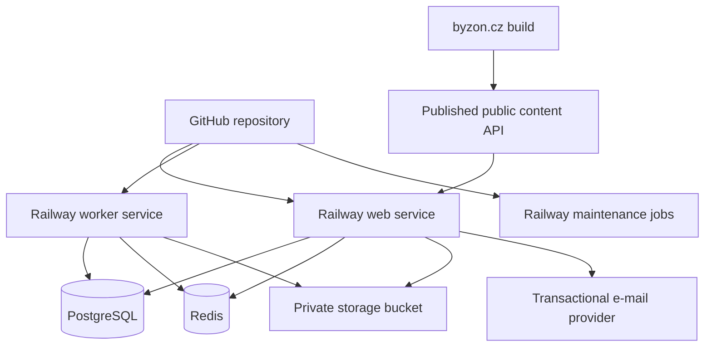

# BYZON 2026 – detailní plán agentního vývoje

> Stav: implementační plán v1.2
>
> Datum sestavení: 20. července 2026
>
> Cílový repozitář: `martymax/byzon-2026`
>
> Cílová aplikace: `https://app.byzon.cz`
>
> Deployment: GitHub → Railway
>
> Produktový zdroj: [BYZON 2026 – zadávací dokumentace webové aplikace v1.0](https://docs.google.com/document/d/1xNNuZaluTWvysPVGUeLNRGAZB6JKN7Z0KNIr2RdUp5g/edit), revize načtená 20. 7. 2026: `ALtnJHwlTM7HUd2qC1co_s6cz_hQwtjfSgjWmCZUo6W79pbMu4Ko6PiTLZKqIWYoVF50nMCRTqiH-n9leQBGgaXE-AD6uDRScGZ3o91P2P2i`

Tento soubor je hlavní prováděcí plán pro vývoj pomocí AI agentů. Produktové zadání určuje **co** se staví; tento plán určuje **jak, v jakém pořadí a podle čeho se pozná dokončení**. Pokud se plán a produktové zadání dostanou do rozporu, má přednost produktové zadání. Změna rozsahu se nejprve zaznamená do rozhodovacího logu v tomto souboru.

---

## 1. Jak má AI agent s plánem pracovat

### 1.1 Povinný pracovní postup pro každý úkol

1. Přečti tento soubor, související část produktového zadání, `README.md`, případný `AGENTS.md` a existující kód dotčeného modulu.
2. Ověř čistotu pracovního stromu a že pracuješ na větvi aktuální etapy. Cizí nebo uživatelské změny nemaž, nepřepisuj ani nezahrnuj do vlastního commitu.
3. Vyber právě jeden nejbližší nehotový úkol, jehož závislosti jsou splněné. Nezačínej několik velkých vertikál současně.
4. Pokud úkol narazí na položku označenou `BLOCKER`, nehádej výsledek. Implementuj pouze bezpečně oddělitelnou infrastrukturu a vyžádej rozhodnutí.
5. Nejdřív napiš nebo uprav test, pokud je to rozumné. U kritických doménových pravidel je test povinný před nebo současně s implementací.
6. Implementuj nejmenší úplný vertikální řez: databáze → doménové pravidlo → API → UI → audit/telemetrie → test.
7. Spusť všechny kontroly uvedené u úkolu a globální kontroly relevantní pro změnu.
8. Proveď self-review diffu se zaměřením na autorizaci, soukromí, souběh, idempotenci, časová pásma a offline chování.
9. Aktualizuj tento plán: stav úkolu, odkaz na rozhodnutí, případně nově zjištěný blokátor. Neoznačuj úkol jako hotový bez splnění jeho akceptačních podmínek.
10. Předlož uživateli dokončený a ověřený krok: změněné soubory, diff/scope, migrace, env proměnné, provedené testy a zbylá rizika. Do explicitního schválení uživatelem neprováděj commit ani push.
11. Po explicitním schválení daného kroku vytvoř právě jeden tematický commit s ID úkolu a pushni jej na větev aktuální etapy. Popis musí uvést změnu schématu, proměnné prostředí, migrační/rollback dopad a provedené testy.
12. Merge etapy, rebase, force-push ani smazání větve neprováděj bez samostatného explicitního schválení uživatelem.

### 1.2 Stavové značky

- `[ ]` nezačato
- `[~]` rozpracováno
- `[x]` dokončeno a ověřeno
- `[!]` blokováno vstupem nebo rozhodnutím
- `[–]` vědomě vyřazeno z rozsahu, vždy s odkazem na rozhodnutí

### 1.3 Pravidla pro rozhodování agentů

- **Nedomýšlet produkt:** ceny, kapacity, texty souhlasů, storno pravidla, cílové skupiny oznámení a oprávnění k výjimkám musí být explicitní data nebo schválené rozhodnutí.
- **Privacy by default:** při nejasnosti osobní údaj nezveřejnit, neposlat třetí straně a nezapsat do logu.
- **Server je autorita:** klientské skrytí tlačítka nikdy nenahrazuje serverovou autorizaci a validaci.
- **PostgreSQL je autorita pro transakční stav:** Redis je cache/fronta/pub-sub, nikoli zdroj pravdy pro vstupenky, rezervace, check-in nebo souhlasy.
- **Idempotence:** importy, aktivace, check-in, e-mailové úlohy a webhooky musí bezpečně zvládnout opakování.
- **Čas:** databáze ukládá okamžiky v UTC; uživatelské rozhraní standardně používá `Europe/Prague`. Lokální datum akce je samostatný doménový údaj.
- **Žádné skryté breaking changes:** změny API a schématu musí být dopředně kompatibilní alespoň po dobu jednoho deploymentu.
- **Priorita A před B před C:** práce na C se nesmí zahájit před akceptací A a B.

### 1.4 Definition of Ready pro implementační úkol

Úkol lze začít, když má:

- jasný uživatelský nebo provozní výsledek;
- vyřešené závislosti a případné produktové rozhodnutí;
- známé role a oprávnění;
- definované chování při chybě, souběhu a výpadku připojení;
- akceptační kritéria a testovací scénáře;
- uvedený dopad na osobní údaje a audit, pokud nějaký má.

### 1.5 Větve, schválení, commit a push

- Každá implementační etapa má vlastní větev `stage/NN-strucny-nazev`, například `stage/00-foundation` nebo `stage/01-monorepo`.
- Etapa 0 se větví z aktuálního `main`. Další etapa se založí z aktuálního `staging` až po merge a akceptaci předchozí etapy; dokud `staging` neexistuje, použije se poslední uživatelem schválený integrační commit.
- Všechny úkoly jedné etapy se zpracovávají na její etapové větvi. Každý dokončený implementační krok má po schválení vlastní tematický commit; nesouvisející úkoly se neslučují do jednoho commitu.
- Dokončení a ověření kroku samo o sobě není souhlas s commitem ani pushem. Agent vždy nejprve předloží výsledek a čeká na explicitní schválení uživatele vztahující se ke konkrétnímu kroku.
- Po schválení agent commitne pouze předložený scope a pushne aktuální etapovou větev. V handoffu uvede branch, commit SHA a výsledek pushe.
- Po dokončení všech úkolů a akceptačních podmínek etapy se etapová větev sloučí přes PR do `staging`; vytvoření/aktualizace PR a merge vyžadují explicitní schválení uživatele.
- Po staging CI a UAT se `staging` sloučí do `main` samostatným schváleným release krokem. Přímý push do `staging` nebo `main` se nepoužívá.
- Schválení se nevztahuje automaticky na pozdější opravy nebo rozšíření. Každá dodatečná změna se znovu ověří a před commitem/pushem znovu schválí.

---

## 2. Výchozí stav repozitáře

Při sestavení plánu je větev `main` čistá a sleduje `origin/main`. Výchozí commit je `29933429a23671e7d5d88cf114b9bf8872223aab`.

Současný veřejný web:

- je statický HTML/CSS/JS web;
- generuje se Python skriptem `build.py`;
- používá `data/content.json` jako současný zdroj obsahu;
- nemá Node runtime ani balíčkové závislosti;
- používá SimpleShop embed pro nákup;
- musí zůstat během vývoje aplikace provozně nedotčený.

Nová aplikace se přidá do stejného repozitáře jako monorepo. Přesun nebo přepis stávajícího veřejného webu není součástí prvních etap.

---

## 3. Pevně stanovený rozsah

### 3.0 Konstanty ročníku 2026

- Event slug: `byzon-2026`.
- Termín: 18.–19. září 2026; přesný začátek/konec se převezme z publikovaného programu.
- Výchozí časová zóna: `Europe/Prague`.
- Místo: Clarion Congress Hotel, České Budějovice; přesné navigační texty a plánek jsou řízený obsah.
- Správce osobních údajů a pořadatel: ENJOiT s.r.o.
- Jazyk UI a provozní komunikace: čeština.
- Nákup zůstává na `byzon.cz` přes SimpleShop; `app.byzon.cz` nenahrazuje checkout.

### 3.1 Produkt

- Mobilně orientovaná PWA na `app.byzon.cz`, bez povinné instalace.
- Veřejný `byzon.cz` zůstává marketingovým/prodejním webem.
- Aktivace osobním odkazem, skenem QR/čárového kódu nebo ručním zadáním stejného kódu vstupenky.
- Jedna jedinečná vstupenka se aktivuje právě k jednomu účtu; oprávněný správce může řešit převod/reaktivaci.
- Program, osobní agenda, rezervace, čekací listiny, praktické informace a check-in.
- Dobrovolný networking se soukromím po jednotlivých polích.
- Oznámení, řečnický portál, otázky, ankety, hodnocení a organizační přehledy.
- Čeština jako jediný jazyk ročníku 2026.
- Social wall pouze jako priorita C za samostatným feature flagem.

### 3.2 Mimo rozsah 2026

- nativní mobilní aplikace;
- plně offline zprávy, dotazy a hlasování;
- plánování networkingových schůzek do pevných slotů;
- pokročilé profilování/matching;
- gamifikace;
- certifikáty, fotogalerie a videozáznamy;
- plná CZ/EN lokalizace;
- Apple/Google Wallet;
- partner lead capture nebo přístup partnerů k účastnickým kontaktům;
- přímé řízení tiskárny jmenovek.

### 3.3 Priority

- **A – podmínka spuštění:** účet a aktivace, program, agenda, rezervace, praktické informace, check-in, organizační správa, souhlasy, ochrana dat a provozní fallbacky.
- **B – podmínka plného průběhu:** networking, oznámení, řečnický portál, dotazy, hlasování, hodnocení a přehledy.
- **C – volitelné:** social wall a drobná vylepšení až po formální akceptaci A a B.

---

## 4. Závazná technická rozhodnutí

| ID | Rozhodnutí | Vlastník | Důvod a důsledek |
| --- | --- | --- | --- |
| [ADR-001](docs/adr/001-monorepo.md) | Jeden GitHub repozitář, monorepo | Tech lead | Sdílení značky, typů a doménových pravidel; nezávislé Railway služby přes root/watch paths. |
| [ADR-002](docs/adr/002-nextjs-react-typescript.md) | Next.js App Router + React + TypeScript strict | Tech lead | Jeden full-stack kód, serverové renderování, Route Handlers, PWA podpora, dobrý Railway deployment. |
| [ADR-003](docs/adr/003-postgresql-drizzle.md) | PostgreSQL + Drizzle ORM | Tech lead | Transakce a databázová omezení pro kapacity, vstupenky a check-in; explicitní SQL migrace. |
| [ADR-004](docs/adr/004-better-auth.md) | Better Auth pro identity, relace a magic link | Tech lead + security | Nevytvářet vlastní správu relací; ticket claim zůstává vlastní doménová vrstva. |
| [ADR-005](docs/adr/005-redis-bullmq-worker.md) | Redis + BullMQ worker | Tech lead | Asynchronní e-maily, připomínky, waitlist, retence, exporty a retry bez blokování web requestů. |
| [ADR-006](docs/adr/006-rest-sse.md) | REST JSON API `/api/v1` + SSE | Tech lead | Offline klient potřebuje stabilní HTTP rozhraní; živé funkce jsou převážně server → klient. |
| [ADR-007](docs/adr/007-private-object-storage.md) | Railway private Storage Bucket | Tech lead + ENJOiT | Soukromé materiály řečníků, obrázky a exporty; přístup pouze krátkodobými podepsanými URL/proxy. |
| [ADR-008](docs/adr/008-database-published-content-source.md) | DB jako jediný zdroj publikovaného programu a profilů | Produkt + tech lead | Admin spravuje obsah bez vývojáře; `byzon.cz` obsah pouze synchronizuje/konzumuje. |
| [ADR-009](docs/adr/009-service-worker-indexeddb.md) | Service worker + IndexedDB | Tech lead | Offline čtení programu/agendy/informací; explicitní synchronizační fronta jen pro bezpečné operace. |
| [ADR-010](docs/adr/010-eu-railway-region.md) | EU Railway region pro web, worker, DB, Redis i bucket | ENJOiT + tech lead | Soulad se zadáním; externí zpracovatelé vyžadují samostatné právní schválení. |
| [ADR-011](docs/adr/011-event-feature-flags.md) | Feature flags per event | Produkt + tech lead | Bezpečné oddělení priorit B/C a postupné zpřístupňování funkcí. |
| [ADR-012](docs/adr/012-multi-event-data-model.md) | Multi-event datový model od začátku | Produkt + tech lead | Opakované použití pro další ročník bez sdílení dat mezi akcemi. |

Nezafixované externí služby (e-mail, error tracking, uptime monitor, případný malware scanner) se implementují přes rozhraní/adaptéry. Produkční provider musí být vybrán a právně schválen před příslušnou launch gate.

---

## 5. Cílová architektura



### 5.1 Runtime komponenty

1. **Conference web** – Next.js proces: UI, `/api/v1`, autentizace, serverová autorizace, SSE, health/readiness endpoint.
2. **Worker** – dlouho běžící Node proces: BullMQ consumers, e-maily, waitlist nabídky, reminders, exporty, údržba a outbox dispatch.
3. **Maintenance job** – jednorázové Railway cron příkazy: retence/anonymizace, zálohy, kontrola konzistence. Musí být idempotentní a používat distribuovaný zámek.
4. **PostgreSQL** – trvalý transakční zdroj pravdy.
5. **Redis** – fronty, rate limiting, krátká cache a realtime fan-out. Ztráta Redis nesmí poškodit autoritativní data.
6. **Private bucket** – soubory, exporty, zálohy podle schválené politiky.

### 5.2 Railway služby a prostředí

Pro každé dlouhodobé prostředí vytvořit oddělené služby a data:

- `byzon-app-web`
- `byzon-app-worker`
- `byzon-app-postgres`
- `byzon-app-redis`
- `byzon-app-storage`
- případně `byzon-app-maintenance` pro cron

Prostředí:

- `production`: větev `main`, doména `app.byzon.cz`, produkční data;
- `staging`: větev `staging`, doména např. `staging-app.byzon.cz`, anonymizovaná/testovací data;
- PR environments: až po ověření nákladů; nikdy nekopírovat produkční osobní údaje.

Web a worker používají stejný image/lockfile, ale různé start commands. Migrace se spouštějí jako Railway pre-deploy command pouze jednou na webové službě. Worker se nesmí rozběhnout proti nekompatibilnímu schématu.

### 5.3 Vývojový tok

```mermaid
flowchart LR
    BASE[Schválený integrační stav] --> BR[stage/NN větev]
    BR --> STEP[Implementace a ověření kroku]
    STEP --> APPROVAL[Schválení uživatelem]
    APPROVAL --> PUSH[Tematický commit + push]
    PUSH --> GATE[Akceptace celé etapy]
    GATE --> PR[PR + CI]
    PR --> STG[Schválený merge do staging]
    STG --> UAT[Railway staging + UAT]
    UAT --> MAIN[Schválený merge do main]
    MAIN --> PROD[Railway production]
```



Na jedné etapové větvi vzniká po tomto approval gate více malých commitů, zpravidla jeden na každý schválený implementační krok. Přímý push do `staging` ani `main` se nepoužívá. Produkční migrace musí být dopředně kompatibilní a nasazení musí mít popsaný rollback bez destruktivního downgrade schématu.

---

## 6. Cílová struktura repozitáře

```text
/
├── apps/
│   ├── conference/
│   │   ├── public/
│   │   │   ├── icons/
│   │   │   └── sw.js                 # generovaný nebo řízený service worker
│   │   ├── src/
│   │   │   ├── app/                  # Next.js routes/layouts
│   │   │   ├── components/           # app-specific UI
│   │   │   ├── modules/              # vertikální produktové moduly
│   │   │   ├── server/               # auth, API helpers, adapters
│   │   │   ├── offline/              # IndexedDB, sync, cache contracts
│   │   │   └── instrumentation.ts
│   │   ├── next.config.ts
│   │   └── package.json
│   └── worker/
│       ├── src/
│       │   ├── jobs/
│       │   ├── providers/
│       │   ├── scheduler/
│       │   └── index.ts
│       └── package.json
├── packages/
│   ├── database/
│   │   ├── src/schema/
│   │   ├── src/queries/
│   │   ├── drizzle/
│   │   └── package.json
│   ├── domain/
│   │   ├── src/contracts/
│   │   ├── src/policies/
│   │   ├── src/state-machines/
│   │   └── package.json
│   ├── ui/
│   ├── config/
│   └── test-support/
├── docs/
│   ├── AI_IMPLEMENTATION_PLAN.md
│   ├── adr/
│   ├── runbooks/
│   └── api/
├── .github/workflows/
├── railway.web.json
├── railway.worker.json
├── railway.maintenance.json
├── pnpm-workspace.yaml
├── package.json
├── pnpm-lock.yaml
├── build.py                              # existující veřejný web
├── data/content.json                     # migrační vstup, později exportovaný snapshot
└── ... existující statický web
```

### 6.1 Hranice modulů v `apps/conference/src/modules`

- `auth`
- `events`
- `content`
- `tickets`
- `participants`
- `agenda`
- `reservations`
- `check-in`
- `networking`
- `announcements`
- `speakers`
- `live-interaction`
- `feedback`
- `files`
- `admin`
- `reporting`
- `privacy`
- `audit`

Modul nesmí přímo používat interní tabulky jiného modulu mimo explicitně sdílené query/service rozhraní. Sdílené doménové typy neimportují React, Next.js ani konkrétní provider.

---

## 7. Technické standardy

### 7.1 Toolchain

- Node.js: při scaffoldingu ověřit aktuální Active LTS, zafixovat přes `.nvmrc`, `packageManager` a Railway/Nixpacks nastavení.
- pnpm workspaces, jeden lockfile.
- TypeScript: `strict`, `noUncheckedIndexedAccess`, `exactOptionalPropertyTypes`, bez neodůvodněného `any`.
- ESLint + Prettier; import boundaries pro moduly.
- Next.js `output: "standalone"` pro Railway.
- Environment schema validovaný Zodem při startu. Chybějící povinná proměnná musí ukončit proces před přijetím provozu.
- Datové a API kontrakty se odvozují ze sdílených Zod schémat, ale databázové entity se neposílají přímo klientovi.

### 7.2 Standard odpovědí API

- Úspěch: explicitní DTO, ISO 8601 timestamps, stabilní ID, žádná neveřejná pole.
- Chyba: `application/problem+json` s `type`, `title`, `status`, `code`, `detail`, `requestId` a volitelným `fieldErrors`.
- Stránkování: cursor-based; `limit` má serverové maximum.
- Mutace náchylné k opakování přijímají `Idempotency-Key`.
- Každý request dostane `requestId`; klient jej zobrazí v chybovém detailu pro podporu.
- API se verzionuje cestou `/api/v1`; breaking změna vyžaduje `/api/v2` nebo kompatibilní přechod.

### 7.3 Doménové identifikátory

- Primární klíče: UUIDv7, generované serverem.
- Veřejné slugs pouze pro obsah, nikoli jako autorizační identita.
- Citlivé sekvenční počty se nezveřejňují.
- Kód vstupenky se normalizuje deterministicky a ukládá jako `HMAC-SHA-256(server_pepper, normalized_code)`. Pro podporu lze uložit nejvýše bezpečný maskovaný suffix.

### 7.4 Čas a plánování

- DB `timestamptz` pro okamžiky; `date` pro lokální den konference.
- Každá akce má `timezone`, pro 2026 `Europe/Prague`.
- API vrací UTC a případně explicitní `eventTimezone`.
- DST a půlnoční přesahy musí mít testy.
- Joby se plánují podle UTC vypočteného z časové zóny akce; opakovaný scheduler nesmí vytvořit duplicitní úlohy.

### 7.5 Feature flags

Feature flags jsou per event, serverově vyhodnocené a auditované:

- `networking_enabled`
- `announcements_enabled`
- `speaker_portal_enabled`
- `questions_enabled`
- `polls_enabled`
- `ratings_enabled`
- `social_wall_enabled`
- `offline_checkin_enabled`
- `public_content_sync_enabled`

Vypnutí flagu musí uzavřít i přímé API endpointy, ne jen navigaci.

### 7.6 Knihovny a odpovědnosti

Přesná čísla verzí se zvolí při `P1-02` podle aktuální stabilní kompatibility a ihned se uzamknou v `pnpm-lock.yaml`. Níže uvedený výběr je závazný; náhrada vyžaduje ADR.

| Oblast | Výchozí knihovna/přístup | Pravidlo použití |
| --- | --- | --- |
| Web framework | Next.js App Router, React | Server Components pro read-first obrazovky; Client Components jen tam, kde je interakce/browser API. |
| CSS a komponenty | Tailwind CSS + shadcn/ui/Radix primitives | Komponenty se kopírují a přizpůsobují v `packages/ui`; zachovat přístupnost primitiv. |
| Formuláře | React Hook Form + Zod resolver | Server vždy validuje znovu stejným nebo ekvivalentním kontraktem. |
| Server/client data | TanStack Query | Pro autentizovaná mutabilní data, invalidace a reconnect; nenahrazuje serverovou autoritu. |
| Lokální offline data | Dexie nad IndexedDB | Jen DTO uvedená v cache politice, schema migrations a per-user cleanup. |
| Auth | Better Auth | Identity/session/magic link; event membership a ticket claim jsou vlastní doména. |
| DB | `pg` + Drizzle ORM/Kit | Transakce a constraints explicitně; migrace jsou verzované soubory v repu. |
| Queue/cache | BullMQ + ioredis | Worker jobs, rate limits, pub/sub; připojení musí fungovat přes Railway private networking. |
| Logy | Pino | JSON, request context a centrální redaction. |
| Datum/čas | `date-fns` + timezone podpora nebo aktuální ekvivalent | Žádná ruční práce s offsetem; vždy event timezone. |
| QR/barcode | Browser `BarcodeDetector` jako progressive enhancement + lazy fallback `@zxing/browser` | Ruční kód je vždy dostupný; scanner bundle nenačítat mimo scan route. |
| Rich text | Markdown subset + `react-markdown`/sanitizační allowlist | Zakázat raw HTML a nebezpečné URL protokoly. |
| E-mail | vlastní `MailProvider` interface | SDK providera smí být pouze v adapteru workeru/serveru. |
| API dokumentace | Zod kontrakty → generovaný OpenAPI dokument | CI kontroluje drift; OpenAPI nemusí být veřejně přístupné v produkci. |
| Unit/integration | Vitest | DB/Redis testy běží proti izolovaným skutečným službám, ne proti in-memory náhradě. |
| E2E | Playwright | Mobilní viewporty, Chromium; kritické Safari chování ověřit také manuálně/BrowserStack-like službou po schválení. |
| Accessibility | axe-core/Playwright integrace | Automatický audit doplnit manuálním testem; nulový axe nález není úplná akceptace. |

Redux, vlastní password auth, GraphQL, Firebase/Supabase a samostatný Express server se bez nového ADR nezavádějí. Server Actions lze použít pouze pro lokální UI formulář, pokud zároveň neobcházejí stabilní `/api/v1` kontrakt potřebný pro PWA/offline klienta.

### 7.7 Lokální vývoj

- Root příkaz spustí web, worker a sdílené watch buildy.
- PostgreSQL a Redis se spouštějí přes verzovaný `compose.yaml`; produkční data se lokálně nekopírují.
- `pnpm dev:infra` spustí infrastrukturu, `pnpm dev` aplikace, `pnpm dev:reset` znovu vytvoří pouze explicitně pojmenovanou lokální DB.
- Seed vytvoří syntetické role, ticket stavy, kapacitní souběh, waitlist, networking privacy a live session. Testovací e-maily končí v lokálním sinku.
- Lokální bucket používá S3-kompatibilní dev službu nebo filesystem adapter výhradně za stejným `ObjectStorage` rozhraním. Produkční chování presigned URL musí mít integrační test.
- Čas lze v dev/testu řídit přes injektovaný `Clock`; nepřidávat globální produkční proměnnou, která by dovolila posun času.

### 7.8 Proměnné prostředí

Názvy se mohou upravit pouze konzistentně ve schema, `.env.example`, Railway a runbooku. Hodnoty tajných proměnných se nikdy necommitují.

| Proměnná | Web | Worker | Citlivá | Účel |
| --- | --- | --- | --- | --- |
| `NODE_ENV` | ano | ano | ne | Runtime režim. |
| `APP_ENV` | ano | ano | ne | `development | test | staging | production`. |
| `APP_BASE_URL` | ano | ano | ne | Kanonická URL aplikace. |
| `PUBLIC_SITE_URL` | ano | ano | ne | Kanonická URL `byzon.cz`. |
| `DATABASE_URL` | ano | ano | ano | Railway PostgreSQL private URL. |
| `REDIS_URL` | ano | ano | ano | Railway Redis private URL. |
| `BETTER_AUTH_SECRET` | ano | ne | ano | Podpis/šifrování auth; minimální délka dle knihovny. |
| `BETTER_AUTH_URL` | ano | ne | ne | Kanonický auth origin, bez wildcardu. |
| `TICKET_CODE_PEPPER_ACTIVE` | ano | ne | ano | Aktivní HMAC key. |
| `TICKET_CODE_PEPPER_PREVIOUS` | ano | ne | ano | Volitelné rotační přechodné čtení; odstranit po rehash migraci. |
| `MAIL_PROVIDER` | ano | ano | ne | `sink` v dev/test, schválený provider v prod. |
| `MAIL_API_KEY` | ano | ano | ano | Provider credential. |
| `MAIL_FROM` | ano | ano | ne | Ověřený sender. |
| `MAIL_REPLY_TO` | ano | ano | ne | Organizační podpora. |
| `STORAGE_ENDPOINT` | ano | ano | ne | S3-compatible endpoint. |
| `STORAGE_REGION` | ano | ano | ne | EU region. |
| `STORAGE_BUCKET` | ano | ano | ne | Environment-specific bucket. |
| `STORAGE_ACCESS_KEY_ID` | ano | ano | ano | Bucket credential. |
| `STORAGE_SECRET_ACCESS_KEY` | ano | ano | ano | Bucket credential. |
| `LOG_LEVEL` | ano | ano | ne | `info` produkčně, debug jen dočasně bez PII. |
| `WORKER_CONCURRENCY_EMAIL` | ne | ano | ne | Samostatný limit e-mail jobů. |
| `WORKER_CONCURRENCY_DEFAULT` | ne | ano | ne | Ostatní joby. |
| `PUBLIC_SYNC_PROVIDER` | ne | ano | ne | `noop` do potvrzení, později schválený trigger. |
| `PUBLIC_SYNC_TOKEN` | ne | ano | ano | Credential pro rebuild/deploy trigger. |
| `ERROR_TRACKING_DSN` | ano | ano | ano | Jen po schválení providera a redaction. |
| `RELEASE_SHA` | ano | ano | ne | Git commit pro logy, SSE a diagnostiku. |

Do klientského bundle smí pouze výslovně bezpečné `NEXT_PUBLIC_*` hodnoty. Serverové env schema má unit test, který selže při nečekaném zpřístupnění secret názvu klientské konfiguraci.

### 7.9 Migrační strategie databáze

- Používat expand → migrate/backfill → switch reads/writes → contract v oddělených deploymentech.
- Produkční migrace nesmí čekat dlouhý table lock; velký backfill dělá resumable worker v dávkách.
- Přidání required sloupce: nejdřív nullable/default, backfill, validace, teprve později constraint.
- Odebrání/přejmenování: nejdřív duální kompatibilita aplikace, až potom odstranění starého pole.
- Každá migrace má integrační test z předchozího schématu a poznámku o očekávané délce/locku.
- Down migrace se v produkci nepovažuje za bezpečný rollback dat. Rollback aplikace musí po přechodnou dobu rozumět novému schématu.
- Destruktivní migrace vyžaduje explicitní approval, snapshot a ověřenou obnovu.

---

## 8. Role a oprávnění

### 8.1 Role

- `participant`
- `speaker`
- `organizer_admin`
- `checkin_operator`
- `moderator`
- `room_operator` – technická role pro seznam rezervovaných a účast na konkrétních aktivitách
- `support_operator` – volitelně oddělená omezená role pro obnovu přístupu; nevytvářet, dokud není potvrzena potřeba
- `system_worker` – technická identita, nepřihlašuje se přes UI

Role se vážou k `event_id`. Globální superadmin se ve verzi 2026 nevytváří, pokud není explicitně požadován.

### 8.2 Matice minimálních oprávnění

| Akce | Účastník | Řečník | Check-in | Moderátor | Room op. | Admin |
| --- | --- | --- | --- | --- | --- | --- |
| Číst publikovaný program | ano | ano | ano | ano | ano | ano |
| Měnit vlastní agendu/rezervaci | vlastní | jen pokud je i účastník | ne | ne | ne | ano jako auditovaná výjimka |
| Číst networkingový adresář | opt-in participant | jen pokud opt-in participant | ne | pouze moderace reportu | ne | pouze moderace/report, ne plošný export kontaktů |
| Psát zprávy | přijatá spojení | totéž | ne | ne | ne | pouze zásah do nahlášeného obsahu |
| Správa programu/obsahu | ne | vlastní podklady | ne | ne | ne | ano |
| Sken/check-in | vlastní kód zobrazit | vlastní kód zobrazit | ano | ne | ne | ano |
| Vrátit check-in | ne | ne | omezeně dle politiky | ne | ne | ano |
| Seznam rezervovaných | vlastní stav | vlastní stav | ne | ne | jen přidělené aktivity | ano |
| Moderovat dotazy/ankety | ne | odpovědět přidělené | ne | přidělené bloky | ne | ano |
| Odeslat oznámení | ne | ne | ne | jen pokud explicitně povoleno | ne | ano |
| Export osobních dat | vlastní export | vlastní export | ne | ne | ne | jen schválené provozní exporty, audit |

### 8.3 Autorizační pravidla

- Každý chráněný query/mutation přijímá `actor`, `eventId` a kontroluje membership/role na serveru.
- Žádný endpoint nesmí důvěřovat `role` z request body nebo klientského tokenu bez serverového ověření.
- Citlivá administrativní akce vyžaduje čerstvou relaci; později lze přidat step-up ověření magic linkem.
- Audit log obsahuje aktéra, akci, cíl, event, důvod výjimky a bezpečný diff bez citlivých hodnot.

---

## 9. Datový model

Názvy jsou doporučené a mají být zpřesněny v Drizzle schématu. Každá eventová tabulka musí mít index s `event_id`. Osobní údaje nesmí být zbytečně kopírovány do snapshotů nebo job payloadů.

### 9.1 Událost, konfigurace a právní verze

#### `events`

- `id`, `slug`, `name`, `starts_at`, `ends_at`, `timezone`
- `status`: `draft | activation_open | live | ended | archived`
- `activation_opens_at`, `networking_deletes_at`, `operational_data_anonymizes_at`
- `created_at`, `updated_at`
- unique: `slug`

#### `event_features`

- `event_id`, jednotlivé boolean flags, `updated_by`, `updated_at`
- unique: `event_id`

#### `legal_documents`

- `id`, `event_id`, `type`: `terms | privacy_notice | networking_consent | other`
- `version`, `title`, `content_url` nebo sanitizovaný obsah, `published_at`, `is_current`
- unique: `(event_id, type, version)`
- právě jedna current verze typu/eventu – vynutit transakcí a částečným unique indexem

#### `consent_records`

- `id`, `event_id`, `user_id`, `legal_document_id`, `decision`: `accepted | withdrawn | acknowledged`
- `recorded_at`, `source`, `request_id`
- append-only; změna vytváří nový záznam

### 9.2 Identity a role

Better Auth tabulky (`user`, `session`, `account`, `verification` nebo jejich aktuální ekvivalent) spravovat podle zvolené verze knihovny. Doménové rozšíření:

#### `event_memberships`

- `event_id`, `user_id`, `status`: `active | suspended | revoked`
- `activated_at`, `revoked_at`, `revocation_reason`
- unique: `(event_id, user_id)`

#### `event_roles`

- `event_id`, `user_id`, `role`, `scope_json`, `granted_by`, `granted_at`, `revoked_at`
- `scope_json` jen pro omezení na session/room; schéma validovat
- unique aktivní role: `(event_id, user_id, role)`

### 9.3 Vstupenky a importy

#### `ticket_import_batches`

- `id`, `event_id`, `source`, `source_filename`, `file_sha256`
- `status`: `uploaded | validated | awaiting_confirmation | applying | applied | failed`
- `row_count`, souhrn diffu, `created_by`, timestamps
- unique: `(event_id, file_sha256)` pro idempotenci

#### `ticket_import_rows`

- staging záznamy; normalizovaná pole, původní číslo řádku, validační chyby
- původní raw řádek uchovat pouze po nezbytnou dobu a nepsat do aplikačních logů

#### `tickets`

- `id`, `event_id`, `external_id`, `order_external_id`
- `code_hmac`, `code_suffix`, `status`: `valid | activated | cancelled | refunded | transferred | blocked`
- `holder_user_id`, `claimed_at`, `cancelled_at`, `transferred_from_ticket_id`
- volitelné provozní údaje kupujícího jen pokud jsou skutečně potřebné
- unique: `(event_id, code_hmac)`
- unique: `(event_id, external_id)` pokud jej zdroj garantuje
- indexy: status, holder, order id

#### `ticket_events`

- append-only historie importu, aktivace, storna, transferu, blokace a reaktivace
- `actor_type`, `actor_id`, `ticket_id`, `from_status`, `to_status`, `reason`, `occurred_at`

#### `ticket_claim_attempts`

- agregovaná bezpečnostní stopa: HMAC/suffix, výsledek, actor/IP hash, user-agent hash, timestamp
- krátká retence; nikdy neukládat raw kód

### 9.4 Profily a soukromí

#### `participant_profiles`

- `event_id`, `user_id`, `first_name`, `last_name`, `company`, `job_title`, `bio`, `linkedin_url`, `photo_asset_id`
- `industry`, `looking_for`, `offering`, `phone`, `contact_email`
- `networking_enabled`, `moderation_status`
- `phone_visibility`, `email_visibility`: `nobody | networking | connections`
- u ostatních polí explicitní public/networking pravidlo; výchozí stav nejpřísnější
- timestamps, soft-delete/anonymization timestamps
- unique `(event_id, user_id)`

#### `interest_tags`, `profile_tags`, `tag_aliases`

- kanonické tagy per event, vlastní návrhy a adminem spravované aliasy
- vyhledávání pracuje s canonical tag IDs, ne s nekontrolovanými texty

#### `profile_blocks`, `content_reports`

- blokování a hlášení; důvod, stav moderace, řešitel, audit
- zablokovaný uživatel se nesmí zobrazit ani kontaktovat blokujícího

### 9.5 Program a obsah

#### `event_days`, `venues`, `rooms`

- pořadí, názvy, lokální data, popisy, dostupnost a navigační informace

#### `sessions`

- `event_id`, `day_id`, `room_id`, `slug`, `title`, `summary`, `description`
- `type`: `talk | panel | workshop | mastermind | coaching | networking | break | meal | gala | other`
- `starts_at`, `ends_at`, `status`: `draft | published | cancelled | archived`
- `capacity_mode`: `none | reservation | registration_estimate`
- `capacity`, `reservation_opens_at`, `reservation_closes_at`
- `waitlist_mode`: `disabled | auto_confirm | offer_with_deadline`
- `waitlist_offer_ttl_minutes`, `allow_release_after_deadline`, `version`
- omezení: end > start; capacity nezáporná; kapacitní režim vyžaduje capacity podle pravidel

#### `session_speakers`

- `session_id`, `speaker_profile_id`, `order`, `role`

#### `content_pages`, `faq_items`, `partners`

- draft/published/archived workflow, sort order, content version, asset odkazy
- rich text pouze v omezeném sanitizovaném formátu

#### `content_publications`

- publikovaný immutable snapshot/version, checksum, published_by, published_at
- podklad pro veřejné API a kontrolu synchronizace `byzon.cz`

#### `program_change_events`

- diff významné změny publikované session, seznam dotčených uživatelů/segmentu, stav oznámení

### 9.6 Agenda, rezervace a docházka

#### `agenda_items`

- `event_id`, `user_id`, `session_id`, `source`: `manual | reservation | organizer`
- unique `(event_id, user_id, session_id)`
- odstranění ruční položky nesmí obejít zrušení aktivní rezervace

#### `reservations`

- `id`, `event_id`, `session_id`, `user_id`
- `status`: `confirmed | cancelled | attended | no_show`
- `created_at`, `cancelled_at`, `source`, `version`
- maximálně jedna aktivní rezervace uživatele na session

#### `waitlist_entries`

- `id`, `session_id`, `user_id`, `status`: `waiting | offered | accepted | expired | cancelled | promoted`
- `position_key`/sekvence, `offered_at`, `offer_expires_at`
- FIFO podle stabilního pořadí; admin override je auditovaný

#### `session_attendance`

- skutečná účast označená room operátorem/adminem
- oddělit od check-inu na konferenci

### 9.7 Networking

#### `connection_requests`

- requester, recipient, intro message, `pending | accepted | declined | cancelled | expired`
- zakázat self-request a více současných pending requestů stejné dvojice

#### `connections`

- canonical dvojice `lower_user_id`, `higher_user_id`, accepted timestamp, ended timestamp
- unique aktivní dvojice

#### `messages`

- `connection_id`, sender, omezený text, created/read/deleted timestamps
- bez příloh v 2026; server ověřuje aktivní spojení a blokace

### 9.8 Oznámení a doručení

#### `announcements`

- draft text/title, severity, audience definition, scheduled/published timestamps
- `status`: `draft | scheduled | sending | sent | cancelled`
- schválený immutable recipient snapshot před odesláním

#### `announcement_recipients`

- konkrétní user ID, důvod zařazení, in-app read timestamp

#### `notification_deliveries`

- channel `in_app | email | push`, provider message ID, stav, pokusy, poslední chyba sanitizovaná

#### `notification_preferences`

- provozní vs volitelné kanály; kritické provozní zprávy nelze zaměnit za marketing

### 9.9 Řečníci a soubory

#### `speaker_profiles`, `speaker_invitations`

- doménový profil navázaný volitelně na user; magic-link invitation s expirací a jednorázovým tokenem

#### `speaker_submissions`

- `draft | submitted | changes_requested | approved`, deadline, comment, publish permission
- historie stavů je append-only

#### `assets`

- bucket key, owner/event, purpose, původní název, MIME dle sniffingu, size, checksum
- `uploading | quarantined | ready | rejected | deleted`
- žádná veřejná bucket URL; autorizovaný download endpoint/presigned URL

### 9.10 Živé otázky, ankety a hodnocení

#### `questions`, `question_votes`

- session, author, text, moderation state, rank/order, merged_into, answered_at
- jeden hlas uživatele na otázku; autor může hlasovat podle zvoleného pravidla (výchozí ano)

#### `polls`, `poll_options`, `poll_votes`

- draft/open/closed, single/multiple choice, publication of results
- unique vote podle user/poll/option a pravidla typu

#### `ratings`

- session nebo event, user, číselné hodnocení a volitelný komentář
- unique user/target/type; opakovaná výzva se po dokončení nezobrazuje

### 9.11 Check-in, audit a provoz

#### `check_ins`

- `event_id`, `ticket_id`, `user_id`, `checked_in_at`, `operator_id`, `device_id`, `source`
- aktivní check-in je unikátní na ticket/event; undo nevytváří delete, ale reverzní událost

#### `operator_devices`

- `id`, `event_id`, `label`, `public_key` nebo bezpečný credential hash, `status`, `last_seen_at`, `authorized_by`, `expires_at`
- slouží pro omezený check-in režim a případný offline manifest; ztracené zařízení lze okamžitě revokovat
- zařízení nenahrazuje osobní přihlášení operátora, pokud provozní rozhodnutí výslovně nestanoví kiosk režim

#### `audit_logs`

- append-only: actor, action, target, event, request ID, safe before/after, reason, timestamp
- citlivá data maskovat; audit log není náhradou databázové historie

#### `outbox_events`

- transakčně vytvořené doménové události, které worker doručí do fronty/provideru
- stav a počet pokusů; unique deduplication key

#### `idempotency_keys`

- actor/scope/key/request hash/result reference/expiry

#### `maintenance_runs`, `export_requests`, `privacy_requests`

- dohledatelné spuštění retence, zálohy, exportu vlastních dat, opravy/výmazu

---

## 10. Kritické stavové automaty a invarianty

### 10.1 Vstupenka

```text
valid → activated → transferred
  │         │
  ├→ cancelled/refunded
  └→ blocked

cancelled/refunded/blocked → valid nebo activated pouze auditovanou admin výjimkou
```

Invarianty:

- claim je transakce se zámkem řádku;
- neaktivní stav nesmí založit relaci, rezervaci ani check-in;
- storno po aktivaci zachová audit a účet, ale zablokuje práva z ticketu a nové rezervace;
- převod explicitně odpojí původního držitele od oprávnění a rozhodne, co se stane s rezervacemi – viz `BLOCKER-RES-03`;
- opakovaný validní claim téhož uživatele vrací idempotentní úspěch, jiného uživatele bezpečnou neenumerující chybu.

### 10.2 Rezervace

```text
available → confirmed → cancelled
full → waiting → offered → accepted/promoted
                    └→ expired → next waiting
confirmed → attended | no_show
```

Invarianty:

- počet aktivních potvrzených rezervací nikdy nepřekročí kapacitu;
- rozhodnutí se provádí v DB transakci s row/advisory lockem session;
- pořadník má deterministické FIFO pořadí, ruční změna vyžaduje audit a důvod;
- agenda je projekce rezervace: potvrzená rezervace vytvoří položku, zrušení ji odstraní jen pokud nemá jiný zdroj;
- časový konflikt se uživateli zobrazí jako varování; bez explicitního produktového rozhodnutí neblokuje uložení.

### 10.3 Networking

- `networking_enabled=false` znamená okamžité skrytí z adresáře a zákaz nových žádostí.
- Existence účtu, ticketu a agendy není vypnutím dotčena.
- Stávající spojení se bez výslovné akce automaticky nemažou; viditelnost kontaktů se vždy znovu vyhodnotí podle aktuálního nastavení. Toto je výchozí implementační pravidlo a může být změněno rozhodnutím produktu.
- Zprávu lze poslat pouze v aktivním přijatém spojení, bez blokace a při zapnutém networkingu obou stran.
- Po skončení retenční lhůty se profily a zprávy odstraní/anonymizují bez možnosti obnovení z aplikace.

### 10.4 Publikace obsahu

- Draft změna nemění účastnické UI ani veřejný web.
- Publish vytvoří immutable publication version.
- Významná změna času/místa/zrušení vytvoří `program_change_event` a přes outbox cílené oznámení.
- Veřejný web a aplikace zobrazují stejnou publication version; nesoulad je viditelný v admin dashboardu.

### 10.5 Check-in

- Online scan je jediný plně autoritativní režim.
- Duplicitní scan vrátí předchozí čas/stanoviště bez druhého check-inu.
- Undo je oprávněná, auditovaná akce s důvodem.
- Offline režim nesmí být povolen, dokud není ověřena entropie kódů, bezpečnost lokálního manifestu a provozní slučovací postup.

---

## 11. API plán

Všechny endpointy jsou pod `/api/v1`. Konkrétní názvy lze během implementace upravit ADR, ale pokrytí a bezpečnostní vlastnosti musí zůstat.

### 11.1 Veřejné a bootstrap

- `GET /health/live` – proces žije, bez externích závislostí.
- `GET /health/ready` – DB dostupná, správná verze schématu; Redis degradaci reportuje odděleně.
- `GET /public/events/:slug/bootstrap` – publikované veřejné minimum, version/ETag.
- `GET /public/events/:slug/content` – program, řečníci, partneři, praktické informace; cacheable, bez PII.
- `GET /public/events/:slug/calendar.ics` – veřejný kalendář publikovaných bodů.

### 11.2 Auth a aktivace

- Better Auth routes pod vyhrazenou cestou dle doporučené integrace.
- `POST /events/:eventId/tickets/claim` – normalizovaný kód, idempotency, rate limit.
- `POST /events/:eventId/tickets/claim-link` – jednorázový token z e-mailu/SMS.
- `GET /me/bootstrap` – uživatel, event role, onboarding, feature flags, unread counts.
- `POST /me/onboarding` – povinné minimum + právní acknowledgement + oddělený networking opt-in.
- `POST /me/email/change-request` a potvrzení – bezpečná obnova/převazba.
- `POST /auth/logout-all` – revokace všech relací po incidentu/transferu.

### 11.3 Program, agenda a rezervace

- `GET /events/:eventId/program?day=&room=&type=&version=`
- `GET /events/:eventId/sessions/:sessionId`
- `PUT /me/agenda/:sessionId`, `DELETE /me/agenda/:sessionId`
- `GET /me/agenda`, `GET /me/agenda.ics`
- `POST /sessions/:sessionId/reservations`
- `DELETE /sessions/:sessionId/reservations/me`
- `POST /sessions/:sessionId/waitlist`
- `DELETE /sessions/:sessionId/waitlist/me`
- `POST /sessions/:sessionId/waitlist-offers/:offerId/accept`

Mutace vracejí aktuální kapacitu/stav, version a případný časový konflikt. `409` rozlišuje `CAPACITY_FULL`, `RESERVATION_CLOSED`, `STALE_VERSION`, `TICKET_INACTIVE`.

### 11.4 Profil a networking

- `GET/PATCH /me/profile`
- `PATCH /me/privacy`
- `GET /me/data-export`, `POST /me/privacy-requests`
- `GET /networking/directory?q=&tags=&cursor=`
- `GET /networking/profiles/:profileId`
- `GET /networking/recommendations`
- `POST/DELETE /networking/blocks/:userId`
- `POST /networking/connection-requests`
- `POST /networking/connection-requests/:id/accept|decline|cancel`
- `GET /networking/connections`
- `DELETE /networking/connections/:id`
- `GET/POST /networking/connections/:id/messages`
- `POST /reports`

DTO se sestavuje podle aktuálního vztahu a field-level visibility; nikdy se nenačte kompletní profil a následně pouze neschová CSS.

### 11.5 Oznámení

- `GET /me/announcements`
- `POST /me/announcements/:id/read`
- admin draft/preview/audience-count/schedule/send/cancel endpoints
- audience preview musí vrátit počet a vzorek bez zbytečného odhalení PII
- send vyžaduje potvrzení immutable preview version

### 11.6 Řečník

- claim invitation link, vlastní profil, vlastní sessions, submissions, upload initiation/finalization, response to assigned question
- speaker nesmí číst jiné neveřejné profily/submissions

### 11.7 Živé funkce

- `GET /sessions/:id/live-stream` – SSE s Last-Event-ID a heartbeat.
- otázky create/vote/report; moderator approve/hide/merge/reorder/answer.
- polls open/close/vote/results.
- projection endpoints používají krátkodobý read-only token a bezpečné DTO.
- po reconnectu klient vždy dotáhne canonical snapshot; SSE event není jediný zdroj dat.

### 11.8 Check-in

- `POST /check-in/lookup` – sken/ruční kód, bez mutace.
- `POST /check-in/confirm` – autoritativní transakce, idempotency key.
- `POST /check-in/:id/undo` – oprávnění + reason.
- `GET /check-in/stats` – agregace.
- `GET /check-in/search?q=` – minimální nutná data, přísný rate limit a audit.

### 11.9 Admin, import a reporting

- CRUD draft obsahu; publish endpoint s optimistic version.
- ticket import: upload → validate → preview diff → confirm apply → report.
- auditovaný support endpoint pro ruční přiřazení/aktivaci, převod, opětovné zaslání přístupu a reaktivaci ticketu; vyžaduje důvod a ověření cílové identity.
- role grants/revocations.
- reservation/waitlist overrides.
- exporty vždy asynchronně: create request → worker → expiring download.
- audit query jen pro oprávněné role, bez exportu tajných hodnot.

---

## 12. UI a navigace

### 12.1 Veřejná/aktivační část

- `/` – rozcestník podle relace a fáze eventu
- `/aktivace`
- `/aktivace/skenovat`
- `/aktivace/kod`
- `/aktivace/odkaz`
- `/prihlaseni`
- `/onboarding`
- `/offline`
- `/chyba-pristupu`

### 12.2 Účastnická část

- `/app` – „Právě teď“, nejbližší agenda, oznámení, ticket shortcut
- `/app/program`, `/app/program/[sessionId]`
- `/app/agenda`, `/app/rezervace`
- `/app/networking`, `/app/networking/[profileId]`, `/app/spojeni`, `/app/zpravy/[connectionId]`
- `/app/interakce/[sessionId]`
- `/app/informace`, `/app/oznameni`
- `/app/vstupenka`
- `/app/profil`, `/app/soukromi`, `/app/nastaveni`

Mobilní primární navigace má nejvýše pět položek; sekundární funkce jsou v menu. Kritické akce musí být dosažitelné jednou rukou a bez hoveru.

### 12.3 Řečník

- `/speaker` dashboard
- `/speaker/profil`
- `/speaker/vystoupeni/[sessionId]`
- `/speaker/podklady`
- `/speaker/dotazy`

### 12.4 Organizace

- `/admin` dashboard
- `/admin/obsah`, `/admin/program`, `/admin/recnici`, `/admin/partneri`
- `/admin/vstupenky`, `/admin/ucastnici`, `/admin/role`
- `/admin/rezervace`, `/admin/check-in`
- `/admin/oznameni`
- `/admin/moderace`
- `/admin/reporty`, `/admin/audit`, `/admin/nastaveni`
- `/check-in` – samostatné rychlé operátorské UI
- `/moderator/[sessionId]`
- `/projection/[sessionId]`

### 12.5 UX stavy povinné na každé obrazovce

- loading/skeleton;
- prázdný stav s dalším krokem;
- opravitelná chyba a retry;
- nedostatečné oprávnění;
- offline/stale data včetně času poslední aktualizace;
- pending synchronizace;
- úspěch bez spoléhání pouze na barvu;
- session expired s návratem k původnímu úkolu po přihlášení.

---

## 13. PWA, offline a synchronizace

### 13.1 Cache politika

| Data | Strategie | Offline zápis |
| --- | --- | --- |
| App shell, ikony, základní fonty | precache, versioned | ne |
| Publikovaný program, profily řečníků, partneři | network-first s cache fallback a ETag | ne |
| Osobní agenda | stale-while-revalidate + IndexedDB snapshot | bezpečný add/remove lze queueovat |
| Praktické informace/FAQ/plánek | cache-first po publikaci, invalidace verzí | ne |
| Oznámení | network-first, cache posledních | read receipt lze queueovat |
| Rezervace a waitlist | online autoritativní | nevytvářet potvrzenou rezervaci offline |
| Networking/messages | network-first, omezená lokální cache | zprávy a žádosti v 2026 neposílat offline |
| Otázky/ankety | pouze online s jasným stavem | ne |
| Check-in | online; nouzový režim až po samostatné gate | pouze pokud je schválen bezpečný manifest |

### 13.2 IndexedDB stores

- `metadata`: event/content version, schema version, last sync
- `program`: bezpečné publikované DTO
- `agenda`: snapshot a pending safe mutations
- `practicalInfo`
- `announcements`
- `syncQueue`: mutation id, type, sanitized payload, createdAt, retries, auth owner

Při logoutu, změně uživatele nebo revokaci event membership se osobní IndexedDB data vymažou. Migrace lokálního schématu musí být testovaná; při neřešitelné chybě se vymaže cache, ne serverová data.

### 13.3 Offline mutace

- Každá queue položka má klientské UUID jako idempotency key.
- Sync probíhá po návratu online a při otevření aplikace; Background Sync je pouze optimalizace.
- Konflikt vrátí uživateli čitelný stav. Klient nesmí automaticky přepsat novější serverový stav.
- Offline UI nikdy neslibuje rezervované místo ani odeslanou živou interakci.

### 13.4 Nouzový check-in

Fáze 2026 musí minimálně dodat provozní fallback mimo běžný online flow: aktuální export, rozdělení obsluhy, značení ručních záznamů a následný import/sloučení. Pokročilý offline scanner lze zapnout jen pokud:

1. SimpleShop kódy mají dostatečnou entropii;
2. lokální manifest neobsahuje PII a používá podepsané pseudonymní otisky;
3. zařízení jsou předem autorizovaná a manifest expiruje;
4. je otestováno sloučení duplicit z více zařízení;
5. organizátor přijme známé omezení: dvě odpojená zařízení nedokážou zabránit současnému dvojímu odbavení.

---

## 14. Realtime návrh

- Server publikuje doménovou změnu do outboxu; worker/web ji fan-outuje přes Redis pub/sub.
- SSE endpoint ověřuje relaci/role a filtruje topic podle event/session.
- Event má monotónní ID nebo odkaz na DB version; klient používá `Last-Event-ID`.
- Heartbeat 15–30 s; reconnect s exponenciálním backoffem a jitterem.
- Po reconnectu se vždy načte snapshot, protože pub/sub negarantuje historii.
- Více Railway web instancí musí používat Redis fan-out; procesová paměť není dostačující.
- Projection view je read-only, bez admin cookies, s rotovatelným tokenem a fullscreen recovery stavem.

---

## 15. Integrace

### 15.1 SimpleShop

Dokud není potvrzeno API/webhook schéma, výchozí implementace je bezpečný CSV/XLSX import přes admin UI.

Import pipeline:

1. upload do private/quarantine storage;
2. detekce formátu a přesné mapování hlaviček;
3. staging bez změny produkčních ticketů;
4. normalizace kódu a výpočet HMAC;
5. validační report: duplicity v souboru, duplicity v DB, chybějící kód/stav, neznámý stav;
6. preview diffu: new/unchanged/status changed/conflict;
7. explicitní potvrzení adminem;
8. transakční dávkové apply s idempotencí;
9. outbox události pro storna/reaktivace;
10. audit batch + stažitelný sanitizovaný report.

Nikdy automaticky nestornovat aktivovanou vstupenku z neznámé hodnoty statusu. Nejdříve zastavit batch a zobrazit konflikt.

Po získání podkladů rozhodnout:

- manuální import vs API polling vs webhook;
- stabilní externí ID;
- význam stornované/vrácené/nezaplacené vstupenky;
- frekvence synchronizace;
- způsob více vstupenek v jedné objednávce;
- zda export obsahuje e-mail konkrétního účastníka nebo jen kupujícího.

### 15.2 Transakční e-mail

Vytvořit rozhraní `MailProvider` a šablony mimo konkrétní SDK. Povinné typy:

- magic link/obnova přístupu;
- invitation/claim link;
- potvrzení rezervace, waitlist nabídka a změna;
- významná změna programu;
- kritické oznámení;
- speaker deadline/reminder/status change;
- odpověď na nezodpovězený dotaz;
- privacy/export completion.

Každý e-mail má deduplication key, provider message ID, retry policy a plain-text variantu. Citlivá data nepatří do subjectu. Produkční sender doména musí mít SPF, DKIM a DMARC a otestovanou doručitelnost.

### 15.3 Storage

- Upload inicializuje server a vrátí krátkodobý presigned request.
- Klient nemůže zvolit libovolný bucket key.
- Po uploadu server ověří checksum, velikost a skutečný MIME.
- Soubor je `quarantined`, dokud neprojde schválenou kontrolou.
- Download vyžaduje autorizaci nebo veřejný published asset flag.
- Smazání respektuje audit a retenci; bucket lifecycle je doplněk, ne jediný mechanismus.

### 15.4 Kalendáře

- Primární interoperabilita je `.ics` download/subscription; funguje pro Apple, Google i Outlook.
- Externí OAuth integrace kalendářů se v roce 2026 nezavádí bez nového rozhodnutí.
- U změny/zrušení používat stabilní ICS UID a rostoucí SEQUENCE.

### 15.5 Synchronizace s `byzon.cz`

1. Migrační skript převede relevantní `data/content.json` do DB draftu.
2. Admin publish vytvoří content publication version.
3. Veřejné API poskytne bezpečný, verzovaný JSON snapshot.
4. `build.py` dostane volitelný deterministický vstup z exportovaného snapshotu; při CI nesmí tiše použít zastaralá data.
5. Publish vytvoří outbox událost a přes adapter vyvolá rebuild/deploy veřejného webu nebo označí `sync_pending`.
6. Admin dashboard porovná publication version veřejného webu a aplikace.
7. Launch gate vyžaduje end-to-end test: změna programu → publish → aplikace → veřejný web → cílené oznámení dotčeným účastníkům.

Konkrétní trigger veřejného deploymentu se potvrdí podle stávajícího hostingu `byzon.cz`; do té doby bude adapter v dev/staging režimu no-op s viditelným `sync_pending`.

---

## 16. Bezpečnost

### 16.1 Hlavní hrozby

- hádání/únik ticket kódů a aktivačních tokenů;
- enumerace účastníků přes chyby, hledání nebo check-in;
- krádež relace a magic link tokenu;
- překročení kapacity souběžnými rezervacemi;
- horizontální/vertikální privilege escalation;
- XSS přes profil, obsah, dotaz nebo název souboru;
- CSRF a neověřený Origin u mutací;
- zneužití uploadu;
- únik PII do logů, analytiky, cache a exportů;
- hromadné odeslání testovacího oznámení;
- replay webhooku/importu/jobu;
- ztráta dat nebo nefunkční obnova těsně před akcí.

### 16.2 Povinná opatření

- HMAC ticket kódy, rotovatelný pepper s popsanou rotací.
- Claim rate limit per IP, device fingerprint hash a code prefix bucket; progresivní cooldown; generické chybové hlášky.
- Jednorázové magic link tokeny ukládané jako hash, krátká expirace, redirect allowlist.
- Secure/HttpOnly/SameSite cookies; session rotation; revoke-all.
- Server-side RBAC a object-level authorization na každém endpointu.
- CSRF ochrana dle Better Auth/Next doporučení, kontrola Origin pro citlivé mutace.
- Security headers: CSP, HSTS po ověření domény, `frame-ancestors`, `nosniff`, referrer policy, permissions policy.
- Sanitizovaný omezený rich text; žádné vykreslování raw HTML z uživatelských vstupů.
- Parametrizované query přes Drizzle; raw SQL jen izolovaně a testovaně.
- Upload allowlist, size limit, MIME sniffing, quarantine, bezpečné názvy.
- Secrets pouze v Railway variables; nikdy `NEXT_PUBLIC_*`; samostatné hodnoty per environment.
- PII redaction v loggeru a error trackingu. Request body se standardně neloguje.
- Audit kritických akcí a explicitní `reason` u výjimek.
- Dependency/secret scanning v CI; lockfile a pravidelné bezpečnostní aktualizace.
- Backup a restore drill před launch gate.

### 16.3 Rate limits – počáteční bezpečné hodnoty

Hodnoty jsou konfigurovatelné per environment a musí projít load/UAT testem:

- claim/login: 5 pokusů / 15 min per IP a 5 per code hash bucket;
- magic link send: 3 / hodinu per e-mail a IP;
- directory search: 30 / min per user;
- message/question create: 10 / min per user;
- poll vote: 30 / min per user, DB uniqueness je autorita;
- check-in lookup/confirm: vyšší limit pro autorizované zařízení, např. 120 / min, s monitoringem;
- admin export/send: nízký limit + audit.

### 16.4 Security verification

- unit test authorization policies;
- integration test IDOR pro každý typ soukromého zdroje;
- abuse test claim/login a search;
- XSS payload suite;
- CSRF/origin test;
- file upload bypass test;
- concurrency test reservation/check-in;
- manuální security review před produkcí;
- externí pentest nebo nezávislá revize před akcí, pokud rozpočet dovolí.

---

## 17. Ochrana dat a retence

### 17.1 Klasifikace

- **Public:** publikovaný program, řečníci, partneři, praktické informace určené veřejnosti.
- **Internal:** drafty, provozní metriky, audit bez PII.
- **Personal:** jméno, e-mail, společnost, profil, agenda, rezervace, check-in.
- **Sensitive-by-context:** telefon, networkingové potřeby/nabídky, zprávy, hlášení a admin poznámky.
- **Secret:** ticket kód/claim token/session/provider secrets – raw podoba se nesmí trvale ukládat ani logovat.

### 17.2 Retenční joby

- Do 30 dnů po konci eventu odstranit networkingové profily a zprávy podle schváleného právního postupu.
- Do 90 dnů odstranit nebo anonymizovat provozní data, pokud neexistuje legal hold/nárok.
- Oddělit zákonně uchovávané účetní/smluvní doklady; aplikace je nemá přebírat bez potřeby.
- Retention job má dry-run report, explicitní scope, idempotenci, audit, testovací fixture a možnost schválit první produkční běh.
- Backup politika nesmí fakticky obcházet schválenou retenci; dokumentovat expiraci záloh a režim obnovy.

### 17.3 Subjekt údajů

- uživatelský export pouze po čerstvém ověření;
- export je asynchronní, šifrovaný nebo přes krátkodobou podepsanou URL;
- žádost o opravu/výmaz má stav, audit a kontaktní cestu;
- administrátor vidí dopad zákonných/provozních výjimek, ale systém neslibuje automaticky úplný výmaz tam, kde není právně potvrzen.

---

## 18. Přístupnost, design a výkon

### 18.1 Přístupnost

- cílit na WCAG 2.2 AA;
- plná klávesnicová obsluha adminu i účastnické části;
- logické focus pořadí, viditelný focus, skip link;
- input label, popis chyby a propojení přes ARIA;
- minimální dotykový cíl 44 × 44 CSS px;
- kontrast a význam nesdělovaný pouze barvou;
- `prefers-reduced-motion`;
- live změny oznamovat přes vhodné ARIA live regiony bez zahlcení;
- scanner musí mít ruční alternativu;
- test axe + manuální VoiceOver/TalkBack základních cest.

### 18.2 Design systém

- přenést brand tokeny z existujícího webu: růžová `#f5218e`, tmavá švestková `#140610`, světlé růžové plochy, Khand/Inter charakter;
- aplikační čitelnost a rychlost má přednost před dekorací;
- vytvořit tokeny pro barvy, spacing, radius, typography, elevation, z-index a motion;
- žádné ad-hoc hex hodnoty v produktových komponentách;
- dark theme není požadavek 2026.

### 18.3 Výkonnostní rozpočty

- mobilní LCP p75 do 2,5 s na rozumné 4G pro hlavní účastnické stránky;
- CLS pod 0,1;
- INP p75 pod 200 ms;
- počáteční JS účastnického shellu držet co nejmenší; admin moduly se nesmějí načítat participantům;
- obrázky optimalizovat a rozměry deklarovat;
- program bootstrap gzip/brotli cílit pod 250 kB pro celý event bez obrázků;
- check-in potvrzení online p95 pod 500 ms v EU regionu při očekávané špičce;
- konkrétní load profil doplnit po potvrzení počtu účastníků/stanovišť.

---

## 19. Observabilita, zálohy a provoz

### 19.1 Logování a metriky

- strukturované JSON logy přes Pino;
- request ID, event ID, actor ID jako interní pseudonym, route, latency, status;
- redaction e-mailů, telefonů, kódů, tokenů, cookies, message/profile textů;
- job metrics: queue depth, age nejstarší úlohy, success/failure/retry;
- business health: claim success/failure, aktivace, rezervace, waitlist, check-in throughput, SSE connections, notification delivery;
- alerty na readiness, error rate, DB connection pressure, queue backlog, failed email burst, public content sync drift.

Railway deployment healthcheck není nepřetržitý uptime monitoring; před produkcí připojit externí syntetické kontroly `/health/ready`, aktivační landing page a public content endpoint.

### 19.2 Zálohování

- denní šifrovaný `pg_dump` do odděleného privátního umístění s kontrolním checksumem;
- častější snapshot před hromadným importem a před akcí;
- retenční politika záloh schválená s privacy policy;
- alespoň jeden dokumentovaný restore drill na staging;
- runbook pro obnovu obsahuje RPO/RTO, pořadí DB/Redis/worker/web a ověření konzistence;
- Redis se neobnovuje jako autorita; nedoručené outbox události se replayují z DB.

### 19.3 Runbooky povinné před akcí

- `deployment-and-rollback.md`
- `database-restore.md`
- `simpleshop-import.md`
- `ticket-activation-support.md`
- `checkin-online.md`
- `checkin-connectivity-outage.md`
- `reservation-override.md`
- `urgent-announcement.md`
- `email-provider-outage.md`
- `redis-worker-outage.md`
- `privacy-incident.md`
- `event-day-roles-and-contacts.md`

---

## 20. Testovací strategie

### 20.1 Vrstvy

- **Unit:** normalizace kódů, visibility policy, role policy, state machines, capacity rules, audience builder, retention selection.
- **Integration:** skutečný PostgreSQL a Redis; transakce, constraints, migrations, outbox, BullMQ retry.
- **API contract:** Zod/OpenAPI snapshot a chybové kódy.
- **Component:** formuláře, offline stavy, accessible widgets.
- **E2E Playwright:** celé uživatelské cesty přes prohlížeč.
- **Accessibility:** axe v CI + manuální assistive technology smoke test.
- **Concurrency/load:** rezervace posledního místa, ticket claim, duplicitní check-in, polling/SSE a check-in špička.
- **Security:** IDOR, role escalation, rate limits, XSS, CSRF, upload.
- **Resilience:** Redis nedostupný, worker restart, e-mail provider timeout, stale service worker, DB read-only/failure.

### 20.2 Povinné E2E scénáře Priority A

1. Nový držitel aktivuje platný kód ručně, doplní e-mail a onboarding.
2. Tentýž kód aktivuje přes sken; používá stejný endpoint a výsledek.
3. Již aktivovaný kód nevytvoří duplicitní účet.
4. Stornovaný/refundovaný/neznámý kód neposkytne přístup.
5. Magic link obnoví přístup k účtu založenému kódem.
6. Program jde filtrovat, detail je čitelný a uložený bod se objeví v agendě.
7. Časový konflikt se zřetelně oznámí.
8. Dva uživatelé soutěží o poslední místo; právě jeden dostane rezervaci.
9. Zrušení rezervace spustí správnou waitlist politiku.
10. Program/agenda/praktické informace se po předchozím načtení zobrazí offline se stavem stáří.
11. Check-in platné vstupenky uspěje, opakování je bezpečně duplicitní.
12. Check-in stornované/neznámé vstupenky selže; operátor vidí správný stav bez přebytečné PII.
13. Admin vrátí chybný check-in s důvodem a audit stopou.
14. Admin vytvoří draft programu, preview a publish; účastník nevidí draft.
15. Změna času uložené session vytvoří oznámení jen dotčeným.
16. Uživatel vypne networking a jeho profil okamžitě zmizí z directory endpointu.
17. Logout/switch account odstraní lokální osobní cache.

### 20.3 Povinné E2E scénáře Priority B

- opt-in networking + field visibility před/po přijetí spojení;
- block/report a zákaz další komunikace;
- speaker invitation, upload, changes requested, approve, publish permission;
- otázka, hlasování, moderation, projection, reconnect snapshot;
- poll open/vote/close/results s jedním hlasem;
- hodnocení se po dokončení znovu nenabízí;
- cílené oznámení má správný audience preview a delivery audit;
- privacy export a retence na testovací akci.

### 20.4 CI gate

Každý PR musí projít:

```text
install --frozen-lockfile
format:check
lint
typecheck
unit tests
integration tests relevantní změně
database migration validation
build web
build worker
Playwright smoke pro kritickou cestu
dependency/secret scan
```

No flaky retry jako trvalé řešení. Flaky test se opraví nebo dočasně izoluje s issue, vlastníkem a termínem.

---

## 21. Implementační etapy

Každá etapa končí nasaditelným a demonstrovatelným stavem. Pořadí je závazné, pokud nové rozhodnutí výslovně nezmění závislosti.

### Etapa 0 – rozhodnutí, inventura a bezpečný základ

**Cíl:** odstranit nebezpečné nejasnosti a připravit měřitelný základ bez zásahu do veřejného webu.

- [x] `P0-01` Založit `docs/adr/` a převést ADR-001 až ADR-012 do samostatných krátkých záznamů.
- [ ] `P0-02` Získat a popsat vzorový SimpleShop export včetně stavů, více kusů objednávky a storna.
- [ ] `P0-03` Potvrdit cílový hosting/deploy veřejného `byzon.cz` a způsob triggeru rebuildu.
- [ ] `P0-04` Potvrdit kapacitní/waitlist/transfer pravidla v seznamu blokátorů.
- [ ] `P0-05` Potvrdit event-day zařízení, počet check-in míst a očekávaný počet účastníků.
- [x] `P0-06` Udělat asset/content inventuru `data/content.json` → cílové entity. Výsledek: [`docs/content-inventory.md`](docs/content-inventory.md).
- [x] `P0-07` Změřit současný veřejný web a vytvořit regresní smoke test, že monorepo změny jej nerozbijí. Baseline: [`docs/static-site-baseline.md`](docs/static-site-baseline.md), test: `python3 tests/static_site_smoke.py`.
- [ ] `P0-08` Vybrat produkční e-mail provider a potvrdit DPA/region až před etapou 8; zatím fake provider.
- [x] `P0-09` Založit decision/blocker registry v tomto dokumentu a jmenovat vlastníky. Registr rozhodnutí je v §4, blockery s vlastníky a gates v §22.

**Akceptace:** existující `python3 build.py` generuje stejný web; všechny nejasnosti mají ID, vlastníka a gate; nic nebylo nasazeno do produkce.

### Etapa 1 – monorepo, aplikace, CI a Railway skeleton

**Cíl:** prázdná, brandovaná a monitorovatelná aplikace se stejným buildem lokálně, v CI a Railway staging.

- [x] `P1-01` Přidat pnpm workspace bez změny Python static build workflow.
- [x] `P1-02` Scaffold `apps/conference` s aktuální stabilní Next.js/React/TypeScript verzí a standalone output.
- [x] `P1-03` Scaffold `apps/worker` a sdílené packages.
- [x] `P1-04` Zafixovat Node Active LTS, pnpm a lockfile; přidat Renovate/Dependabot pravidla.
- [x] `P1-05` Přidat strict TS, lint, format, module boundaries a root scripts.
- [x] `P1-06` Přenést základní BYZON tokeny, fonty a aplikační shell; nepřenášet zbytečné marketingové komponenty.
- [x] `P1-07` Přidat manifest, ikony, offline fallback page a instalovatelnost bez datové cache.
- [x] `P1-08` Implementovat `/health/live`, `/health/ready`, request ID a redacted logger.
- [x] `P1-09` Přidat env schema a `.env.example` bez tajných hodnot.
- [x] `P1-10` GitHub Actions CI pro root static build i nové aplikace.
- [x] `P1-11` Railway config-as-code, root/watch paths, web/worker start commands a staging služby. Deployment a smoke staging skeletonu potvrdil provozovatel 20. 7. 2026.
- [x] `P1-12` Smoke test veřejného webu a conference shellu.

**Akceptace:** čistý checkout se reprodukovatelně nainstaluje a sestaví; `build.py` zůstává funkční; staging web/worker startují; healthchecky a CI jsou zelené.

### Etapa 2 – databáze, auth, audit a doménový kernel

**Cíl:** bezpečná identita a víceeventový základ bez ještě otevřené aktivace.

- [x] `P2-01` Drizzle schema pro events, features, Better Auth tabulky, memberships, roles, legal documents, consents, audit, outbox/idempotency. Implementováno v `packages/database`; schema metadata kryje 12 testů.
- [x] `P2-02` Migrace, seed BYZON 2026 a testovací event; migration journal v repu. První Drizzle migrace a idempotentní seed jsou v `packages/database/drizzle` a byly ověřeny proti PostgreSQL.
- [x] `P2-03` DB connection pooling a transakční helpery. Sdílený bounded `pg` pool, Drizzle klient, transakce a advisory lock jsou zapojené do web readiness a worker lifecycle a ověřené proti PostgreSQL.
- [x] `P2-04` Better Auth session + magic link s fake mail providerem. Serverová konfigurace, Next.js route, hashované pětiminutové tokeny, přesný trusted origin a fake provider jsou implementované; jednorázovost a session byly ověřeny proti PostgreSQL.
- [x] `P2-05` Serverové policy helpers a permission matrix testy. Doménová matice a DB-backed event policy jsou implementované; unit kontroly, produkční web build a PostgreSQL IDOR test proti Railway staging DB prošly.
- [x] `P2-06` Onboarding state machine a versionované právní acknowledgement.
  Eventový onboarding profil, čistý stavový automat, aktuální právní verze,
  append-only rozhodnutí a transakční audit jsou implementované; PostgreSQL
  integrační scénáře i globální kontroly prošly.
- [x] `P2-07` Admin bootstrap role pouze explicitním seedem/CLI, ne veřejným
  endpointem. Interní transakční operace a `db:bootstrap-admin` udělují pouze
  event-scoped `organizer_admin`, bezpečně zvládají souběžné opakování,
  odmítají neaktivní membership a zapisují audit bez e-mailu.
- [x] `P2-08` Audit helper s redaction a testem, že se raw secrets/PII
  nezapisují. Sdílený `writeAuditLog` validuje technická metadata, rekurzivně
  rediguje citlivé klíče a textové hodnoty a je jedinou cestou současných
  onboarding/bootstrap zápisů; unit i PostgreSQL integrační testy prošly.
- [x] `P2-09` API problem response, idempotency middleware a rate-limit
  abstraction. Přidán bezpečný `application/problem+json` kontrakt, transakční
  PostgreSQL replay wrapper s hashovaným klíčem/requestem a provider-neutral
  atomický rate-limit kontrakt s fail-closed chováním a `429` hlavičkami.
- [x] `P2-10` Auth/session E2E včetně expirace a logout-all. Session politika je
  explicitně připnutá, HTTP integrační test odmítá expirovanou relaci a
  `POST /api/v1/auth/logout-all` revokuje všechny Better Auth relace, maže
  lokální cookie a odmítá anonymní i cross-origin požadavky.

**Akceptace:** neautorizovaný uživatel nečte event data; role jsou event-scoped; magic link je jednorázový; souhlasy jsou versionované a auditovatelné.

### Etapa 3 – obsah, program, praktické informace a admin publikace

**Cíl:** DB se stane zdrojem pravdy pro aplikaci a administrátor spravuje/publikuje program bez vývojáře.

- [ ] `P3-01` Schéma program/content/speakers/partners/assets/publications.
- [ ] `P3-02` Jednorázový idempotentní import `data/content.json` do draftu; report nepřevedených polí.
- [ ] `P3-03` Participant read API s ETag/version a filtry.
- [ ] `P3-04` Mobile program, detail, speaker/partner/practical pages.
- [ ] `P3-05` Admin CRUD pro dny, místnosti, sessions, speaker/partner/FAQ/page.
- [ ] `P3-06` Validace času, kolizí, slugu, draft/published/archived.
- [ ] `P3-07` Preview a atomická publication snapshot.
- [ ] `P3-08` Program change detection a outbox bez odesílání e-mailu.
- [ ] `P3-09` Veřejné content API a `.ics`.
- [ ] `P3-10` Přístupnost a responzivní testy programu.

**Akceptace:** participant nikdy nevidí draft; publish je atomický; stejná version vrací deterministický JSON; významná změna vytváří cílitelnou událost.

### Etapa 4 – vstupenky, import, claim a obnova přístupu

**Závislost:** `BLOCKER-TKT-01` až `TKT-04` musí být vyřešeny pro finální apply logiku.

- [ ] `P4-01` Tickets/import schema, HMAC normalizace, test vectors a pepper rotation runbook.
- [ ] `P4-02` Admin upload/staging/validation/preview bez změny ticketů.
- [ ] `P4-03` Transakční idempotentní apply a stavová historie.
- [ ] `P4-04` Manual code claim endpoint s lockem, rate limitem a generickými chybami.
- [ ] `P4-05` QR/barcode scanner UI se stejným endpointem a ruční fallback cestou.
- [ ] `P4-06` Claim link token a invitation batch přes worker.
- [ ] `P4-07` Propojení claimu s Better Auth identitou a onboardingem.
- [ ] `P4-08` Již aktivovaný kód: bezpečné přihlášení/support flow, žádný duplicitní profil.
- [ ] `P4-09` Ruční přiřazení/aktivace, storno/refund/block/transfer/reactivation admin flow s ověřením identity, důvodem a auditem.
- [ ] `P4-10` Recovery ověřeným e-mailem a revokace relací při transferu.
- [ ] `P4-11` Abuse, race a E2E testy všech stavů.

**Akceptace:** žádný raw kód v DB/logu; dva souběžné claimy nevytvoří dva držitele; stornovaná vstupenka nezíská práva; uživatel se po claimu může bezpečně vrátit magic linkem.

### Etapa 5 – agenda, rezervace, waitlist a kalendář

**Závislost:** potvrzené kapacity a pravidla `BLOCKER-RES-*`.

- [ ] `P5-01` Agenda/reservation/waitlist/attendance schema a constraints.
- [ ] `P5-02` Agenda add/remove a conflict detector.
- [ ] `P5-03` Rezervační transakce s lockem a concurrency testem posledního místa.
- [ ] `P5-04` Waitlist FIFO a oba režimy promotion/offer TTL.
- [ ] `P5-05` Zrušení, uzávěrky a admin override s reason.
- [ ] `P5-06` Koučovací slot UI bez identity rezervujícího.
- [ ] `P5-07` Řízený networking jako registration-estimate režim.
- [ ] `P5-08` Room operator seznam a attendance mark.
- [ ] `P5-09` Osobní agenda a `.ics` export se stabilním UID.
- [ ] `P5-10` Reminder schedule události do outboxu.
- [ ] `P5-11` E2E/race/timezone testy.

**Akceptace:** kapacitu nelze překročit; waitlist je deterministický; konflikt se zobrazí; změny mají audit; ICS funguje v reprezentativních kalendářích.

### Etapa 6 – check-in a provozní výjimky

**Závislost:** `BLOCKER-OPS-*`, zejména zařízení, stanoviště a offline postup.

- [ ] `P6-01` Check-in schema, device identity a permission policies.
- [ ] `P6-02` Rychlý scan/lookup/confirm flow s haptickou/zvukovou odezvou pouze jako doplněk k vizuálnímu stavu.
- [ ] `P6-03` Ruční kód a vyhledání jméno/e-mail s minimálními výsledky.
- [ ] `P6-04` Duplicate/storno/neznámý stav a bezpečný retry.
- [ ] `P6-05` Undo s důvodem, omezením role a audit trail.
- [ ] `P6-06` Live agregované stats a seznam výjimek.
- [ ] `P6-07` Export pro jmenovky/seznam, bez přímého tisku.
- [ ] `P6-08` Nouzový offline runbook + ruční import/sloučení.
- [ ] `P6-09` Rozhodnutí a případná implementace device offline manifestu za feature flagem.
- [ ] `P6-10` Load test očekávané špičky a onsite rehearsal checklist.

**Akceptace:** běžný check-in je rychlý a idempotentní; duplicitní scan nic nepoškodí; obsluha nevidí zbytečná data; fallback je prakticky odzkoušen.

### Etapa 7 – PWA offline čtení a odolnost Priority A

- [ ] `P7-01` Versionovaný service worker a update UX bez nekonečného stale shellu.
- [ ] `P7-02` IndexedDB schema/migrations a ownership isolation.
- [ ] `P7-03` Cache programu, agendy a praktických informací s last-updated stavem.
- [ ] `P7-04` Bezpečná offline queue pro agenda add/remove a read receipts.
- [ ] `P7-05` Conflict/retry UX a telemetry bez payload PII.
- [ ] `P7-06` Logout/revocation cache wipe.
- [ ] `P7-07` Offline/install testy v Chrome Android a Safari iOS/PWA omezeních.
- [ ] `P7-08` Stale service worker rollback scénář.

**Akceptace:** dříve načtený program/agenda/informace fungují bez sítě; rezervace a live funkce jasně odmítnou offline příslib; osobní cache nepřeteče mezi účty.

### Etapa 8 – worker, e-maily, oznámení a reminders

**Závislost:** schválený e-mail provider a sender doména před produkčním odesláním.

- [ ] `P8-01` Redis/BullMQ connection s Railway IPv6/family konfigurací a health metrikami.
- [ ] `P8-02` Transactional outbox dispatcher a deduplication.
- [ ] `P8-03` MailProvider prod adapter + fake dev adapter.
- [ ] `P8-04` Šablony a delivery log pro povinné e-maily.
- [ ] `P8-05` Announcement draft/audience preview/immutable confirmation/send.
- [ ] `P8-06` In-app inbox/read state a cílení dle event/day/room/reservation/role/user.
- [ ] `P8-07` Critical email channel a oddělení marketing consent.
- [ ] `P8-08` Program change notifications.
- [ ] `P8-09` Agenda/reminder scheduler s timezone a dedupe.
- [ ] `P8-10` Retry/backoff/dead-letter/admin visibility.
- [ ] `P8-11` SPF/DKIM/DMARC a deliverability smoke.

**Akceptace:** opakovaný job neposílá duplicitní e-mail; preview recipient count odpovídá send snapshotu; provider outage neztratí zprávu ani nezablokuje web.

### Etapa 9 – organizační dashboard a reporty Priority A

- [ ] `P9-01` Dashboard activation/check-in/reservation/content sync stavu.
- [ ] `P9-02` Role management a scoped operator assignments.
- [ ] `P9-03` Participant/ticket search a support actions.
- [ ] `P9-04` Audit browser s bezpečnými filtry.
- [ ] `P9-05` Async export framework, expirující linky a download audit.
- [ ] `P9-06` CSV injection ochrana v exportech (`=`, `+`, `-`, `@`).
- [ ] `P9-07` Agregované reporty bez nepovoleného odhalení networkingu.
- [ ] `P9-08` Admin accessibility/desktop responsive smoke.

**Akceptace:** běžné organizační změny nevyžadují vývojáře; všechny výjimky jsou dohledatelné; exporty jsou minimální, bezpečné a časově omezené.

### Gate A – formální připravenost ke spuštění

Před zahájením social/networking detailů musí být na staging akceptováno:

- [ ] kompletní activation → onboarding → program → reservation → ticket → check-in cesta;
- [ ] offline program/agenda/info;
- [ ] admin program/import/support/check-in/announcement základ;
- [ ] souhlasy, privacy defaults, audit a retention skeleton;
- [ ] záloha + restore drill;
- [ ] fallback runbooky;
- [ ] load/security/accessibility minimum;
- [ ] žádné otevřené severity 1/2 vady.

### Etapa 10 – portál řečníka a soubory

- [ ] `P10-01` Speaker invitation + scoped magic link.
- [ ] `P10-02` Profil, sessions, instrukce a deadlines.
- [ ] `P10-03` Secure upload, quarantine/scan decision, private download.
- [ ] `P10-04` Submission workflow a historie komentářů.
- [ ] `P10-05` Publish permission prezentace.
- [ ] `P10-06` Reminder jobs.
- [ ] `P10-07` Assigned unanswered questions and responses.

**Akceptace:** řečník vidí pouze své podklady; upload není veřejný; organizátor zvládne review; bez publish opt-in se materiál účastníkům nezobrazí.

### Etapa 11 – networking

- [ ] `P11-01` Profile fields, per-field privacy a opt-in.
- [ ] `P11-02` Canonical tags/custom suggestions/admin aliases.
- [ ] `P11-03` Directory search/filter s privacy DTO.
- [ ] `P11-04` Jednoduché recommendation skóre s vysvětlitelným překryvem tagů.
- [ ] `P11-05` Connection request/accept/decline/cancel.
- [ ] `P11-06` Contact visibility po spojení.
- [ ] `P11-07` Messages mezi aktivními spojeními.
- [ ] `P11-08` Unconnect/block/report/moderation.
- [ ] `P11-09` Instant hide po opt-out a cache invalidace.
- [ ] `P11-10` Privacy/IDOR/retention test suite.

**Akceptace:** opt-out profil není zjistitelný; kontakt se nezobrazí mimo zvolené publikum; blokovaný uživatel nemůže kontaktovat; admin nemá neomezený lead export.

### Etapa 12 – otázky, ankety, projekce a hodnocení

**Závislost:** seznam podporovaných sessions, moderátoři a projekční zařízení.

- [ ] `P12-01` Questions/votes/moderation schema a API.
- [ ] `P12-02` Participant question/vote UI přes session a QR deep link.
- [ ] `P12-03` Moderator approve/hide/merge/order/answered.
- [ ] `P12-04` SSE + Redis fan-out + reconnect snapshot.
- [ ] `P12-05` Read-only projection view a token rotation.
- [ ] `P12-06` Speaker unanswered question assignment/answer notification.
- [ ] `P12-07` Poll lifecycle, vote uniqueness a live results.
- [ ] `P12-08` Session/event ratings a completed suppression.
- [ ] `P12-09` Abuse/load/reconnect/projector rehearsal.

**Akceptace:** konečné pořadí řídí moderátor; reconnect neztratí canonical stav; jeden uživatel nepřekročí hlasovací pravidlo; projekční token neumí zapisovat.

### Etapa 13 – privacy operations, retence a finální reporty

- [ ] `P13-01` Vlastní data export.
- [ ] `P13-02` Privacy request workflow.
- [ ] `P13-03` 30denní networking dry-run/delete job.
- [ ] `P13-04` 90denní operational anonymization dry-run/apply.
- [ ] `P13-05` Legal hold mechanism s přísným oprávněním a expirací.
- [ ] `P13-06` Backup retention alignment.
- [ ] `P13-07` Agregované organizátorské reporty a delivery report.
- [ ] `P13-08` Test na syntetické skončené akci.

**Akceptace:** dry-run přesně ukazuje dopad; apply je idempotentní a auditovaný; po retenci nejsou networkingová data dostupná přes UI/API/cache/export.

### Etapa 14 – plná synchronizace `byzon.cz`

- [ ] `P14-01` Public snapshot schema a compatibility test s `build.py`.
- [ ] `P14-02` Deterministický static import/build bez ručního dvojího editování.
- [ ] `P14-03` Deployment trigger adapter podle potvrzeného hostingu.
- [ ] `P14-04` Publication version marker na obou webech a drift monitoring.
- [ ] `P14-05` Viditelný vstup z `byzon.cz` do aplikace po otevření aktivací.
- [ ] `P14-06` Odkazy z aplikace na nákup/právní veřejné stránky.
- [ ] `P14-07` End-to-end publish/sync/notification test.

**Akceptace:** program, speaker a partner data se ručně neupravují dvakrát; sync failure je viditelný a opravitelný; starý snapshot je označen, ne tiše považován za aktuální.

### Etapa 15 – hardening, UAT a go-live

- [ ] `P15-01` Kompletní test matrix na produkčně podobném stagingu.
- [ ] `P15-02` Concurrency/load test podle potvrzených počtů.
- [ ] `P15-03` Security review a oprava high/critical.
- [ ] `P15-04` Accessibility audit kritických cest.
- [ ] `P15-05` Restore drill a deploy rollback drill.
- [ ] `P15-06` Rehearsal se skutečnými/testovacími ticket kódy a zařízeními na místě.
- [ ] `P15-07` E-mail deliverability a announcement dry run s bezpečnou test skupinou.
- [ ] `P15-08` Feature flag a role review.
- [ ] `P15-09` Retention dates a právní texty potvrzeny.
- [ ] `P15-10` Freeze period, incident kontakty, on-call rozpis a change approval.
- [ ] `P15-11` Production domain/TLS/DNS, monitoring a alert routing.
- [ ] `P15-12` Go/no-go checklist podepsaný vlastníky produktu, provozu a techniky.

### Etapa 16 – Social wall, pouze priorita C

Zahájit jen po formálním potvrzení, že Gate A i všechny Priority B jsou hotové a existuje moderátor/provozní kapacita.

- [ ] `P16-01` Feature flag default off.
- [ ] `P16-02` Text post, volitelná fotografie přes bezpečný upload.
- [ ] `P16-03` Chronologický feed a pin.
- [ ] `P16-04` Pre/post moderation, report, delete.
- [ ] `P16-05` Rate limit, abuse a retence.

---

## 22. Decision/blocker registry

Tyto body nejsou důvodem zastavit celý projekt. Zastavují pouze uvedenou část.
Přijatá architektonická rozhodnutí, jejich vlastníci a odkazy na samostatné
záznamy jsou vedeny v §4. Následující tabulka je autoritativní registr otevřených
vstupů. `Gate` určuje nejzazší krok, před kterým musí vlastník dodat a nechat
zaznamenat rozhodnutí; bezpečný výchozí postup není automatické produktové
rozhodnutí ani souhlas s produkčním nasazením.

| ID | Potřebný vstup | Blokuje | Vlastník | Gate | Bezpečný výchozí postup |
| --- | --- | --- | --- | --- | --- |
| BLOCKER-TKT-01 | Ukázkový SimpleShop export a přesné sloupce | P4 apply | Organizátor | P4-02 preview | Implementovat staging/mapování přes adapter, bez prod apply. |
| BLOCKER-TKT-02 | Význam statusů storno/refund/nezaplaceno | P4 stavy | Organizátor | P4-01 stavový model | Neznámý stav = validation error, nikdy automaticky neaktivovat/stornovat. |
| BLOCKER-TKT-03 | Frekvence a kanál změn SimpleShop | Prod sync | Organizátor | P4 produkční import | Ruční idempotentní import. |
| BLOCKER-TKT-04 | Entropie/formát kódů | Claim/offline check-in security | Organizátor + tech lead | P4-01 test vectors | HMAC storage; offline manifest disabled. |
| BLOCKER-RES-01 | Kapacity, uzávěrky a waitlist mode per session | P5 prod konfigurace | Organizační tým | P5 UAT/publikace | Schéma podporuje obě politiky, feature zůstane neveřejná. |
| BLOCKER-RES-02 | Coaching délka/paralelnost/pravidla | Coaching UI | Organizační tým | P5-06 | Model generalizované sessions/rooms/coaches. |
| BLOCKER-RES-03 | Co s rezervacemi při transferu/stornu | P4/P5 edge cases | Produkt | P4-09 / P5-05 | Výchozí: rezervace zrušit a uvolnit waitlist, ale nenasazovat bez potvrzení. |
| BLOCKER-RES-04 | Nabídka místa vs automatická promotion | Waitlist worker | Produkt | P5-04 | Podporovat obojí konfiguračně. |
| BLOCKER-OPS-01 | Počet vstupů, zařízení, operátorů, očekávaná špička | Load/check-in gate | Organizace | P6-10 load profil | Vývoj s parametrizovaným load profilem. |
| BLOCKER-OPS-02 | Nouzový check-in a autorita ručních záznamů | P6 gate | Organizace + tech lead | P6-08 runbook | Online autorita + exportní fallback. |
| BLOCKER-LIVE-01 | Sessions s otázkami/anketami, moderátoři a projekce | P12 | Organizace | P12-01 scope | Feature off. |
| BLOCKER-CONTENT-01 | Finální program, plánek, FAQ a cutoffs | Obsah UAT | Organizace | Gate A obsah UAT | Testovací seed jasně označený. |
| BLOCKER-LEGAL-01 | Schválené účely, texty, retence a souhlasy | Production onboarding/networking | ENJOiT | Gate A onboarding UAT | Verze draft, žádné produkční opt-in. |
| BLOCKER-VENDOR-01 | E-mail provider + DPA/region | Prod e-mail | ENJOiT + tech lead | P8-03 | Fake/sink adapter. |
| BLOCKER-VENDOR-02 | Error/uptime provider + privacy nastavení | Go-live monitor | Tech lead + ENJOiT | P15-11 | Redacted logs + Railway, ale launch gate zůstává otevřená. |
| BLOCKER-INFRA-01 | Railway DPA, subprocesory, datová rezidence a bezpečnost/retence bucketu | Produkční PII a privátní soubory | ENJOiT + tech lead | První produkční PII / P10-03 | Pouze syntetický/anonymizovaný staging; bez produkčních PII a privátních souborů. |
| BLOCKER-WEB-01 | Hosting/deploy trigger `byzon.cz` | P14 | Tech lead | P14-03 | Public API + no-op adapter + sync_pending. |

---

## 23. Globální Definition of Done

Funkce je dokončená pouze pokud:

- odpovídá produktovému zadání a není mimo prioritu;
- autorizace je v serverové vrstvě a má negativní test;
- validace je sdílená nebo konzistentní na hranici systému;
- doménová pravidla mají unit/integration testy;
- souběh a idempotence jsou ošetřeny tam, kde hrozí;
- UI má loading/empty/error/offline/permission stavy;
- je použitelné na mobilu a ovladatelné klávesnicí;
- osobní údaje mají klasifikaci, minimální DTO a nejsou v logu;
- kritická mutace má audit a případně outbox;
- DB změna má dopřednou migraci a deployment/rollback poznámku;
- proměnná prostředí je ve schématu a `.env.example` bez secretu;
- telemetry dovolí zjistit problém bez čtení PII;
- relevantní testy, lint, typecheck a build prošly;
- staging smoke/UAT je proveden, pokud funkce mění uživatelskou cestu;
- dokumentace/runbook/API kontrakt jsou aktualizované;
- plán a changelog rozhodnutí odrážejí skutečný stav.

Po splnění Definition of Done agent předloží krok uživateli ke schválení. Commit a push jsou následné publikační operace podle §1.5, nikoli automatická součást samotného dokončení.

---

## 24. Go-live checklist

### Produkt a obsah

- [ ] Finální publikovaný program a praktické informace.
- [ ] Kapacity/uzávěrky/waitlist pravidla potvrzené.
- [ ] QR/deep links vyzkoušené z tiskových materiálů/projekce.
- [ ] Čeština a mikrocopy zkontrolované.
- [ ] Feature C vypnuté, pokud nebylo samostatně akceptováno.

### Data a právní

- [ ] Finální SimpleShop import a diff review.
- [ ] Právní dokumenty a consent versions publikované.
- [ ] DPA/vendor/region schválené.
- [ ] Retenční data nastavena a maintenance job naplánován.
- [ ] Produkční exporty omezeny rolemi a auditovány.

### Technologie

- [ ] Production migration + snapshot/backup.
- [ ] Health/uptime/error/queue alerty fungují.
- [ ] Domain/TLS/cookies/CSP/HSTS zkontrolovány.
- [ ] E-mail authentication/delivery zkontrolovány.
- [ ] Restore a rollback drill úspěšný.
- [ ] Load test splňuje check-in a app budget.
- [ ] Žádné high/critical bezpečnostní vady.

### Provoz na místě

- [ ] Operátoři mají správné role, zařízení a nabíjení.
- [ ] Test scan z aplikace, PDF, SMS i ručního kódu.
- [ ] Test stornované/duplicitní/neznámé vstupenky.
- [ ] Fallback seznam/export aktuální a bezpečně distribuovaný.
- [ ] Incident/eskalační kontakty jsou dostupné offline.
- [ ] Moderátoři a projektor prošli rehearsal.
- [ ] Bezpečná test audience pro oznámení je oddělená od produkčního publika.

---

## 25. Rizika a mitigace

| Riziko | Dopad | Mitigace |
| --- | --- | --- |
| Neznámý SimpleShop formát/změny | aktivace a storna | Adapter, staging import, preview diff, žádné auto-apply neznámého stavu. |
| Současné rezervace posledního místa | overbooking | DB transaction/lock/constraint, race test. |
| Slabý internet na místě | check-in a orientace | Offline čtení, online autoritativní check-in, vyzkoušený fallback a export. |
| Příliš široký rozsah | nedokončené Priority A/B | Feature flags, stage gates, C až po akceptaci. |
| Únik networkingových údajů | právní/reputační | Opt-in, field policy na DTO, IDOR test, retence, žádný partner export. |
| Hromadné chybné oznámení | provozní škoda | Draft → audience preview → immutable confirm → send, test audience. |
| Service worker drží starou verzi | nesprávné instrukce na akci | Versioning, update prompt/forced critical refresh, rollback test. |
| Worker/provider výpadek | zpožděné e-maily/waitlist | Outbox, retry/backoff/DLQ, queue alerts, ruční replay. |
| Nekonzistence `byzon.cz` a app | chybný program | Publication version, automated trigger, drift monitor, admin sync status. |
| Destruktivní migrace před akcí | výpadek/ztráta | Expand-contract, pre-deploy migration, backup, restore/rollback drill. |
| AI agent rozšíří scope nebo obchází policy | technický dluh/bezpečnost | Jeden úkol, DoR/DoD, ADR, review kritických invariantů, gates. |

---

## 26. Šablona zadání pro následujícího AI agenta

```markdown
Implementuj úkol `<ID>` z `AI_IMPLEMENTATION_PLAN.md`.

Povinně:
1. Nejprve ověř závislosti, blokátory a relevantní ADR.
2. Zachovej existující statický web a cizí změny.
3. Implementuj malý úplný vertikální řez včetně serverové autorizace.
4. Přidej testy akceptačních kritérií, negativní autorizace a kritických invariantů.
5. Spusť lint, typecheck, relevantní testy a build.
6. Proveď self-review bezpečnosti, soukromí, souběhu, idempotence, timezone a offline dopadu.
7. Aktualizuj stav úkolu v plánu a vypiš změněné soubory, migrace, env proměnné, testy a případné zbylé riziko.
8. Předlož dokončený krok uživateli a bez jeho explicitního schválení neprováděj commit ani push.
9. Po schválení commitni pouze schválený scope s ID úkolu a pushni větev aktuální etapy; uveď branch, commit SHA a výsledek pushe.
10. PR nebo merge etapy proveď pouze po samostatném explicitním schválení uživatelem.

Pokud chybí produktový vstup označený BLOCKER, nevymýšlej jej. Dokonči jen bezpečně oddělitelnou část a přesně popiš potřebné rozhodnutí.
```

---

## 27. Doporučené první implementační zadání

První agent má realizovat pouze `P0-01`, `P0-06`, `P0-07` a následně `P1-01` až `P1-05`. Nemá ještě zavádět databázi, autentizaci, Railway produkci ani měnit zdroj obsahu veřejného webu. Výsledkem má být bezpečný monorepo skeleton s CI, který prokazatelně zachovává současný statický build.

---

## 28. Referenční dokumentace

- [Next.js dokumentace](https://nextjs.org/docs)
- [Next.js self-hosting](https://nextjs.org/docs/app/guides/self-hosting)
- [Next.js PWA](https://nextjs.org/docs/app/guides/progressive-web-apps)
- [Railway – Next.js](https://docs.railway.com/guides/nextjs)
- [Railway – full-stack Next.js](https://docs.railway.com/guides/fullstack-nextjs)
- [Railway – monorepo](https://docs.railway.com/deployments/monorepo)
- [Railway – config as code](https://docs.railway.com/config-as-code/reference)
- [Railway – regions](https://docs.railway.com/deployments/regions)
- [Railway – storage buckets](https://docs.railway.com/storage-buckets)
- [Railway – healthchecks](https://docs.railway.com/deployments/healthchecks)
- [Better Auth – magic link](https://better-auth.com/docs/plugins/magic-link)

Při implementaci se řiď aktuální dokumentací a přesné použité verze vždy zafixuj v lockfilu. Změna major verze vyžaduje kompatibilitní review auth, migrations, service workeru a Railway deploymentu.

---

## 29. Záznam změn plánu

| Verze | Datum | Změna |
| --- | --- | --- |
| 1.0 | 20. 7. 2026 | První úplný implementační plán vytvořený z produktového zadání v1.0 a stavu repozitáře. |
| 1.1 | 20. 7. 2026 | Dokončen `P0-01`: ADR-001 až ADR-012 byly převedeny do samostatných závazných záznamů; doplněn `BLOCKER-INFRA-01`. |
| 1.2 | 20. 7. 2026 | Zavedeny etapové větve a povinné explicitní schválení každého kroku před commitem/pushem i samostatné schválení PR/merge. |
| 1.3 | 20. 7. 2026 | Dokončen `P0-06`: zdrojový obsah a assety byly zmapovány na cílové entity včetně migračních hranic, validačních nálezů a kontraktu budoucího draftového importu. |
| 1.4 | 20. 7. 2026 | Dokončen `P0-07`: změřen root statický web a přidán izolovaný deterministický smoke test generovaných souborů, lokálních odkazů a kritických embedů. |
| 1.5 | 20. 7. 2026 | Dokončen `P0-09`: registr přijatých rozhodnutí dostal vlastníky a každý otevřený blocker explicitního vlastníka, gate a bezpečný postup. |
| 1.6 | 20. 7. 2026 | Dokončen `P2-07`: přidán explicitní event-scoped organizer admin bootstrap přes auditované idempotentní CLI bez veřejného endpointu. |
| 1.7 | 20. 7. 2026 | Dokončen `P2-08`: všechny audit zápisy používají sdílený helper s rekurzivní redakcí secrets/PII a databázovým negativním testem. |
| 1.8 | 20. 7. 2026 | Dokončen `P2-09`: standardizovány problem responses, databázová idempotence mutací a víceinstanční rate-limit rozhraní. |
