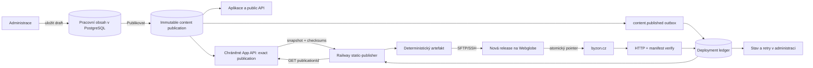
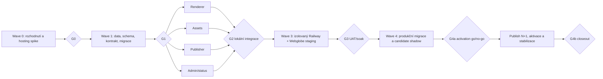

# Plán propojení administrace BYZON a statického webu

> Stav: architektonická varianta schválena; implementace podléhá gates G0–G4a  
> Datum auditu: 5. září 2026  
> Rozsah: `app.byzon.cz` / Railway → `byzon.cz` / Webglobe  
> Schválený směr: App API → build statického HTML → Webglobe  
> Charakter změny: nový publikační a provozní subsystém, nikoli dílčí FTP skript

## 1. Výsledek, kterého chceme dosáhnout

PostgreSQL v konferenční aplikaci bude jediným zdrojem pravdy pro schválený
sdílený obsah. Organizátor upraví draft v administraci, zkontroluje souhrn změn
a jedním explicitním krokem jej publikuje. Stejná neměnná verze se okamžitě
zpřístupní aplikaci a bez ručního zásahu se z ní sestaví a bezpečně nasadí nový
statický web na Webglobe.

„Okamžitě“ zde nemůže znamenat jednu distribuovanou transakci mezi PostgreSQL na
Railway a cizím souborovým systémem na Webglobe. Pro první produkční verzi se
proto navrhuje tento měřitelný kontrakt:

- origin aplikace zpřístupní novou publikaci ihned po databázovém commitu;
- nový/revalidovaný i již otevřený klient aplikace změnu uvidí podle zvlášť
  otestované cache/refresh politiky, předběžný uživatelský cíl je p95 do 60 s;
- statický web se přepne asynchronně, předběžný cíl je rovněž p95 do 60 sekund;
- po 2 minutách rozdílu vznikne varování a po 10 minutách kritický alarm;
- dokud nový web neprojde ověřením, Webglobe dál servíruje poslední známou
  funkční release;
- administrace po celou dobu pravdivě ukazuje, zda je verze jen v aplikaci,
  sestavuje se, nahrává se, ověřuje se, je synchronizovaná, nebo selhala.

Předběžné SLO se musí potvrdit měřením na reálném Webglobe tarifu. Pokud je
požadována kratší nebo téměř atomická viditelnost na obou webech, musí se změnit
hostingový model; nelze ji spolehlivě slíbit nad prostým nahráváním souborů.

## 2. Schválené hlavní architektonické rozhodnutí

Rozhodnutím z 5. září 2026 je zachovat skutečně statický veřejný web, předávat
mu obsah přes verzované App API a přidat samostatnou neveřejnou Railway službu
`@byzon/static-publisher`. Publisher z API načte přesnou immutable publikaci,
sestaví HTML a bezpečně je nasadí na Webglobe.



Tato varianta je preferovaná, protože:

- navazuje na již existující transakční outbox a immutable publikace;
- publisher má stabilní verzovaný kontrakt a nepotřebuje číst content tabulky
  ani účastnická data přímo z databáze;
- obsahová změna nevyžaduje Git commit ani nový deploy aplikace;
- zachová plné statické HTML, SEO, detailní URL, sitemapu a funkci bez
  JavaScriptu;
- veřejný web po úspěšném nasazení nemá runtime závislost na Railway;
- SFTP přístup lze izolovat do jediné služby a oddělit pro test a produkci;
- chyba buildu nebo přenosu nepoškodí aktivní release.

### 2.1 Varianty, které nejsou nyní zvolené

| Varianta                                          | Výhoda                                     | Zásadní nevýhoda                                                        | Role v plánu                                           |
| ------------------------------------------------- | ------------------------------------------ | ----------------------------------------------------------------------- | ------------------------------------------------------ |
| Outbox → GitHub Actions → SFTP                    | hotová historie běhů a environment secrets | další externí systém, GitHub write token v publisheru, delší fronta     | záložní runner, pokud nechceme publisher na Railway    |
| JavaScript na Webglobe načítající Railway API     | text se může změnit rychle                 | nové detailní URL nevzniknou, horší SEO/no-JS, CORS a runtime závislost | pouze nouzový dílčí experiment                         |
| Webglobe CRON stahující obsah                     | logika běží u cíle                         | polling, omezený runtime a slabší observabilita                         | jen reconciliation/fallback                            |
| Commitovat exportovaný JSON do Gitu               | známý CI/CD model                          | Git se stane druhým zdrojem pravdy, konflikty a zpoždění                | nepoužívat pro redakční publish                        |
| Přesun statického hostingu na Railway/static host | nejjednodušší atomické deploye             | změna provozního rozhodnutí a hostingu                                  | eskalace, pokud Webglobe neumí bezpečný release switch |

## 3. Ověřený současný stav

### 3.1 Co už je použitelné

- [ADR-008](adr/008-database-published-content-source.md) už určuje PostgreSQL
  jako autoritu publikovaného programu, řečníků, partnerů a praktických
  informací.
- Databáze má event-scoped entity, vazby, optimistic `version`, immutable
  `content_publications`, checksum a stavy `sync_pending|syncing|synced|sync_failed`
  v [content schématu](../packages/database/src/schema/content.ts).
- [Publikační služba](../apps/conference/src/server/content-publication.ts)
  vytváří snapshot, audit a událost `content.published` v jedné transakci.
- [Public content API](../apps/conference/src/server/public-content.ts) vrací
  whitelistovanou publikaci s verzí, ETagem a bez účastnických PII.
- Admin má CRUD pro dny, místa, místnosti, program, řečníky, partnery, stránky
  a FAQ; publish má impact preview a optimistic kontrolu.
- Provozní dashboard již umí zobrazit agregovaný sync status.
- [Statický generátor](../static-site/build.py) a
  [smoke test](../tests/static_site_smoke.py) dnes reprodukovatelně projdou.
- HTML na Webglobe nemá dlouhou cache; současný `.htaccess` vypíná LiteSpeed
  cache pro veřejný web.

### 3.2 Co dnes nefunguje nebo je nebezpečné

| Priorita | Nález                                                                                                                                | Dopad                                                                                       |
| -------- | ------------------------------------------------------------------------------------------------------------------------------------ | ------------------------------------------------------------------------------------------- |
| P0       | Worker claimuje jen `export.requested` a `program.changed`; `content.published` nikdo nezpracuje.                                    | Tlačítko Publikovat Webglobe vůbec nezmění.                                                 |
| P0       | `static-site/build.py` vždy čte lokální `data/content.json` a zapisuje do pevného `public/`.                                         | Nelze deterministicky sestavit konkrétní DB publikaci ani izolovaný artefakt.               |
| P0       | `static-site/public/` je současně generovaný output i jediný repozitářový zdroj CSS, JS, fontů, hero/video, dokumentů a `.htaccess`. | Pouhé vyčištění outputu by vytvořilo neúplný web; nelze bezpečně poznat zdroj od artefaktu. |
| P0       | Railway staging při deployi znovu importuje JSON s `--allow-published-update`.                                                       | Po přechodu na CMS může opačný tok přepsat ruční změny z administrace.                      |
| P0       | Produkční asset upload není zapojen; UI používá pouze preview port/placeholder.                                                      | Nový řečník nebo partner nemůže spolehlivě dostat fotografii/logo.                          |
| P0       | Public asset resolver částečně redirectuje zpět na `byzon.cz` a WebP balí při buildu aplikace.                                       | Vzniká kruhová závislost a staging není izolovaný.                                          |
| P0       | DB/public snapshot neobsahuje všechna pole potřebná pro současný web.                                                                | Prosté přepnutí zdroje by ztratilo detailní medailonky programu a prezentační metadata.     |
| P0       | Anonymous content API dovoluje `max-age=60, stale-while-revalidate=300` a otevřený React klient obsah nepolluje.                     | Ani aplikace dnes nezaručí uživatelské „okamžitě“; origin commit sám nestačí.               |
| P0       | Není ověřen atomický způsob aktivace release na konkrétním Webglobe účtu.                                                            | Přímý upload do live rootu může servírovat smíšené verze.                                   |
| P1       | `content_publications.syncStatus` nemá historii jednotlivých pokusů/cílů.                                                            | Slabý audit, retry a diagnostika.                                                           |
| P1       | Slug lze změnit bez aliasu/redirect ledgeru.                                                                                         | Rozbité odkazy, záložky a indexované detailní URL.                                          |
| P1       | Dny nemají optimistic verzi a maží se natvrdo; řazení není jeden atomický příkaz.                                                    | Race a obtížný audit redakčních změn.                                                       |
| P1       | UI po DB publishi hlásí obecné zveřejnění, i když web ještě není potvrzený.                                                          | Organizátor může mylně považovat statický web za aktuální.                                  |
| P1       | Public API nabízí jen nejnovější verzi.                                                                                              | Externí runner by při rychlých publishech mohl sestavit jinou verzi než událost.            |
| P1       | Content audit není kompletně viditelný v admin audit kontraktu.                                                                      | Publikace, retry a rollback nelze provozně dobře dohledat.                                  |

### 3.3 Aktuální baseline a prokázaný obsahový drift

Audit 5. září 2026 ověřil:

- lokální statický smoke: **47 HTML stránek, 75 assetů, 28 943 559 B assetů**;
- `static-site/data/content.json`: **68 programových položek, 24 řečníků,
  15 partnerů, 7 stages a 15 detailů programu**;
- každý z 15 detailů programu má anotaci, tři mají strukturované `takeaways`;
- veřejné API na `app.byzon.cz` v publikaci **v7** v době auditu vracelo
  **82 sessions, 24 řečníků, 16 partnerů a 10 rooms**, ale žádný neprázdný
  `session.description`.

Rozdíl má částečně legitimní důvody (například rozpad obecných koučovacích
slotů na konkrétní provozní sessions), částečně ale ukazuje neúplnou migraci
detailního copy. Žádný agent nesmí tento rozdíl „opravit“ automatickým
přepsáním jedné strany druhou. Nejprve vznikne schválená mapovací a
reconciliation zpráva po jednotlivých polích.

Starší [content inventory](content-inventory.md) a
[static baseline](static-site-baseline.md) už uvádějí jiné počty a musí se v
první etapě aktualizovat.

## 4. Rozsah první produkční fáze

První fáze nemá vytvářet univerzální page builder. Má bezpečně převést společná
data, kvůli kterým dnes hrozí dvojí editace.

### 4.1 Obsah řízený administrací v první fázi

- dny, programové stage/místnosti a body programu;
- název, čas, stav, pořadí, krátké shrnutí a detail bodu programu;
- strukturované anotace/takeaways potřebné pro existující detailní stránky;
- explicitní veřejná prezentace session/řečníka: zda má detailní URL a zda se
  ukazuje v homepage/directory/program listing; provozní session bez
  redakčního detailu ji nemají automaticky;
- řečníci, role, firma, medailonek, sociální odkazy, fotografie a jejich
  alternativní text;
- vazby řečník–program a pořadí řečníků u session;
- partneři, jejich odkazy, kategorie, pořadí a loga;
- místo konání a společné praktické informace;
- publikované FAQ;
- stabilní slugs a přesměrování starých veřejných URL.

Program musí oddělit fyzickou `room` používanou kapacitou/rezervacemi od
prezentačního `track/displayGroup` použitého jako sloupec statické mřížky. Nová
koučovací místnost tedy automaticky nevytvoří nový sloupec webu. Session může
mít fyzickou room, prezentační skupinu a omezené presentation metadata
(agregace, `span=all`, compact/layout mode, mobile label, detail eligibility),
vždy přes typované ID/enumy. Field map rozhodne, zda se 26 konkrétních coaching
sessions na webu skládá do souhrnných bloků, a zachová vazbu na zdrojová ID.

### 4.2 Zatím řízeno repozitářem jako `site-config`

- layout, komponenty, CSS/JS a ikony;
- navigace a footer;
- GTM/analytics konfigurace;
- SimpleShop form ID a fallback;
- právní HTML a veřejné přílohy;
- hero a obecné marketingové bloky;
- marketing cenových vln vstupenek;
- historické ročníky, videa a partnerská brožura.

Tyto části mohou později přejít do CMS, ale pouze jako typované, validované
bloky s draftem, preview, publikací a rollbackem. Libovolné HTML ani libovolná
šablona z administrace se nepovolují.

`site-config` není zkopírovaný zbytek legacy `content.json`. `SITE-01` vytvoří
jeho JSON Schema/typy a JSON-pointer ownership manifest pro každé dnešní pole.
Například entity v `speakers.list`, `partners.logos` a `program.days` vlastní
CMS, zatímco sekční nadpis/note/organizer/marketingové intro může vlastnit
repo. Faktické location údaje patří do DB, čistě marketingové location copy do
site-config. Shared entity pole se v site-config zakáže contract testem, aby
nevznikl nový druhý zdroj pravdy. Target config (origin, robots, analytics,
checkout a remote fingerprint) je ještě samostatný od obsahového site-configu.

### 4.3 Význam draftu a publikace

Doporučený produktový kontrakt:

1. `Uložit` mění pouze pracovní sadu.
2. `Náhled publikace` zmrazí kontrolovaný kandidát a souhrn změn.
3. `Publikovat` vydá celou nearchivovanou pracovní sadu jako jednu immutable
   verzi.
4. Stav „je v poslední publikaci / čeká na publikaci / archivováno“ se odvozuje
   z posledního snapshotu; nemá se zaměňovat s uložením formuláře.
5. Pokud produkt potřebuje schovat jednu aktivní položku bez archivace, přidá
   se explicitní veřejná viditelnost. Nepoužije se k tomu nejasná kombinace
   `draft`/`published` na jednotlivých řádcích.

Toto rozhodnutí musí zaznamenat ADR před úpravou schématu a textů UI.

### 4.4 Tři oddělené třídy souborů statického webu

Dnešní `static-site/public/` se před refaktorem inventarizuje a rozdělí, protože
je zároveň výstupem i zdrojem části webu:

1. **Repo-owned source:** templates, CSS/JS, fonty, ikony, obecné brand assety,
   hero/video, veřejné dokumenty a target-aware `.htaccess`/server config
   šablona. Přesunou se například pod `static-site/source/` a
   `static-site/site-config/` a dál se verzují v Gitu.
2. **CMS media:** fotografie řečníků, loga partnerů a další obsahové obrázky
   spravované přes immutable asset pipeline a bucket.
3. **Generated output:** kompletní jednorázový release v novém prázdném temp
   adresáři. Není zdrojem pro další build a nic se z předchozího `public/`
   naslepo nepředkopíruje.

Migrační manifest klasifikuje všech současných 75 assetů a pro každý určí
vlastníka, zdrojovou cestu, veřejnou cílovou URL, checksum a cache policy.
Přesun zdrojů nesmí neúmyslně změnit veřejné URL dokumentů ani rozbít odkazy;
tam, kde se URL mění kvůli fingerprintu, HTML a případné redirecty vzniknou v
jednom releasu. Teprve poté lze vynutit clean output invariant.

## 5. Cílový obsahový kontrakt

Vznikne nový verzovaný kontrakt `PublicSiteSnapshotV1`. Nemá být jen volným
JSON exportem tabulek ani přímo legacy strukturou statického webu.

Minimální obálka:

```json
{
  "publication": {
    "id": "uuid",
    "version": 8,
    "schemaVersion": 1,
    "publicationChecksumSha256": "…",
    "siteSnapshotChecksumSha256": "…",
    "publishedAt": "2026-09-05T12:00:00Z"
  },
  "snapshot": {
    "event": {},
    "program": { "days": [], "rooms": [], "sessions": [] },
    "speakers": [],
    "partners": [],
    "venues": [],
    "practical": { "pages": [], "faqs": [] },
    "assets": [],
    "redirects": []
  }
}
```

`siteSnapshotChecksumSha256` se počítá z kanonické serializace samotného
`snapshot`; obálka `publication` ani checksum samotný do výpočtu nevstupují.
`publicationChecksumSha256` je checksum dnešního aplikačního snapshotu a může
zahrnovat provozní pole, která statický web nedostane. Oba payloady vzniknou a
uloží se jako immutable záznamy v jedné publish transakci pod stejným
`publicationId/version` — například stávající `content_publications.snapshot`
a one-to-one `public_site_publication_snapshots`. Site snapshot se nesmí líně
přepočítávat novou verzí producer kódu až při deployi. `schemaVersion` se uloží
vedle něj a je součástí desired-state identity. Tím nevznikne kruhový checksum,
aplikace si zachová své rezervační/provozní potřeby a statický export má
samostatný privacy whitelist.

Snapshot publisher získá přes chráněný exact-version App API endpoint, například
`GET /api/v1/internal/events/:eventId/public-site-publications/:publicationId`.
Endpoint ověří service identity i event/destination scope a vrátí výhradně výše
uvedenou veřejnou projekci, `ETag` a oba očekávané checksumy. Nejde o dnešní
veřejný `latest` endpoint a pipeline jej nesmí nahrazovat dotazem bez
`publicationId`. Protože odpověď je immutable, retry vrátí identické bytes;
neexistující, nekompatibilní nebo checksumově odlišná publication skončí před
buildem.

### 5.1 Povinné vlastnosti kontraktu

- `schemaVersion` je nezávislá na redakční `publication.version`.
- Kanonické JSON bytes se definují jedním meziplatformním standardem, doporučeně
  RFC 8785 (JCS), s UTF-8 a zakázanými/normalizovanými hodnotami mimo jeho
  doménu. Současné JS `localeCompare` se jako hash standard nepoužije; stejné
  Unicode/numeric fixtures musí dát shodný digest v Node i Pythonu.
- Stejný snapshot, renderer, `site-config`, repo-owned asset source a target
  konfigurace vytvoří byte-identický payload a manifest.
- Každá kolekce má stabilní ID, stabilní slug a deterministické pořadí.
- Snapshot připíná přesný asset ID, SHA-256, MIME, velikost, rozměry,
  alternativní text a výslednou content-addressed cestu.
- Rich text používá jeden omezený, dokumentovaný Markdown/CommonMark subset bez
  raw HTML. Node preview/aplikace a Python renderer sdílejí stejné golden AST/HTML
  fixtures pro odstavce, odkazy, seznamy a důraz; nepodporovaná syntaxe publish
  zablokuje místo rozdílného zobrazení medailonku.
- Neobsahuje `accountEmail`, účastnické identity, ticket stav, reservation
  windows, interní poznámky, privátní bucket credentials ani jiné PII.
- Publisher odmítne neznámou novější `schemaVersion` dříve, než se dotkne
  aktivního webu.
- Producent musí po přechodnou dobu zachovat alespoň kompatibilitu s aktuální a
  předchozí podporovanou verzí kontraktu; změny se nasazují consumer-first.
  Starší publikace mají explicitní `renderable/rollbackEligible` podle
  dostupného site snapshotu/upcasteru. UI nenabídne obsahový rollback verze,
  kterou nelze bezeztrátově převést; artifact rollback je oddělená možnost.
- Historická publication bez uloženého site snapshotu se nikdy neregeneruje z
  dnešních mutable tabulek. Buď dostane jednorázový auditovaný immutable backfill
  keyed `publicationId + schemaVersion`, nebo se po migraci vytvoří obsahově
  schválená nová publication N+1. Doporučený cutover je N+1.
- Odkazy a slugy projdou kontrolou proti path traversal, Unicode kolizím,
  řídicím znakům a rezervovaným trasám.

### 5.2 Mapovací rozhodnutí před implementací

| Oblast               | Dnes v DB/public snapshotu                                                    | Dnes jen ve statickém JSON                                                                          | Povinné rozhodnutí                                                                                                       |
| -------------------- | ----------------------------------------------------------------------------- | --------------------------------------------------------------------------------------------------- | ------------------------------------------------------------------------------------------------------------------------ |
| Event                | název, slug, timezone, začátek/konec                                          | SEO title/description, brand copy                                                                   | společná fakta do snapshotu; marketing/SEO zatím `site-config` nebo typovaná event metadata                              |
| Program              | dny, fyzické rooms, title, summary, description, typ, časy, stav, speaker IDs | 7 prezentačních stages vs 10 rooms, badge, `span`, `compact`, mobile label, detail mapping/agregace | přidat displayGroup/track oddělený od room a typovanou presentation/detail eligibility; layout odvodit nebo omezený enum |
| Detail session       | obecné `summary`/`description`                                                | annotation, takeaways, closing, presenter heading, kind                                             | navrhnout typovaná pole/sekce a migrovat beze ztráty                                                                     |
| Řečník               | jméno, firma, role, bio, část sociálních URL, photoAssetId                    | homepage/directory visibility, label, YouTube                                                       | přidat chybějící veřejná pole nebo jasně odvodit                                                                         |
| Partner              | jméno, popis, URL, category/tier, logoAssetId                                 | `tall`, `on_dark`                                                                                   | odvodit z rozměrů/kontrastu, nebo přidat omezenou variantu zobrazení                                                     |
| Venue/practical      | strukturované místo, Markdown, FAQ                                            | nadpisy a image použití                                                                             | přenést asset reference a společné copy                                                                                  |
| Marketing shell      | content pages jsou obecné                                                     | hero, CTA, tickets, archive, nav/footer                                                             | v první fázi zůstává pouze v `site-config`                                                                               |
| Legal/SimpleShop/GTM | nejsou součástí content publication                                           | celé konfigurace/texty                                                                              | zatím repo-only, staging musí umět bezpečně vypnout produkční integrace                                                  |

Výstupem není pouze dokument; musí vzniknout strojově testovaná fixture, která
obsahuje všechny dnešní varianty polí a prokáže, že nic nebylo tiše zahozeno.
Součástí je schválený přesný URL set: 82 dnešních DB sessions neznamená 82
detailních stránek, když současný web záměrně publikuje jen 15. Coaching a jiné
provozní sloty nesmějí dostat indexovatelný detail jen proto, že mají DB slug.

### 5.3 URL a redirect politika

- Přejmenování stejné entity vytvoří trvalý 301 na nový canonical.
- Archivace dostane 301 jen při explicitní věcné náhradě; bez náhrady vrátí
  schválenou 404 nebo 410 a zmizí ze sitemap.
- Alias se znovu nepřidělí jiné entitě. Redirect ledger zakáže smyčky, řetězce,
  kolize mezi typy i kolizi s repo-owned/generovanou rezervovanou trasou;
  řetězce se zploští přímo na současný canonical.
- Skutečný HTTP status/`Location` vytvoří target-aware `.htaccess` či jiný
  ověřený server rule. Meta refresh nebo obyčejná HTML stránka se nepovažuje za 301.
- Integrační test kontroluje status, `Location`, canonical, sitemap a chování
  trailing slash/case/Unicode variant na reálném Webglobe stagingu.

## 6. Asset pipeline je součást P0

Bez skutečné správy médií není požadavek „nový řečník se objeví na obou
webech“ dokončený.

### 6.1 Cílový tok assetu

1. Admin zahájí upload pro konkrétního vlastníka a účel.
2. Server vytvoří vlastní náhodný immutable object key v privátním bucketu.
3. Upload se finalizuje serverovou kontrolou skutečného MIME, velikosti,
   rozměrů a SHA-256, bezpečným decode/re-encode, odstraněním EXIF/metadat a
   limitem pixelů/dekomprese; animované či vadné varianty odmítne. Stav je do
   dokončení `uploading/quarantined`.
4. Pro první fázi se nové uploady omezí na bezpečně dekódované JPEG/PNG/WebP.
   Stávající repozitářová SVG lze jednorázově migrovat jako důvěryhodné
   baseline; nové SVG se nepovolí bez sanitizeru.
5. Nahrazení obrázku vytvoří nový objekt a asset ID. Již publikovaný objekt se
   nikdy nepřepisuje pod stejným klíčem.
6. Binary asset drží technická metadata a `createdBy`; použití drží
   event/entity/purpose a accessibility usage (`altText`, nebo explicitně
   `decorative`). Publikace smí odkázat pouze `ready` asset přes validní
   zveřejněné použití.
7. Aplikace servíruje/proxyuje publikovaný asset z bucketu přes vlastní
   autorizovaný allowlist a immutable cache URL; nečeká na Webglobe.
8. Static publisher stáhne přesné bytes podle manifestu přes scoped App asset
   API nebo jím vydané krátce platné signed GET URL, ověří checksum a vloží je
   do release pod content-addressed názvem.
9. Garbage collection odstraní objekt až po retenční době a jen pokud jej
   nereferencuje žádná držená publication/release.

DB model musí oddělit uploadujícího uživatele od vlastníka/použití obsahu,
například verzovanou vazbou `asset_usages(event_id, owner_type, owner_id,
purpose, asset_id, alt_text, decorative, version)`. Purpose pokryje minimálně speaker photo,
partner logo, venue hero a page hero. Attach/replace proběhne atomicky pod
event/content lockem. Samotný mutable příznak `isPublic` nesmí zpřístupnit asset
draftu; public resolver autorizuje konkrétní referenci z immutable publikace.
Odpověď používá správný `Content-Type`, `Content-Length`, immutable cache headers
a `X-Content-Type-Options: nosniff`.

### 6.2 Migrační pravidla pro dnešní soubory

- Projít všechny fotografie, loga a venue obrázky ze současného JSONu.
- Uploadnout je jednorázově do bucketu a porovnat uložené checksumy s repem.
- Zapsat alt text, nebo výslovnou dekorativní roli; nevyplněná accessibility
  volba je content blocker, ne automatický prázdný default.
- Dokud není migrace a app asset serving ověřené, původní soubory v repu ani
  na Webglobe se nemažou.
- Odstranit build-time kopírování WebP a hardcoded redirect na produkční
  `byzon.cz` až po dokončení nové cesty.

## 7. Publikační a deployment stavový model

Immutable `content_publications` zůstane autoritativní historií obsahu. Vedle ní
vzniknou destination registry a deployment ledger.

Každý cíl má explicitní desired-state záznam
`static_site_destinations`: event, environment, mode, desired publication,
desired renderer SHA, site-config checksum, monotonní `generation` a aktivní
deployment. Neobsahuje SFTP secret. Publish posune požadovanou publication;
řízený deploy rendereru posune renderer/config a tím vyvolá rebuild i bez nové
redakční verze. Deployment smí aktivovat pouze tehdy, když se celý jeho tuple a
generation stále shoduje s destination row.

Destination má povinný cizí klíč na právě jeden `event_id` a explicitní
environment; neexistuje globální ani „první nalezený“ fallback target.
Nepřiřazený nebo vícenásobně/konfliktně namapovaný event skončí v quarantine a
nesmí vyvolat síťový zápis.

Ledger `static_site_deployments` obsahuje například:

```text
id
event_id
publication_id
destination_id
publication_version
schema_version
renderer_release_sha
site_config_checksum_sha256
destination_config_checksum_sha256
publication_checksum_sha256
site_snapshot_checksum_sha256
artifact_manifest_checksum_sha256
remote_release_id/path
state: queued | building | uploading | ready_for_activation | activating |
       verifying | succeeded | failed | superseded | rolled_back
attempts
retry_class: retryable | terminal
next_attempt_at
claim_owner / fencing_token
lease_until / heartbeat_at
started_at / activated_at / finished_at
error_code / sanitized_error_detail
created_at / updated_at
```

Jedna agregovaná deployment row nestačí jako historie. Každý claim/retry má
append-only `static_site_deployment_attempts` s ownerem, fencing tokenem,
přechody, trváním a sanitizovanou chybou; aktivace/rollback mají append-only
activation event. Destination ukazuje explicitním `active_deployment_id` na
současnou pravdu. Efektivní target config (origin, robots, integrations a remote
root fingerprint) je součástí checksumu desired tuple, ne pouze mutable ID.

Unikátní desired-state identita musí zahrnout alespoň destination, publication,
renderer revision a site-config checksum. Tím se stejná publikace znovu sestaví
i po změně CSS/generátoru bez falešné nové content publication.

### 7.1 Spolehlivé zpracování

0. Před prvním zapnutím handleru se inventarizují všechny historické pending
   `content.published` eventy, přiřadí se k publication/eventu a schváleným
   způsobem se uzavřou nebo sloučí rovnou na nejnovější desired version. Nesmějí
   se bez auditu postupně přehrát proti produkci.
1. `content.published` outbox consumer pouze idempotentně posune desired
   publication cíle a materializuje deployment row pro celý aktuální desired
   tuple; pak označí outbox event jako doručený.
2. Publisher atomicky claimuje `queued` nebo `failed` s
   `retry_class=retryable` a splatným `next_attempt_at`; umí převzít expirovaný
   in-progress pokus. Dostane monotonní fencing token, pravidelně obnovuje lease
   a zapisuje heartbeat. Jeden replica/concurrency limit je jen další ochrana,
   ne náhrada fencing.
3. Vždy načte snapshot přes přesný `publicationId`, nikdy dotazem na „latest“.
   Použije chráněný App API exact-ID endpoint přes Railway private networking a
   samostatnou service identity. Privátní síť není sama autentizace: request je
   krátce platně podepsaný/tokenizovaný, scope omezuje event/destination a API
   kontroluje ETag/checksum. Veřejný latest endpoint ani přímé čtení content DB
   se pro build nepoužije.
4. Build probíhá v čistém dočasném adresáři bez změny pracovního stromu.
5. Před aktivací publisher znovu ověří desired generation, celý tuple, fencing
   token a poslední aktivní verzi pomocí DB CAS. Remote activation vstoupí do
   jediného critical section pro destination a pod remote lockem odmítne token
   starší než již zapsaný; teprve potom atomicky změní pointer a marker.
6. Starší opožděný job se označí `superseded`; nikdy nesmí downgradeovat web.
7. Retry používá omezený exponenciální backoff, idempotentní release ID a
   dead-letter/ruční recovery po dosažení limitu.
8. Pád, timeout nebo neurčitý výsledek po uploadu/aktivaci se při novém lease
   nejprve reconciliuje podle
   vzdáleného release manifestu; nevytváří slepě další změnu.
9. Start nové verze publisheru provede desired-state reconciliation poslední
   publikace proti `renderer_release_sha`, takže změna šablony vyvolá rebuild i
   bez content editace.

V režimu `shadow` job po buildu, durable artifact uložení, remote uploadu a
integrity verify skončí v `ready_for_activation`. Pozdější lidské schválení
nepoužije starý claim: vytvoří nový activation attempt, získá čerstvý lease a
fencing token a znovu ověří celý desired tuple. Mezitím zastaralý shadow release
se pouze označí `superseded`.

Existující `publicContentSyncEnabled` se během přechodu použije jako globální
kill switch, destination `mode` jako jemnější `off|shadow|active`. Vypnutý cíl
neztratí informaci o nejnovější požadované publication, pouze ji neaktivuje; po
zapnutí reconciler vytvoří deployment rovnou pro aktuální celý desired tuple.
Tím se nemusí přehrávat staré outbox eventy ani vyrábět falešná publikace.

Remote fencing je součást `SYNC-01`: pokud Webglobe nedovolí bezpečný lock,
porovnání tokenu a atomický switch jedním důvěryhodným aktivačním mechanismem,
G0 se neuzavře. Samotné „ověřil jsem generation v DB a potom provedl SFTP
rename“ nechává okno pro expirovaný proces a není dostatečné.

Stávající `content_publications.syncStatus` lze ponechat jako denormalizovaný
souhrn pro hlavní cílový web. Historie a pravda o jednotlivých pokusech ale musí
být v deployment ledgeru.

### 7.2 Veřejný release marker

Každá aktivní release obsahuje například
`/.well-known/byzon-release.json`:

```json
{
  "eventSlug": "byzon-2026",
  "environment": "production",
  "releaseId": "production-v8-…",
  "destinationGeneration": 42,
  "publicationId": "uuid",
  "publicationVersion": 8,
  "schemaVersion": 1,
  "publicationChecksumSha256": "…",
  "siteSnapshotChecksumSha256": "…",
  "artifactManifestChecksumSha256": "…",
  "rendererReleaseSha": "…",
  "siteConfigChecksumSha256": "…",
  "destinationConfigChecksumSha256": "…"
}
```

Marker neobsahuje interní cestu, credentials ani citlivá data. Nahrává/přepíná
se spolu s release a `synced` lze nastavit teprve po HTTP ověření jeho verze a
checksumu. Čas aktivace patří pouze do ledgeru; nesmí měnit deterministic build.

`artifactManifestChecksumSha256` je SHA-256 kanonického, podle cesty seřazeného
manifestu položek `{path,size,sha256}`. Manifest nezahrnuje marker ani svůj
vlastní checksum, takže nevzniká self-reference. Marker se vytvoří až z tohoto
digestu. Volitelný checksum výsledného tar archivu se drží pouze v ledgeru.
Bit-flip libovolného payload souboru, manifestu nebo marker hodnoty musí remote
verify odhalit před aktivací.

## 8. Bezpečné nasazení na Webglobe

Použije se pouze šifrovaný přenos přes SFTP/SSH s připnutým host key. Běžné FTP
není pro automatizovaný publisher přijatelné. Webglobe dokumentuje SFTP/SCP na
portu `222`, trvalé SSH klíče v `.ssh/authorized_keys`, samostatné adresáře pro
subdomény a omezení přístupu podle IP nebo země. To ale samo o sobě neprokazuje,
že konkrétní tarif a účet dovolí atomickou aktivaci releasu; ta se musí ověřit
praktickým spike.

### 8.1 Povinný hostingový spike před vývojem deployeru

Spike se provede nejprve na dočasné subdoméně a skončí protokolem s přesnými
příkazy, naměřenými časy a screenshoty/HTTP důkazy. Musí ověřit:

- skutečný document root testovací i produkční domény a zda lze z účtu vidět
  pouze přidělený podstrom;
- přihlášení neinteraktivním SSH klíčem na portu 222 a stabilní host key;
- zda konkrétní tarif dovoluje trvalý, always-on neinteraktivní SSH/SFTP
  přístup, potřebné příkazy a za jakou cenu; hodinová WebSSH konzole sama
  nestačí;
- ověření host-key fingerprintu druhým důvěryhodným kanálem, ne pouze
  `ssh-keyscan` v témže prvním spojení;
- vytvoření release adresáře, upload stovek souborů a server-side rename;
- server-side checksum nástrojem přes SSH, nebo úplný read-back přes SFTP s
  lokálním porovnáním; samotná velikost/`stat` není kontrola integrity;
- zda účet dovolí symlink a zda lze pointer přepnout jednou atomickou operací;
- zda aktivační mechanismus umí pod lockem porovnat a trvale uložit monotonní
  fencing token, takže opožděný proces nemůže vrátit pointer na starší release;
- alternativně zda funguje interní rewrite přes malý pointer soubor nebo
  atomicky přejmenovaný `.htaccess`;
- chování během aktivace pomocí paralelních HTTP dotazů: žádná 404, žádné HTML
  verze N s assety verze N−1 a vždy konzistentní release marker;
- LiteSpeed/proxy/browser cache, `Cache-Control`, ETag a chování po přepnutí;
- HTTPS certifikát a Basic Auth/noindex na testovací subdoméně;
- diskovou kvótu, počet inodů, limity spojení, timeouty, velikost uploadu a
  rychlost reálného artefaktu;
- bezpečné mazání staré release a chování při zaplněné kvótě;
- možnost omezení účtu na Railway statické odchozí IP adresy.

Výstupem `SYNC-01` bude explicitní volba jednoho z následujících mechanismů,
nikoli obecná věta, že „SFTP funguje“.

### 8.2 Pořadí preferovaných mechanismů aktivace

1. **Atomický symlink/pointer:** artefakt se nahraje do
   `releases/<release-id>/`, ověří se a jedinou server-side operací se přepne
   `current`. To je cílová varianta.
2. **Atomický rewrite pointer:** document root obsahuje stabilní bootstrap
   `.htaccess`; aktivní release určuje malý generovaný soubor, který se po
   uploadu přepne atomickým rename. Spike musí prokázat, že všechny cesty,
   chyby, trailing slashes a `.well-known` fungují.
3. **Manifestem řízený in-place deploy:** smí se použít pouze ve staging spike
   nebo jako break-glass během oznámeného maintenance okna. Pořadí je nové
   fingerprintované assety → detailní stránky → vstupní stránky → release
   marker → odstranění osiřelých cest. Není to schválený produkční CMS režim.
4. **Změna hostingového mechanismu:** povinná, pokud nelze variantu 1 nebo 2 a
   spolehlivý rollback prokázat. G0 se bez atomického switch mechanismu
   neuzavře. Přímý synchronizační upload do live rootu se nesmí schovat pod
   označení „MVP“.

Každý release adresář je write-once. Upload nejprve míří do unikátního
`*.partial` adresáře mimo veřejný document root, projde úplným remote integrity
verify a teprve server-side rename z něj udělá finální release. Finální releases
zůstávají mimo document root nebo webserver přímý přístup k
`releases/<id>`/`.partial` vždy vrací 403/404; directory listing je vypnutý.
Veřejně dosažitelný je pouze aktivní pointer. Shadow artifact lze prohlížet jen
na chráněném preview originu, nikdy přes hádatelnou produkční cestu.

Publisher nikdy needituje aktivní release
ani nepřepisuje fingerprintovaný asset. Drží se minimálně posledních pět
úspěšných release nebo delší schválená retenční sada. Případná Webglobe záloha
se nejprve ověří pro konkrétní tarif včetně retention a test restore; i potom je
jen sekundární disaster recovery, ne mechanismus běžného rollbacku ani náhrada
nezávislého artifact store.

### 8.3 Release artefakt

Publisher sestaví lokálně tar/manifest obsahující relativní POSIX cestu,
velikost a SHA-256 každého souboru. Zakáže absolutní cesty, `..`, symlinky z
artefaktu, duplicitní normalizované cesty a soubory mimo allowlist. Remote path
se skládá pouze z předem nakonfigurovaného rootu a serverem vytvořeného
`release-id`; nikdy z volného vstupu administrátora.

Tar je deterministický: stabilní pořadí, normalizovaný `mtime`, `uid/gid`, mode
a žádná lokální absolutní metadata. Před Webglobe uploadem se artifact,
detached manifest a marker uloží pod append-only content-addressed key do
privátního artifact store odděleného pro test/produkci. Zápis je conditional
create a existující key se nepřepisuje. Ledger drží object key i digest.

Artifact store má vlastní retention, backup/export a restore drill pro případ
současné ztráty Railway deploymentu i Webglobe releasu. Pokud zvolený Railway
bucket nemá object versioning, object lock nebo lifecycle policy, nahradí se to
aplikační immutable politikou, pravidelným cleanup jobem a nezávislou záložní
kopií; nesmí se o něm tvrdit, že je WORM. Break-glass smí použít jen artifact,
jehož digest se shoduje s ledgerem.

HTML a release marker mají krátkou nebo validační cache. CSS, JS, fonty a
obrázky mají content-hashed názvy a `immutable` cache. Sitemap, robots,
canonical, OpenGraph a structured data se vždy generují podle cílového originu,
nikoli podle konstanty v builderu.

HTML nesmí odkazovat na asset relativně uvnitř mutable `current` pointeru.
Jinak může prohlížeč načíst HTML N, mezitím se přepne N+1 a následný požadavek
na asset N skončí 404. Doporučený layout je sdílený append-only
content-addressed namespace `/assets/<sha256>...`, který activation rewrite
obchází. Všechny assety se nahrají a ověří před pointer switchem; GC je odstraní
až když je nereferencuje žádná držená release a uplynulo nejdelší HTML/cache
retenční okno. Přípustnou alternativou jsou veřejné release-qualified asset URL,
ale HTML/partial adresáře téže release musejí zůstat přímo nepřístupné.
Staging race test načte HTML těsně před switchem a jeho assety až po switchi.

## 9. Prostředí, identity a tajemství

### 9.1 Cílová topologie

| Vrstva                      | Lokální/CI                     | Integrační test                               | Produkce                                  |
| --------------------------- | ------------------------------ | --------------------------------------------- | ----------------------------------------- |
| Railway environment         | ephemeral/local                | nový persistentní `content-sync-test`         | schválený produkční environment           |
| Web aplikace                | localhost/preview              | Railway URL, případně testovací app subdoména | definitivní produkční app origin          |
| PostgreSQL/Redis            | lokální izolované              | vlastní služby/data                           | vlastní produkční služby/data             |
| Asset storage               | lokální emulator/test bucket   | vlastní privátní bucket                       | vlastní privátní bucket                   |
| Artifact storage            | temp/content-addressed fixture | vlastní append-only test store                | vlastní privátní store + nezávislá záloha |
| Static publisher            | dry-run/fake SFTP              | vlastní Railway service                       | vlastní Railway service                   |
| Webglobe                    | lokální SSH fixture            | např. `cms-preview.byzon.cz`, vlastní docroot | `byzon.cz`, produkční docroot             |
| Indexace/analytics/checkout | vypnuto                        | `noindex`, vypnuto                            | zapnuto dle schválené konfigurace         |

Railway environment isolation chrání pouze tehdy, když reference, volumes a
proměnné opravdu míří na služby stejného prostředí. Proto se testovací prostředí
nevytvoří pouhým přepínačem nad produkční databází nebo bucketem.

### 9.2 Tvrdé ochrany proti záměně cíle

- Staging nikdy nedostane produkční SFTP private key a produkce nikdy testovací
  key nepotřebuje.
- Webglobe účet pro test smí zapisovat pouze do testovacího docrootu; produkční
  účet pouze do produkčního release podstromu.
- Publisher používá samostatnou DB roli pouze pro claim/update deployment
  ledgeru a čtení necitlivé destination konfigurace. Site snapshot čte přes App
  API; DB role nemá `SELECT` nad content, účastníky, rezervacemi, účty ani
  mutable draft tabulkami. Repository interface bez DB grants není
  bezpečnostní hranice.
- Publikovatelné CMS assety jsou v samostatném bucketu/prefixu, ale publisher
  nedostane široké bucket credentials. Stáhne pouze manifestem připnuté
  publikované bytes přes scoped App asset API nebo krátce platné signed GET URL
  vydané tímto API. Pokud provider neumí prefix-level práva, použije se
  samostatný bucket; soukromé uživatelské uploady zůstanou nedostupné.
- Publisher při startu ověří podepsanou/allowlistovanou kombinaci
  `environment ID + destination ID + expected hostname + remote root + App API audience`.
- `APP_ENV=staging` není dostatečný guard. Do logu se zapíše fingerprint cíle,
  ne tajemství; nesoulad způsobí fail-closed ještě před uploadem.
- Produkční aktivace vyžaduje samostatný `STATIC_PUBLISHER_MODE=active` a
  produkční feature flag. Výchozí hodnota je `off`, testovací mezistupeň
  `shadow` artefakt sestaví a nahraje, ale nepřepne pointer.
- Railway region publisheru se po allowlistu nemění bez současné změny povolené
  odchozí IP. Railway statické outbound IP jsou podle dokumentace dostupné na
  Pro plánu, tvoří HA set a při změně regionu se mění; allowlist obsahuje celý
  aktuální set. IP může být sdílená a je jen defense-in-depth, nikdy náhrada SSH
  klíče.
- SSH `known_hosts` se připne z výsledku spike; `StrictHostKeyChecking` zůstane
  zapnutý. Hesla ani fallback na plain FTP nejsou povolené.
- Secrets se nikdy nevkládají do snapshotu, artefaktu, DB error detailu ani
  admin odpovědi. Logování příkazů a URL musí být redigované.
- Negativní integrační test se přihlásí skutečnými publisher credentials a
  prokáže, že nelze číst PII/mutable draft, neveřejný asset ani zapisovat mimo
  ledger a přidělený remote root.
- Před prvním startem `content-sync-test` se diffují všechny zděděné/reference
  variables, nejen DB/bucket/SFTP: test nesmí mít produkční platební,
  SimpleShop, mailové, analytické, OAuth ani jiné integrační credentials.

### 9.3 Kritický současný konflikt prostředí

[Railway staging runbook](runbooks/railway-staging.md) v době auditu uvádí, že
environment nazvaný `staging` obsluhuje vlastní doménu `app.byzon.cz`, zatímco
`production-2026` má generickou Railway URL. Před přidělením produkčního SFTP
klíče musí vlastník infrastruktury jednoznačně určit:

- který Railway environment je skutečná produkční aplikace a databáze;
- na který z nich ukazuje `app.byzon.cz` při cutoveru;
- jak se bude jmenovat a adresovat oddělený `content-sync-test`;
- kdo může měnit production variables a spouštět produkční rollback.

Dokud tato mapa není zapsaná a dvoučlenně ověřená, žádná Railway služba nesmí
dostat write přístup k produkčnímu Webglobe rootu.

### 9.4 Ochrana testovací subdomény

Testovací web musí současně používat:

- vlastní HTTPS origin a canonical URL;
- `X-Robots-Tag: noindex, nofollow, noarchive` i odpovídající `robots.txt`;
- Basic Auth nebo allowlist přístupu, pokud je kompatibilní s automatickým
  ověřením;
- vypnuté GTM/analytics a zakázané reálné checkout/objednávkové akce;
- viditelný environment banner;
- pouze syntetická nebo schválená veřejná data, nikdy účastnická PII.

## 10. Administrace, preview a provozní zpětná vazba

CMS workflow musí rozlišit obsahový commit od fyzického deploye. Jedna zelená
hláška po DB commitu není dostatečná.

### 10.1 Stav zobrazený editorovi

Na hlavním panelu obsahu i v potvrzení publikace se zobrazí:

- poslední uložená změna a zda pracovní sada čeká na publikaci;
- číslo poslední content publication a její autor/čas;
- pro každý relevantní cíl poslední aktivní verze, přesný stav pipeline a čas;
- průběh `ve frontě → sestavuji → nahrávám → aktivuji → ověřuji → hotovo`;
- varování „aplikace v8 / web v7“ s uplynulým časem;
- sanitizovaná, uživatelsky srozumitelná chyba a correlation ID;
- odkaz „otevřít testovací/produkční web“ a release marker;
- historii pokusů, retry, supersede a rollbacků.

UI nesmí tvrdit „zveřejněno na webu“, dokud HTTP verify nepotvrdí správný
marker a několik reprezentativních stránek.

### 10.2 Ovládací akce

- `Publikovat` vytváří novou obsahovou publikaci; před potvrzením ukáže počty
  přidaných, změněných, archivovaných entit, změny slugů a chybějící assety.
- `Opakovat nasazení` znovu zařadí stejný desired state. Nevytváří falešnou
  novou content publication.
- `Sestavit nejnovější obsah novým rendererem` je řízený rebuild po změně
  šablon/CSS a je plně auditovaný.
- `Vrátit obsah` vytvoří z vybrané starší publikace novou pracovní revizi,
  ukáže diff a po schválení publikuje verzi N+1. Historie se nemění.
- `Nouzově vrátit webový artefakt` pouze přepne pointer na předchozí release.
  Aplikace a web pak záměrně divergují, vznikne kritický alarm a musí následovat
  oprava nebo obsahový rollback. Tato akce je pro omezenou roli a vyžaduje
  důvod i druhé potvrzení.

Publikační role, retry a oba typy rollbacku budou oddělená oprávnění. Všechny
akce zapíší actor, publication, destination, předchozí a nový stav, čas,
correlation ID a důvod do audit logu.

### 10.3 Preview

První verze může používat preview posledního uloženého draftu v Railway bez
zápisu na Webglobe. Před produkčním cutoverem ale musí existovat alespoň:

- admin preview vytvářející stejnou candidate aplikační publication i
  `PublicSiteSnapshotV1` jako ostrá publish transakce;
- candidate site checksum vrácený s preview; publish request pošle očekávaný
  app i site checksum a uvnitř event locku oba znovu sestaví a porovná;
- preflight URL graphu, detail-page eligibility, redirect smyček/kolizí,
  chybějících asset usages, altů a invalidních slugů před povolením tlačítka
  Publikovat; template-only linky hlídá renderer CI;
- testovací Webglobe cíl pro ověření skutečného statického výsledku.

Volitelný plný draft render může dostat pouze krátce platný immutable candidate
payload přes interní preview queue a výsledek držet na chráněném preview
originu. Publisher kvůli preview nedostane read přístup k mutable tabulkám.
Změní-li se draft po preview, checksum guard publish odmítne.

Candidate artifact obsahuje jen deterministic site payload a manifest. Nemá
ještě finální `publicationId`, version ani publication checksum, proto není
Webglobe release a nesmí dostat finální marker ani stav `ready_for_activation`.
Po úspěšném publishi nový deployment attempt porovná site checksum, přidá
deterministický marker z immutable DB metadat, znovu ověří bundle a teprve pak
vytvoří/finalizuje remote release. Candidate má TTL a při checksum mismatch se
bezpečně zahodí.

Candidate proto není neúplná `static_site_deployments` row. Samostatný TTL
záznam `static_site_build_candidates` obsahuje event, working revision,
expected previous publication version, app/site snapshot checksum,
renderer/site/destination config checksumy, artifact/manifest object keys,
createdBy a `expiresAt`. Publish pod event lockem přijme candidate ID, znovu
ověří oba content checksumy a do outboxu zapíše vazbu pouze při úplné shodě;
jinak se po commitu provede běžný nový build. Cleanup expirovaných candidates a
append-only audit vlastní `PREVIEW-02`.

Automatické publikování při každém stisku `Uložit` se nezavádí. Explicitní
publish chrání proti rozepsanému copy, sadě napůl provedených změn a zahlcení
SFTP pipeline; požadavek na rychlé promítnutí platí od potvrzení Publikovat.

### 10.4 Čerstvost obsahu v aplikaci

Dnešní `max-age=60, stale-while-revalidate=300` a jednorázové načtení při mountu
neplní uživatelský slib pro již otevřenou aplikaci. `APP-01` proto navrhne a
změří lehký version bootstrap s revalidací (`no-cache`/ETag), periodický polling
s jitterem a refresh po focus/reconnect, nebo ekvivalentní push mechanismus.
Plný public payload se může cacheovat pod immutable/versioned URL; změna verze
atomicky přepne resource. Service worker nesmí držet neomezeně starý „latest“.
Offline klient se do online SLO nepočítá, ale musí viditelně uvést verzi a stáří
místo předstírání aktuálnosti.

## 11. Testovací strategie a release gates

Testy nesmějí pouze porovnávat nový build s dnešním commitnutým `public/`.
Rozdělí se na kontrakt, renderer, pipeline, bezpečnost, obsahovou paritu a
ověření skutečného cíle.

### 11.1 Automatizované vrstvy

| Vrstva                | Co musí prokázat                                                                                           | Kdy běží                  |
| --------------------- | ---------------------------------------------------------------------------------------------------------- | ------------------------- |
| Unit/domain           | kanonická serializace a checksum; validace slugů, URL, Markdownu, assetů; stavový automat; retry/supersede | každý PR                  |
| Producer contract     | DB → `PublicSiteSnapshotV1`, whitelist bez PII, deterministické řazení, kompatibilita schemaVersion        | každý PR                  |
| App API contract      | exact `publicationId`, service auth/scope, ETag/checksum/byte stabilita a zákaz latest fallback            | každý PR                  |
| Consumer contract     | renderer přijme podporované fixture, odmítne nekompatibilní/poškozené, nic tiše nezahodí                   | každý PR                  |
| Renderer golden       | stejný snapshot + renderer = stejný manifest; čistý output; žádné osiřelé stránky                          | každý PR                  |
| DB integration        | publication + outbox + deployment row v očekávaných transakcích; idempotence a leases                      | každý PR s Postgres/Redis |
| Publisher integration | lokální SFTP/SSH fixture, upload, verify, pointer switch, restart a rollback                               | každý PR pipeline části   |
| Browser/static        | hlavní stránky, detail session/speaker, responsive layout, odkazy, formuláře, a11y                         | CI a staging              |
| Security              | path traversal, XSS/Markdown, MIME spoof, SVG, unsafe URL, host-key mismatch, secret redaction             | CI a staging              |
| Staging E2E           | admin edit → publish → app vN → Webglobe vN → marker/checksum → admin success                              | každý release candidate   |
| Production smoke      | marker, homepage, program, sitemap, náhodný detail a fingerprintovaný asset                                | po každé aktivaci         |

Existující `pnpm test:static` se rozdělí: obecné invarianty zůstanou, konkrétní
jména a dnešní copy přejdou do verzované migrační parity fixture. Playwright v
repozitáři se rozšíří o statický testovací origin; nebude se zavádět druhý
browser framework.

### 11.2 Povinné funkční scénáře

Každý z následujících scénářů se ověří na `content-sync-test` přes UI a na
výsledném HTML, JSON-LD/sitemapě, assetech i markeru:

1. vytvořit řečníka s fotografií, medailonkem, diakritikou a sociálním odkazem;
2. připojit jej k nové session, přidat detail/takeaways a zařadit ji do programu;
3. upravit jméno, bio, název, čas, místnost a pořadí bez rozbití vazeb;
4. nahradit fotografii a prokázat novou content-hashed URL i okamžitý nový
   obrázek bez čekání na starou cache;
5. změnit slug, zachovat starou URL přes 301 a aktualizovat canonical/sitemap;
6. session zrušit a ověřit schválené zobrazení stavu `cancelled`;
7. řečníka/session/partnera archivovat a prokázat, že starý HTML soubor nezůstal
   přístupný, kromě explicitního redirectu;
8. přidat/upravit partnera, venue, praktickou informaci a FAQ;
9. změnit pouze renderer/CSS, bez změny content publication, a dostat nový
   desired-state release;
10. uložit draft bez publikace a prokázat nulovou změnu aplikace i Webglobe;
11. zamítnout publish s chybějícím altem, nehotovým assetem, kolizním slugem nebo
    rozbitou interní referencí;
12. ověřit českou diakritiku, emoji, dlouhé texty, prázdné volitelné hodnoty a
    časové hranice v timezone akce včetně přechodu letní/zimní čas.
13. ověřit, že provozní/coaching session bez detail eligibility zůstane v
    programu aplikace, ale nevznikne jí indexovatelná detailní URL;
14. po publishi změřit viditelnost v novém anonymním i již otevřeném online
    klientu aplikace, včetně focus/reconnect a service-worker cache.
15. obsahový rollback nad session s aktivní rezervací, waitlistem a osobní
    agendou zachová ID/provozní pole nebo bezpečně odmítne kolidující změnu.

### 11.3 Povinné souběhy a poruchové scénáře

- Publikace N+1 vznikne, zatímco N se sestavuje nebo nahrává; výsledkem může být
  pouze N+1, nikdy downgrade po pozdním dokončení N.
- Dvě skutečné instance publisheru, expirace lease a pause starého procesu mezi
  DB CAS a remote aktivací; remote fencing odmítne jeho starší token.
- Starý failed job se retryne po aktivaci novější verze; skončí `superseded`.
- Worker/publisher spadne před a po vytvoření deployment row, během uploadu,
  těsně před aktivací a těsně po aktivaci před DB potvrzením.
- SFTP vrátí timeout, částečný upload, `disk full`, permission denied a příliš
  mnoho spojení; aktivní release zůstane funkční a retry je idempotentní.
- App API je nedostupné/timeout, odmítne service token, vrátí jiné
  `publicationId`, ETag/checksum neodpovídá nebo renderer nepodporuje
  `schemaVersion`; publisher nesáhne po latest ani DB fallbacku a neaktivuje.
- Asset chybí, je poškozený nebo má jiný MIME/checksum; build selže před
  aktivací.
- SSH host key se změní; publisher se fail-closed zastaví a alarmuje, neobejde
  kontrolu.
- Někdo ručně změní/smaže vzdálený marker nebo pointer; pravidelný reconciler
  drift zjistí a bezpečně obnoví/eskaluje podle runbooku.
- HTTP cache vrátí starý marker; verify používá cache-busting požadavek a ověří
  i běžné URL tak, aby nezamaskoval reálné cache chování.
- Publisher je spuštěn s testovacím environment ID a produkčním hostname/rootem;
  target guard jej zastaví ještě před síťovým zápisem.
- Dřívější Railway deploy se pokusí spustit legacy JSON import; test musí
  prokázat, že po cutoveru je příkaz odstraněný/zakázaný a DB se nezmění.
- Publisher se svými skutečnými test credentials zkusí načíst účastníka,
  mutable draft, neveřejný asset a zapsat mimo ledger/remote root; každý pokus
  je zamítnut.
- Prohlížeč načte HTML N, aktivuje se N+1 a teprve potom stáhne všechny assety
  odkazované HTML N; žádný nesmí vrátit 404 ani bytes jiného digestu.

### 11.4 Obsahová a vizuální parita před cutoverem

Reconciliation nástroj vytvoří strojově čitelný diff:

- všechny veřejné entity a jejich stabilní ID/slug;
- textová pole normalizovaná pouze pro porovnání, ne pro automatický přepis;
- vazby session–speaker, pořadí, časy, stage a stav;
- checksumy a rozměry médií;
- seznam URL ze staré a nové sitemap;
- seznam ztracených, přidaných a přesměrovaných cest.

Po schválení očekávaných rozdílů se nový renderer porovná s aktuálním webem na
desktopu i mobilu. Blokující jsou chybějící veřejný obsah, nečitelný layout,
rozbitá navigace, formuláře, canonical/robots, kontrast/a11y a nečekaná změna
indexovatelných URL. Pixelová identita není cílem, pokud je změna záměrná a
schválená.

### 11.5 Výkonnostní a kapacitní gate

Na reálném staging hostingu se změří velikost snapshotu/artefaktu, čas build,
upload, aktivace, HTTP verify a end-to-end latence. Série deseti publikací
včetně dvou rychle po sobě je pouze funkční/observed-max baseline, nikoli
statisticky platné p95. V 48h soaku se shromáždí reprezentativní vzorek,
zveřejní jeho velikost a percentily; pokud je vzorek pro p95 stále malý, SLO se
označí za provizorní a dál se konzervativně sleduje. Gate před produkcí:

- žádná aktivace smíšeného nebo neúplného releasu;
- 100 % úspěšných testovacích publishů po případném automatickém retry;
- potvrzené p95 a alert threshold; pokud p95 přesahuje 60 sekund, SLO se před
  produkcí pravdivě upraví nebo se pipeline optimalizuje;
- dostatek kvóty pro aktuální release, dočasný upload a retenční sadu s
  minimálně 2× provozní rezervou;
- žádný vysoký/critical security nález a žádné tajemství v logu/artefaktu.

### 11.6 Stop-gates

| Gate                        | Podmínka pro pokračování                                                                                                                                                           | Kdo schválí                        |
| --------------------------- | ---------------------------------------------------------------------------------------------------------------------------------------------------------------------------------- | ---------------------------------- |
| G0 – architektura/hosting   | schválené ADR, publish semantics, cílová mapa prostředí, prokázaný bezpečný Webglobe switch                                                                                        | tech owner + provoz                |
| G1 – data/kontrakt          | schválený field map a reconciliation, bez ztráty 15 detailů, validní contract fixtures, záloha                                                                                     | product/content owner + tech owner |
| G2 – lokální integrace      | CI zelené, přesná verze, assets, concurrency/failure scénáře, žádný legacy reverse import                                                                                          | tech owner                         |
| G3 – testovací prostředí    | kompletní E2E/UAT, security test, kapacitní měření a souvislý soak bez driftu                                                                                                      | product + tech + provoz            |
| G4a – production activation | ověřený production stack v `off`, backup/restore a rollback rehearsal, frozen working-set migration, checksum-locked candidate shadow, change window/on-call, žádný otevřený P0/P1 | jmenovaný release owner            |
| G4b – closeout              | 24–48h stabilizace, SLO/alerty bez nevysvětleného driftu, break-glass drill a schválené vypnutí starého toku                                                                       | product + tech + provoz            |

Přes gate se nepřechází „s tím, že se to opraví po nasazení“. Výjimka musí být
písemně přijata vlastníkem rizika a nesmí se týkat atomicity, izolace prostředí,
PII, ztráty obsahu ani rollbacku.

## 12. Implementační vlny a pracovní balíčky pro AI agenty

Níže uvedené ID jsou jednotky předání. Jeden agent dostane jeden jasně omezený
balíček, jeho vstupy, závislosti a definition of done. Agent nesmí sám přeskočit
gate ani doplnit neodsouhlasené produktové hodnoty.



### Wave 0 – discovery, rozhodnutí a bezpečný základ

| ID        | Vlastník                                  | Dodávka                                                                            | Závislost                     | Akceptace                                                                                                                        |
| --------- | ----------------------------------------- | ---------------------------------------------------------------------------------- | ----------------------------- | -------------------------------------------------------------------------------------------------------------------------------- |
| `SYNC-00` | audit/data agent                          | obnovit inventory, exportovat DB v7 a legacy JSON, normalizovaný read-only diff    | žádná                         | počty, pole, vztahy, assety a URL jsou strojově reprodukovatelné; nic se nepřepisuje                                             |
| `SYNC-01` | infra agent + člověk s Webglobe přístupem | vytvořit throwaway subdoménu/účet a provést hosting capability/fencing spike z §8  | přístup k Webglobe/tarifu     | log a HTTP důkazy atomicity, remote integrity, fencing a limitů; přesné docrooty bez secretů; zvolená varianta 1/2, nebo G0 stop |
| `SYNC-02` | architekt                                 | ADR pro zdroj pravdy, full-set publish, eventual consistency/SLO, ledger, rollback | výsledky `SYNC-00/01`         | ADR schválené product/tech/ops ownerem, otevřené otázky mají vlastníka a termín                                                  |
| `SYNC-03` | infra agent                               | mapa Railway/Webglobe prostředí, destination registry a secret matrix              | přístup k Railway konfiguraci | každá služba/DB/bucket/doména/root/key má environment a owner; vyřešen konflikt `app.byzon.cz`                                   |

**Gate G0:** bez úspěšného `SYNC-01` a definitivní environment mapy se nesmí
implementovat produkční SFTP aktivace ani vkládat produkční credentials.

### Wave 1 – kanonický obsah, kontrakt a bezpečná migrace

| ID             | Vlastník                           | Hlavní změna                                                                                                                                   | Závislost                          | Akceptace                                                                                                                                          |
| -------------- | ---------------------------------- | ---------------------------------------------------------------------------------------------------------------------------------------------- | ---------------------------------- | -------------------------------------------------------------------------------------------------------------------------------------------------- |
| `CONTENT-01`   | content + data agent               | field-by-field reconciliation: coaching slots, room↔stage/displayGroup, `24:00 - ?`, `LIVEST`, `Solnice/Bude Hub`, 15 anotací a 3 takeaways    | `SYNC-00`                          | každá odchylka má rozhodnutí; fixture po session ID určuje room, display group/agregaci, layout/detail/URL/order; schváleno content ownerem        |
| `SITE-01`      | domain/web agent                   | typované `site-config` a oddělený target config, JSON-pointer ownership manifest celého legacy JSON a checksum fixture                         | `SYNC-02`, `CONTENT-01`            | každé pole má právě jednoho vlastníka; shared entity data v site-config contract odmítne; location/section metadata mají schválenou hranici        |
| `CONTRACT-01`  | domain agent                       | typy + JSON Schema jako runtime-neutral autorita pro `PublicSiteSnapshotV1`; RFC 8785/JCS, Markdown subset a checksums                         | `SYNC-02`, `CONTENT-01`, `SITE-01` | Node/Python fixtures včetně Unicode/numbers/rich text pokrývají všechna pole; unknown schema failne; PII negativní test                            |
| `DB-01`        | jediný migration owner             | doplnit display groups/presentation fields, rich blocks, asset usages, stabilní slug/redirect ledger a version/order ochrany                   | `CONTRACT-01`, `SITE-01`           | expand/contract kompatibilní forward migrace na kopii dat; restore/compensating postup; constrainty/indexy; starý app kód dál funguje              |
| `DB-02`        | publication/API agent              | v publish transakci uložit site snapshot V1 a přidat service-auth App API pro přesné `publicationId`, ETag, asset manifest a privacy whitelist | `CONTRACT-01`, `DB-01`             | app/site snapshot mají stejnou immutable verzi a vlastní checksumy; exact endpoint vynutí scope a byte stabilitu; public latest zůstane oddělený   |
| `PREFLIGHT-01` | publication agent                  | candidate app/site snapshot, URL/redirect/asset validation a dual-checksum optimistic guard                                                    | `DB-02`                            | změna draftu po preview publish odmítne; invalidní detail/slug/asset/link se do immutable publication nedostane                                    |
| `MIG-01`       | migration owner + content reviewer | idempotentní jednorázový import/merge legacy textů a asset mapping manifest, report před/po                                                    | `DB-01`, `CONTENT-01`              | opakovaný dry-run je beze změny; 15 detailů a 3 takeaways beze ztráty; každý legacy soubor má checksum/alt/cílového vlastníka; nic se zatím nemaže |
| `MIG-02`       | Railway config owner               | připravit odstranění automatického opačného importu JSON z predeploy a explicitní jednorázový, prostředím uzamčený migrační příkaz             | `MIG-01` dry-run                   | po aktivaci DB authority redeploy web/workeru nemění content tabulky; guard odmítne legacy import po cutoveru                                      |

Poznámky pro `DB-01`:

- Slug není volný filename. Normalizaci a unikátnost vynucuje doména i DB;
  změna vytvoří redirect/alias, nikoli tiché opuštění URL.
- Vazba programu na řečníka je pouze přes ID s explicitním pořadím, nikdy přes
  regex nad jménem.
- O layoutových příznacích `span`, `compact`, `tall`, `on_dark` se musí
  rozhodnout: buď jsou deterministicky odvoditelné rendererem, nebo se uloží
  jako omezené enumy. Volné CSS třídy se do CMS neukládají.
- Zápisy migrací vlastní jeden agent. Ostatní dostanou hotové typy/migraci, aby
  nevznikly dvě konfliktní historie schématu.

**Gate G1:** nový kontrakt dokáže vyjádřit celý schválený společný obsah,
migrační dry-run nemá nevysvětlenou ztrátu, každé legacy JSON pole má právě
jednoho vlastníka a restore databáze je vyzkoušený.
Protože stávající app snapshot zůstává zachovaný, musí zároveň projít regresní
test programu, osobní agendy, rezervací, kapacit, waitlistu a otázek nad nově
vytvořenou publication.

### Wave 2A – parametrický a deterministický renderer

| ID          | Dodávka                                                                                                                                                                                                     | Závislost                             | Akceptace                                                                                                                               |
| ----------- | ----------------------------------------------------------------------------------------------------------------------------------------------------------------------------------------------------------- | ------------------------------------- | --------------------------------------------------------------------------------------------------------------------------------------- |
| `RENDER-00` | inventář všech 75 assetů a rozdělení `public/` na repo-owned source, CMS media a generated output podle §4.4                                                                                                | `SYNC-00`, `SITE-01`                  | každý soubor má owner/source/URL/checksum/cache; clean temp build nic nepředkopíruje ze starého outputu a přesto je kompletní           |
| `RENDER-01` | explicitní renderer CLI/library: `--snapshot`, `--site-config`, `--site-assets-dir`, `--cms-assets-dir`, čistý output a target config; zvolit/připnout Python runtime, dependencies a JSON Schema validator | `CONTRACT-01`, `SITE-01`, `RENDER-00` | žádný module-load fixed JSON; žádná síť ani zápis do `public/`; Railpack/container build reprodukovatelný; deterministický manifest     |
| `RENDER-02` | adapter V1 → view model a ID vazby pro program, speakers, partners, venue, FAQ včetně detail/homepage/directory eligibility                                                                                 | `RENDER-01`, field map                | všechny schválené fixture i přesný 15-detail URL set renderují; žádné coaching detaily navíc, párování jmen ani dvojí programový model  |
| `RENDER-03` | detailní URL, sitemap/canonical/OG/JSON-LD, target-aware server redirect/410 rules, robots a release marker                                                                                                 | `RENDER-02`                           | HTTP `Location/status` na Webglobe sedí; bez smyček/chains/route kolizí; archiv zmizí ze sitemap; origin/integrations respektují target |
| `RENDER-04` | z lokálních source/CMS asset dirs sestavit sdílený content-hashed namespace, Markdown parity, broken-link a HTML validation                                                                                 | `RENDER-02`                           | renderer nikdy sám nestahuje bucket; chybějící/poškozený asset blokuje build; XSS/path traversal fixture neprojde; interní linky platí  |
| `RENDER-05` | nahradit dnešní obsahově hardcoded smoke test kontraktními/golden/parity testy                                                                                                                              | `RENDER-01..04`                       | `pnpm test:static` běží nad temp outputem a odhalí orphan, nestabilitu i změnu URL                                                      |

Commitnutý `static-site/public/` se během migrace nemaže. Rozhodnutí, zda po
cutoveru zůstane jen referenční fixture, se provede až po ověřené obnově
artefaktu; živý deploy jej ale nesmí používat jako pracovní adresář.

### Wave 2B – úplná správa assetů

| ID         | Dodávka                                                                                                                  | Závislost            | Akceptace                                                                                                                                   |
| ---------- | ------------------------------------------------------------------------------------------------------------------------ | -------------------- | ------------------------------------------------------------------------------------------------------------------------------------------- |
| `ASSET-01` | storage adapter, oddělené privátní buckety, asset-usage vazby; bezpečný decode/re-encode/finalize/checksum stavový model | `DB-01`, `SYNC-03`   | JPEG/PNG/WebP happy path i MIME spoof, metadata, pixel/decompression limit a chyba; server volí key; žádný public bucket write              |
| `ASSET-02` | zapojit production admin asset port a UI pro photo/logo/venue/page usage, alt a atomický replace                         | `ASSET-01`           | editor vloží nový asset bez placeholderu; publish blokuje not-ready/chybějící alt; RBAC/audit funguje                                       |
| `ASSET-03` | App API pro snapshotem připnutý asset/signed GET a veřejné app serving s immutable URL                                   | `ASSET-01`, `DB-02`  | service scope povolí jen manifest asset; publisher nemá bucket/draft/PII přístup; žádný redirect na `byzon.cz`; cache/type/nosniff bezpečné |
| `ASSET-04` | migrace legacy médií, deduplikace checksumem a retention/GC                                                              | `ASSET-01`, `MIG-01` | všechny referencované bytes sedí; GC dry-run nic aktivního nemaže; retainuje publikace/release dle politiky                                 |

### Wave 2C – deployment ledger a publisher

| ID              | Dodávka                                                                                                                                                                  | Závislost                                  | Akceptace                                                                                                                                      |
| --------------- | ------------------------------------------------------------------------------------------------------------------------------------------------------------------------ | ------------------------------------------ | ---------------------------------------------------------------------------------------------------------------------------------------------- |
| `DEPLOY-01`     | destination/deployment/attempt/activation doména a přesný stavový automat; DDL dodá výhradně migration owner                                                             | `SYNC-02`, migration owner                 | unikátní desired-state/generation, retry fields, heartbeat/fencing, expired reclaim a povolené přechody testované                              |
| `DEPLOY-02`     | event-bound `content.published` handler, historický backlog audit/quarantine a idempotentní posun desired state                                                          | `DEPLOY-01`, `DB-02`                       | redelivery nevytvoří duplicitu; unmapped/test event nikdy necílí prod; backlog skončí rovnou na schváleném latest; outbox se neblokuje buildem |
| `DEPLOY-SEC-01` | ledger-only publisher DB role/grants, scoped App API + published-asset service identity a negativní privilege suite; DDL přes migration owner                            | `DEPLOY-01`, `DB-02`, `ASSET-03`           | credentials nepřečtou PII/draft/private asset ani content DB a nezapíší mimo ledger; event/destination/audience scope vynucen v DB/API         |
| `DEPLOY-03`     | nový `@byzon/static-publisher`: exact snapshot/asset fetch z App API do `--cms-assets-dir`, claim/lease/heartbeat, temp workspace, připnutý Python renderer, logs/health | `DEPLOY-SEC-01`, `RENDER-01`               | nikdy nevolá latest ani content DB; auth/ETag/checksum fail-closed; restart bezpečný; correlation IDs; žádné credentials ve výstupu            |
| `DEPLOY-04`     | durable artifact store, shared append-only asset namespace, SFTP upload/read-back či remote hash a atomická fenced aktivace z `SYNC-01`                                  | `DEPLOY-03`, `RENDER-03/04`, hosting spike | lokální SSH fixture i Webglobe test: artifact → partial → integrity → fenced switch; HTML načtené před switchem najde asset po něm             |
| `DEPLOY-05`     | HTTP verify, remote fencing, retry/backoff, expired reclaim, supersede, startup/periodic reconciliation                                                                  | `DEPLOY-04`                                | dva procesy + expirovaný lease nedowngradeují; `succeeded` jen po marker/page smoke; neurčitý výsledek se reconciliuje                         |
| `DEPLOY-06`     | renderer/site-config/destination desired-state rebuild a bezpečný retenční cleanup                                                                                       | `DEPLOY-05`                                | změna SHA/configu bez obsahu vyrobí release; cleanup nemaže active/rollback/cache-ref ani rozpracovaný upload                                  |

Publisher je dlouho běžící, obnovitelná služba, ne request uvnitř Next.js a ne
jednorázová práce držená v outbox transakci. Pokud tým po `SYNC-02` zvolí GitHub
Actions runner, ledger, exact-version, monotonicita, marker a všechny gates
zůstávají stejné; mění se jen executor.

Dnešní Railpack/root `pnpm build` Python static build nezahrnuje. Doporučený
první krok je zachovat renderer v Pythonu, ale zabalit jej s připnutou verzí a
dependencies do reproducibilního publisher image/service s vlastním Railway
configem, start/health commandem a watch paths. Nesmí spoléhat na náhodně
dostupný systémový Python. JSON Schema a golden fixtures jsou runtime-neutral
autorita; Zod typy samy nejsou Python kontrakt. Přepis rendereru do TypeScriptu
je možný samostatný ADR, ne skrytá součást deploy ticketu.

### Wave 2D – admin, observabilita a provozní nástroje

| ID             | Dodávka                                                                                                                                               | Závislost                               | Akceptace                                                                                                                                     |
| -------------- | ----------------------------------------------------------------------------------------------------------------------------------------------------- | --------------------------------------- | --------------------------------------------------------------------------------------------------------------------------------------------- |
| `CMS-ADMIN-01` | domain/Zod inputy, CRUD API a formuláře pro všechny P0 detail/presentation/redirect/venue/page/asset-usage fields                                     | `DB-01`, `PREFLIGHT-01`, `ASSET-02`     | nový řečník/session/partner/venue lze kompletně spravovat bez JSON/SQL; API/UI validace shodná; preview zobrazuje rich text i visibility      |
| `PREVIEW-02`   | TTL `static_site_build_candidates`, interní queue pro immutable candidate payload, plný render/cleanup a bezpečné byte reuse po dual-checksum promote | `PREFLIGHT-01`, `RENDER-04`, `ASSET-03` | publisher nečte mutable DB; mismatch/expiry odmítne; candidate bez final markeru není deployment/release ani indexovatelný prod path          |
| `ADMIN-01`     | read API a UI stavů/diffu podle §10.1                                                                                                                 | `DEPLOY-01/02`                          | UI rozliší DB publish od Webglobe success; polling/SSE nezobrazuje starší stav jako nový                                                      |
| `ADMIN-02`     | explicitní retry a rebuild actions s RBAC, CSRF/optimistic guard a auditem                                                                            | `DEPLOY-05`                             | double click je idempotentní; žádný volný hostname/path; povolení jsou testovaná                                                              |
| `ADMIN-03`     | obsahový rollback workflow N+1 a omezený emergency artifact rollback                                                                                  | `DEPLOY-05`, schválené role             | diff + potvrzení + důvod; historie immutable; divergence po artifact rollbacku alarmuje                                                       |
| `ADMIN-04`     | field-level content/asset diff audit, action allowlist/UI a oddělené permission policy pro edit/publish/retry/rebuild/rollback/migration              | `CMS-ADMIN-01`, `ADMIN-02`              | audit má before/after bez citlivých hodnot a actor type; běžný editor nemůže deploy/rollback; všechny nové action typy se zobrazí             |
| `APP-01`       | user-visible content freshness: version revalidation/polling nebo ekvivalent, cache/SW invalidace a stale/offline stav                                | `DB-02`, `CONTRACT-01`                  | origin, nový anonymní browser i již otevřený online klient dosáhnou schváleného SLO; offline klient pravdivě ukáže stáří; bez thundering herd |
| `OBS-01`       | metriky, dashboard, alerty a redigované strukturované logy                                                                                            | `DEPLOY-03/05`                          | vidět queue age, duration per phase, failures, active/desired version, drift, quota/release count                                             |
| `OPS-01`       | runbook retry/rollback/host-key/quota/manual drift/Webglobe outage/credential rotation                                                                | všechny výše                            | jiný operátor provede staging drill pouze podle runbooku a důkaz se přiloží                                                                   |

Minimální alerty: pending déle než 2 minuty, failed deployment, desired/active
drift déle než limit, žádný úspěch po publikaci, opakované retry, změněný host
key, nízká kvóta a selhání pravidelného syntetického smoke. Railway deployment
webhook může doplnit infra události, ale nenahrazuje business metriky publisheru.

**Gate G2:** všechny Wave 2 tracky jsou spojeny nad jednou fixture a lokálním
SSH cílem; celý tok projde automaticky a legacy opačný import už nelze náhodně
spustit. Všechny P0 fieldy jsou dostupné přes administraci, app consumer
regrese jsou zelené a online klient prokazatelně revaliduje novou publication.

### Wave 3 – izolované integrační prostředí a UAT

| ID         | Dodávka                                                                                                                       | Závislost     | Akceptace                                                                                                         |
| ---------- | ----------------------------------------------------------------------------------------------------------------------------- | ------------- | ----------------------------------------------------------------------------------------------------------------- |
| `INFRA-01` | nový Railway `content-sync-test`: web, worker, publisher, Postgres, Redis, bucket, variables/reference wiring                 | `SYNC-03`, G2 | žádná produkční DB/bucket/key reference; service health; deploy/restore dokumentován                              |
| `INFRA-02` | z výsledku throwaway spike vytvořit/hardenovat trvalou Webglobe test subdoménu: TLS, vlastní docroot/účet, Basic Auth/noindex | `SYNC-01`     | zápis mimo root odmítnut; production root/key nedostupný; veřejné hlavičky ověřeny; throwaway credentials zrušeny |
| `STAGE-01` | nasadit migraci a seed schválené fixture, publisher nejprve `shadow`, poté `active`                                           | `INFRA-01/02` | shadow nic neaktivuje; schválením režimu vznikne první konzistentní test release                                  |
| `UAT-01`   | funkční scénáře §11.2 a redakční akceptace                                                                                    | `STAGE-01`    | podepsaný protokol s publication/release ID a screenshoty/URL                                                     |
| `UAT-02`   | failure, concurrency, security a rollback rehearsal                                                                           | `STAGE-01`    | všechny P0 scénáře projdou; obnovena správná finální verze bez ručního editování souborů                          |
| `UAT-03`   | kapacitní test a minimálně 48h soak s reconcilerem                                                                            | `UAT-01/02`   | žádný nevysvětlený drift; naměřené p95/SLO; alerty doručeny a potvrzeny                                           |

**Gate G3:** product owner schválí obsah i vzhled, tech owner konzistenci a
security, provoz on-call/rollback. Dočasná subdoména zůstane izolovaná i po UAT;
nesmí se jen přesměrovat na produkční root.

### Wave 4 – produkční příprava, cutover a stabilizace

| ID              | Dodávka                                                                                                                                                                                          | Závislost                             | Akceptace                                                                                                                                     |
| --------------- | ------------------------------------------------------------------------------------------------------------------------------------------------------------------------------------------------ | ------------------------------------- | --------------------------------------------------------------------------------------------------------------------------------------------- |
| `CUTOVER-00`    | předzměnový DB/Webglobe/artifact backup + restore evidence, environment/variables review a autorizovaný change plan                                                                              | G3                                    | obnova je prokázaná před prvním produkčním DDL/deployem; vlastníci a návratový bod jsou zapsaní                                               |
| `PROD-INFRA-01` | expand-only schema/grants, kompatibilní app/worker a publisher v `off`, media/artifact stores, ledger DB role, scoped App API identity, destination, SFTP/known_hosts a remote release struktura | `CUTOVER-00`, G2 artifacts            | health + API/least-privilege/target guard smoke bez aktivace; destination je `off`; rollback neobnoví staré variables; žádný live root zápis  |
| `CUTOVER-01`    | finální DB/Webglobe/artifact backup, content freeze, backlog audit, environment + úplný variables/secrets diff, change window                                                                    | `PROD-INFRA-01`                       | podepsaný checklist; ověřené restore; žádné zděděné prod secrets v testu; dostupní release/rollback owners                                    |
| `CUTOVER-MIG`   | prod dry-run report/sign-off, vypnout legacy predeploy import, idempotentně aplikovat text/relations a nahrát/attachnout legacy assety do frozen working setu                                    | `CUTOVER-01`, `MIG-01/02`, `ASSET-04` | app i web stále čtou starou publication; working diff a candidate app/site checksum sedí; při chybě lze working set obnovit bez veřejné změny |
| `CUTOVER-02`    | přepnout production cíl nejvýš do `shadow`; z checksum-locked candidate snapshotu sestavit payload/manifest bez finálního publication markeru a zobrazit jej na chráněném preview originu        | `CUTOVER-MIG`                         | parita a payload integrity; aktivní root beze změny; stav je pouze `candidate_payload_ready`, nikoli nasaditelná release                      |
| `CUTOVER-03`    | po G4a publikovat skutečnou N+1 se shodným candidate site checksumem; nový attempt doplní finální deterministic marker, remote partial/finalize verify a provede fresh-fenced aktivaci           | `CUTOVER-02`, G4a                     | app, marker, stránky a admin hlásí stejné publication ID/verzi/checksumy; při mismatch se candidate zahodí a nic neaktivuje                   |
| `CUTOVER-04`    | malá reverzibilní CMS editace a publish, sledování 24–48h                                                                                                                                        | `CUTOVER-03`                          | splněné SLO, cache i redirecty; on-call potvrdí alert/retry; žádný drift                                                                      |
| `CUTOVER-05`    | po G4b vypnout starý běžný FTP workflow, rotovat dočasná tajemství, archivovat/uzamknout migrační nástroje                                                                                       | `CUTOVER-04`, G4b                     | jediná standardní cesta je CMS pipeline; break-glass má ownera, audit a immutable artifact                                                    |

První produkční synchronizace doporučeně vytvoří skutečnou N+1, protože dnešní
v7 nemá uložený `PublicSiteSnapshotV1` ani migrovaných 15 detailů. Opětovné
použití v7 je přípustné pouze po samostatně schváleném append-only immutable
backfillu V1 z checksum-locked zdrojů; nesmí se rekonstruovat z mutable tabulek.
Candidate shadow před G4a snižuje riziko, ale veřejnou publication se stane až
transakční N+1 se stejným site checksumem.

### Wave 5 – postupné rozšíření CMS

Po stabilizaci lze po jednotlivých typovaných modulech přesouvat hero, CTA,
vstupenky, historii, navigaci/footer, SEO metadata a právní obsah. Každý modul
musí mít vlastní schéma, validaci, preview, migraci, fallback a kontraktní
testy. „Univerzální HTML page builder“ není automatické pokračování tohoto
projektu a vyžadoval by samostatné bezpečnostní a produktové rozhodnutí.

## 13. Cutover a rollback playbook

### 13.1 Před každou produkční aktivací

- potvrdit poslední úspěšnou DB zálohu a prakticky ověřený restore postup;
- zaznamenat aktivní Webglobe release ID, marker a manifest checksum;
- zkontrolovat frontu/outbox, aby v ní nebyla neznámá starší publikace;
- ověřit environment fingerprint, host key, kvótu a počet držených release;
- dokončit production shadow build a porovnat jej se schváleným snapshotem;
- mít jmenované osoby pro go/no-go, rollback a obsahové rozhodnutí;
- během změnového okna neprovádět paralelní ruční FTP editace.

### 13.2 Tři různé druhy návratu

| Situace                                             | Správná akce                                                                                                | Výsledek                                                                 |
| --------------------------------------------------- | ----------------------------------------------------------------------------------------------------------- | ------------------------------------------------------------------------ |
| Publikovaný obsah je věcně chybný, pipeline funguje | vytvořit doménově bezpečný inverse patch z vhodné starší publikace, zkontrolovat diff a publikovat jako N+1 | app i statický web znovu konvergují, historie zůstává immutable          |
| Nový statický artefakt/renderer je rozbitý          | nouzově přepnout Webglobe pointer na poslední zdravou release                                               | web dočasně diverguje od app; kritický alarm zůstává do opravy/redeploye |
| Nový kód app/worker/publisheru je vadný             | Railway rollback příslušné služby a případně vypnout publisher mode                                         | DB publication ani aktivní Webglobe release se samy nevracejí            |

Nikdy se nemění obsah již existující `content_publications` a nikdy se ručně
neopravuje aktivní release. Automatický rollback je povolen pouze u aktivace,
která neprojde bezprostředním HTTP verify: pointer se vrátí na přesně známý
předchozí zdravý release a deployment se označí failed. Věcný obsahový rollback
vždy potvrzuje člověk.

Obsahový rollback není wholesale replace tabulek. Zachová stabilní identity a
aktuální provozní atributy (kapacity, reservation windows, waitlist, otázky a
vazby osobních agend), používá stejné optimistic/event locky jako běžná editace
a odmítne smazání či časovou změnu kolidující s aktivní rezervací. UI přesně
ukáže, která CMS-owned pole vrací a která provozní pole zůstávají. Povinný test
obsahuje aktivní rezervace, waitlist a souběžnou administrátorskou změnu.

Railway code rollback se před potvrzením porovná i na úrovni custom variables.
Nesmí obnovit odvolaný SFTP key, starý `known_hosts`, remote root ani dřívější
`active` mode; po rollbacku se vždy znovu vyhodnotí destination fingerprint a
kill switch. Rollback image/deploymentu sám o sobě není rollback secrets.

### 13.3 Break-glass při výpadku automatizace

Ruční přenos zůstane dočasně popsaný jako nouzová, nikoli standardní cesta:

1. oprávněný operátor vezme už sestavený a checksumově ověřený immutable
   artifact konkrétní deployment row;
2. použije stejný SFTP účet, release adresář, manifest verify a pointer switch
   jako automat;
3. nesmí editovat jednotlivé produkční HTML/JSON/asset soubory;
4. akce, release ID, actor, důvod a výsledek se doplní do ledgeru/auditu;
5. po obnovení publisheru proběhne reconciliation, nikoli slepý nový upload.

Pokud není dostupný ověřený artefakt, bezpečný fallback je nechat běžet poslední
zdravý web a komunikovat zpoždění, ne vyrábět neauditovatelnou směs souborů.

## 14. Bezpečnostní a privacy checklist

### 14.1 Trust boundaries

- Text, Markdown, URL, slug a metadata z administrace jsou nedůvěryhodný vstup.
  HTML se nepřebírá; Markdown prochází společným allowlist sanitizerem a output
  escapingem.
- Externí URL dovolí jen schválená schémata (`https`, případně explicitně
  `mailto`/`tel`). Redirect ledger nesmí vytvořit otevřený redirect.
- Publisher nestahuje libovolnou URL uloženou editorem. Asset získá pouze přes
  interní ID a předem nakonfigurovaný storage adapter; tím se omezuje SSRF.
- Slug, release ID i všechny cesty procházejí serverovou normalizací. Žádná
  uživatelská hodnota se nevkládá do shell commandu, SSH command stringu nebo
  remote path bez pevného allowlistu.
- Nové SVG a aktivní obsah (HTML upload, skripty) jsou zakázané, dokud není
  zavedena samostatně auditovaná sanitizace.

### 14.2 Přístupy a tajemství

- nejmenší práva, samostatný deploy účet a key pro každý cíl;
- key bez interaktivního sdílení, pravidelná rotace a okamžité odvolání při
  incidentu; žádný private key v repu, artefaktu ani DB;
- IP allowlist využít, pokud Webglobe účet a Railway plán umožní stabilní
  odchozí IP; stále ponechat key auth a host-key pinning;
- produkční publish/retry/rebuild/rollback pod RBAC, CSRF ochranou,
  optimistic/idempotency klíčem a auditem;
- admin a publisher endpointy nejsou veřejné obecné webhooky; pokud vznikne
  trigger endpoint, používá krátce platný podpis, replay ochranu a rate limit;
- logy, error detail a alerty redigují secrets, query tokeny, remote username i
  citlivé filesystem cesty.

### 14.3 Data a dostupnost

- contract má explicitní allowlist; automatický test zakáže PII a interní
  account/ticket/reservation pole;
- staging nepoužívá produkční účastnická data;
- databázová a asset záloha mají stejnou zdokumentovanou retenční/restore
  politiku; samotný DB snapshot bez médií nestačí;
- checksum se ověřuje v každém hopu: publication → snapshot → stažené assety →
  lokální artifact → remote artifact → HTTP marker;
- aktivní release je read-only a poslední zdravá verze zůstává dostupná při
  výpadku Railway, DB, bucketu i SFTP;
- pravidelný syntetický test kontroluje nejen HTTP 200, ale i správnou desired
  version/checksum a reprezentativní obsah.

Před G3 proběhne krátký threat-model review minimálně pro zneužití admin účtu,
škodlivý obsah/upload, únik SFTP key, cross-environment deploy, replay publish,
rollback abuse, Webglobe kompromitaci a vyčerpání disku/fronty.

## 15. Rozhodnutí, která musí udělat lidé

### 15.1 Schválené rozhodnutí

| ID     | Rozhodnutí                                 | Stav a datum         | Důsledek                                                                                                                            |
| ------ | ------------------------------------------ | -------------------- | ----------------------------------------------------------------------------------------------------------------------------------- |
| `A-01` | App API → build statického HTML → Webglobe | schváleno 5. 9. 2026 | publisher čte exact immutable snapshot a assety přes scoped App API; browser-only fetch ani přímý content DB read nejsou cílový tok |

### 15.2 Otevřená rozhodnutí

AI agenti mohou připravit diff a varianty, ale nesmějí samostatně rozhodnout:

| ID     | Rozhodnutí                                                                                                      | Nejpozději před      | Doporučený výchozí směr                                                                                           |
| ------ | --------------------------------------------------------------------------------------------------------------- | -------------------- | ----------------------------------------------------------------------------------------------------------------- |
| `D-01` | správný obsah u všech dnešních rozdílů v programu, stages, partnerech a detailním copy                          | `CONTENT-01` merge   | field-by-field merge, nikdy wholesale overwrite                                                                   |
| `D-02` | přesný P0 CMS rozsah a co zůstává v `site-config`                                                               | `CONTRACT-01` freeze | společná fakta a entity do DB; marketing shell zatím repo-only                                                    |
| `D-03` | full working-set publish vs individuální row publish                                                            | `SYNC-02`            | celý konzistentní working set jedním explicitním publishem                                                        |
| `D-04` | room vs stage/displayGroup, coaching agregace, `cancelled`, detail eligibility/URL set a redirect/410 retention | `DB-01`              | 15 detailů/7 stages zachovat; 10 rooms/26 coaching sessions mapovat po ID; rename 301, archiv bez náhrady 404/410 |
| `D-05` | Webglobe release mechanism nebo změna hostingu                                                                  | G0                   | atomický symlink/pointer; bez něj eskalovat hosting                                                               |
| `D-06` | skutečný produkční Railway environment a vlastnictví `app.byzon.cz`                                             | `SYNC-03`            | oddělit nový `content-sync-test`; žádný sdílený prod key                                                          |
| `D-07` | název testovací subdomény, přístupy a doba jejího držení                                                        | `INFRA-02`           | vlastní docroot + účet + TLS + Basic Auth + noindex                                                               |
| `D-08` | CMS media a durable artifact storage, práva, limity, nezávislá záloha a retention                               | `ASSET-01`           | oddělené privátní stores per env, app-level append-only při absenci object lock/versioning, min. 5 release        |
| `D-09` | cílové user-visible SLO v aplikaci i na webu a alert channel                                                    | G3                   | začít p95 60 s / warn 2 min / critical 10 min, potvrdit browser + host měřením                                    |
| `D-10` | kdo smí publish, retry, content rollback a artifact rollback                                                    | `ADMIN-02`           | oddělená oprávnění; nouzový rollback se druhým potvrzením                                                         |
| `D-11` | nejzazší bezpečný termín produkčního cutoveru před konferencí                                                   | před G3              | condition-based go/no-go, žádný zásadní cutover těsně před akcí                                                   |
| `D-12` | první site snapshot pro dnešní v7: auditovaný immutable backfill, nebo nová N+1                                 | G1                   | po frozen working-set migraci publikovat skutečnou N+1; nikdy lazy rebuild v7 z mutable DB                        |

Rozhodnutí se zapíší do ADR/runbooku nebo schváleného decision logu. Slack/e-mail
souhlas bez trvalého odkazu není dostatečný vstup pro autonomní implementaci.

## 16. Protokol práce AI agentů

### 16.1 Rozdělení vlastnictví

- Jeden **integration owner** drží kontrakt, pořadí merge a konečný green build.
- Jeden **migration owner** jako jediný vytváří/čísluje DB migrace. Ostatní
  navrhují změny přes něj.
- Po G1 mohou paralelně běžet renderer, assets, publisher a admin/observability
  track, ale pouze nad zamknutou verzí kontraktu a fixtures.
- `pnpm-lock.yaml`, centrální domain typy, Railway konfigurace a veřejné API
  mají explicitního vlastníka; agent je neupravuje „bokem“ kvůli pohodlí.
- Doporučen je samostatný branch/worktree pro každý ticket a integrace v pořadí
  závislostí. Dva agenti nemají současně vlastnit stejnou migraci nebo manifest.

| Track              | Primární cesty                                                | Sdílený bod vyžadující koordinaci                     |
| ------------------ | ------------------------------------------------------------- | ----------------------------------------------------- |
| contracts/content  | `packages/domain/src/contracts/`, `packages/test-support/`    | schema version, JCS a golden fixtures                 |
| database/migration | `packages/database/src/schema/`, `packages/database/drizzle/` | jediný migration owner a generated snapshots          |
| publication/admin  | `apps/conference/src/server/`, admin components/lib           | app/site dual checksum, RBAC a API contracts          |
| renderer           | `static-site/` mimo generated output                          | `SITE-01`, JSON Schema, repo/CMS asset manifest       |
| worker/publisher   | `apps/worker/`, nový `apps/static-publisher/`                 | outbox ownership, DB role, renderer invocation        |
| infrastructure/ops | Railway configs, `.github/workflows/`, `docs/runbooks/`       | environment variables, credentials a activation gates |

### 16.2 Povinný vstup každého ticketu

Agent dostane:

- ticket ID a jediný měřitelný výsledek;
- odkazy na schválené ADR, contract schema/fixture a závislé tasky;
- přesný seznam souborů/vrstev, které smí měnit;
- testy a akceptační scénáře, které musí dodat;
- informaci, zda je práce čistě lokální, stagingová, nebo vyžaduje výslovné
  lidské povolení k externí změně.

Produkční credentials, DNS, DB migrace, Webglobe aktivace ani mazání release se
agentovi nepředávají implicitně pouhým přiřazením implementačního ticketu.

### 16.3 Povinný výstup každého ticketu

- malý reviewovatelný diff bez nesouvisejícího refaktoru;
- unit/contract/integration test podle rizika a jejich skutečný výsledek;
- aktualizovaný typ/schema/fixture a runbook, pokud se mění rozhraní/provoz;
- důkaz idempotence, fail-closed chování a kompatibility tam, kde je relevantní;
- migrační `dry-run`/rollback poznámka u datových změn;
- seznam zbylých rizik, rozhodnutí a explicitní potvrzení, že nebyla použita
  produkční data/tajemství;
- correlation/release/publication IDs a HTTP důkazy u staging tasků.

### 16.4 Definition of done pro integrační merge

Podle dotčených částí musí projít alespoň:

```bash
pnpm format:check
pnpm lint
pnpm typecheck
pnpm test
pnpm build
pnpm test:static
pnpm test:e2e
```

K tomu contract compatibility suite, DB migration dry-run, publisher SSH
integration a staging smoke z §11. Samotné „build prošel na mém stroji“ nebo
screenshot jedné stránky není dokončení publikačního subsystému.

Reviewer kontroluje zejména exact-publication semantics, cross-environment
guard, transakční hranice, idempotenci, monotonic activation, secret redaction,
PII whitelist, čistý output, rollback a nový provozní runbook.

## 17. Hlavní rizika a doporučení k termínu

| Riziko                                     | Pravděpodobnost / dopad | Mitigace a stop podmínka                                                        |
| ------------------------------------------ | ----------------------- | ------------------------------------------------------------------------------- |
| neúplná datová migrace smaže detailní copy | vysoká / vysoký         | `CONTENT-01`, golden fixture, human sign-off; bez G1 nejít dál                  |
| rychlé publishe aktivují starší verzi      | střední / vysoký        | exact publication, destination lock, monotonic guard, concurrency test          |
| Webglobe neumí atomický switch             | neznámá / vysoký        | `SYNC-01`; změna hostingu nebo explicitní odmítnutí cutoveru                    |
| nový obrázek funguje jen na jedné straně   | vysoká / vysoký         | asset pipeline jako P0, nikoli pozdější enhancement                             |
| testovací service zasáhne produkční root   | nízká / kritický        | oddělené účty/keys, target fingerprint, IP allowlist, failure test              |
| legacy predeploy přepíše CMS               | vysoká / kritický       | `MIG-02` a redeploy regression gate                                             |
| cache skrývá nebo míchá verze              | střední / vysoký        | fingerprint assets, marker, cache test na skutečném hostingu                    |
| otevřená aplikace zůstane na staré verzi   | vysoká / vysoký         | `APP-01`, version revalidation/SW test a browser-measured SLO                   |
| expirovaný publisher přepne web zpět       | střední / kritický      | lease heartbeat + DB/remote fencing; bez ověřeného mechanismu G0 stop           |
| `site-config` se stane druhou content DB   | střední / vysoký        | `SITE-01` ownership manifest a contract zákaz shared entity fields              |
| staré HTML ztratí asset po pointer switchi | střední / vysoký        | append-only hash namespace, cache-aware GC a pre/post-switch race test          |
| ztratí se Webglobe i lokální artifact      | nízká / kritický        | durable content-addressed store, nezávislá záloha a restore drill               |
| ruční editace vytvoří drift                | střední / střední       | write-once releases, reconciler, break-glass audit, zrušit běžné FTP            |
| release zaplní Webglobe kvótu              | střední / vysoký        | preflight, retention, 2× rezerva, alert; nemaže aktivní/rollback release        |
| změna těsně před konferencí naruší web     | vysoká / kritický       | condition-based go/no-go, 48h soak, rollback rehearsal, starý tok jako fallback |

Podle dat v repozitáři probíhá konference 18.–19. září 2026; od auditu zbývá
13 dní. Doporučení je začít okamžitě Wave 0, reconciliation a plně izolované
testování, ale produkční cutover nevázat na přání „stihnout to za každou cenu“.
Bez G0–G4a, alespoň 48hodinového stabilního soaku a vyzkoušeného rollbacku se
před akcí zachová současný ruční produkční postup a plný cutover se dokončí po
ní. Bezpečné odložení je lepší než částečné zapnutí nového zdroje pravdy, které
může rozdělit aplikaci a web ve chvíli nejvyšší návštěvnosti.

## 18. Referenční podklady

### 18.1 Repozitář

- [ADR-008 – database published content source](adr/008-database-published-content-source.md)
- [Databázové content schema](../packages/database/src/schema/content.ts)
- [Vytváření content publication](../apps/conference/src/server/content-publication.ts)
- [Public content API](../apps/conference/src/server/public-content.ts)
- [Worker outbox](../apps/worker/src/outbox.ts)
- [Statický builder](../static-site/build.py)
- [Legacy content JSON](../static-site/data/content.json)
- [Statický smoke test](../tests/static_site_smoke.py)
- [Railway web config](../railway.web.json)
- [Railway staging runbook](runbooks/railway-staging.md)
- [Současný ruční FTP postup](../README.md)

### 18.2 Oficiální dokumentace poskytovatelů

- [Railway Environments](https://docs.railway.com/environments)
- [Railway: Isolate Staging and Production Environments](https://docs.railway.com/guides/isolate-staging-production)
- [Railway Static Outbound IPs](https://docs.railway.com/networking/static-outbound-ips)
- [Railway Storage Buckets a omezení](https://docs.railway.com/storage-buckets)
- [Railway Deployment Actions/Rollback](https://docs.railway.com/deployments/deployment-actions)
- [Railway Webhooks and Alerts](https://docs.railway.com/observability/webhooks)
- [Webglobe: šifrované FTP/SFTP/SCP a port 222](https://www.webglobe.cz/poradna/sifrovane-ftp-tls)
- [Webglobe: trvalý přístup přes SSH](https://www.webglobe.cz/poradna/jak-se-dostanu-do-webove-ssh-konzole)
- [Webglobe: vytvoření subdomény a vlastní adresář](https://www.webglobe.cz/poradna/vytvoreni-subdomeny)
- [Webglobe: Let’s Encrypt certifikát](https://www.webglobe.cz/poradna/jak-objednat-ssl-certifikat)
- [Webglobe: omezení FTP přístupu](https://www.webglobe.cz/poradna/omezeni-pristupu-na-ftp)
- [Webglobe: zálohy FTP dat](https://www.webglobe.cz/poradna/jak-zalohovat-data)
- [GitHub Actions deployment environments/concurrency](https://docs.github.com/en/actions/how-tos/deploy/configure-and-manage-deployments/control-deployments)

## 19. Konečná podoba úspěchu

Projekt je dokončený teprve tehdy, když organizátor v administraci bezpečně
vytvoří nebo upraví řečníka, bod programu či společný text, přiloží validní
médium, publikuje jednu konzistentní verzi a během potvrzeného SLO vidí stejné
údaje v aplikaci i na Webglobe. Admin ukazuje důkaz nasazené verze, chyba
nepoškodí poslední funkční web, retry je idempotentní, starší job nedokáže web
vrátit zpět a provoz umí bez vývojáře obnovit poslední zdravý stav podle
vyzkoušeného runbooku.
